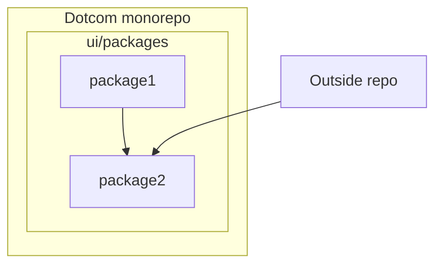

# Publish UI Packages

Looking for a way to share your UI package with an outside repository? Try publishing your UI package!

## Requirements

- Have a UI package
- Get NPM access to read/write `@github-ui` packages
  - Contact an owner to be added by reaching out in [#collab-shared-components-a11y](https://github-grid.enterprise.slack.com/archives/C05HD5GU6CA) or [#web-systems](https://github-grid.enterprise.slack.com/archives/CMZ4DC9BL)
  - If your team has never published packages before, create an NPM team within the `github-ui` that matches your SERVICEOWNER name. This will make it easier to find the responsible team for the package and help manage the NPM team members.

## Warnings

- Feature flags will not work in published NPM packages

## Table of Contents

### [Getting Started in Dotcom](docs/getting-started-in-github-monorepo.md)

### [Getting Started outside of Dotcom](docs/getting-started-outside-github-monorepo.md)

### [How it works](docs/how-it-works.md)
