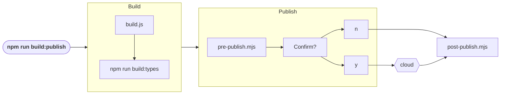

# How it works

## `npm run build:publish`

- The user runs the command `npm run build:publish` in the package directory to kick off the process.
- The `build.js` compiles the package and its @github-ui dependencies into the `/dist` folder. Entrypoints are based on the exports listed in the package.json.
- The build script runs `npm run build:types` to create declaration files (.d.ts).
- The `pre-publish.mjs` transforms the package.json into a format that references the compiled `/dist` and removes @github-ui dependencies
- An `npm publish --dry-run` is run to display the package that will be published to the registry and a confirmation prompt is given to the user
- Once confirmed, `npm publish` publishes the package to the registry 
- As clean up, the `post-publish.mjs` is run. Transformations to package.json are reverted and the `/dist` folder is deleted.

## Eslint rule for published-package

List of published packages are maintained here: https://github.com/github/github/blob/master/ui/packages/eslint-plugin-github-monorepo/published-packages.js

The list is used to verify the package.json's ["private"](https://docs.npmjs.com/cli/v11/configuring-npm/package-json#private) and ["version"](https://docs.npmjs.com/cli/v11/configuring-npm/package-json#private) fields are listed correctly.
- A published package should have no "private" field and a "version" exists
- If "private": true, then NPM will refuse to publish it

Source code: https://github.com/github/github/blob/master/ui/packages/eslint-plugin-github-monorepo/rules/package-json-required-fields.js#L18-L48
