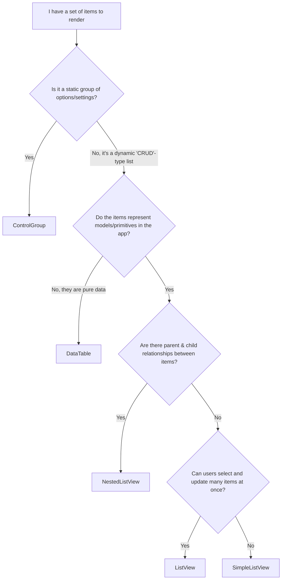

# `SimpleListView`

`SimpleListView` is a static collection of items with one or multiple primary actions each. `SimpleListView` provides core
list-rendering functionality without the complex capabilities provided by `ListView`. `SimpleListView` is responsive
by default and presents to screen readers as a `list`.

Typically, [`SimpleListView`](https://ui.githubapp.com/storybook/?path=/docs/recipes-simplelistview--readme) should be preferred over `ListView` unless selection and bulk update features are required.
[`ListView`](https://ui.githubapp.com/storybook/?path=/docs/recipes-listview--readme) is most often used for 'index' style pages, while `SimpleListView` is most often used for
'administration'-style pages.

`SimpleListView` also appears similar to `ControlGroup`, however they have distinct purposes. [`ControlGroup`](https://ui.githubapp.com/storybook/?path=/docs/recipes-controlgroup--readme), an opinionated API built for Settings page controls, should
only be used to render a group of related options, while list views should be used to render dynamic lists
of items (i.e. lists powered by database tables). [`DataTable`](https://primer.style/components/data-table/react/draft) is a 2-dimensional data structure where each row is an item, and each column is a data point about the item, but the component presents limitations in that it does not support a 2-4 column list layouts or user actions.

The following flowchart can be used to determine which component is most appropriate for your use case.



## SimpleListView Example

```tsx
<SimpleListView>
  <SimpleListView.Header headingLevel="h3">Organizations</SimpleListView.Header>

  <SimpleListView.Items>
    <SimpleListItem>
      <SimpleListItem.LeadingVisual>
        <Avatar square src="https://avatars.githubusercontent.com/u/44036562?v=4" />
      </SimpleListItem.LeadingVisual>

      <SimpleListItem.Title href="https://github.com/actions">actions</SimpleListItem.Title>

      <SimpleListItem.Status>
        <Label>Member</Label>
        <Label variant="primary">2FA required</Label>
      </SimpleListItem.Status>

      <SimpleListItem.Description>Automate your GitHub workflows</SimpleListItem.Description>

      <SimpleListItem.Actions>
        <Button variant="danger">Leave</Button>
      </SimpleListItem.Actions>
    </SimpleListItem>

    <SimpleListItem>
      <SimpleListItem.LeadingVisual>
        <Avatar square src="https://avatars.githubusercontent.com/u/80129863?v=4" />
      </SimpleListItem.LeadingVisual>

      <SimpleListItem.Title href="https://github.com/githuba11y">githuba11y</SimpleListItem.Title>

      <SimpleListItem.Status>
        <Label>Owner</Label>
      </SimpleListItem.Status>

      <SimpleListItem.Description>
        This is an organization used for accessibility testing. All content is for testing purposes.
      </SimpleListItem.Description>

      <SimpleListItem.Actions>
        <Button>Compare plans</Button>
        <Button>Settings</Button>
        <Button variant="danger">Leave</Button>
      </SimpleListItem.Actions>

      <SimpleListItem.TrailingActions>
        <IconButton icon={EllipsisIcon} aria-label="More actions" />
      </SimpleListItem.TrailingActions>
    </SimpleListItem>
  </SimpleListView.Items>
</SimpleListView>
```

## Components

### `SimpleListView`

Container for a simple list view.

#### Example

```tsx
<SimpleListView>
  <SimpleListView.Header headingLevel="h3">...</SimpleListView.Header>
  <SimpleListView.Items>...</SimpleListView.Items>
</SimpleListView>
```

#### Attributes

| Name       | Description           | Type                                              | Default    |
| ---------- | --------------------- | ------------------------------------------------- | ---------- |
| `children` | List title & contents | `SimpleListView.Header` or `SimpleListView.Items` | _required_ |

### `SimpleListView.Header`

Optional header with title for the list. `headingLevel` should be set carefully to ensure a valid
[document heading structure](https://www.w3.org/WAI/tutorials/page-structure/headings/).

#### Example

```tsx
<SimpleListView.Header headingLevel="h3">Repositories</SimpleListView.Header>
```

#### Attributes

| Name           | Description                             | Type              | Default    |
| -------------- | --------------------------------------- | ----------------- | ---------- |
| `children`     | Heading text                            | `React.ReactNode` | _required_ |
| `headingLevel` | Indicate which heading tag to render as | `h1` - `h6`       | _required_ |

### `SimpleListView.Items`

**Required** container for all of the items in the list. Note that this container is required even for single-item lists.

#### Example

```tsx
<SimpleListView.Items>
  <SimpleListItem>...</SimpleListItem>
  <SimpleListItem>...</SimpleListItem>
  <SimpleListItem>...</SimpleListItem>
  <SimpleListItem>...</SimpleListItem>
</SimpleListView.Items>
```

#### Attributes

| Name       | Description | Type             | Default    |
| ---------- | ----------- | ---------------- | ---------- |
| `children` | List items  | `SimpleListItem` | _required_ |

### `SimpleListItem`

A single item in a simple list view.

#### Example

```tsx
<SimpleListItem>
  <SimpleListItem.LeadingVisual>...</SimpleListItem.LeadingVisual>
  <SimpleListItem.Title>...</SimpleListItem.Title>
  <SimpleListItem.Status>...</SimpleListItem.Status>
  <SimpleListItem.Description>...</SimpleListItem.Description>
  <SimpleListItem.Actions>...</SimpleListItem.Actions>
  <SimpleListItem.TrailingActions>...</SimpleListItem.TrailingActions>
</SimpleListItem>
```

#### Attributes

| Name       | Description   | Type                                                                                                 | Default    |
| ---------- | ------------- | ---------------------------------------------------------------------------------------------------- | ---------- |
| `children` | Item contents | `SimpleListItem.LeadingVisual`, `Title`, `Status`, `Description`,`Actions`, and/or `TrailingActions` | _required_ |

### `SimpleListItem.LeadingVisual`

Optional leading visual (icon or image) for a list item.

#### Example

```tsx
<SimpleListItem.LeadingVisual>
  <PadlockIcon />
</SimpleListItem.LeadingVisual>
```

#### Attributes

| Name       | Description                                                        | Type              | Default    |
| ---------- | ------------------------------------------------------------------ | ----------------- | ---------- |
| `children` | Leading visual (typically an Octicon or Primer `Avatar` component) | `React.ReactNode` | _required_ |

### `SimpleListItem.Title`

**Required** title for the item. Optionally can be rendered as a link by providing an `href` attribute.

#### Example

```tsx
<SimpleListItem.Title href="https://github.com/github/github">github/github</SimpleListItem.Title>
```

#### Attributes

| Name       | Description          | Type              | Default    |
| ---------- | -------------------- | ----------------- | ---------- |
| `children` | Title text / content | `React.ReactNode` | _required_ |
| `href`     | URL to link to       | `string`          | _optional_ |

### `SimpleListItem.Status`

Optional additional status metadata to render next to the title. Children of this component automatically render with
a flex gap between them, so multiple `Label` components can be passed without applying styling.

#### Example

```tsx
<SimpleListItem.Status>
  <Label>Private</Label>
  <Label variant="accent">Maintainer</Label>
  <Label variant="severe">Archived</Label>
</SimpleListItem.Status>
```

#### Attributes

| Name       | Description                                                             | Type              | Default    |
| ---------- | ----------------------------------------------------------------------- | ----------------- | ---------- |
| `children` | Status text / content (typically one or more Primer `Label` components) | `React.ReactNode` | _required_ |

### `SimpleListItem.Description`

Optional description for the item. Supports rich formatting if necessary.

#### Example

```tsx
<SimpleListItem.Description>
  <p>development fork of ruby/ruby</p>
  <p>
    <ForkIcon /> forked from <Link href="https://github.com/ruby/ruby">ruby/ruby</Link>
  </p>
</SimpleListItem.Description>
```

#### Attributes

| Name       | Description                | Type              | Default    |
| ---------- | -------------------------- | ----------------- | ---------- |
| `children` | Description text / content | `React.ReactNode` | _required_ |

### `SimpleListItem.Actions`

Optional actions that can be taken on this item. If multiple components are provided here, they will automatically
render with a gap between them.

Actions will render on the right side of the list on large screens, and will automatically move below the item at
smaller widths.

#### Example

```tsx
<SimpleListItem.Actions>
  <Button>Rename</Button>
  <Button variant="danger">Delete</Button>
</SimpleListItem.Actions>
```

#### Attributes

| Name       | Description                                                                    | Type              | Default    |
| ---------- | ------------------------------------------------------------------------------ | ----------------- | ---------- |
| `children` | Actions (typically Primer `Button`, `IconButton`, or `ButtonGroup` components) | `React.ReactNode` | _required_ |

### `SimpleListItem.TrailingActions`

Optional additional actions or simple icon buttons. Unlike `Actions`, `TrailingActions` will _always_ render on the
right-hand side of the list; they will never wrap even on small screens.

#### Example

```tsx
<SimpleListItem.TrailingActions>
  <IconButton variant="danger" aria-label="Delete" icon={TrashIcon} />
</SimpleListItem.TrailingActions>
```

#### Attributes

| Name       | Description                                                       | Type              | Default    |
| ---------- | ----------------------------------------------------------------- | ----------------- | ---------- |
| `children` | Actions (typically Primer `IconButton` or `ActionMenu` component) | `React.ReactNode` | _required_ |
