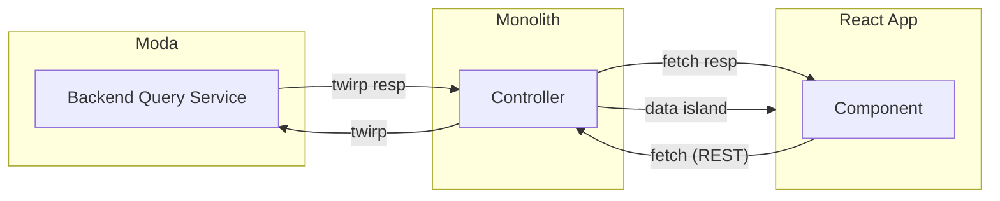

# Actions Usage Metrics Front End High Level Approach

## Status
Proposed - 2023-09-12

## Context

Due the various changes coming for the next version of the UI, it is easier and more beneficial to rebuild the front-end rather than attempting to change the existing front end to fit our needs.

This document aims to describe the high-level approach that will be taken when building this new UI.

## High-Level Details

React has been chosen for the front-end because [it is the current guidance for Github](https://thehub.github.com/epd/engineering/dev-practicals/frontend/react/adoption-guidelines/
)
### Data Flow

The most standard approach at GH seems to be:

- Backend -> gh/gh (Ruby/GraphQL) -< React with Relay for state management

We are not going to be using GraphQL, and this rules out Relay for state management as docs say DO NOT use Relay without GraphQL.

This leads to a less common, but still “paved path” approach of:

- Backend -> Moda Service -> gh/gh Ruby controller with twirp client -> React

In this less common approach data from the service is fetched from the Ruby controller using the Twirp client, and then it is passed to the React app through a data island (JSON object) for initial load.

For subsequent large data fetches the React app would need to trigger a route/query string change which could be picked up by the controller, and then the controller can fetch additional data and pass it down to the React app with a soft navigation.

For smaller async calls a method can be added to the Ruby controller, and the front end can make a web request to the controller.

### Partials vs. UI Packages

There are 2 ways to create a React front end at Github:

- React Partial: This is the current implementation of the Insights application. This offers less overall control, and is an older approach to React at GH. This is primarily used when Ruby and React need to be mixed in the main content area of a page.

- React UI Package: This is the newer way of doing React at GH, and the current recommended way as there is a current push to get partals into UI packages instead. It is important to be aware that with this approach it is not possible to reference any components that have not been moved to packages.

## Decision

A new UI will be created using React with the UI packages approach. A Ruby controller will be created to wrap the Twirp client so that the React app can fetch data as needed. The initial data will be front-loaded by the Ruby controller, and passed to the React app in a data island.