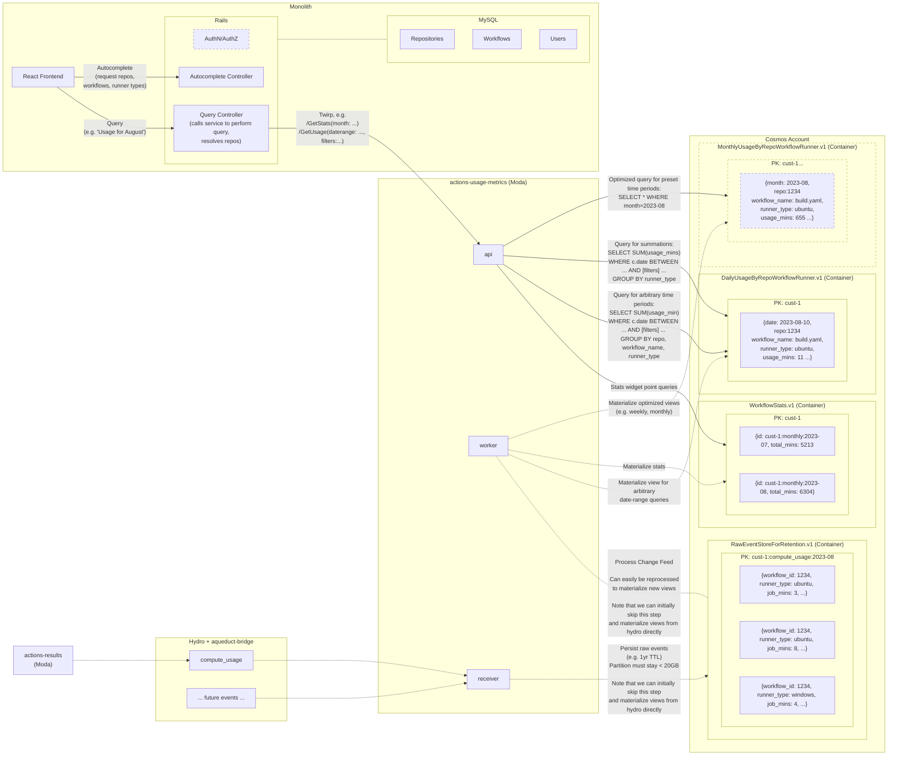

# Actions Usage Metrics Service Architecture

> :warning: This has been partially [superseded](./0479-kusto-data-warehouse-followers.md). Read with caution.

## Status
Proposed - 2023-10-05  
[Partially superseded](./0479-kusto-data-warehouse-followers.md) - May 2024

## Context

Actions Usage Metrics is being rebuilt as a separate Moda service backed by Azure Cosmos DB, integrated into the monolith with React frontend.
This ADR describes the proposed architecture.

## Decision

### Service Topology



#### Decision
See above diagram, but essentially we'll have/use:
* GitHub Monolith, responsible for hosting our frontend and acting as a thin intermediate layer in front of our Moda service.
* Actions Usage Metrics Moda service, consisting of:
  * An apiserver responsible for fulfilling queries
  * An event receiver responsible for receiving events from Hydro/Aqueduct and storing them for long-term retention
  * A worker responsible for processing events and producing query-oriented views of the data

Note that (as later described in this document) the event receiver and worker may initially be combined until we need to implement raw event retention

#### Alternatives

- Other insights-affected teams have chosen to not write a Moda service, and instead do everything in the Monolith for quicker prototyping. We disagree with this approach for numerous reasons, including availability concerns, development friction, data store choice limitations, etc.

### Monolith / Service Interactions

#### Decision

All client queries will go through the monolith, which will be responsible for authN/Z. It will also be responsible for fetching and resolving the names of GitHub resources (e.g. repositories). Communication from the monolith to the service will be over HMAC-secured Twirp, per standard GitHub patterns.

#### Discussion

In addition to authentication and authorization concerns, in terms of functionality we need to resolve the names of repositories (and potentially other resources owned by the monolith) when returning queries. Similarly, for autocomplete support in our UX filters we'll need to be able to query for repositories, workflows, etc on the monolith. As such, the monolith naturally makes sense to be an intermediate between our frontend and Moda service.

Unlike Hosted Compute Insights which serves especially large artifacts, we have no strong immediate reason to need direct client -> moda service communication. Even our "Export data" feature should still remain within Monolith request timeouts (~10 second).

#### Alternatives

- We could implement client-to-service authentication, expose the Moda service publicly, and directly query the Moda service without going through the monolith. But given that we need to perform authorization checks and resolve resources owned by the Monolith, we'd have to separately call the monolith anyways. It's possible that eventually we may need to support large file downloads (e.g. export raw data), and then we could implement direct access at that time specifically for those features.


### Frontend
Frontend high-level architecture is previously described by [0002-front-end-high-level-approach.md](./0002-front-end-high-level-approach.md).

### Data Store

Cosmos DB as the primary data store for the service is previously described by [0001-data-store.md](./0001-data-store.md).

### Event Ingestion

Event ingestion via Hydro and aqueduct-bridge is previously described by [0004-event-ingestion.md](./0004-event-ingestion.md).

### Event Storage

Raw events will not be directly queried against, but instead are aggregated into read-optimized views (see next section). This section describes how events are stored after being read from Hydro/Aqueduct.

#### Decision

Store raw events in Cosmos. This enables long-term retention configurable at a customer level, and allows us to easily rebuild or add new materialized views to support new data access patterns.

#### Discussion

Raw events such as `compute_usage` are the source of truth for the data we present. We should assume that even after using the events to materialize new views of the data, retaining the raw events for some period of time is still critically important for multiple reasons. We may have bugs in the views we produce and wish to regenerate them, and we may need to produce new views to support new features or queries.

The COGS of retaining events should be well worth it. Cosmos public pricing is $0.25/month per GB+region (plus some compute for writing), and there are additional options available for cold storage if needed. Assuming a reasonable retention duration (e.g. 6 months or 1 year), I'd expect this cost to be negligible compared to the development time we'd spend manually correcting/backfilling/transforming from non-source-of-truth data stores.

One of the main benefits of consuming the events from Hydro and then re-storing them in Cosmos is that we have full control over exactly which events we store and for how long. For example, if Usage Metrics becomes an opt-in feature, we could only store/retain events for enabled customers. Or we could have different retention durations for enabled vs. disabled customers, or for customers on different plans. Cosmos has rich TTL functionality which can help with automatically managing event retention.

Events will likely need to be partitioned not just by customer but additionally time-partitioned (e.g. by month), as our larger customers may come close to exceeding 20GB/year in raw events and thus hitting Cosmos's 20GB partition limit. See the [data store ADR](./0001-data-store.md) for more details.

Worth noting is that we can start implementing the service without raw event storage (e.g. while in a private beta period) as long as we don't provide guarantees around how long metrics history will exist. We would start by directly materializing views from the events coming from Hydro/Aqueduct. We can later add in event storage, and then even later implement the actual ability to replay from event storage to produce a view.

#### Alternatives

- One option would be to not retain events at all. This would mean that if we ever needed to fix or produce a new view for historical data, we would be unable to do so (at least without much difficulty).

- As another option, we could rely on Kafka retention. Kafka normally retains events for a relatively short period (e.g. ~14 days depending on actual data size). While the duration is configurable at a Kafka partition level and could potentially be increased, it would be difficult to partition by customer and thus have different retention policies per customer. e.g. we might have to retain many GB of data for a customer that doesn't even have Usage Metrics enabled! This would likely be incredibly wasteful, and also require deep collaboration with the Data Pipelines team.

  Further, in order to utilize Kafka retention and "replay" older events, we would need to take on the complexity of implementing Kafka consumer groups rather than using aqueduct-bridge. From discussing with other teams, this adds significant development and maintenance costs (and de-aligns us with others like Billing Platform and Hosted Compute Insights).

- Data Warehouse already stores the events long-term. But per previously communicated announcements, using DW to drive customer-facing features in this manner is not allowed.

### Materializing Views and Querying

#### Decision

Project raw events into query-oriented views in Cosmos. Don't overoptimize, but assume that new views will eventually be needed to satisfy new query shapes and features, and that rebuilding existing views may be needed due to bugs / inconsistencies.

#### Discussion

The raw `compute_usage` event describes the usage of an individual job. Performing queries (e.g. "how many minutes has each workflow consumed this month?") against the raw events using a non-analytics oriented datastore would be wildly inefficient - even the previous iteration of Actions Insights based on MSSQL Column Store pre-aggregated events.

##### Processing

For the existing and planned MVP experience, data is aggregated at the level of `DateRange`-`Repo`-`Workflow`-`RunnerType`-`RunnerRuntime`. For example, a supported query is "During this week, how many Linux Hosted Runner minutes did the Foo repo's CI consume?"

To perform that sort of query, imagine we have a table/view named `DailyUsageByRepoWorkflowRunner`. Its schema might look roughly like:
```json
{
  date: 2023-08-20,
  repo: 1234,
  workflowName: build.yaml,
  runnerType: hosted,
  runnerRuntime: linux,
  usageMins: 11,
  jobIds: [..., ..., ...],
  jobCount: 3
}
```

To build that table, we can consume the raw `compute_usage` events in a streaming manner and update the item as jobs complete. Cosmos DB conveniently has APIs for [Partial Document Updates](https://learn.microsoft.com/en-us/azure/cosmos-db/partial-document-update) (patching items) which even can automatically perform summations on a field ("add 10 minutes to `usageMins` if not already in `jobsIds`"), making it easy to aggregate usage information. 

##### Querying

Using this hypothetical `DailyUsageByRepoWorkflowRunner` view, we can now answer various queries. Let's explore some pseudoqueries for scenarios we intend to initially support.

- "Usage minutes by repo/workflow/runner for the current month"
  - `SELECT SUM(usageMins) WHERE date BETWEEN 2023-08-01 AND 2023-08-31 GROUP BY (repo, workflowName, runnerType, runnerRuntime)`
- "Summarized usage minutes filtered to just the CI workflow since July"
  - `SELECT VALUE SUM(usageMins) WHERE date >= 2023-07-01 AND workflowName = 'ci.yaml'`
- "Usage minutes and job counts summarized and sorted by repo in a few day period"
  - `SELECT SUM(usageMins) AS totalUsage, COUNT(jobCount) WHERE date BETWEEN 2023-08-10 AND 2023-08-13 GROUP BY repo ORDER BY totalUsage DESC`

As such, we can satisfy filters, summations, sorting, etc. However...

##### Additional Views and Optimization

...at some point sooner or later we may decide that the performance / cost of a query (or a new feature) warrants storing the data differently. That's one of the huge benefits of using NoSQL paradigms here along with retaining the raw events - it's easy to produce a new view (or rebuild an existing one) by replaying the raw events from the start or a specific date.

For example, let's assume that the landing page or most common query for Usage Metrics shows grouped usage for the Current Month (the first scenario in the section above). Instead of `DailyUsageByRepoWorkflowRunner`, now imagine we have a view `MonthlyUsageByRepoWorkflowRunner` which is exactly the same, but pre-aggregated at a monthly granularity rather than daily.

To satisfy the scenario, we can now simplify our query and avoid the SUM / GROUP BY: `SELECT repo, workflowName, runnerType, runnerRuntime, usageMins WHERE month = 2023-08`. This is a lower cost query in terms of both the query itself and that it allows us to take advantage of Cosmo's rich pagination / continuation token features rather than using OFFSET / LIMIT.

Similarly, to provide a single point-queriable value for a "Total minutes across everything this month" stats widget, we could have a `UsageSummarized` view that simply holds a sum of all jobs for each month/week/etc.

All this is not to say that we immediately need multiple views. A daily view with less efficient queries may be sufficient in the short-term. But this architecture leaves us with the ability to expand and optimize as needed.

#### Alternatives

- One option would be to query against raw events. This would both be wildly inefficient and Cosmos-resource intensive, and additionally cause problems with needing to frequently make cross-partition queries as raw events won't always be able to fit within a single partition.

- Another option would be to process/materialize views on a schedule (similar to existing Insights). There is no obvious benefit in doing so if the views can be produced in a streaming manner. If at a later time we need to batch process data (either ourselfs or perhaps via an external analytics platform) we could do so at that time.
