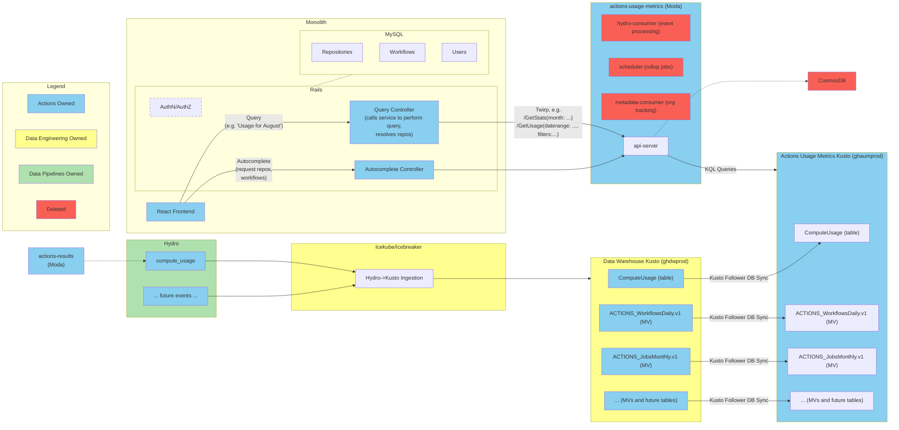

## Status
Proposed - 2024-05-23

## Context

Actions Usage Metrics shipped as Public Beta using an [architecture](./0002-high-level-arch.md) which directly [consumes](./0004-event-ingestion.md) `ComputeUsage` Hydro events and aggregates them into CosmosDB-based "projections" of the data at different Actions granularities (job, workflow, repo, runner type, runner runtime) and time ranges (daily, weekly, monthly). [Scheduled rollup jobs](./0005-timerange-queries.md) were used to produce `Last N Days` views. [Backfilling](./0005-backfilling.md) was performed by pulling historical events from "raw archived" Data Warehouse data, but due to its complexity around double-counting prevention was implemented as a manually initiated process that couldn't easily be re-run when onboarding additional customers. 

The architecture has worked well in production and allowed quickly delivering the initial Actions Usage Metrics feature set, but has significant limitations in that new features, time ranges, or customers all depend on a complex and fragile backfilling process. 

### Change in Data Org Guidance
Before AUM began development, Data Engineering had released a [statement](https://github.com/github/engineering/discussions/3387) in July 2023 that the Data Warehouse (DWH) should not be used to power production observability services for Insights replacements or otherwise: “The Data org will not build a central platform for customer-facing observability. The data warehouse will not power production observability services.“ This, along with no clear analytical store that an individual feature team could/should support on their own - led to the original [data store decision](./0001-data-store.md).

In October 2023, Data Engineering [withdrew](https://github.com/github/data-engineering/blob/master/docs/adrs/0025-powering-services-with-warehouse-data.md) their previous statement, allowing DW to power customer-facing scenarios with some restrictions. This was largely in support of Copilot Usage Telemetry. This opened up opportunities for Actions to consider using Data Warehouse in some manner. However, the method used by Copilot (exporting results from DWH to their own DB) didn't solve enough of our goals to necessarily be worth the change. 

### External Data Experience

In early 2024, an [initiative](https://github.com/github/data/issues/6948) began to plan the future of how customer-facing features could use the Data Warehouse. We paired with this initiative to explore using the DWH to power Actions Usage Metrics. After a meeting with the Kusto team, we decided to move forward with exploring querying Kusto to power customer facing experiences.

This ADR describes the decision to bring that exploration to production, replacing AUM's previous architecture.

## Decision

Use Kusto follower databases to query data from Data Warehouse without _directly_ depending on the availability of Data Warehouse.

Specifically:
* Data Warehouse ingests `ComputeUsage` Hydro events
* Data Warehouse has Materialized Views (MVs) defined to optimize queries based on job/workflow/etc and time granularities
* Tables and MVs are synced to an Actions-owned Kusto cluster via Kusto follower database feature
* Actions Usage Metrics queries the Actions-owned Kusto cluster containing DWH data

This decision greatly simplifies the service by eliminating a number of components previously implemented in Actions Usage Metrics, including:
* The entire `hydro-consumer` deployment responsible for ingesting events
* The entire `scheduler` deployment responsible for running rollup jobs
* The entire `metadata-consumer` deployment responsible for managing Organization enablement (enterprise orgs only), and associated storage
* Backfilling logic and jobs
* CosmosDB infrastructure and code (replaced by Kusto / ADX clusters)

This decision also improves the future flexibility of the service by:
* Making it easier to add new data views/charts/etc simply by writing KQL (and MVs)
* Making it easier to support new time ranges
* No manual backfilling required for the above
* No manual backfilling required for onboarding new customers (e.g. if we decide to expand to Team or all customers)
* Likely easier to develop a future API / extensibility points

### Diagram

### Event Ingestion

Event Ingestion will be owned by the Data Engineering team rather than being a component (hydro consumer) within the AUM service. Data Engineering already has deep experience in this space via Icebreaker / Icekube projects.

### Time Range Queries (e.g. `Last N Days`)

One of the major benefits of Kusto is that while views _can_ be pre-materialized (as we did with CosmosDB) for performance, it's also possible to run arbitrary queries filtered by time range. Further, it's possible to aggregate across these time ranges _even when using distinct count aggregations_, as Kusto contains flexible `hll` / `hll_merge` / `dcount_hll` operators. This means that we'll be able to support queries such as `Last N Days` or even custom time range queries without precomputing the result in a "rollup job" - although we will still potentially need to optimize the queries via appropriate granularity MVs, cache priming, etc.

### Backfilling

One of the major challenges with the previous architecture was that many new features would require re-running backfilling, which was a complex and fragile process that wasn't fully automated.

Implementing backfilling logic/infrastructure is no longer needed, as:
* Data Warehouse already contains 1+ year of `ComputeUsage` data for all customers
* Materialized Views support automatic backfilling when created

As such, adding a new feature based on `ComputeUsage` data (e.g. a new tab, visualization, or time range) requires only adding MVs and switching to them once the MV is caught up, _without any custom backfilling code_.

### Organization Enablement

Actions Usage Metrics is currently available in Public Beta to all GitHub organizations on an Enterprise plan.

It turns out that determining which and when organizations become Enterprise is extremely complex and error-prone outside of the monolith. As such, the previous implementation had to have multiple Hydro event consumers and hardcoded and stored lists of known Enterprise orgs to capture every type of Enterprise-eligible organization. Computing all non-eligible customer data with the previous architecture was not reasonable in terms of COGS (both CosmosDB and compute).

Because Data Warehouse already has data for all customers (and materializing views w/ all customers appears to be reasonable w.r.t. compute/COGS), this means that we can simply control access to the feature within the Monolith. This also makes it easy for us to change the user/organization requirements for using the feature in the future.

### Multitenancy

In CosmosDB, multitenancy was achieved by using partition keys to strictly separate customer data based on `repository_owner_id` event field.

Kusto also has [good support for multitenancy](https://learn.microsoft.com/en-us/azure/data-explorer/multi-tenant). We will take the `One table for many tenants` approach, using the `Restrict` KQL statement with `repository_owner_id` event field to ensure that queries on customer data are safely scoped.

### Availability

Data Warehouse is not intended for the higher availability requirements of a customer facing service. Even with this change, it still isn't. So why is that ok?

Rather than depend on Data Warehouse directly, we will depend on a follower cluster as described above. That decouples the compute aspects of our feature from DWH; we have confirmation from the Kusto team that an outage of the Data Warehouse cluster would only result in our follower database lagging / being out of date, rather than being unavailable. Actions owns its own cluster, and can configure policies, availability zones, DR solutions, etc as it desires.

That said, there are some aspects to consider here due to how Kusto follower databases work:
1. Even though AUM won't depend on the DWH cluster, it will directly use its underlying (Azure/Kusto-managed) storage accounts.
2. The follower cluster must be hosted in the same Azure region as Data Warehouse.

For (1), we are working with Kusto to enable Availability Zones and specifically [ensure our storage accounts are ZRS](https://github.com/github/actions-fusion/issues/1579).  
For (2), we will host our cluster in the same region as DWH. We do not plan to host clusters in multiple regions (e.g. for georedundancy) at this time.

## Consequences

### No GHES

This decision eliminates the possibility of adding Actions Usage Metrics to the GHES product. Note that supporting GHES has not been a goal and was already potentially non-trivial using CosmosDB.

### Less control over data freshness/latency

With our CosmosDB architecture, we ran our own Hydro consumers and ensured data was up-to-date within minutes (at least for some views, others were up to 12 hours). With Data Warehouse, we no longer own data ingestion and rely on an advertised SLO is generally 2 hours. We decided this is acceptable for our needs, but if it wasn't would require significant work to run our own Hydro ingestion rather than following DWH.

This also may have implications for our E2E tests which run a workflow and expect (within minutes) AUM to update.

### Data accuracy (temporary)

The Hydro -> DWH ingestion process using Icebreaker is currently is up to 0.5% inaccurate (e.g. missing data). This was decided to not be a significant concern and will anyways be resolved with the [switch to IceKube](https://github.com/github/actions-fusion/issues/1581).

### No geo-replication

As described in Availability above, geo-replication is difficult to achieve with Kusto, and Data Warehouse is not currently set up for it. We decide that for this feature, zonal-redundancy of compute and storage is acceptable.

### Dependency on Data org for changes

Materialized Views must currently be defined on the leader in a Kusto leader-follower configuration. This means that new MVs we need defined (e.g. for performance metrics, additional time granularities, etc) have to be reviewed and approved by the Data org. Further, currently due to limitation in warehouse-config, creating a backfilled MV via PR is not currently possible and requires Data to manually create the MV for us. So far this has not been a problem.

### Dependency on Data org for operations

We go from operating nearly completely independently (aside from Hydro) to relying on Data Engineering for a significant component of our service. We'll need appropriate escalation and other playbooks and to continue to clearly define expectations between the organizations.

### Paving a path

We are the first to take this approach - we are paving a path for External Data Experience at GitHub. Being the first comes with risks, both in terms of discovering unknowns and if the paved path continues to evolve after our project is "complete". Close continued collaboration with the Data org will be needed to be successful.
