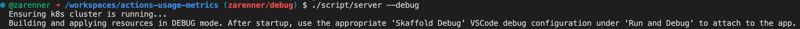
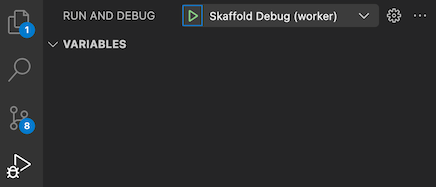

# Debugging the backend

To hook up a VSCode debugger to an AUM pod:
1. Run `script/server --debug`. This tells Skaffold to enable the Golang dlv (Delve) debugger and sets up port forwarding.  

    * Important: Leave the command running to keep debug port forwarding alive!   
1. Use the `Run and Debug` view in VSCode to debug the desired type of deployment.  

Notes / Caveats:
* Skaffold rewrites the replica counts to 1. This makes it easy to make sure you hit your breakpoint - but be aware in case you're trying to test multiple replicas!
* Rather than rely on Skaffold's semi-random port forwarding, we have user-defined port forwarding mapping dlv port `56268` on each pod to well-defined codespace ports `5620_`. See `skaffold.yaml` and `launch.json` if curious.
* The `Kubernetes: Debug` command also works in addition to the provided launch.json tasks, but you'll need to manually specify ports/paths.
* See https://skaffold.dev/docs/workflows/debug for further details

## Jaeger

Datadog APM does not currently offer or include a development or testing tenant that would allow you to verify your tracing changes in your codespace or local development environment.

We use a Jaeger all-in-one container to view traces when working in development. See <https://thehub.github.com/epd/engineering/dev-practicals/observability/distributed-tracing/user-guide/tracing-in-development/>.

To view OTEL traces in dev:

1. Make sure the ingress port is forwarded (32474)
2. Navigate to http://127.0.0.1:32474/jaeger/search
3. Select `actions-usage-metrics` and search

