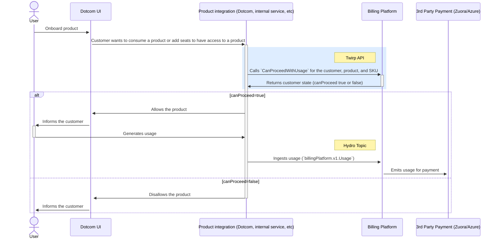

# Can Proceed with Usage

This endpoint exists for the internal product teams (e.g. Actions, git-systems, etc.) to check whether
a new usage event/job is allowed to proceed (or even if any in-flight jobs should be stopped). Product teams are
expected to call this endpoint when users are electively creating usage events. What they get in return is information about the customer's billable state and if applicable, relevant budgets and the customer's choice on how to deal with each budget.

In the event of downtime _each product team needs to decide how to proceed (allow usage or not) on their own_.

## Table of Contents

- [Introduction](#introduction)
- [Terminology](#terminology)
- [Integration details](#details)
  - [Integrating with Ruby](#integrating-with-ruby)
  - [Integrating with Golang](#integrating-with-golang)
  - [Processing flow](#processing-flow)
  - [Example responses](#example-responses)
  - [Can proceed statuses](#can-proceed-statuses)
  - [Observability](#observability)
  - [Partner teams integrations](#partner-teams-integrations)

## Introduction

If your team is planning to bill customers via metered billing, you need to confirm if a customer is billable before enabling access and during your product consumption lifecycle.

`CanProceedWithUsage` is a key part of the billing pipeline to help with that and should be integrated as part of the steps to [integrate your product with Billing Platform](https://github.com/github/billing-platform/blob/main/docs/how-to-guides/how-to-integrate-with-billing-platform.md).

### What `CanProceedWithUsage` can do

Provide details about a customer, such as billable state, billing target (Azure/Zuora), customer screening status, customer suspension status, discounts and budgets consumption, and etc.

### What `CanProceedWithUsage` cannot do

Change the state of a customer. The API only retrieves the most up-to-date information about a customer and doesn't perform updates.

### Lifecycle of an integrated product/SKU



## Terminology

- **Product team (partner team)**: Teams that own a product and send data to the billing platform (e.g., Actions, Copilot, etc)

## Integration details

### Integrating with Ruby

> [!NOTE]
> All references to models assume that you're executing that in Dotcom.

0. Obtain the customer id

```ruby
# billable_owner is either User, Organization or Business
customer_id  = if billable_owner.delegate_billing_to_business?
  billable_owner.business.customer_id
else
  billable_owner.customer.id
end
```

1. Setup an `EntityDetail`

```ruby
entity_detail = BillingPlatform::Base::EntityDetail.new(
  customerId: <String>, # see above and notice that the id has to be passed as string (required)
  repoId: <Integer>, # database id of the repo that usage applies to (optional)
  ownerId: <Integer>, # owner: User or Organization that repo (optional)
  actorId: <Integer>, # User who initiated the usage (optional)
)
```

2. Setup a `UsageKey`

```ruby
# Refer to https://github.com/github/billing-platform/blob/main/lib/engines/pricing.go#L174-L237 for the specific values for `product` and `sku`
usage_key = BillingPlatform::Api::V1::UsageKey.new(
  product:"git_lfs",
  sku: "git_lfs_bandwidth",
  entityDetail: entity_detail,
  usageAt: Time.now.to_i, # in UTC, defaults to `Time.now.utc`,
  quantity: 456, # quantity of usage that should be checked, **currently ignored**
)
```

3. Call the endpoint

```ruby
client = ::Billing::Platform::Api::Client.new
response = client.can_proceed_with_usage(usage_key: usage_key)
#=> {:canProceed=>true, :applicableBudgets=>[], :planDiscounts=>[], :planName=>"enterprise", :status=>:UsageAllowed}
```

### Integrating with Golang

TBD, refer to the [implementation from the Actions](https://github.com/github/launch/blob/8fb7679bb0ebafb847ff4a54cbb4cb93aed5ca28/clients/billingplatform/client.go#L118) team for now.

### Processing flow

#### Billing locked

This is a state that can occur when an account:

- Is disabled (same as "billing locked" in Dotcom);
- Is suspended; or
- Has metered services locked (mostly enterprises)

#### Has full trade restrictions

Usually applied to user and organizations. For more information about this check, please contact [Trade Compliance](https://github.com/github/trade-compliance).

#### Has any trade restrictions

This check is useful for cases when a feature is allowed to customers without full trade restrictions. E.g: at the time of this writing, Actions allow partially trade restricted users and organizations to run jobs on public repositories.

This check is usually applied to user and organizations. For more information, please contact [Trade Compliance](https://github.com/github/trade-compliance).

#### Has commercial interaction restriction

This is a check on the various commercial restrictions an account can have. For more information, please contact [Trade Compliance](https://github.com/github/trade-compliance).

#### Included discounts

There are two cases here depending on whether customer has a payment method on file or not.

If customer doesn't have a payment method, then we only check their included discounts (formerly known as entitlements).

- If discounts are fully applied and no longer available, then `canProceed` is always `false` regardless of the
  existing customer's budgets.
- If discounts still available, we proceed to the budgets checks.

The response also includes the discount states. This can be used to track free consumption before a billed state.

```ruby
{:canProceed=>true,
 :planDiscounts=>[
  {
   :isFullyApplied=>false,
   :currentAmount=>10.0,
   :targetAmount=>20.0,
   :uuid=>"4a58aabb-0190-426f-b390-196f5d944f65",
  }
 ],
 :planName=>"enterprise",
 :status=>:UsageAllowed,
 :applicableBudgets=> []
}
```

#### Budget checks

Billing platform records all the usage that applies to a given budget _after customer exhausts their included discounts_.

For each applicable budget, we check its state at the billing period in which `usage_key.usageAt` falls.
If at least one of the applicable budgets is fully funded and it's _not_ an alert-only budget, then
`canProceed` is `false`. Otherwise `true`.

There might be cases when there is no budget state for the given billing period. In that case, we assume that there was
no usage for that budget yet and check the budget record itself to see if it's fully funded or not (based on the `TargetAmount` field).

Along with `canProceed`, the response contains an array of fully funded budgets in `applicableBudgets` which
has the information on how to process the next usage if `canProceed` is `false` - prevent further usage or
stop any in-flight usage.

> [!NOTE]
> Given that the quantity field is ignored at the moment, there could be cases when budgets are not
> fully funded yet, but will be overfunded right after the next usage.

### Example Responses

```ruby
{:canProceed=>true,
 :planDiscounts=>[],
 :planName=>"enterprise",
 :status=>:UsageAllowed,
 :applicableBudgets=> [
   {
     :budgetKey=> {
       :customerId=>"1061737",
       :targetType=>:Org,
       :targetId=>"30846345",
       :pricingTargetType=>:ProductPricing,
       :pricingTargetId=>"actions"
     },
     :budgetState=>{
       :isFullyFunded=>true,
       :currentAmount=>5574.711636373,
       :targetAmount=>1.0,
       :quantity=>188173.939134554,
       :thresholdMet=> {
         :name=>"100%",
         :minimumUsagePercentage=>100.0,
         :alertable=>true
       }
     },
     :budgetLimitType=>:IgnoreLimit}
 ]
}
```

```ruby
{:canProceed=>true, :applicableBudgets=>[], :planDiscounts=>[], :planName=>"enterprise", :status=>:UsageAllowed}
```

Due to the discounts check, you can still get `false` in return with no budgets.

```ruby
{:canProceed=>false, :applicableBudgets=>[], :planDiscounts=>[], :planName=>"enterprise", :status=>:NotBillable}
```

For the specific values please refer to the proto definitions - https://github.com/github/billing-platform/blob/96813c37ffcfe26ac95cba16b056a790a084ecaa/proto/customer-api.proto#L21

### Can proceed statuses

Along with the boolean `canProceed`, the response includes the `canProceed` status. Currently, they are:

- `UsageAllowed` (`canProceed` is `true`)
- `BillingLocked` (`canProceed` is `false`)
- `FullTradeRestrictionsApplied` (`canProceed` is `false`)
- `AnyTradeRestrictionsApplied` (`canProceed` is `false`)
- `CommercialInteractionRestrictionApplied` (`canProceed` is `false`)
- `NotBillable` (`canProceed` is `false`)
- `BudgetLimitReached` (`canProceed` is `false`)

### Observability

#### Splunk

We have logging in place for all `CanProceedWithUsage` responses. Below are some helpful Splunk queries to use when trying to debug issues around integration with this endpoint.

To find logs for a specified stamp and customer:

```
// Update the value of stamp and customer id as needed
index=billing Body="CanProceedWithUsage result" stamp=dotcom customerId=5018891
```

To summarize the number of calls for each SKU:

```
index=billing Body="CanProceedWithUsage result" stamp=dotcom | stats count by sku
```

#### DataDog

We also have some DataDog metrics in place around `CanProceedWithUsage` responses.

- [Response by status](https://app.datadoghq.com/dashboard/646-msn-qic/billing-platform?fromUser=false&refresh_mode=paused&view=spans&from_ts=1722873385789&to_ts=1723478185789&live=false&tile_focus=3710934132299568)
- [Requests by SKU](https://app.datadoghq.com/dashboard/646-msn-qic/billing-platform?fromUser=false&refresh_mode=paused&view=spans&from_ts=1722873385815&to_ts=1723478185815&live=false&tile_focus=2668051602398831)

### Partner Teams Integrations

The following partner/product teams are currently calling `CanProceedWithUsage` for customers billed through billing platform.

- Actions - the Actions team calls `CanProceedWithUsage` from their launch repo [here](https://github.com/github/launch/blob/master/clients/billingplatform/client.go#L132-L156). The two instances when the Actions team is concerned about the result of `CanProceedWithUsage` are:
  - When a customer is requesting to start a new Actions run, the Actions team uses the result to decide whether the run can start.
  - If a customer has any larger runners configured, the Actions team will check the `CanProceedWithUsage` response every 5 minutes for the billable owner of the runner. If `CanProceedWithUsage` returns false, the larger runner will be shut down until the billing issues are resolved.
- Packages - the Packages team calls `CanProceedWithUsage` in their dotcom code for storage and packages.
  - It's called for storage in [the storage_allowed method](https://github.com/github/github/blob/d5fd54b12b5f4cc878b816ff6235de63ee682d75/app/api/internal/twirp/registrymetadata/core/v1/billing_api_handler.rb#L157).
  - It's called for bandwidth / downloads in [the download_allowed method.](https://github.com/github/github/blob/d5fd54b12b5f4cc878b816ff6235de63ee682d75/app/api/internal/twirp/registrymetadata/core/v1/billing_api_handler.rb#L77)
- Git LFS - the LFS team's code calling `CanProceedWithUsage` is in the monolith [here](https://github.com/github/github/blob/4f180efbffc0e39581487180eb928f454ae06b54/packages/data/app/models/media/blob.rb#L631).
- Codespaces - the Codespaces team calls `CanProceedWithUsage` from [their dotcom code here](https://github.com/github/github/blob/fa74ccb2210d8675af2a97ea55cad0e9ac4b3d2f/packages/codespaces/app/public/codespaces/access/v_next_billing_checker.rb#L94). 

As of the writing of these docs, the following teams do not call `CanProceedWithUsage`. We're investigating the possibility of having these teams call the endpoint before allowing usage of their products, so this could change in the near future.

- Copilot - The Copilot team has a method called [copilot_billable](https://github.com/github/github/blob/master/packages/copilot/app/public/copilot/billable.rb#L14), which calls a billing-owned method called [billable.metered_services_billable?](https://github.com/github/github/blob/master/packages/billing/app/models/billing/metered_billable.rb#L163) We are investigating whether we can migrate calls for enterprises and organizations over to `CanProceedWithUsage` instead.
- GHAS
- GHEC

If you have questions about any of our partner teams' integrations with `CanProceedWithUsage`, consult [this doc](https://github.com/github/gitcoin/blob/main/docs/partner-team-channels.md) for a list of Slack channels where you can ask for help. 


