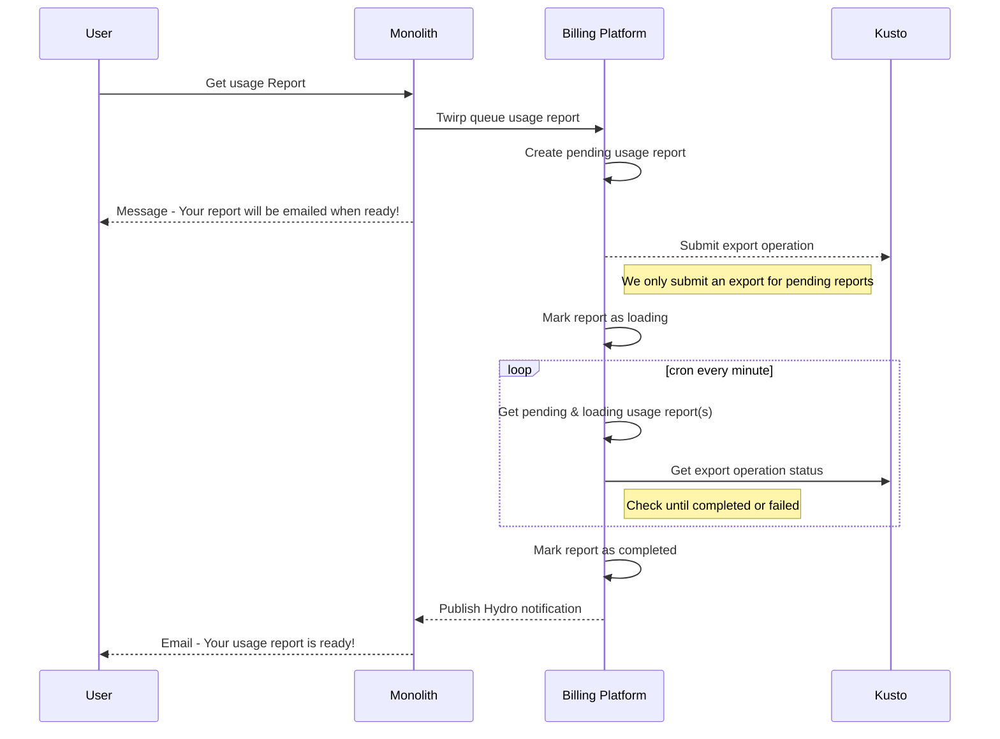
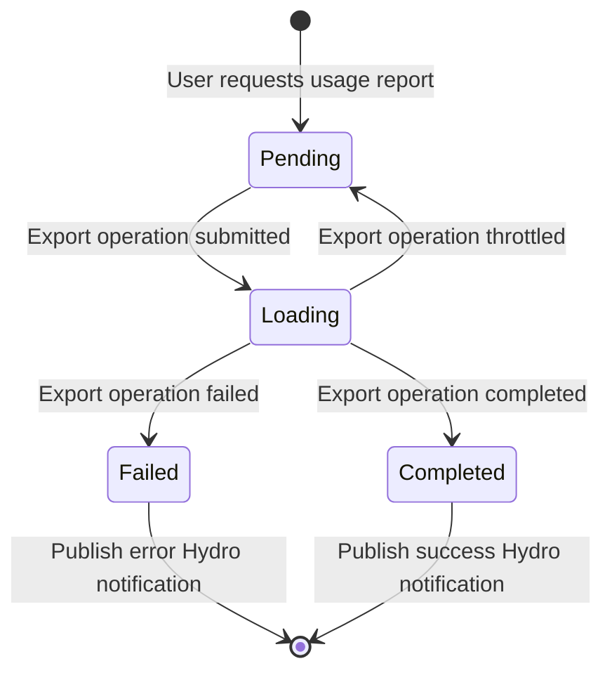

# Usage Reports

Billing platform does not aggregate or store data with username or workflow name, so users are unable to see spend for a particular user or workflow via the UI. Instead, we publish line item messages to Hydro which contain this information.

Users can instead request usage reports which query for the individual line items that billing platform has published to Hydro via [Azure Data Explorer (Kusto)](../tools/azure-data-explorer-kusto.md) exports. This allows us to deliver a report that is more detailed than what is available in the UI, containing the following fields:

- Date
- Product
- Sku
- Quantity
- Unit Type
- Price Per Unit
- Gross Amount
- Discount Amount
- Net Amount
- Repository Name
- Workflow Name
- Organization Name
- User Name

> [!NOTE]
> We also have a usage report API that serves different data than the usage report button in the UI. See [Get Usage Report API](../../how-to-guides/how-to-get-a-usage-report-with-the-api.md) for more information on this.

## Table of Contents

- [Terminology](#terminology)
- [Details](#details)
  - [Sequence diagram](#sequence-diagram)
  - [State diagram](#state-diagram)
- [Development](#development)
- [References](#references)

## Terminology

- **Common term**: definition

## Details

### Sequence diagram

See the below sequence diagram for the flow of generating and delivering a successful usage report:



Notes:

- If Kusto returns a `throttled` export status, we migrate the report from `loading` to `pending` and retry the export operation during the next cron run.
  - See [this playbook](https://github.com/github/gitcoin/blob/main/docs/playbook/alerts/kusto-exports-throttled.md) for more info on throttled exports
- Pending and loading usage reports are stored in the [`usageReportExports:active` partition](https://github.com/github/billing-platform/blob/main/docs/reference/project/id-partitionkey-reference.md#active-usage-report-exports-loading-and-pending) with an ID scoped to the requesting user and customer ID for the report
  - This prevents users from requesting multiple reports at the same time
- Completed and failed usage reports are moved out of `usageReportExports:active` to a partition with the customer ID (e.g. `customer:[customerID]:usageReportExports:completed`)

### State diagram

See the below state diagram for the flow of usage report status transitions:



Notes:

- Throttled operations are retried during the next cron run
  - Operations are throttled due to us exceeding our export capacity, see [this section](./azure-data-explorer.md#tuning-export-capacity) for more information on tuning our export capacity

## Development

Locally we connect to the billing [development Kusto](https://ghbillingnonprod.westus2.kusto.windows.net) cluster.

*Right now we don't have a way submit usage locally to the development Kusto cluster since we rely on Hydro ingestion. You can instead upload a CSV file of sample data to ingest.*

### Usage report request

To create a usage report request you can either run billing-platform alongside the monolith and click 'Get usage report' in the UI or you can submit a CURL/HTTP request to billing platform's usage report Twirp API.

The usage report request will be created in the `usageReportExports:active` partition and will be sent to the usage report worker for processing. The scheduler runs in the background every minute to fan out jobs to check the status of the export. Once it is completed the usage report will be moved to the `customer:[customerID]:usageReportExports:completed` partition.

You can manually trigger the scheduled fan out by running:
```
./script/schedule-usage-report-jobs
```

### Publishing messages to Hydro after an export is complete
We currently aren't able to publish messages to Hydro to be consumed by dotcom in a codespace environment, which means once an export is complete an email isn't automically sent. This part of the flow needs to be done manually if you would like to see "Your usage report is ready" emails in mailhog during development. To accomplish this you need to do the following:

1. From your dotcom codespace you'll need to manually start the processor via `bin/billing-platform-usage-report-request-notification-processor`.

```zsh
github on master
➜ bin/billing-platform-usage-report-request-notification-processor
Starting up GitHub::StreamProcessors::BillingPlatform::UsageReportRequestNotificationProcessor
Waiting for SIGINT, SIGTERM to shutdown
```

2. Next you'll want to get the completed report item you want to create a notification for from the `customer:[customerID]:usageReportExports:completed` partition in CosmosDB. Once you have that item, open a console in Dotcom via `script/console` and create
the following variable with the completed report item you pulled from CosmosDB:
```ruby
completed_report = {
    "partitionKey": "customer:1:usageReportExports:completed",
    "id": "0546df30-1527-439f-ae1f-e5f0b0713e6f",
    "CustomerID": "1",
    "ActorId": 2,
    "StartDate": "2024-01-01T00:00:00Z",
    "EndDate": "2024-10-08T18:36:44Z",
    "Status": "completed",
    "ReceivedAt": "2024-10-08T18:36:45.039622797Z",
    "ExportOperationUUID": "0546df30-1527-439f-ae1f-e5f0b0713e6f",
    "ExportBlobs": [
        "https://mbnonprod.blob.core.windows.net/billing-metered-exports-reports/usageReport_1_f87e11baa5054498b58037272a53ba23.csv"
    ],
    "_rid": "QmoLAIAcS1RlBQAAAAAAAA==",
    "_self": "dbs/QmoLAA==/colls/QmoLAIAcS1Q=/docs/QmoLAIAcS1RlBQAAAAAAAA==/",
    "_etag": "\"340352ca-0000-0700-0000-67057c080000\"",
    "_attachments": "attachments/",
    "_ts": 1728412680
}
```
3. In the same console you'll then want to run the following code which will translate the CosmosDB item into a Hydro message and publish the message to Hydro
```ruby
hydro_message = {
  actor_id: completed_report[:ActorId],
  blob_urls: completed_report[:ExportBlobs],
  customer_id: completed_report[:CustomerID].to_s,
  success: true,
  start_date: completed_report[:StartDate].to_datetime.to_i,
  end_date: completed_report[:EndDate].to_datetime.to_i,
}

GitHub.hydro_publisher.publish(message, schema: "billingplatform.v1.UsageReportRequestNotification")
```

If successful, you should see a corresponding email in [mailhog](https://thehub.github.com/epd/engineering/products-and-services/dotcom/email/#preview-email-locally-with-codespaces-and-mailhog).


## References

- [ADR: Usage reports for billing platform GA](https://github.com/github/metered-billing/discussions/91)
- [Azure Data Explorer (Kusto)](../tools/azure-data-explorer-kusto.md)
