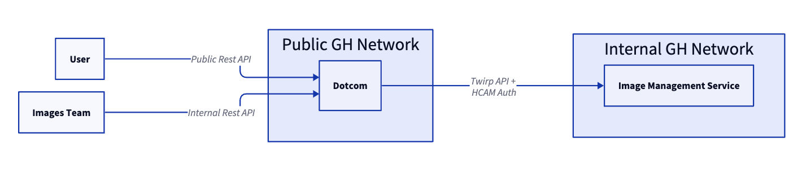

# Dotcom <-> IMS interaction

## Status
Accepted

## Context

In 4-9s architecture the Image Management Service will be responsible for image promotion and image management.
We need to figure out how our customers will manage custom images and how the image-gen team will manage curated and custom images.
Managing images includes creating new image definitions, updating existing image definitions and deleting image definitions. Also, uploading new image versions, updating them and deleting.

## Proposal

The IMS is deployed in the internal GH network and is not available on the public internet. So we will use dotcom as a middleware (proxy) for API requests.  
Dotcom will recieve requests from customers (via dotcom Rest API or dotcom UI), validate permissions and pass these requests to IMS.

This approach will give us a bunch of benefits:
- Images API will be unified with other dotcom API (the same endpoint, OpenAPI docs, etc)
- Take advantage of existing API mechanisms (rate limiting, authz, initial model validation based on YAML API specs, etc)
- All permissions validation will be centralized and IMS won't need to care about it (See [Permissions to manage custom images](#permissions-to-manage-custom-images))

### API for IMS <-> Dotcom

We will use the Twirp framework for our API between IMS and Dotcom. Also, we will use protobuf to define data contracts.  

Using Twirp with protobuf will give us the following benefits:
- Protobuf will allow us to generate clients for different languages (Ruby, Go, and a lot of others)
- Backward compatibility and easy versioning of API ([with protobuf and numeric fields](https://earthly.dev/blog/backward-and-forward-compatibility/))
- Less boilerplate code because Twirp will take care about serialization and deserialization of models
- Twirp is JSON-compatible so we will still be able to use JSON-based requests to our API during e2e-tests or debug

Twirp is the de-facto standard for GitHub services and the [recommended approach](https://github.com/github/Infrastructure/blob/main/rfc/RFC-5-rpc-at-github.md) for cross-service APIs.  
It is used in the `dotcom <-> launch` and `dotcom <-> runner-admin-service` interactions as well as a lot of other service interactions. So we have a lot of examples of how to implement a Twirp API in Golang.

### Auth for IMS <-> Dotcom

We will use HMAC (Hash-based message authentication code) for S2S auth. HMAC is the recommended approach for cross-service auth in GitHub.
The same approach is used for Launch and runner-admin-service.

[Thehub article describes HMAC auth in details](https://thehub.github.com/epd/engineering/dev-practicals/secure-coding/secure-coding-general/service-to-service-auth/) so we won't include too many details in this document.

### Permissions to manage custom images

Custom images are images which belong to specific organizations or enterprises. They are private and not available to any other entity.
Dotcom will provide public API and UI to manage custom images. Users with role "Manage runners" will be able to manage images.

As I mentioned earlier, IMS won't validate permissions to perform specific operations and will consider all requests from dotcom as Trusted. Dotcom will take care of permission validation because it has all the necessary information about a user's role, permissions, etc.

Example how request flow will look like:
1. `UserA` makes a request (API or UI) to update `ImageC` in `OrganizationB`.
2. Dotcom checks that `UserA` has permissions to manage `OrganizationB` and their role allows to manage images.
    - Dotcom rejects request if `UserA` doesn't have enough permissions.
3. Dotcom makes a request to IMS to update `ImageC` in `OrganizationB` (this call doesn't contain any information about `UserA` and IMS only works in context of organization / enterprise).
4. IMS performs request and report result back to Dotcom.

This approach is similar to `dotcom <-> runner-admin-service` permissions flow.

### Permissions to manage curated and marketplace images

Curated and Marketplace images are shared between all organizations / enterprises and any organization's admin can perform READ operations on them (ListCuratedImages, ListCuratedImageVersions, ListMarketplaceImages, ListMarketplaceImageVersions). But managing of curated and marketplace images (ADD, UPDATE, DELETE operations) are not allowed to organization's admins.

We will provide ability to manage curated and marketplace images for GitHub staff engineers and image-generation team and make sure that it is secure (API is not available for customers).  
There are two main use-cases:
- Add, update, delete images -> this functionality is required pretty rare to manage image lifecycle: new image is released,  old image is deprecated, etc.  
In future, we will consider integrating this functionality to GH stafftools or chatops but on first iteration it will be managed via API.
- Upload new image version for specific image -> This functionality is required pretty often (on daily basis) and it should be available from image-generation CI pipeline.

We will use the following approach to implement API for managing curated and marketplace images:
1. Mark endpoints as internal so they won't be visible in API documentation.
2. Make endpoints only available for users with GH staff role.
3. Add long-lived dotcom FF (like `actions_allow_manage_curated_images`) and make endpoints are only available for users with enabled FF.

#2 and #3 points together will give us enough security and confidence that API won't be available for customers. "GH staff role" validation will be our protection in case if we accidentially enable FF globally. Feature Flag validation will be our protection in case if some GH engineers without context call API accidentially.

With this approach, we will be able to enable FF for specific people from our team and image gen team. Then they will be able to use their PATs to manage curated and custom images. Also, PAT of image-gen pipeline owner will be used to upload images on daily basis.
