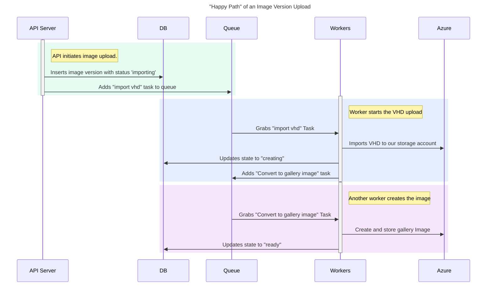

## IMS image upload process

#### Update on 05.03.2024

After implementing proposed image upload approach, active usage showed having multiple promotion jobs is inconvenient.
We revisited this part of decision in our [Revisit Promotion States ADR](./2024-03-revisit-promotion-states.md).

### Overview

This doc goes over two aspects of the IMS image upload flow:

- The general API, very briefly
- The upload process and how workers handle it (the primary focus of this ADR)

### API

The API should be able to:

- List images
  - List all curated images
  - List all marketplace images
  - List all custom images for an organization
- List all versions for a given image
- Get details for a given image version (status, size, etc)
- Upload a new image version
- Delete an image version

Most of the API is self-explanatory. However, the purpose of the rest of this doc is to provide details on the more involved upload process.

### The Upload Process

The upload process is split into multiple steps, with workers handling each one. Each step will be inserted into a queue for workers to pick up and process.

#### Happy Path

In the ideal scenario, where nothing goes wrong, the upload process is fairly simple.

##### API Server initiates image upload

- This is triggered by a POST request from Dotcom or the ImageGen team
  - request will include the image id, new version (e.g. `2.0.1`), VHD uri
- From this request, the API server will add a new image version with the state `importing` into the database
- Then, it'll add a task to the queue for a worker to import the VHD into our storage account. The task will include:
  - image version id
  - VHD uri (NOTE: we can also just store the VHD uri in the database instead)
- **NOTE**: The VHD uri for the new image version should always be saved encrypted because it contains sensitive information.

##### Worker starts the VHD import

- A worker will pick up the `import` task
- Imports the VHD for the new image version
- Adds a new "create" task to the queue to create the new image from this imported VHD
- Updates the state of the image version to `creating` in the database

##### Worker creates the Image

- A worker will pick up the `create` task.
- Creates the new image from the imported VHD
- Updates the state of the image version to `ready` in the database

#### Monitoring

The jobs that workers will execute can be very long running. Each worker should save its progress in a way that is surfaceble to devs, DRIs, and customers. Ideally, this progress should be numerical, e.g. "Upload is 30% complete".

#### Handling worker failures

Uploading can fail in a few different ways:

- A step can fail due to a transient issue (e.g., network outage, Azure outage, worker restart)
- A step can fail due to a permanent issue (e.g., invalid VHD)

##### A step can fail due to a transient issue (e.g., network outage)

- Each step should have a configurable number of retries
- Each retry should use an exponential backoff (e.g., 1s, 2s, 4s, 8s, etc). This will give external systems more time to recover from transient issues.
- Each step should be idempotent, so that another worker can pick up where the previous worker left off

###### A step can fail due to a permanent issue (e.g., invalid VHD)

- We should not allow retries for specific errors that we know can't be recovered from, e.g. if the error is "Invalid VHD URI" (paraphrasing) we should detect this as an issue that cannot be recovered from.
- For unknown errors/failures, once the number of retries exceeds the configured limit, the image version will transition to an error state.

#### Edge Cases

##### How do we handle multiple uploads for the same image version?

- Only one upload should be allowed at a time for a given image version.
   - A unique constraint should be placed on the image version ID at the database level to ensure this.
- If a new upload is attempted for an image version that has already been passed, we should fail the upload with an error message regardless of the VHD uri, i.e. image versions are immutable.
- For different image versions, even if they have the same VHD uri as a previously uploaded version, we should proceed with the upload, i.e. customers can upload the same image under a different version.

##### How do we handle deletes for an image version that is uploading?

- We should mark the image version as `deleting` in the database
- We should cancel any tasks in the queue for this image version (if possible)
- Each step should check if the image version is marked as `deleting` before starting
- Each step should check if the image version is marked as `deleting` before updating the state in the database

##### How do we handle updating an image version with a new VHD uri?

- We should not allow this
- Customers should delete the image version and upload a new one
   - We could possibly allow users to change the version number (this would require the version number of an image to be separate from its id, while still being unique)

##### How do we handle long-running issues?

Sometimes, outages last for an extended period, such as an Azure outage that persists for an indeterminate amount of time. In these cases, we should be able to pause new uploads.

Ideally, each worker in the process should be able to detect which downstream services are available and use this to determine whether it should proceed or not.

- We should be able to pause new uploads
- We should be able to pause existing uploads

##### How do we handle sudden spikes in uploads?

- We should be able to throttle uploads, ideally at a granular level, e.g., by region
