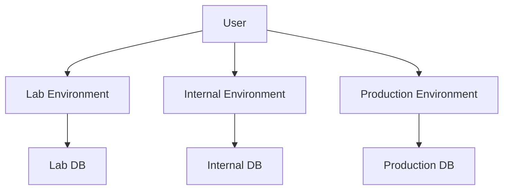

# Define deployment environments

## Status
In review

***

## Context

As our service grows and our needs become more complex, we need to define clear deployment environments. 
This will help us manage changes more effectively and ensure stability and reliability.

Ideally we would be able to repeat what Runner service is doing in terms of the ring-based rollout. Instead of rolling out IMS to all production users at once we would roll our IMS only to a certain subset of orgs/users first, before potentially impacting production.

## Decision

We have decided to establish three distinct deployment environments: Production, Internal, and Lab.

**Lab Environment:**

- Purpose: Used exclusively for testing. We will also explore options of using lab for load testing as well.
- Traffic: Does not handle production traffic, has it's own DB and aqueduct app.

**Internal Environment:**

- Purpose: Serves production traffic but is limited set of accounts
- Traffic: Limited to a few organizations, e.g., BBQ Beets. We will use a separate DB for internal environment.
Using data that we have from [Runner service](https://github.com/github/actions-dotnet/tree/main/Runner) we can assume that **internal** env will serve traffic for US Ring-0 and Ring-0, see data query below:

**Production Environment:**

- Purpose: Main environment for normal operations.
- Traffic: Handles the majority of traffic, excluding that serviced by the Internal environment.

We have also considered deploying to Proxima stamps, for instance, staff-wus2-01. 
More information on this can be found in this guide on adding a new Proxima stamp.

## Consequences

Defining these environments will:

- Enable e2e testing on lab environment
- Ring based rollout of IMS service
- However, we must manage and maintain `internal` vs `production` envs, which can increase complexity.
