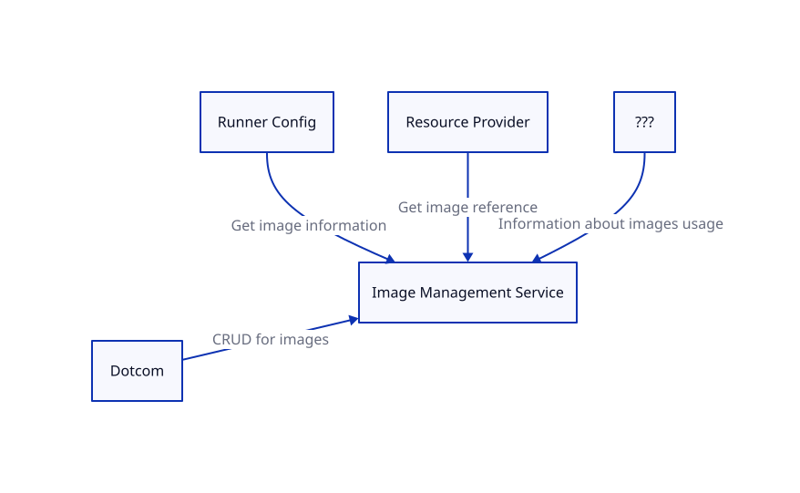
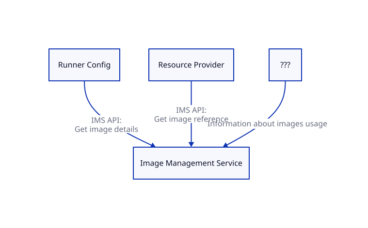

# Cross-service interaction

## Context

We would like to define how IMS interacts with other services (dotcom, Runner, hosted-compute-4-9s services, etc)

During the initial design of IMS we were mostly focused on designing the internal functionality which was independent of other services. Now is a good time to revisit cross-service interaction based on the [new design of hosted-compute](https://github.com/github/hosted-compute/blob/main/design/architecture.md).

IMS (Image Management Service) will interact with 4 services:



1. Dotcom -> IMS:  
Customers will use the dotcom UI, and eventually the public dotcom rest API, to perform CRUD operations against custom images and Read operations against curated and marketplace images. For such operations, dotcom will perform API calls to IMS under hood. 
2. Runner Config -> IMS:  
`Runner Config` is a a new service responsible for storing the configurations of customers' pools, including: pool name, public ip enabled/disabled, machine spec, and the image key used by pool (image source, image id, image version).  
When a customer creates a new pool or updates an existing one, the Runner Config service needs to call IMS to validate that the specified image exists and available for customer use.
3. Resource Provider -> IMS:  
[Resource Provider](https://github.com/github/hosted-compute/blob/main/design/resource-provider/resource-provider.md) is a service which will be responsible for interacting with cloud providers and VM creation. Resource Provider needs to call IMS to resolve image for VM creation.
4. Oracle -> IMS:  
IMS service needs to know the usage of every image version (how many VMs do we plan to have with the specific image version) in every region. IMS needs to know this information to set appropriate number of replicas for image versions.

The 1st point is already implemented and won't be covered by this ADR. See [Dotcom <-> IMS Interaction ADR](./2023-08-dotcom-ims-interaction.md) for more details.
Points 2, 3, 4 are covered in scope of this ADR.

## 2. Runner Config -> IMS

`Runner Config` is a a new service responsible for storing the configurations of customers' pools, including: pool name, public ip enabled/disabled, machine spec, and the image key used by pool.  (image source, image id, image version). Right now, Runner service performs duties of Runner Config.

### Interaction flows

When customer creates a new pool or updates an existing one, Runner Config service needs to call IMS to get the image details and confirm that:
- Image exists
- Customer is allowed to use image (ensuring the Customer/Organization is indeed the owner of that image, dictated by the supplied Github `global_id`)
- Architecture and OS of image is compatible with pool
- Image is enabled

Any other Runner Config operations (GetPool, ListPools, DeletePool) don't require interaction with IMS.  
Also, Runner Config doesn't need to be notified about any image changes because:
- Existing image can't be removed if it is used by any pools
- Owner, Architecture and OS of image is permanent and can't be changed
- Enabling or disabling image only control ability of creating a new pool with this image and doesn't impact existing pools  

### Data

Approximate data contract between Runner Config and IMS:
```
RequestPayload: {
  owner_id: string
  ImageKey: {
    source: "Curated" | "Customer" | "Marketplace",
    id: int, // unique id of image definition supplied by `GetImage` from IMS upon creating customer pool
    version: string
  }
}

Examples:
{ "owner_id": "github", "source": "Curated", "id": 5, "version": "latest" }
{ "owner_id": "E_MjYK", "source": "Customer", "id": 6, "version": "2.0.0" }
{ "owner_id": "nvidia", "source": "Marketplace", "id": 20, "version": "latest" }

ResponsePayload: {
  architecture: "X64" | "Arm64",
  os_type: "Linux" | "Windows",
  enabled: boolean
}

Examples:
{ "architecture": "X64", "os_type": "Linux", enabled: true }
{ "architecture": "Arm64", "os_type": "Windows", enabled: false }
```

### Number of API calls

```kusto
ActivityLog
| where PreciseTimeStamp > ago(7d)
| where Service == "runner"
| where Command == "Pools.CreatePool" or Command == "Pools.UpdatePool"
| summarize count() by bin(PreciseTimeStamp, 1min)
| render linechart 
```

- Average: 2.5 API calls per minute (2.3k API calls per week)
- Peak: 30 API calls per minute

### Option A: Direct API calls

Runner Config will perform API calls to IMS when it needs to retrieve image details.

With this approach, Runner Config will fail to create a new pool or update existing pool if IMS is not available. But if IMS is down, customers won't be able to create or update pools anyway because dotcom UI will be broken.

### Option B: Implement image validation logic on dotcom

Another discussed option is implementing image validation logic on the dotcom side. With this approach, Runner Config won't need to interact with IMS service at all and Runner Config will consider any image as valid in all `CreatePool` / `UpdatePool` requests.

Per our discussion and investigation, this option has a number of drawbacks:
- Validation logic will be split between different services: images will be validated by dotcom side however machine specs, public IP enablement, etc.. will be validated by the Runner Config (as they are owned by this service). This will complicate maintenance.
- It is not recommended to implement business logic in dotcom. [It is recommended to place a new business logic in separate services if this business logic doesn't require any data from monolith](https://thehub.github.com/epd/engineering/principles/when-to-build-features-in-the-monolith-vs-a-microservice). Also, considering the single-responsibility concept of the hosted-compute-4-9s, we would prefer to treat dotcom as a client for IMS / Runner Config and don't include new business logic.

### Decision

We decided to proceed with option A.  
Considering the aforementioned small number of requests and availability concerns, it should still meet the availability SLO. In future if we see emergent issues with this approach it is easier to re-think this design and consider moving this logic or potential other solutions than if we started with adding this logic to the monolith. 

Also, as it was discussed, 4-9s availability SLO should be only applied to job execution since that's what customers care about with CI. Configuration is not usually time critical and it is fine to relax to three nines.

## 3. Resource Provider -> IMS

[Resource Provider](https://github.com/github/hosted-compute/blob/main/design/resource-provider/resource-provider.md) is a new service in the hosted-compute-4-9s architecture which is responsible for interacting with cloud providers as well as VM creation. Right now, Runner service performs the duties of Resource Provider.

`Resource Provider` will retrieve information about pool configuration from the Runner Config service:
```json
{
  "name": "ubuntu-latest pool"
  "public_ip_enabled": false,
  "machine_spec": "4-core",
  "image": {
    "source": "Curated",
    "id": 5,
    "version": "latest"
  }
}
```

### Interaction flows

Resource Provider will need to call IMS to resolve the `image` property and retrieve the `ImageReference`. An `ImageReference` is a [special Azure object](https://learn.microsoft.com/en-us/azure/templates/microsoft.compute/2021-03-01/virtualmachines?pivots=deployment-language-bicep#imagereference) which defines where an image version is located (which azure subscription, resource group, compute gallery, etc ).  
A new IMS API will return an `ImageReference` object to the Resource Provider and Resource Provider will subsequently add this object to the VM deployment template when creating virtual machine [like the Runner service currently does](https://github.com/github/actions-dotnet/blob/25d702f544b1600e062a892f94e0f744a1a68349/Runner/Service/Server/Templates/vmResources.bicep#L147).

This way, images will remain a black box for `Resource Provider`, it doesn't need to know any details of how images work and are stored under the hood. Resource Provider will only know the aforementioned pool properties and will use IMS to retrieve the ImageReference from these properties. Then ResourceProvider uses this ImageReference for VM creation. 

Another requirement is storing timestamp of last usage for every image version in IMS database. Ideally, our solution should allow us to track and save timestamp of last usage for every image version. Otherwise, we will need to find other way to achieve it.

### Data

Approximate data contract between Resource Provider and IMS:
```
RequestPayload: {
  ImageKey: {
    source: "Curated" | "Customer" | "Marketplace",
    id: int,
    version: string
  }
}

Examples:
{ "source": "Curated", "id": 5, "version": "latest" }
{ "source": "Customer", "id": 6, "version": "2.0.0" }

ResponsePayload: {
  ImageReference: {
    id: string,
    offer: string,
    publisher: string,
    sku: string,
    version: string
  }
}

Examples:
{
  "id": "/subscriptions/<>/resourcegroups/<>/providers/Microsoft.Compute/galleries/<>/images/<>/versions/20230911.1.0",
  "offer": "",
  "publisher": "",
  "sku": "",
  "version":""
}
{
  "id": "",
  "offer": "0001-com-ubuntu-server-jammy",
  "publisher": "canonical",
  "sku": "22_04-lts-arm64",
  "version":"1.0.0"
}
```

### Number of API calls

Resource Provider and Runner service need to retrieve image reference in two cases: vm creation & vm reimage (to understand if VM should be re-imaged or re-created on a new image version).

So the number of requests is equal to the number of jobs in MMS and Runner service in total.

In total for MMS and Runner service, it will be:
- 115 millions jobs per week, 20 millions jobs per day
- 20k jobs per minute
- ~98% of all jobs are run on top 5 images
- 4% of all jobs are larger runners. 96% of all jobs are standard runners.


```kusto
github_actions_v0_job_execution
| where timestamp > ago(7d)
| where runner_type in ("RUNNER_TYPE_HOSTED", "RUNNER_TYPE_CUSTOM")
| summarize count() by bin(timestamp, 1min)
| render linechart 
```

### Option A: Direct API calls + local cache in Resource Provider

Resource Provider will make direct API calls to IMS to retrieve an image reference.

Also, Resource Provider will have use a local cache to reduce the number of API calls and to be tolerant to IMS outages. This local cache for specific image key will be refreshed every N minutes to pick up a new image versions. If refresh fails due to IMS outage, Resource Provider will continue to use last known image version.

The benefits of this option:
- API is easy to implement
- Resource Provider is not blocked if IMS is down. Local cache will allow using last known version of image
- This option will allow us to track timestamp of last image usage in IMS service. When IMS process API request, IMS will be able to update `LastUsedOn` in database.

The drawbacks of this option:
- Resource Provider will need to implement local cache for image versions
- Resource Provider will have a delay for image version updates as the delay is equal to refresh frequency of Resource Provider cache. This shouldn't be a problem because if we set refresh frequency to a small value such as ~3-5 minutes. It will only become problem for a refresh of  ~30 minutes or larger. 

### Option B: Direct API calls + Internal Redis cache

This option is pretty similar to option A: Resource Provider will make direct API calls to IMS to retrieve an image reference.  
The only difference - IMS will use internal redis cache. Redis cache will help to:
- Reduce DB load -> Image version information is not changed often. It doesn't make sense to perform db call on every request. When a new image version is available, we will update redis entry.
- Improve availability -> Redis has pretty high availability (5-9s). Even if DB is down, IMS will continue to work based on redis cache.  If redis is down, IMS will fallback to DB calls. In total, it will give us pretty high availability and allow to handle a huge number of requests from Resource Provider
- Speed up requests

The benefits of this option:
- API is easy to implement and there is a paved path for Redis deployment and maintenance
- Resource Provider is not blocked if IMS DB is down or IMS Redis is down
- This option will allow us to track timestamp of last image usage in IMS service

The drawbacks of this option:
- Redis is extra dependency which requires maintenance
- Resource Provider still needs to implement some kind of caching on their side to handle cases when IMS is completely down.


### Option C: Hydro events for every image version update + persistent storage in Resource Provider

IMS will send hydro event every time when a new image version is released. Resource Provider will be able to subscribe on these events and save image details for versions to local storage.

With this option Resource Provider will need to have own persistent storage which is shared between all Resource Provider instances and save / maintain image details for absolutely all images in this permanent storage.  
It is required because Hydro only stores events for last 14 days. But some images can be updated pretty rare (every 6 months). If Resource Provider starts to handle a new config, it won't be able to use Hydro history to find last event for specific image version.

The benefits of this option:
- Easy implementation on IMS side
- Resource Provider is not blocked if IMS DB is down. RP will be able to use data from persistent storage during IMS outages

The drawbacks of this option:
- Complicated implementation on Resource Provider side: subscribe on events for absolutely all images, store all images data in persistent storage, duplicating significant amount of data
- This option doesn't allow to track image version usage in IMS


### Option D: Hydro events with image version snapshot

IMS will send hydro event every N minutes and include snapshot of data for muliple images to event payload.

Unfortunately, it is not possible to include data for all images to the single event payload because event payload is limited to 5MB.  
So we will have to split data to multiple batches or only include the most popular images to batch and fallback to API for less popular images.


### Option E: Shared Redis

Since Resource Provider needs to know the latest information about every image key, Redis could be a convinient solution to share this data.  
Resource Provider will be able to connect to it and take image data directly from Redis. IMS will update values in Redis when new image version is released.

The benefits of this option:
- High availability of Redis (5-9s)
- Super fast image updates. Redis can handle high load and Resource Provider will be able to query data from Redis on every vm-creation or vm-reimage

The drawbacks of this option:
- Redis is extra dependency which requires maintenance
- Sharing database is bad practice and not recommended:
    - Keys rotation for shared Redis is tricky because our team will need to update Resource Provider service
    - Redis doesn't enforce data schema / data contract. So we will have to use shared module to access Kusto or use Protobuf over the Kusto to ensure data contract between IMS and Resource Provider services
- This option requires us to have API as a fallback option (if Redis is down or some image is missed in Redis cache)
- This option doesn't allow to track image version usage in IMS

### Decision

We decided to start with Option A (Direct API calls + Local cache in Resource Provider). This option seems to be optimal parity between implementation complexity / availability / features:  
- It is easy to implement and easy to integrate
- It provides us a good availability by using local cache on Resource Provider side
- It allows us to track image usage in IMS from the box without any additional changes

We will start with Option A and see how it works under load after integration with Runner service.  
Since it is internal API, it will be easy to revisit our choice in future in case of any problems or drawbacks. If we see any problems with this option, we can easily adopt Option B or Option C in future.

## 4. Oracle -> IMS

The [Oracle](https://github.com/github/hosted-compute/blob/main/design/oracle/oracle.md) service's main responsibility is to aggregate the request events that are emitted from the GPS and decide how much load each Resource Allocator can expect to be handling. Right now, Runner service performs duties of Oracle.

### Interaction flows

IMS stores images in [Azure Compute Galleries](https://learn.microsoft.com/en-us/azure/virtual-machines/azure-compute-gallery).
For every image version in compute gallery, we need to configure and regularly update replications and replicas count based on current VM usage.

The number of replicas define how many VMs can use specific image version at the same time. Right now, in Runner service we set 1 replica per 250 VMs.

Imagine that some specific image version is used by:
- 1000 VMs in `eastus` -> It means IMS need to set 4 replicas in `eastus` (1000 VMs / 250)
- 2300 VMs in `westus` -> It means IMS need to set 10 replicas in `westus` (2300 VMs / 250)

This information should be updated regularly in IMS to make sure that IMS adjust azure replicas according to current usage. `Runner` service runs [cron job](https://github.com/github/actions-dotnet/blob/main/Runner/Service/Server/Jobs/CuratedImages/CuratedImageReplicationManagementJob.cs) every 30 minutes to update replicas count for every image / image version.

### Data

Example of information which IMS needs to set replications:
```json
{
  "image_source": "Curated",
  "image_id": 5,
  "image_version": "3.0.0",
  "vmcount_per_region": {
    "eastus": 1000,
    "westus": 2300
  }
}
```

In worst case, the number of image versions is equal to the number of configs (if every config uses different image version)

### Decision

We don't have decision for this case yet. 
After additional conversation in https://github.com/github/hosted-compute-ims/discussions/513#discussioncomment-8445231 we realized that it is not clear yet how other services (Oracle, Resource Allocation, Resource Provider) will work.
So we decided to postpone this part of design for now. We will integrate with Runner using the simplest API approach and will revisit this point when other services are ready.


## Summary

We decided to proceed with the following options:
1. Runner Config -> IMS: Option A (Direct API calls)
2. Resource Provider -> IMS: Option A (Direct API calls + local cache in Resource Provider)
3. No decision

