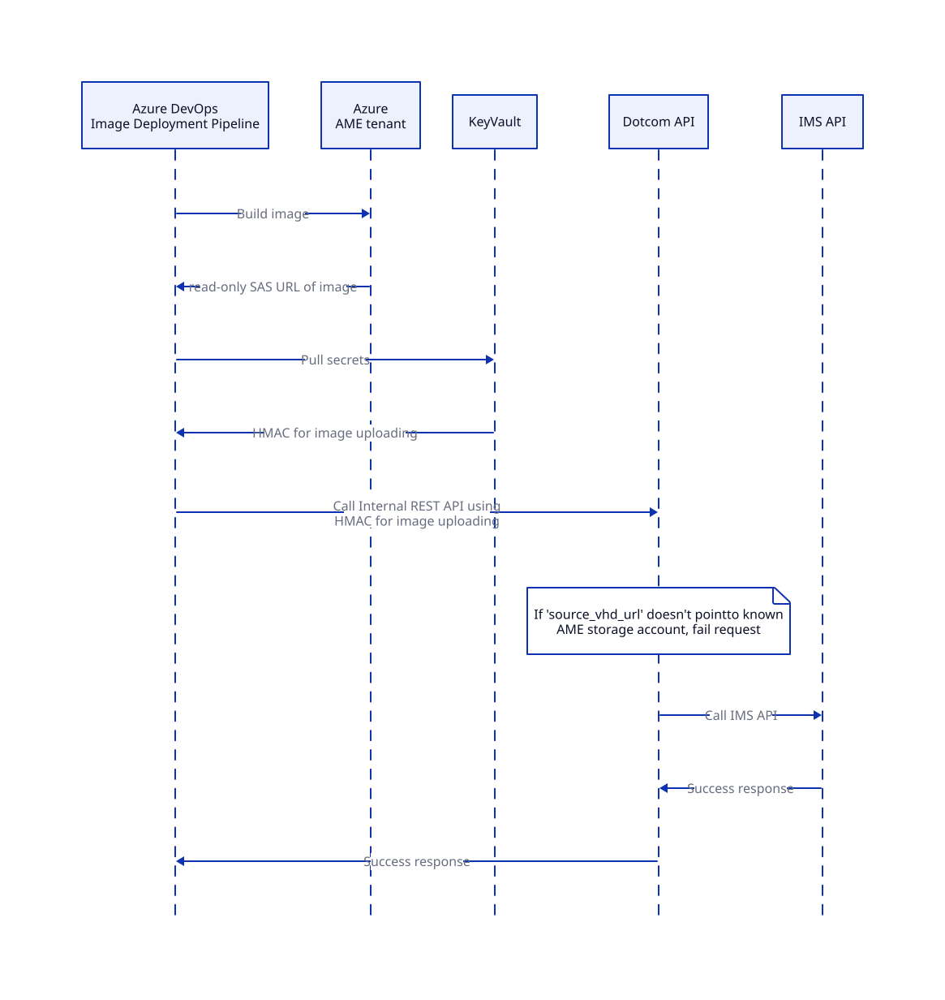

# Upload curated images to IMS

## Context 
Image Management Service is responsible for managing curated (aka GitHub-owned) images which are used for the most of Hosted Compute Runners: Standard Runners (`ubuntu-latest`, `windows-latest`) and Larger Runners. Under hood, IMS stores images in [Azure Compute Gallery](https://learn.microsoft.com/en-us/azure/virtual-machines/azure-compute-gallery) (`githubazure` tenant).  

IMS is Moda app hosted inside GH network. It is integrated with dotcom using HMAC authentication.
Right now, temporary, it is available in public internet to support interaction with old Larger Runners infrastructure which is hosted in Azure. On long-term (~1 year), IMS will become fully internal application which is not accessable from public internet.

### How to upload image version to IMS?

IMS provides API which can be used to upload new image versions. As soon as image version is uploaded to IMS, it will automatically become available for everyone and all new VMs will use the new image version.

To upload a new image version, image deployment pipeline needs to call IMS Twirp API method: `CreateCuratedImageVersion` and pass the following data:
- `image_definition_id` -> unique and persistent ID of image definition. For example, ID `ubuntu-latest` is 1, etc.
    - Since ID is persistent, it can be just hardcoded in script / pipeline.
- `version` -> version if image. Ex: `20240708.1.0`
- `source_vhd_url` -> read-only Azure SAS URL for VHD image.
    - It is already generated in image deployment pipeline and can be just passed to API.

Reference: [Protobuf contract](https://github.com/github/hosted-compute-ims/blob/ec86c834beace05f4878030e03aab4e6d12b5035/proto/services/admin_api/admin_service.proto#L110)

### Image Generation and Deployment pipeline

Image Generation and Deployment pipelines are located in [mseng AzureDevOps organization](https://dev.azure.com/mseng/AzDevNext.Deploy/_build?pipelineNameFilter=compute.image) for legacy reasons. On long term (~ 1 year), these pipelines will be migrated to Actions.

Pipelines are owned and controlled by image-gen team (`#image-gen-dragons` Slack channel).

Image Generation pipeline is triggered on daily cadence. It starts image generation in Azure (AME tenant) using packer.  
Generated images are created in `https://hostedimagestaging.blob.core.windows.net` storage account. This storage account belongs to AME tenant and not available for anyone directly without SAW machine.  
As soon as image is successfully generated, pipeline automatically deploy it to Canary environment. It is special isolated environment for testing which doesn't have real customers.  
Once per week, image-gen-team takes the last successfull image and run "Ship it" button. It triggers deploying of new image version to all VMs.  

We consider mseng pipelines as secure to deploy images to the whole GitHub because very limited set of users has an access to modify YAMLs and trigger deployment. All image generation internal resources are only accessed via SAW machines. Also, these pipelines follow all Microsoft compliance.

## Goal

We need to find a safe and compliant solution to upload image versions from Image Deployment pipeline to IMS. A solution shouldn't require using self-hosted runners and should be available on regular Hosted Runners hosted in Azure.
Also, solution shouldn't use personal access tokens and should be secure enough because IMS Curated images are used on all runners across GitHub.

## Proposal

1. We will implement [Internal REST API](https://thehub.github.com/epd/engineering/products-and-services/internal/internal-apis/#internal-rest-apis) in dotcom to upload new image version
    - Internal REST API will be accessible only via special HMAC (let's name it `image-generation-hmac`)
    - API will call IMS API under hood to create image version
    - As an additional validation, we will add a check that passed `source_vhd_url` property points to AME storage account where images are generated (`source_vhd_url` starts with `https://hostedimagestaging.blob.core.windows.net/*`)
2. Image Deployment pipeline will call Dotcom Internal REST API
    - Pipeline will retrieve `image-generation-hmac` from KeyVault
    - Pipeline will use HMAC to access dotcom internal API
3. `image-generation-hmac` secret will be stored in [IMS GH Vault](https://thehub.github.com/security/security-operations/vault/)
    - We will configure secret federation to sync secret between IMS vault and dotcom vault
    - We will configure secret federation to sync secret between IMS vault and Azure KeyVault available for [Azure DevOps mseng](https://dev.azure.com/mseng/AzDevNext.Deploy)

Advantages:
1. Since we use dotcom internal API, we will be able to upload images from regular hosted runners which are hosted in Azure and doesn't have an access to GH network. It means, this approach will continue to work without modifications when IMS becomes private and won't be accessible outside of GH network.
2. Since we auth into internal API using `image-generation-hmac`, we don't need to use or hardcode any personal secrets. Rotation of HMAC will be pretty strightforward and easy because of secret federation.
3. Even if our `image-generation-hmac` is compromised, we are still safe because we have a check that `source_vhd_url` points to AME storage account. Even if HMAC is leaked, bad actor won't be able to upload any custom image.

## Long-term proposal

On the long term, when MMS and Runner services are deprecated in favor of hosted-compute-4-9s, the following infra changes will happen:
- IMS will become private and not available outside of GH network
- Image Generation pipeline will be migrated to GitHub Actions
- Image Generation resources will be migrated from `AME` to `githubazure` tenant

All these things will allow us to simplify image uploading process and make it even more compliant:
1. We will be able to use Larger Runners with VNET injection to access IMS in GH network without Dotcom middleware
2. We will be able to get rid of read-only Azure SAS URL for VHD image because IMS and image-generaton will be located in the same tenant. SAS URLs will be replaced with simple RBAC for IMS.