# Drop Internal environment and use staff-wus2-01 as Internal

When we setup IMS deployment initially, we decided to proceed with the following environments: `lab`, `internal`, `production`, `staff-wus2-01`, etc (+ some Proxima environments).  
Now, we are close to integration of IMS with Runner service and we would like to revisit this decision because having `internal` environment brings additional maintenance concerns and complicates integration.  

## Initial plan

Our initial plan was:
- `lab` is just a playground. Fully isolated environment which is not connected to any other services and don't serve any real customers. It is super safe to drop database, azure resources or anything else on this environment. Also, Lab is used to run e2e tests against real infrastructure during deployment CI.
- `internal` is real environment which serves internal customers from `dotcom` stamp. Similar to Ring 0 & 1 in Runner service.
- `production` is real environment which serves external customers from `dotcom` stamp. Similar to Ring 2 in Runner service.
- `staff-wus2-01` is Internal Proxima environment which serves customers from `staff-wus2-01` stamp
- `prod-weu-01`, ... are some other Proxima environments. IMS environment per Proxima stamp.

Why `lab`, `internal`, `production` environments?
1. we wanted to be consistent with hosted-compute proposal for `hosted-compute-gps`. Learn more about this proposal in [Environments](https://github.com/github/hosted-compute/blob/main/design/environments.md) document.
2. we wanted to have something like Ring 0 for testing purposes where we can enable some changes for specific org and don't impact other customers. `lab` doesn't suit for this goal because it is isolated and not connected to other services.
3. we wanted to use `internal` / `production` separation for slow image rollout. Like we do right now with Runner service: First, a new image is deployed to Ring 0, 1. Then, in a couple of hours, image is deployed to Ring 2.

The diagram below shows the initial plan:

## What other services do?

- The most of non-Actions services on GitHub prefer `lab & production` configuration. For some services, `lab` is isolated like IMS. For some services, it is connected to other services.
- Actions 4-9s services ([results](https://github.com/github/actions-results/tree/main/config/kubernetes), [broker-worker](https://github.com/github/actions-broker-worker/tree/main/config/kubernetes), [actions-runner-admin](https://github.com/github/actions-runner-admin/tree/main/config/kubernetes)) use `lab & production` configuration.
- Actions-Compute 4-9s services ([hosted-compute-gps](https://github.com/github/hosted-compute-gps/tree/main/config/kubernetes), [hosted-compute-oracle](https://github.com/github/hosted-compute-oracle/tree/main/config/kubernetes), etc) use `lab`, `internal`, `production` configuration.
- Hosted Compute Network service uses `lab & production` configuration.

Looks like the most of GitHub services and Actions 4-9s services use `lab` & `production` configuration and it work perfectly for them.

## Safe service deployment

According to the initial plan, the deployment order is the following: `lab` -> `internal` -> `production` -> `staff-wus2-01` -> `prod-weu-01`.

Will removing `internal` environment make our deployment more dangerous because we deploy to `production` earlier? Not really because:
- Moda deployment provides a bunch of defense mechanisms to make deployment safer:
    - Moda deployment and **deployment rollback** are significantly faster than Vssf. Rollback can be done within a couple of seconds.
    - [Canary deployment](https://thehub.github.com/epd/engineering/products-and-services/internal/moda/feature-documentation/canary-deploys/) is a feature which allows to deploy the single replica, wait for 5-10 minutes to observe any unexpected behaviour and then deploy full environment
- We can change deployment order after removing `internal` environment to be: `lab` -> `staff-wus2-01` -> `prod-weu-01` -> `production`.
    - `staff-wus2-01` is actually internal environment too. It is proxima which serves only internal customers.
    - I have found this approach (reuse proxima `staff-wus2-01` as a test environment and deploy `prod-weu-01` before `dotcom` stamp) in some other GitHub services.
- IMS supports feature flags which can become another protection to rollout new features in a safe way.

As a result, we decrease the number of environments and reduce deployment time. At the same time, we still perform safe deployment.

## Maintenance concerns

Every IMS environment has a bunch of resources which should be maintained:
- Database
- Set of Azure subscriptions
- Separate aqueduct queues
- Telemetry and separate set of alerts / datadog monitors

Also, having additional environment adds ~10 minutes to deployment duration which impacts developer productivity.

## Integration complexity

As you might noticed from [Initial plan](#initial-plan) section, all IMS environments have 1-1 mapping with stamps. The single exception is `dotcom` stamp. The `dotcom` stamp is connected with two IMS environments: `internal` and `production`.  
It means that `IMS-internal` will store data of internal customers and `IMS-production` will store data of production customers. Moving accounts between environments will cause losing all data (uploaded image versions, etc)

The main problem with this approach is synchronization of this mapping with other services:
- Runner service: with Runner service it should be easy to point Ring 0, 1 to `IMS-internal` and Ring 2 to `IMS-production`
- Dotcom: we will need to implement some logic on dotcom to store mapping for every account to call `IMS-internal` or `IMS-production`
- Resource Provider should know which environment belongs every config to resolve image key via `IMS-internal` or `IMS-production`
- (in future) Runner Config service should know which environment belongs every config to resolve image key via `IMS-internal` or `IMS-production`

This problem can be solved by storing additional metadata for account and passing it through multiple services. But it causes some additional complexity and we need to understand if it is really worth to introduce it.  

Also, splitting `dotcom` stamp to `IMS-internal` and `IMS-production` causes problems with using dotcom feature flags system because feature flags can be only enabled per user or per stamp. Per stamp means FF will be enabled for both IMS environments at the same time. No way to enable for `IMS-internal` only.

Based on experience of other services, having one environment per stamp is the best way to simplify integration.  
As it is mentioned in [What other services do?](#what-other-services-do) section, some hosted-compute 4-9s services like `hosted-compute-gps` uses internal and production separation. But their integration case is significantly easier because these services don't store persistent customers' data.  
IMS, Network service, Runner Config (in future) stores customers' data, so keeping unambiguous is pretty important to not lose customers' data.

## Slow image version rollout

Initially, we wanted to use `internal` / `production` separation for slow image version rollout. Similar to what we do right now with Runner service: First, a new image version is deployed to Ring 0, 1. Then, in a couple of hours, image version is deployed to Ring 2.

MMS does slow rollout and deploy a new image version to all VMs during 3 days. The main reason of such slow rollout is MMS infrastructure where deployment image to pool and rollback image from pool are very long operations (1-2 hours vs 5-10 minutes on Larger Runners). So, slow rollout ensure safer deployment.
On practice, MMS rollout model is very painful for customers because 3 days per week, customers' workflows are randomly assigned between old and new image version. As a result, customers who need to use latest tool version from latest image version need to wait for a week before they can safety rely on new functionality.

Anyway, ability to make slow image version rollout is pretty important.  
But `internal` / `production` environments doesn't really help to achieve it because the number of internal customers is too small to get us enough feedback about new image version. Runner Ring 0 & 1 have 600 customers (1.5%) and Runner Ring 2 has 29k customers (98.5%)  
So, if we need to support slow image version rollout, we should use different approach to support instead of relying on `internal` / `production` environments.

## Proposal

We propose dropping `internal` environment and keep mapping between IMS environments and stamps as 1-1 to simplify integration.

For now, our deployment order will become: `lab` -> `production`.

When add Proxima environments, we will change our deployment order to: `lab` -> `staff-wus2-01` -> `prod-weu-01` -> `production`.  
This way, `staff-wus2-01` will take role of internal environment for IMS.

