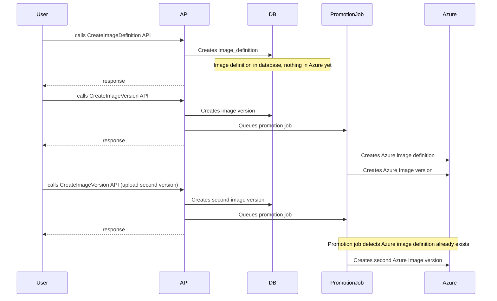
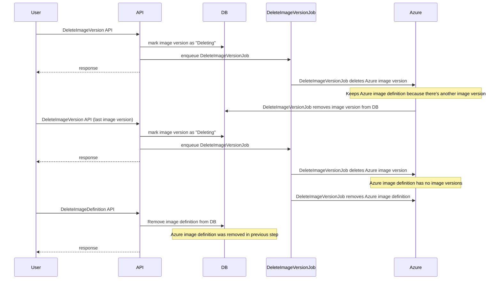

IMS API calls sequence uses lazy logic to sync `ImageDefinitions` and `ImageVersions` between Azure and DB.
Below you can find 2 digrams describing logic behind DB-Azure sync for `Create` and `Delete` RCP calls.

## Create calls:

Diagram describes RPC calls to create image definitions and versions. 
RPC calls interact with the DB and the `PromotionJob` which is scheduled to for expensive operations that might need delayed retries. 
The `PromotionJob`, when called, creates or updates image versions in Azure based on whether an image definition already exists.

## Delete calls

Diagram describes RPC calls to delete image definitions and image versions. 
RPC calls interact with the DB and the `PromotionJob` which is scheduled to for expensive operations that might need delayed retries. 

When the final `DeleteImageVersion` RPC is called, the `DeleteImageVersionJob` ensures the Azure image definition is empty before deleting. 
When `DeleteImageDefinition` RPC is called, the database removes the image definition entry because the Azure image definition was removed in the previous step.

