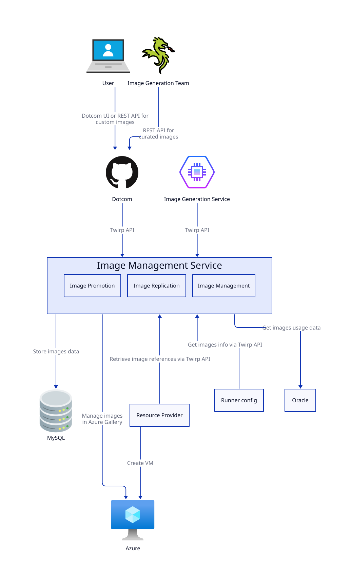

# Image Management service

The **I**mage **M**anagement **S**ervice (IMS) will take the responsibility of image promotion and image management for both Standard and Larger Runners in the 4-9s architecture.

**Main conclusions:**
1. IMS is an image provider and should know nothing about images consumers.
2. IMS will follow the "Single Responsibility" principle to make sure that it is not overloaded by functionality. It will:
    - Provide an API for uploading and managing curated and custom images
    - Image promotion (import a VHD to a blob storage and create an Azure Gallery image from it)
    - Rollback of a specific image version (rollback means fully disabling the specific image version in case if we found an issue or bug with it)
    - Perform background jobs related to image management (scale down replicas for old images, remove custom images older than N days / keep X latest images per image definition, etc)
    - Provide image related information to the Resource Provider, Runner Config and other hosted-compute-4-9s services (see [Interaction with other 4-9s services](#interaction-with-other-4-9s-services) section)
    - Control deployment of new image versions and OS rollout (see ["Deployment plans"](#deployment-plans) section below)
3. IMS won't include any image generation functionality. Also, a "Custom image building" feature and image specialization will be owned by a separate image generation service (its design is still under discussion but it has been agreed that it shouldn't be the responsibility of the IMS).
4. IMS will unify uploading of curated (aka GitHub-owned) and custom images. The Image-Gen team will authenticate on behalf of the system user to upload curated images or manage them.  
In future, we also will be able to provide a stafftools UI or chatops to simplify management of curated images (adding new images, control OS rollout, etc).
5. IMS will support graceful degradation. If IMS is down, customers won't be able to upload new images but all dependent services will be able to work with the latest known image version.
6. IMS will use the same technology stack as other 4-9s services: Golang, Moda deployment, Kubernetes, MySQL, Redis, etc
7. IMS will support dotcom FFs (via the [Twirp Features API](https://thehub.github.com/epd/engineering/products-and-services/dotcom/features/feature-flags/twirp/) like Launch does) so PMs will be able to use dotcom stafftools to enable / disable images for customers (we have a bunch of Marketplace images which are hidden under a FF and enabled for some customers).

## Interaction with other 4-9s services

IMS will need to interact with 3 services:

1. Runner Config -> IMS:  
`Runner Config` is a a new service responsible for storing the configurations of customers' pools, including: pool name, public ip enabled/disabled, machine spec, and the image key used by pool (image source, image id, image version).  
When a customer creates a new pool or updates an existing one, the Runner Config service needs to call IMS to validate that the specified image exists and available for customer use.
2. Resource Provider -> IMS:  
[Resource Provider](https://github.com/github/hosted-compute/blob/main/design/resource-provider/resource-provider.md) is a service which will be responsible for interacting with cloud providers and VM creation. Resource Provider needs to call IMS to resolve image for VM creation.
3. Oracle -> IMS:  
IMS service needs to know the usage of every image version (how many VMs do we plan to have with the specific image version) in every region. IMS needs to know this information to set appropriate number of replicas for image versions.

Interaction with all these services are covered in details in [Cross-service interaction ADR](./adrs/2024-03-cross-service-interaction.md).

## Interaction with Dotcom

IMS won't be accessible directly and customers will use GitHub API to manage images.  
For interaction between IMS and dotcom we will use Twirp client + protobuf to simplify API implementation, backward compatibility support and data validation.

Example of using this approach for [actions-runner-admin](https://github.com/github/actions-runner-admin) service: [Twirp client](https://github.com/github/actions-runner-admin/blob/main/cmd/twirp/main.go), [protobuf models](https://github.com/github/actions-proto/blob/main/proto/runner-admin/api/v1/runner_group.proto), [auto-generated client for dotcom](https://github.com/github/github/blob/master/lib/actions_runner_admin/twirp/runner_admin_client.rb).

Permissions validation will be performed by dotcom. With this approach, all permissions validation will be centralized at the same place and IMS service won't need to care about it.

More details about interaction with dotcom can be found in ["Dotcom <-> IMS interaction"](./adrs/2023-08-dotcom-ims-interaction.md).

## Canary images deployment

Canary pools is a special environment (Scale Unit) on Ring 0 which is only used for testing purposes or by internal customers.  
Image-generation team generates and deploy images to Canary pools on daily basis. Then they run Canary tests against these pools.  
Once per week, image-generation team takes the freshest image which was deployed to Canary pools and passed all tests, and deploy it to production.

We will create a separate set of curated image definitions on production environment. These image definitions will be hidden under FF and will be enabled only for `bbq-beets` org.
So, image generation team will upload new images to canary image definitions on daily basis and upload images to production image definitions once per week.

More details about IMS environments can be found in [Environments](./environments.md).

## Managing replicas for images in Azure Gallery

Every image in an Azure Gallery is hosted in specific region. If we need to use it in other regions, we need to configure replicas in those regions too.

Also, for every region we should specify the number of replicas. Azure's recommendation is `For every 20 VMs that you create concurrently, we recommend you keep one replica`.  
Runner service doesn't have any information on how many VMs are created concurrently so it uses the number of active VMs to calculate replica count. The number of active VMs is divided by `250` - a magic number which we found based on testing, to get the replica count we need to set.

IMS doesn't have information about images consumers and how many VMs we have for every image. So Oracle will provide us the information about image usage and active regions.

## Deployment plans
**[Work In Progress section - Deployment plans is still a raw concept which we want to discuss more]**

The 4-9s architecture should support one more important concept related to images - slow images rollout, which includes:
- When a new image version is released, we want to deploy it slowly across multiple days (our current approach for MMS is 15% of VMs receive this image version on the first the day of deployment, followed by another 15% of VMs on the second day of deployment, with the final 70% of VMs receiving this new image on the third deployment day).
- When a new OS version is released, we migrate the latest image labels (like `ubuntu-latest`) slowly by N% VMs per day.

On the one hand, this process should be controlled by IMS because it is source of truth for images. Also, slow deployments are usually controlled via setting a rollout speed, cadence, date ranges, etc) and monitored by the Image-gen team.  
On the other hand, as we mentioned above, IMS should know nothing about image consumers so it won't be able to distribute different image versions between consumers (e.g it won't be able to dictate image version 1 goes to this LCM and image version 2 goes to another LCM).

The GCAS (Global Capacity Allocation service) is source of truth for available LCMs and GCAS, and is aware how many VMs we have for every image. So it makes sense for GCAS to distribute previous and new image versions between LCMs during slow deployment.

This "Deployment plans" concept **assumes** that IMS defines the plan for image rollout, and GCAS performs this plan.
Example:
- When Image-gen team uploads a new image version to IMS, they provide a deployment plan for image rollout: start date for deployment (for example, at 10 AM PST etc or ASAP), a VM step (%) and cadence (for example, every 3 hours).
- When images stored by IMS are promoted, they're rolled out according to the deployment plan 
- At every moment of time IMS provides GCAS information of what image versions should be deployed for a specific image definition (example: 10% of VMs on version 2, 90% of VMs on version 1)
- LCM service asks GCAS what version should be used for a new VM and GCAS responds according to the distribution provided by image management service.