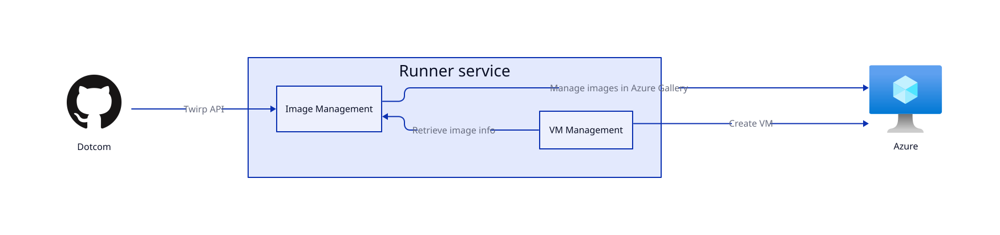
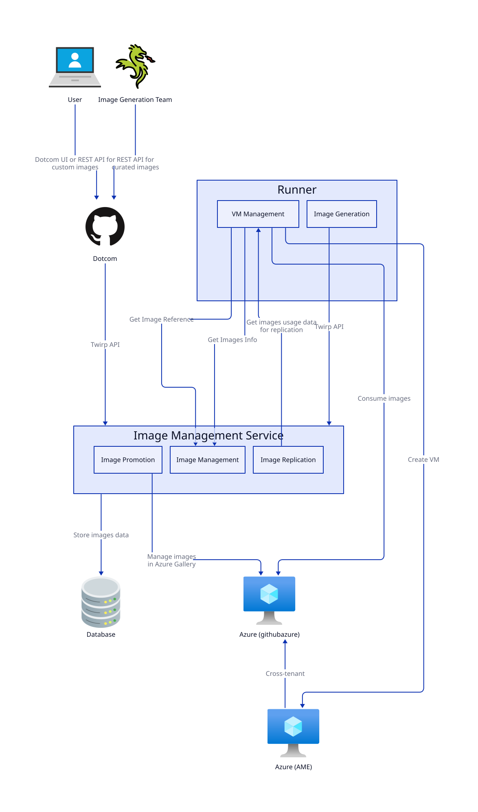

# Implementation plan

## Current state

There are a couple of important things to point out about our current state:
- All image management logic is held within the Runner service and is built on top of the VSSF framework.
- Curated images, Custom images and Marketplace images are processed completely differently within the Runner service. The list of supported curated images and marketplace images is hardcoded within source code.
- The process of uploading curated and custom images is different.

## Implementation Strategy

Use the same principles as [hosted compute implementation plan](./../implementation-plan.md#implementation-strategy).  
The main principle:
> It's important that at each phase we do our best to produce value through incremental changes rather than trying to everything at once, then flip the switch. This will ensure that we are able to adjust and adapt to new design needs and changes in business priority.

## Phase #1 - Implement Image Management Service and Integrate with Runner

At this stage, we will implement foundation of IMS, deploy it to lab and load environments and test under load via emulators.
After that, we'll integrate the Runner service with the LCM Proxy. This will allow it to consume the image data from IMS.

### End State
1. Image Management service supports the following functionality:
    - Support curated (aka GitHub-owned), custom and marketplace images
    - Provide API for image management and image uploading
    - Support rollbacks of images
    - Perform background jobs related to image management (scale down replicas for old images, remove custom images older than N days / keep X latest images per image definition, etc)
2. Image Management service is deployed to lab, production and Proxima environments
3. Runner service uses IMS Twirp API  to retrieve image-related information and all image related logic is removed from Runner service.   
4. Dotcom uses IMS to retrieve the list of images (curated, custom, marketplace) and upload custom images.
5. Image-gen team uses IMS to deploy curated images to Larger Runners.
6. All existing custom images are migrated to IMS.

### Benefits
1. IMS will be validated with production data.
2. Runner service and Launch won't participate in image related operations anymore. Load on Runner service will be reduced
3. Super fast IMS deployments via Moda and Kubernetes
4. More reliable image management part with new 4-9s service

### Responsibility changes

#### Dotcom
\- Use Launch & Runner service to manage images  
\+ Use Image Management service to manage images  

#### Runner service
\- Store information about curated, custom and marketplace images  
\- Run image related background jobs  
\+ Retrieve image information from Image Management service  

#### Image Management service
\+ Store information about curated, custom and marketplace images  
\+ Run image related background jobs  
\+ Provide Runner service information about available images  

### Changes
- IMS is deployed to production
    - Security review is passed
    - Deploy / Release to PROD environment
- Runner can interact with IMS data
    - Implement a bunch of new endpoints in IMS to retrieve image related information from DB and provide it to Runner service
    - Update Runner service to retrieve image related information from LCM Proxy
- Dotcom can talk with IMS
    - Update dotcom UI to use IMS to manage custom images and retrieve information about curated / marketplace images
    - Update dotcom API to use IMS to manage custom images and retrieve information about curated / marketplace images
- Update image deployment pipelines to deploy Larger Runners images using IMS

### Phase decomposition

## Phase #2 - MMS uses Image Management service

Integration of image management service with MMS will be very tricky because MMS uses images differently from Runner and LCM services:
- MMS needs VHD image for deployment and it doesn't support Azure Gallery images
- MMS deployment requires VHD image to be promoted (copied) to blob storage associated with deploying pool and promotion process is signficantly different from Runner / LCM.

We will need to implement a lot of new logic on both IMS and MMS and support VHD image type (which is not required for Runner / LCM) to integrate IMS with MMS.  
And all this new logic will be fully dropped when LCM replaces MMS. So we are not sure about expediency of this integration.

Also, integration of MMS with IMS won't give us immediate benefits because MMS already supports slow deployments based on rings model.

We should reevaluate expediency of this phase when all previous phases are implemented and decide if it's worth.

## Phase #3 - MacOS images support

On this phase, we will add support for macOS images to IMS.

MacOS Images are stored in Anka Registry instead of Redis so their implementation will be different from any existing images.

Also, we need to decide (together with LCM team) if we want to support MacCloud V2 or stick with MacCloud V3 only. From the images perspective, these two MacCloud generations are significantly different (MacCloud V2 uses Azure blob storage to pass images in OVF format, MacCloud V3 doesn't use Azure at all and uses Anka Registry to promote images)

## Phase #4 - hosted-compute-4-9s uses Image Management service
On this phase, we will integrate IMS with other hosted-compute-4-9s services: Resource Provider, Runner Config, Oracle, etc.

