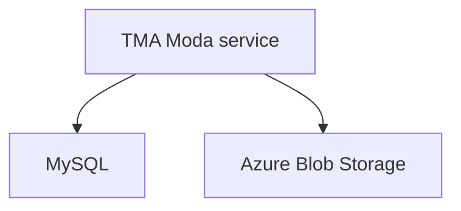

# Deployment Architecture

A TMA deployment consists of the following components:
- The Go service hosted in Kubernetes (see the [Kubernetes and Moda doc](./kubernetes-and-moda.md) for more information)
- A MySQL database that stores attestation metadata (see the [database doc](./database.md) for more information)
- An Azure Blob Storage account that stores the attestation bundles

When a client makes a `StoreAttestation` request to the TMA,
the TMA will parse and validate the request, store the attestation
metadata in MySQL, and store the compressed attestation bundle
in Azure Blob Storage.

When a client makes a `GetAttestation` request, the TMA will
lookup the attestation record in MySQL, construct the associated
blob storage entry name from the record, and fetch the attestation
bundle from [Azure Blob Storage](https://learn.microsoft.com/en-us/azure/storage/blobs/storage-blobs-introduction).
The TMA also generates a [signed access signature (SAS)](https://learn.microsoft.com/en-us/rest/api/storageservices/create-user-delegation-sas) URL.

This SAS URL can be used by the client to fetch the attestation
bundle directly from Blob Storage.
