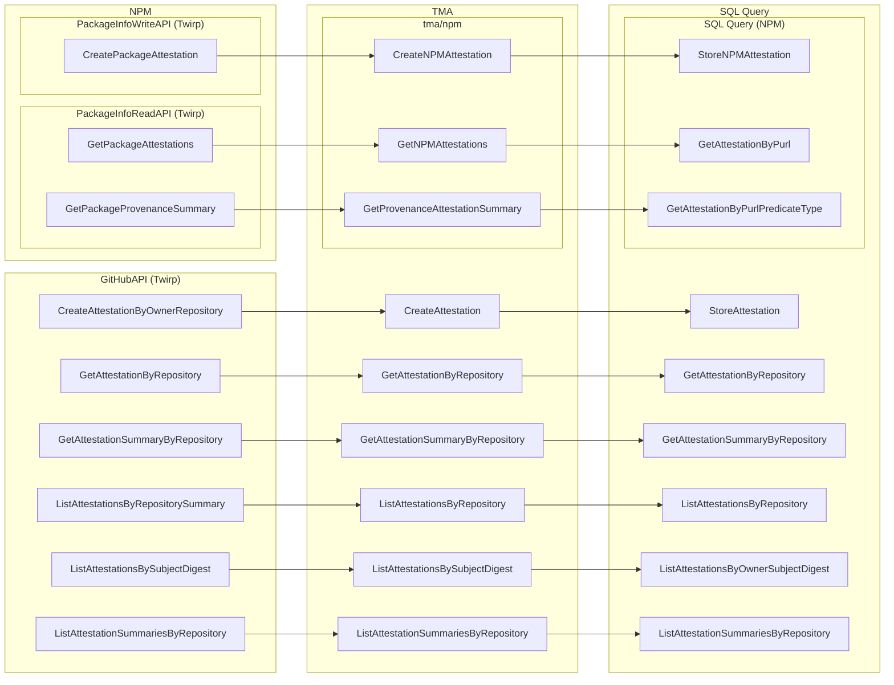

# Service Details

## Service Interactions

The following diagram shows how the different Twirp
[service](https://github.com/github/trust-metadata-api/blob/main/rpc/tma/v0/service.proto)
endpoints interact with the
[`TMAService`](https://github.com/github/trust-metadata-api/blob/main/pkg/service/service.go)
functions and, ultimately, with the different
[SQL queries](https://github.com/github/trust-metadata-api/blob/main/db/query/query.sql).

The core software architecture for TMA is organized into the following layers:

- Transport Layer: Twirp & HTTP Endpoints
- Service Layer: Business Logic
- Data Layer: Database & SQL Queries

## Service Consumers

### GitHubAPI

All endpoints consumed by `github/github`.

#### GetAttestationByRepository

Used for GitHub UI:

- `/attestations/{id}/download` (attestations#download_attestation)

#### GetAttestationSummaryByRepository

Used for GitHub UI:

- `/attestations/{id}` (attestations#show)

#### ListAttestationsByRepositorySummary

Used for GitHub UI:

- `/attestations` (attestations#index)

#### CreateAttestationByOwnerRepository

Used for GitHub API:

- `POST /repositories/{repository_id}/attestations`

#### ListAttestationsBySubjectDigest

Used for GitHub API:

- `GET /repos/{repo}/attestations/{subject_digest}`
- `GET /orgs/{org}/attestations/{subject_digest}`
- `GET /users/{user}/attestations/{subject_digest}`

### NPM

All endpoints consumed by `npm`.

#### PackageInfoWriteAPI/CreatePackageAttestation

Used to create attestations for npm packages

#### PackageInfoReadAPI/GetPackageAttestations

Used to get attestations for npm packages

#### PackageInfoReadAPI/GetPackageProvenanceSummary

Used to get provenance summary for an npm package
