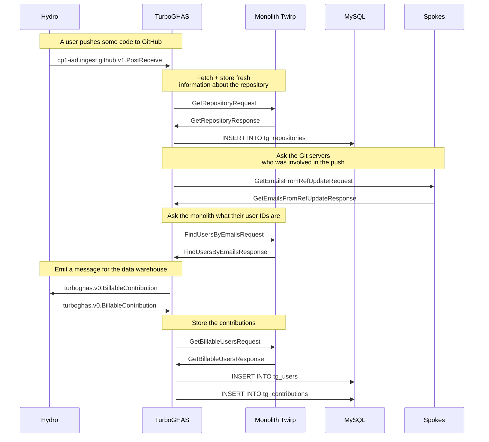

## TurboGHAS

A service for measuring contributions for Advanced Security billing.

> [!IMPORTANT]
> We ran Advanced Security contribution counting in the Monolith for about two years _without_ spinning out a separate service. **We really tried very hard to make that work.**
> 
>  Ultimately we made TurboGHAS due to the difficulty of aggregating our largest customer's data across multiple MySQL clusters. We traded a hard problem for a service boundary and New Problems.
>
> I think it was the right decision? I still worry sometimes that it wasn't, but I find myself fighting fundamental problems far less now and saying "that's easy" to customer requests more often.

This README hopes to give you an overview of this service, where to look for things and how it vaguely works.

<hr />

### Known Issues

| GHES Version Affected | Description | Effect |
| - | - | - |
| [< 3.11.3 ](https://github.com/github/turboghas/pull/585$0) | Incorrectly included contributions for suspended users | Higher committer numbers for customers with large numbers of suspended users who still have active commits being pushed |
| [3.11.x, 3.12.x, < 3.13.3](https://github.com/github/turboghas/pull/835) | incorrectly calculated the number of additional committers required to enable GHAS for an organization | Higher additional committers required when multiple organizations share active committers |
| [< 3.11.4, < 3.12.6](https://github.com/github/turboghas/pull/797) | Incorrectly deleted the ts_repositories cache for public repositories on GHES | Lower committer numbers for customers with large numbers of GHES public repositories |
| [< 3.11.7](https://github.com/github/github/pull/308076) | Did not store contributions from repositories that were imported with the ghe-migrator tool | Missing contributions for repositories that were originally imported into GHES |
| [< 3.11.14, < 3.12.8, < 3.13.3](https://github.com/github/github/pull/335125) | Incorrectly included maximum committers from repositories that were inactive | A higher maximium committer count than is accurate |

### Scope

This service provides:

* **Push monitoring** Identifying committers in repositories that could have Advanced Security.
* **License attribution** Providing Advanced Security seat counts to the monolith.
* **Reporting** Aggregating committer reports at the Organization and Business level.

<hr />

### Advanced Security Contributions

To be considered an 'active' committer and use an Advanced Security seat, a user needs:

* To have one of their commits pushed to a repository owned by an Organization or Enterprise Managed User (EMU) within the last 90 days
* To be using a seat in the Enterprise or Organization that owns the repository

In the database, this is represented as:

<dl>
    <dt>tg_contributions</dt>
    <dd>when we saw a Commit by a User pushed to a Repository</dd>
    <dt>tg_repositories / tg_users</dt>
    <dd>a cache of the User and Repository data from the monolith</dd>
    <dt>tg_purchasers</dt>
    <dd>a link between the Organization or Enterprise Managed User (EMU) that the Repository belongs to and the level they have purchased Advanced Security at</dd>
    <dt>tg_entities</dt>
    <dd>an Organization or Business who has purchased Advanced Security and a cached list of every User who is using a seat</dd>
</dl>

<hr />

### Core Write Flow

TurboGHAS runs a bank of Hydro processors, most of which are for invalidating a cache of monolith-owned data.

> [!NOTE]
> We keep a cache of data from multiple monolith-owned clusters in order to provide reporting. We originally created reports in the monolith, but fetching the data from multiple clusters and stitching it together in-application was very complicated and tended to time out for our largest customers.
> 
> One of the main culprits for this is 'Unique Committers'. To tell if a user has only committed to **one** repository you *have* to consider **all** of them. When a customer has 400k repositories that becomes quite challenging...

The only data TurboGHAS really 'owns' is contributions data for tracking active committers. It creates this by listening on the `PostReceive` topic and calling out to [GitRPCd](https://github.com/github/gitrpcd) to get a list of emails that are associated with the commits in each push. These emails are sent to the monolith over Twirp to get back a list of user IDs.



The `PostReceive` topic can often get uneven load across Hydro partitions. To handle traffic spikes (especially when various regions hit 9am) `PostReceive` load is spread over all processors using Aqueduct.

Everything else is about keeping the local cache of monolith data (users, repositories, organizations etc) up to date. Various topics are used as cache invalidation triggers. The data inside the message is ignored (different topics may have different latencies, the data may be stale or out of order between topics) and TurboGHAS requests the latest state from the monolith.

<hr />

### Core Read Flow

TurboGHAS runs a Twirp service for the monolith to ask questions about billing. Read traffic is delegated to a replica where possible.

### Adding an endpoint to Twirp

* Update the [Twirp protobuf definition](https://github.com/github/turboghas/blob/main/internal/api/proto/turboghas.proto).
* Find a [similar existing endpoint](https://github.com/github/turboghas/tree/main/internal/api) and copy it.
* Add a test which generates [a cassette](https://github.com/github/turboghas/blob/main/ruby/cassettes).
* Vendor the new version of the gem [into the Monolith](https://github.com/github/turboghas#updating-the-turboghas-gem-monolith---turboghas).

### Scheduled Jobs

TurboGHAS runs two scheduled jobs:

* **sync** re-fetches any records we have not seen in a while to catch any invalidation triggers that were missed
* **metrics** emits summary information to Hydro for use in Kusto

> [!CAUTION]
> In an ideal world `sync` would be a **no-op**.
>
> Unfortunately in the real world that is not the case:
> * Some amount of events are never triggered in the monolith or go missing.
> * There are some things that happen that we do not track because there is not a Hydro topic for it and it's not worth adding one - a user being suspended in Stafftools, for example.
>
> We promise customers we will catch up after 24 hours. The `sync` job keeps that promise daily.

### Dependencies

- `docker compose version` >= v2.15.1
- `go version` >= `go mod edit -json | jq -r .Go` – `brew install go`
- `golangci-lint version` >= 1.51.2 (optional) – `brew install golangci-lint`

### Start services

```bash
docker compose up --wait
```

To also start kafka and aqueduct to test the processor locally you can run:

```bash
docker compose --profile processor up --wait
```

### Migrate database

```bash
script/migrate
```

### Generate protobuf

```bash
script/generate
```

### Updating the version of TurboGHAS started in Codespaces

Copy the latest hash into `config/turboghas-version`.

### Updating the TurboGHAS gem (Monolith -> TurboGHAS)

```
bin/vendor-gem https://github.com/github/turboghas
bin/rails db:migrate db:test:soft_reset; bin/tapioca dsl -e test
```

### Updating the monolith Twirp service (TurboGHAS -> Monolith)

#### TurboGHAS

See more information here:

https://github.com/github/monolith-twirp/blob/master/docs/definition.md

#### GitHub/GitHub

> bin/vendor-monolith-twirp-gem code_scanning turboghas VERSION

### Test

```bash
go test ./...
```

### Update Cassettes

```
go generate ./internal/api
```

### Points of Interest

- `internal/api` – Twirp API
- `internal/processor` – Hydro Processor
- `docker-compose.yml` – simple Vitess / Kafka / MySQL setup

### Data Model

* **tg_entities** The model that purchased Advanced Security, equivalent to the github/github `advanced_security_licence.billable_entity`.
* **tg_entities.user_ids** A cache of the results of calling `license_attributor.user_ids` on the `billable_entity` model.
* **tg_purchasers** Links organizations to the `tg_entity` which is billable for Advanced Security. This may be itself if the Organization is paying for GHAS, otherwise it will be a Business.
* **tg_users** A cache of the `users` table. Used for generating CSV data.
* **tg_repositories** A cache of the `repositories` table. Used for determining who owns what and generating CSV data. Use `owner_id` in this table to find all the known repositories for an Organization regardless of who is billable for it.

#### Gotchas

Not every organization will have a corresponding `tg_entities` row as Advanced Security may be billed at the Business level. When providing an endpoint that returns Organization level data, it may make more sense to use a repository `owner_id` to filter repositories by Organization.

### Observability

- [Datadog dashboard](https://app.datadoghq.com/dashboard/wt4-hn9-ft2/turbo-gha-s?live=true)
- [Sentry errors](https://github.sentry.io/issues/?query=is%3Aunresolved+gh.exception.catalog_service%3Agithub%2Fturboghas&referrer=issue-list&statsPeriod=1h)

### Chatops


We have the following chatops:

- `.tg ping` - Returns a "pong" response
- `.tg hmac` - Returns an HMAC token for production (valid for about 10 minutes)


New chatops can be added in `internal/chatops`. Make sure to register them in the `defaultChatops()` function and add a description.
When adding a new chatop, make sure to run `.rpc hup` in `#deploy-ops` to refresh Hubot's list of available chatops.
