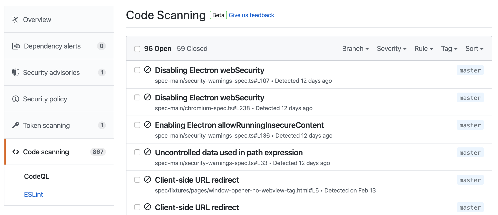
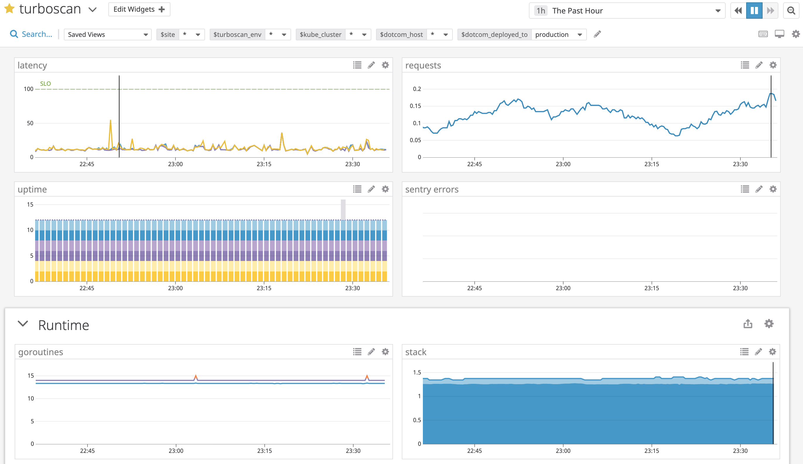
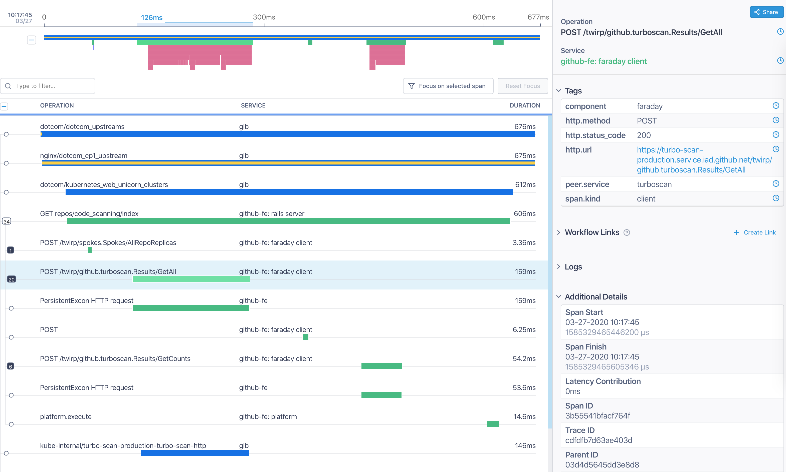
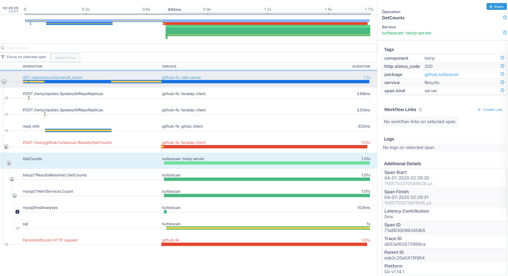
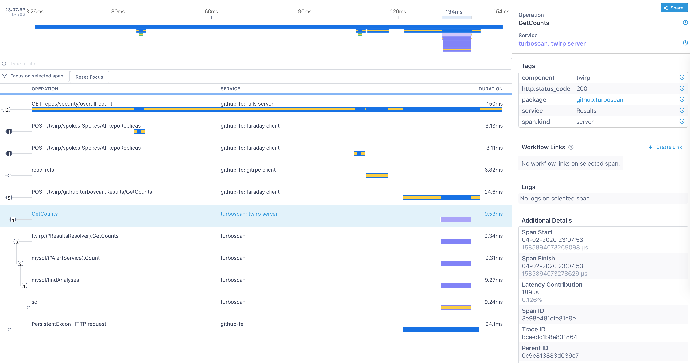
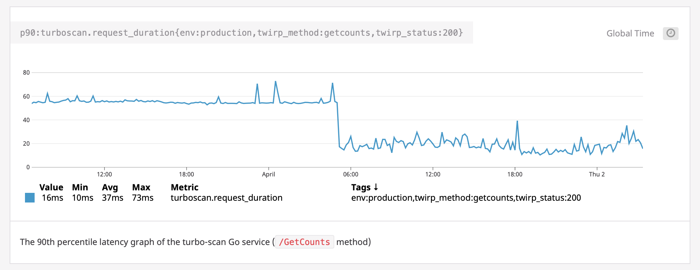

# How to instrument and find bottlenecks in your Go service

Over the last months the Code Scanning team has been working on integrating the [LGTM features](https://lgtm.com/) into GitHub. One of the backbones of this effort is the [`turboscan`](https://github.com/github/turboscan) Go service. It's a Twirp RPC Service that handles parsing of [SARIF](https://sarifweb.azurewebsites.net) files (such as CodeQL analysis results) and storing them in a more suitable format so they can be displayed and managed on GitHub. Below you can see an example of what it looks like:



We're planning to release Code Scanning at Satellite on May 6. Because `turboscan` is on a hot path and is a critical part of the Code Scanning feature, we wanted to make sure it's performant enough and we have a good visibility into its runtime characteristics. That's why, to make sure we don't get caught out by any surprises, we started instrumenting the `turboscan` service. 

## Adding Metrics

The canonical way of instrumenting a Go service at GitHub is to use the `go-stats` package: https://github.com/github/go-stats. This package provides various metric types (such as [counters](https://docs.datadoghq.com/developers/metrics/types/?tab=count#metric-types), [gauges](https://docs.datadoghq.com/developers/metrics/types/?tab=gauge#metric-types) or [distributions](https://docs.datadoghq.com/developers/metrics/types/?tab=distribution#metric-types)). The distribution type is especially useful to calculate 75th, 95th, 99th, etc.. percentiles. When configured, the `go-stats` client connects to the local statsd agent and publishes the metrics periodically for a given interval (i.e: 10 seconds) . All metrics are then forwarded to DataDog, where we can graph them. Below you can see some examples from the `turboscan` [dashboard](https://app.datadoghq.com/dashboard/7hs-9i2-epr/turboscan):



In addition, if the Go application is a Twirp service exposing multiple RPC endpoints, we can easily instrument all endpoints by using the [go-twirp/server/hooks/stats](https://github.com/github/go-twirp/tree/master/server/hooks/stats) package. The go-twirp package provides useful server hooks, which are called on certain Twirp events, such as when a request was received or when a response has been sent. Below is some pseudo-code that shows how simple it is to instrument your Go service:

```go
func main() {
	// create your stats client
	statsClient = stats.NewClient(stats.UDPSink(c.StatsAddr), c.StatsPeriod, "turboscan")
	statsClient.Run()
	defer statsClient.Stop()

	// create a Server side Twirp hook. Use:
	// github.com/github/go-twirp/server/hooks/stats
	// and pass down the stats client
	hooks := twirp.ChainHooks(
		stats.DefaultHooks(statsClient),
	)

	// run your Twirp Service
	handler := twirp.NewResultsServer(yourTwirpImplementation, hooks)
	http.Handle("/twirp", handler)
	http.ListenAndServe(":8080", nil)
}
```

By adding these lines to our code, we're able to graph the latency, request and error rate of our application with no additional setup in our Go code. Please check out our [DataDog dashboard](https://app.datadoghq.com/dashboard/7hs-9i2-epr/turboscan) for example graphs and metric queries.

## Adding Request Tracing

Furthermore, to get even more detailed information, we added tracing support to `turboscan`. Request tracing is very helpful if your product has multiple services talking to each other, and it helps a lot to see any bottlenecks immediately. In the case of Code Scanning, we have DotCom, Turbo-Scan, MySQL and various other intermediate services (such as proxies). Below you can see an example trace (_for a single request_) for a Twirp endpoint:



As you see, tracing allows us to see in a single view how much time we spend for each service (or within a function of that service). By using a single unique ID (which is the `Request-ID` in our case), we can easily connect a single request starting from dotcom to our Go service, down to a single SQL query.

How can we enable tracing for a Go service? We have a package for this as well. The [go-trace](https://github.com/github/go-trace) package, combined with a few external third party packages (such as `opentracing`) makes it simple to instrument and connect each piece. First, we set up tracing and as we did before with the stats client, we're also making sure to add a Twirp hook (using the [`twirp-opentracing`](https://github.com/twirp-ecosystem/twirp-opentracing) package) that instruments each endpoint for their total duration or time that it takes:

```go
func main() {
	tracer := lightstep.NewTracer(lightstep.Options{
		AccessToken: "token",
		Collector: lightstep.Endpoint{
			Host:      "host",
			Port:      "443"
		},
		Tags: opentracing.Tags{
			lightstep.ComponentNameKey: "turboscan",
			"service.version":          "12345",
			"env":                      "development",
		},
	})

	// enable our tracer
	opentracing.SetGlobalTracer(tracer)

	// instrument our Twirp endpoints by using the package:
	// github.com/twirp-ecosystem/twirp-opentracing
	hooks := twirp.ChainHooks(
		twirptrace.NewOpenTracingHooks(tracer),
		stats.DefaultHooks(statsClient),
	)

	// run your Twirp server ...
}
```

Once the tracer is set up in the `main()` function, all we do now is pass down any `context.Context` variable to a function and use the `go-trace` package to start and finish a trace. Below is an example [code snippet from our TurboScan service](https://github.com/github/turboscan/blob/4e9ec968afce31d2afbc0cbc41e37e881404a1a8/ts/mysql/sarif.go#L30):

```go
// Upload stores a SARIF file and returns a reference to be used in Download
func (s *SarifStore) Upload(ctx context.Context, sarif io.Reader, path *string) (string, error)
	// add these two lines to all the functions you want to trace
	ctx, span := trace.ChildSpan(ctx)
	defer span.Finish()

	// do stuff ...
}
```

You're going to spend some time adding these lines to all your functions, but we promise, it's worth it. :) In a bit, you're going to see how adding these lines will be helpful. Once everything is up and running, you're going to see your traces in LightStep.

## Finding bottlenecks and fixing them

Having both Metrics (DataDog) and Tracing (LightStep) makes it handy to observe how your service is behaving. After we instrumented our Go service, we started looking into various parts of our service and immediately discovered that some of our requests took more time than anticipated. Below is one example [trace](https://app.lightstep.com/s/trace/_cwhS-3xI1sN%20):



After seeing this, we debugged why a SQL query took one second (which is too high). We found that we were calling additional SQL queries for an empty set of initial results. Those SQL queries weren't needed at all, but they were contributing to the overall latency. After fixing it (https://github.com/github/turboscan/pull/552) we immediately [saw](https://app.lightstep.com/s/trace/w5I8-k_8SnCY%20) how it improved: 



We cut a 1 second long  query to almost 10ms on average! Of course, this was an outlier, as this particular query was running for a repository with hundreds of Code Scanning results, but the result speaks for itself. Also, this particular endpoint is the most frequently called one, and reducing the time to complete it decreased the overall latency of our service. 

While tracing helps us to see some of the inner working of our service, if we "zoom out" then metrics are helpful to see the overall health and characteristics of the service. After fixing and deploying the change, the 90th percentile latency of that specific endpoint dropped immediately from 60ms to around 20ms. The graph below shows this [change](https://app.datadoghq.com/notebook/187265/fatih-3-apr-2020-01-15?cell=ge1pra9x):



This improvement was [just](https://github.com/github/turboscan/pull/548) [one](https://github.com/github/turboscan/pull/562) [of](https://github.com/github/turboscan/pull/552) [the](https://github.com/github/turboscan/pull/553) [changes](https://github.com/github/turboscan/pull/554) [we](https://github.com/github/turboscan/pull/558) [made](https://github.com/github/turboscan/pull/561) over the past weeks. 

By instrumenting our service via Metrics and Tracing, we have a very solid foundation to enter Satellite with confidence and solve issues along the way. Note that in addition to these listed services, we also heavily rely on logging (Splunk) and exception reporting (Sentry). All of these tools complement each other, and we recommend using them accordingly. 

Some people favor Tracing over Metrics, some favor Metric/Logging over Tracing. There is no right answer. Tracing requires more effort, and instrumenting the code base takes time and patience, whereas metrics are easier to publish. On the other hand, metrics are not real time and show the overall characteristic of your service, and to get more detail you might need to check your logs for a specific user or request id. To each their own.

What's great is that we have well written Go libraries that allow us to interact with all these concepts easily:

* Tracing: [go-trace](https://github.com/github/go-trace)
* Metrics: [go-stats](https://github.com/github/go-stats)
* Logging: [go-log](https://github.com/github/go-log)
* Exceptions: [go-exceptions](https://github.com/github/go-exceptions)

## Next steps and how to start

The Frameworks for Services team has a "Go Sample Service" which provides the idiomatic and canonical way of using Go services at GitHub: https://github.com/github/go-sample-service. This service has example code and documentation for instrumenting your Go service. The sample service should be the first place you should look for an example on how to set up your Go service. Feel free to check out our [`turboscan`](https://github.com/github/turboscan) service as well.

For more questions, feel free to visit the Code Scanning team ([\#dsp-code-scanning](https://github.slack.com/archives/CP9GMKJCE)), our Go community channel ([\#gophers](https://github.slack.com/archives/C0MQYTAG1)) or the Frameworks services team for more guidance ([\#frameworks-services](https://github.slack.com/archives/CS6DA6Y5R)). Also the linked repositories have more information on how to use them.

We want to thank the [\#observability](https://github.slack.com/archives/C9H0UJC2W) team for setting up all these tools for us, and the [\#frameworks-services](https://github.slack.com/archives/CS6DA6Y5R) team and GitHub's supportive Go community for creating our internal Go standard libraries that make it very easy to interact with these services.
