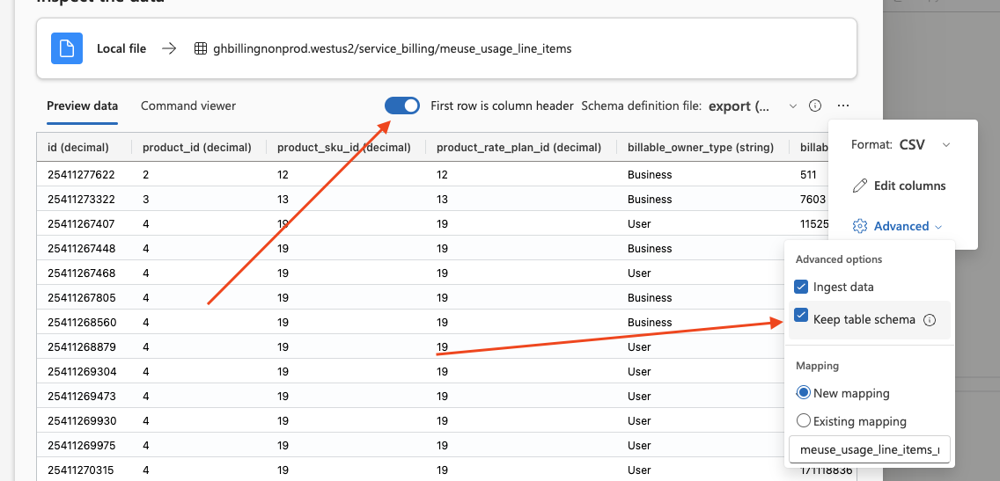

# How to add new Kusto database, table, and import data

The billing team owns the https://ghbillingprod.eastus.kusto.windows.net/ production cluster with follower databases. We also maintain the https://ghbillingnonprod.westus2.kusto.windows.net/ non-prod cluster that we connect to from dev environment.

From time to time, we might add/follow new databases or tables in the production cluster. We need to update the nonprod cluster with this change to keep it in parity with the prod. This is a documentation on how to create new database, create (or update) new table and import data into these tables for testing.

## Create new database in the cluster

If a new database is added to the production cluster, we need to replicate that database in the nonprod cluster for development environment.

> [!NOTE]
> Microsoft Azure Data Explorer documentation for creating database [here](https://learn.microsoft.com/en-us/azure/data-explorer/create-cluster-and-database?tabs=full#create-a-database)

- Access the Billing nonprod cluster "[Databases](https://portal.azure.com/#@githubazure.onmicrosoft.com/resource/subscriptions/57997474-7983-4d65-a2e3-83410c0e43b3/resourceGroups/billing-platform-dev/providers/Microsoft.Kusto/clusters/ghbillingnonprod/databases)" page
  - Ensure you JIT to Azure with all roles
  - You might need to logout and back in after JIT
- Click on "Add database"
- Enter the name of the new database
  - Leave default "Retention period" and "Cache period"
- Click "Create"

## Create a new table in existing database

If a new table is added to the prod database, we need to replicate the table in the nonprod for development environment.

- Access the [Production cluster](https://ghbillingprod.eastus.kusto.windows.net/) through Azure Data Explorer
- Expand the database containing the new table
- Right-click on the new table, hover on "Generate" and click on "Create script"
  - This will generate and create script for the table. Copy the generated create command
- Go to the [non-Production cluster](https://ghbillingnonprod.westus2.kusto.windows.net/) through Azure Portal or Azure Data Explorer
- Click on the target database in the nonprod cluster
- Paste the generated "Create script" and click "Run"
- The new table is created with matching schema as the prod version

## Importing data to table

For development purposes, we might need data in our nonprod tables. Because these tables are not written to automatically, we need to manually import data to the table.

- First order of business is to create some dummy data to import. There are a few approaches you can take here. You can manually construct a CSV that honors the field types or you can also leverage the production database to fetch already prepped data. In general, it might be better to avoid pulling customer data and using that to import into our development cluster. If you do end up choosing that approach, please make sure to exercise caution and obfuscate the data. For example with the meuse_usage_line_items, we took the following approach to redact.

```kql
let table1 = database('service_billing').meuse_usage_line_items | take 1000;

table1 | project
    li_id = id,
    account_id = rand(100000000),
    actor_id = 2,
    product_id = product_id,
    product_rate_plan_id = product_rate_plan_id,
    product_sku_id = product_sku_id,
    effective_quantity = effective_quantity + todecimal(rand(10)),
    source_uri = source_uri,
    rate_plan_multiplier = rate_plan_multiplier,
    rate_plan_unit_price = rate_plan_unit_price,
    rate_plan_overage_unit_of_measure_id = rate_plan_overage_unit_of_measure_id,
    estimated_cost = estimated_cost + todecimal(rand(10000)),
    currency_code = 'USD',
    unit_of_measure_id = unit_of_measure_id,
    billable_owner_id = decimal(1), //Github-inc |
    billable_owner_type = "Business",
    current_code = "USD",
    disposition_type = disposition_type,
    disposition_id = disposition_id,
    submission_state = submission_state,
    submission_state_reason = submission_state_reason,
    updated_at = datetime_add('week', toint(rand(31)), updated_at),
    created_at = datetime_add('hour', toint(rand(31)), created_at),
    usage_at = datetime_add('minute', toint(rand(31)), usage_at),
    usage_uuid = new_guid(),
    day = day,
    quantity = quantity + todecimal(rand(10000)) | extend id = li_id + rand(30) | extend r = rand(2) | extend submission_target = case(r <= 0, "azure", r <= 1, "zuora", "azure") |
project id, product_id, product_sku_id, product_rate_plan_id, billable_owner_type,
billable_owner_id, account_id, actor_id, usage_uuid, usage_at, quantity, unit_of_measure_id,
source_uri, rate_plan_multiplier, effective_quantity, rate_plan_unit_price,
rate_plan_overage_unit_of_measure_id, estimated_cost, currency_code, submission_target, submission_state, submission_state_reason, disposition_type, disposition_id,
created_at, updated_at, day
```
- At the rop right corner, click "Export" and select "Export to CSV"
- Right click on the target table in nonprod cluster
  - eg: 'ghbillingnonprod.westus2 > service_billing > meuse_usage_line_items'
- Select "Get data"
- Choose "Local file" data source
- Click "Browse files" to select the previously exported csv file
- Click "Next"
- In the "Inspect the data" page;
  - Check the "First row is column header" (see screenshot below)
  - Click the "...", hover on "Advanced" and check the "Keep table schema" (see screenshot below)
    - "Ingest data" should also be checked and "New mapping" should be the mapping option
- Click "Finish"
- Wait for the import to complete and click "Close"


