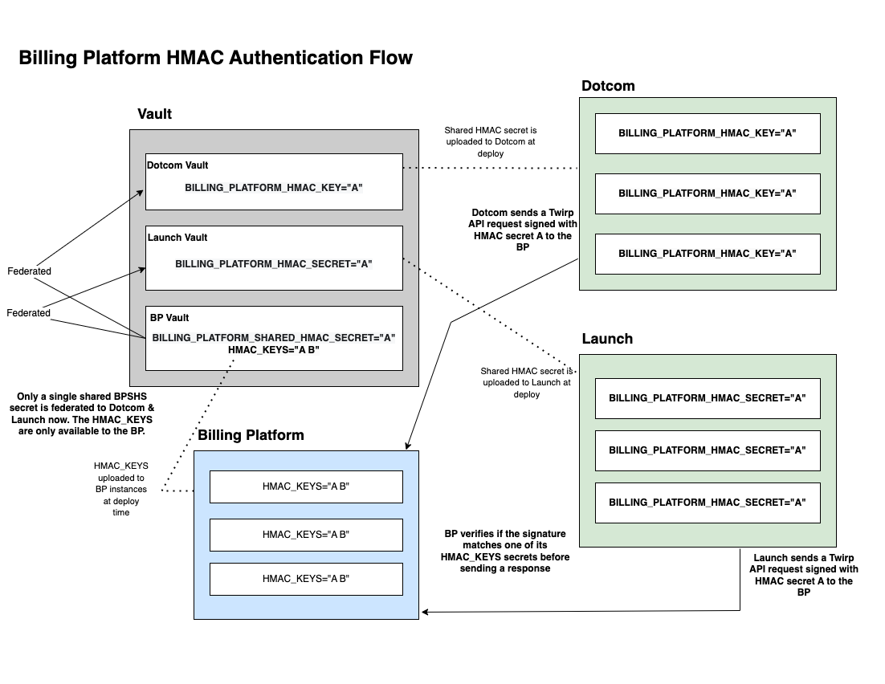

# Billing Platform HMAC Secrets
## Table of Contents

- [Details](#details)
  - [HMAC Secret that Signs Client Requests](#hmac-secret-that-signs-client-requests)
  - [HMAC Secrets that Verify Client Requests](#hmac-secrets-that-verify-client-requests)
  - [Billing Platform HMAC Authentication Flow](#billing-platform-hmac-authentication-flow)
  - [HMAC Secrets Rotation](#hmac-secrets-rotation)
    - [Prerequisites](#prerequisites)
    - [HMAC Rotation Steps](#hmac-rotation-steps)
- [References](#references)

## Details
### HMAC Secret That Signs Client Requests

The `BILLING_PLATFORM_SHARED_HMAC_SECRET` is the key/secret value combination that is used by Launch and Dotcom clients to sign messages sent to the Billing Platform.

The `BILLING_PLATFORM_SHARED_HMAC_SECRET` secret is stored in [Vault](https://thehub.github.com/engineering/security/vault/) and federated to Launch and Dotcom services via [secret federation](https://github.com/github/secrets-federation/blob/6eef433f811767ef4afa93d17a4eed5f47f8573e/config/federation/billing-platform/staff-wus2-01/federation.yaml#L7) in all GitHub stamps (production, staffship, and proxima).

1. Launch - [`BILLING_PLATFORM_HMAC_SECRET`](https://github.com/github/launch/search?q=BILLING_PLATFORM_HMAC_SECRET)
2. Dotcom - [`BILLING_PLATFORM_HMAC_KEY`](https://github.com/github/github/search?q=BILLING_PLATFORM_HMAC_KEY)

### HMAC Secrets that Verify Client Requests

The `HMAC_KEYS` are the key/secrets value combination that is used by the Billing Platform to verify the incoming requests from Launch and Dotcom. The `HMAC_KEYS` secrets are stored in the Billing Platform vault. These secrets are space-separated. The first secret in the space-separated list is typically called the `shared` secret because a copy of that value is also stored, or _shared_, in the `BILLING_PLATFORM_SHARED_HMAC_SECRET`. The following keys (usually up to 2 max) are called `staged` or `secondary` keys and are stored to be used during the HMAC secret rotation.

### Billing Platform HMAC Authentication Flow

This diagram shows the HMAC authentication flow between the Billing Platform and its clients, Dotcom and Launch.



### HMAC Secrets Rotation

Rotating HMAC secrets is an important security practice. If an HMAC secret inadvertently gets compromised or leaked, as happened with this Launch public HMAC secret exposure [incident](https://github.com/github/security-6209-urgent-remediation/issues/533), we should be able to promptly replace the compromised key without incurring any downtime to our systems.

#### Prerequisites

Before embarking on HMAC secrets rotation, it is always a good practice to reach out to the client teams, as well as let the billing team's on-call engineers know about the planned rotation.

1. Leave a note in the [#billing-eng](https://github.slack.com/archives/GDDBJ3D45) Slack channel about the HMAC rotation and the affected environments and tag (`.who is oncall billing`) the on-call engineers for visibility.
2. Leave a note in the [#actions-relaunch](https://github.slack.com/archives/C05T3H8U8UU) Slack channel about the HMAC rotation and the affected environments and tag (`.whos on call for actions-core-oncall`) the on-call engineers for visibility. It is also helpful to reach out to the [#actions-first-responder](https://github.slack.com/archives/CNS9X1LHJ) Slack channel and give them a heads up about the rotation as well.

Additionally, for each client that depends on the HMAC for communication, a redeploy will be required for the secret to take effect after it has been updated in the vault. Hence, if the rotation is urgent, you might need help redeploying the client service as soon as possible.

#### HMAC Rotation Steps

At a high level, the steps are:

1. Generate a new secret (each environment must have a unique HMAC secret value).
2. Add the new secret to the billing-platform vault's `HMAC_KEYS` in a given environment.
3. Redeploy the billing-platform.
4. Update the `BILLING_PLATFORM_SHARED_HMAC_SECRET` for Launch and Dotcom in a given environment to start using the new secret to sign requests.
5. Deploy both Launch and Dotcom.
6. Verify that everything is working as expected.
7. Remove the old secret from the `HMAC_KEYS` and deploy the billing-platform.

##### Generate a new secret

```shell
openssl rand -hex 32
```

##### Add the new secret to `HMAC_KEYS`

Get the existing secret value `"<old-secret>"`.

```shell
vault-secret -a billing-platform -e <env> -k HMAC_KEYS
```

Construct a new secret value by adding the `"<new-secret>"` string to the end of the `"<old-secret>"` string.

Make sure that secrets are space-delimitered and the newly constructed string value is enclosed in double quotes, like `"sharedOrOldsecret stagedNewSecret"`.

```shell
vault-secret -a billing-platform -e <env> -k HMAC_KEYS -v "<old-secret> <new-secret>"
```

To get the list of all the billing-platform vault environments, run this command in the ops-shell:

```shell
vault-secret -a billing-platform -t
```

##### Deploy the billing-platform

For the Billing Platform to pick up the changes from the vault, it needs to be redeployed. If the Billing Platform is not being deployed via a main branch pull request merge, then trigger it via:

`.deploy billing-platform to <env> --ignore-required-pipeline`

##### Update the `BILLING_PLATFORM_SHARED_HMAC_SECRET` to use the new secret

Copy the original (old) secret in case a rollback is needed.

```shell
vault-secret -a billing-platform -e <env> -k BILLING_PLATFORM_SHARED_HMAC_SECRET -v "<new-secret>"
```

Make sure that you are only copying the newest HMAC secret. Clients do not and should not support multiple HMAC secrets from `HMAC_KEYS`.

Wait for the clients to deploy their applications for the changes to take effect. If urgent, coordinate with the client teams to deploy their applications as soon as possible.
##### Revoke the old secret by removing it from the Billing Platform.

Once all applications are using the staged secret, the old secret can be removed from the Billing Platform. Now the new/staged secret becomes a shared secret.

```
vault-secret -a billing-platform -e <env> -k HMAC_KEYS -v "<new-secret>"
```

To stage another secret for a more expedient rotation in the future, you can generate another secret and add it to the end of the `HMAC_KEYS` secrets string. Make sure to add a space between the secrets.

##### Deploy the Billing Platform for the changes to take effect

Validate that:
- The Billing Platform is available and requests return successful responses via observing the Datadog [dashboard](https://app.datadoghq.com/dashboard/646-msn-qic?fromUser=false&refresh_mode=sliding&tpl_var_stamp%5B0%5D=staff-wus2-01&from_ts=1738874781589&to_ts=1738875681589&live=true).
- Going to the github.com or other GitHub environments you have made changes to loads the billing pages as expected.

## References

- [Rotating HMAC Key Hub Post](https://thehub.github.com/security/security-operations/secrets/secrets-rotation/hmac/).
- [Configuring Secrets Federation](https://github.com/github/secrets-federation/blob/main/docs/onboarding.md#configuring-secrets-federation).
- [Zero downtime HMAC rotation in Billing Platform Discussion Post](https://github.com/github/gitcoin/discussions/19287)