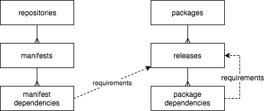

## Dependency Graph API Design

#### Domain language

- **Language** - Programming language e.g. Ruby, JavaScript
- **Package** - Distributable source code and metadata e.g. ExpressJS, Ruby on Rails
- **Package manager** - Platform that enables the distribution and consumption of packages e.g. RubyGems, Maven, NPM
- **Package version** - Metadata tag describing a package version e.g. `2.63.0`
- **Dependency manifest** - A file or files that enumerate the packages a project depends upon e.g. `Gemfile`, `requirements.txt`, `pom.xml`
- **Dependency** - An entry in a dependency manifest file e.g. `rails 5.0.0`
- **Requirements** - A way for package consumers to specify an exact package version or range of versions e.g. `2.63`, `~> 2`
- **Direct dependency** - A dependency a project explicitly requires e.g. `project_a` depends on `rails`
- **Transitive dependency** - A dependency a project indirectly requires e.g. `project_a` depends on `rails` and `rails` depends on `activerecord`, therefore `project_a` depends on `activerecord`

#### Inputs

There are two primary data sources for the dependency graph.

**1. Packages published to third-party package hosting services e.g. rubygems.org, npm.org**

The precise method for extracting package information varies by package manager. Each package manager has an adapter implementation that reads and normalizes data from a third-party package hosting service periodically or continuously, and POSTs it to a local HTTP sink.

**2. Dependency manifests from GitHub**

Manifest formats also vary by package manager and each manifest type has its own parser implementation. We use the codesearch index to backfill manifest data in batches and dotcom pushes manifest changes to the dependency graph API in real time.

#### Querying

Dependency queries are served via GraphQL API. Below is an example query and response.

__Query__

```graphql
query{
  packages(repositoryIds: [618]) {
    edges {
      node {
        name
        id
        packageDependents(first: 1) {
          edges {
            node {
              name
            }
          }
        }
      }
    }
    pageInfo {
      endCursor
      hasNextPage
    }
  }
}
```

__Results__

```graphql
{
  "data": {
    "packages": {
      "edges": [
        {
          "node": {
            "name": "multi_xml",
            "id": "UGFja2FnZS0y",
            "packageDependents": {
              "edges": [
                {
                  "node": {
                    "name": "httparty"
                  }
                }
              ]
            }
          }
        }
      ],
      "pageInfo": {
        "endCursor": "MQ==",
        "hasNextPage": false
      }
    }
  }
}
```

#### Implementation


1. A package manager adapter reads data from a third-party package host, normalizes it to a generic JSON format, and POSTs the result to a local HTTP sink. Adapters are written using whatever language or tools are best-suited to a given package manager.
2. The HTTP sink translates JSON to protobuf and publishes to kafka. It serves as a validation layer and proxy to spare package manager adapters from incorporating a kafka client.
3. (obsolete: search-based manifest ingestion)
4. An ingest process continuously reads data from kafka and merges it into the primary DB. Ingestion is idempotent and presumes that the queue contains duplicates. The ingest process is also responsible for translating GitHub repository URLs into repository IDs, so it queries the dotcom analytics replica via rate-limited, read-through cache.
5. Packages often have repository metadata e.g. a `source_code_url` field. We regard this metadata as untrustworthy. [A verification process](../app/models/package_to_repo_mapping/README.md) runs periodically to accept or reject metadata claims and establish a link between a repo and package.
6. dotcom (or other services) query for package dependency data via GraphQL API.
7. On post-receive, dotcom pushes manifest files to the dependency graph API for immediate indexing.

#### Data model



Repositories have many manifests and each manifest has many dependencies. Each dependency consists of a package name and requirements e.g. `rails > 5.1.0`. Dependency requirements can be resolved to one or more compatible package releases. Similarly, packages have many releases and each release has many dependencies. In addition to these core tables, there are a handful of materialized view tables designed to improve performance for specific querying patterns.

#### Deployment

Package manager adapters, manifest parsing processes and ingestion processes run on a `dependencygraph-worker` host. The API runs on separate `dependencygraph-api` hosts to avoid degrading API performance during periods of intensive data processing and to scale the API layer independently.
