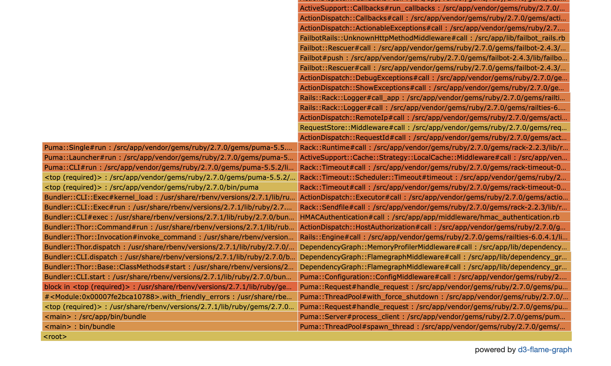
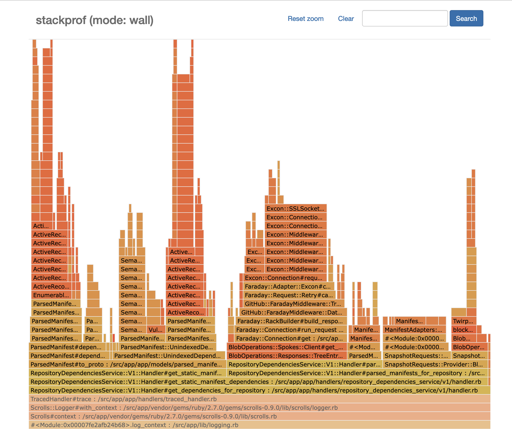

## Request Profiling

It is possible to enable profiling middleware for API calls by manually adding
query strings.

### Flamegraph

Curl an API endpoint with `?flamegraph=1` to enable the flamegraph middleware
using [stackprof](https://github.com/tmm1/stackprof).  This supports several
output formats. The default is json, which can be loaded into speedscope. For
standalone use, the most useful is probably the d3 generated html. Make a curl
request as normal and add `flamegraph=1&flamegraph_output=d3` to the url. The
arguments `--remote-header-name --remote-name` will make it automatically save
the generated html with the suggested filename.

```sh
$ curl -H "Content-Type: application/json" -d '{"query":"query{ packages { edges { node { name } } } }"}' 'http://dependencies.localhost:9596/query?flamegraph=1&flamegraph_output=d3' --remote-header-name --remote-name
  % Total    % Received % Xferd  Average Speed   Time    Time     Time  Current
                                 Dload  Upload   Total   Spent    Left  Speed
100 51143  100 51086  100    57   351k    401 --:--:-- --:--:-- --:--:--  351k
curl: Saved to filename 'flamegraph__query_2021-12-01-14-14-01.html'
```

The [sampling mode](https://github.com/tmm1/stackprof#sampling) can be
controlled with the `flamegraph_mode` query parameter. The default is `wall` but
this can also be set to `cpu` and `object`. The interval is set with
`flamegraph_interval`.

GC frames are ignored by default but can be included by setting `include_gc`.

### Memory profiling

A memory profile can be similarily obtained, using `?memprof=1`. This
uses[memory_profiler](https://github.com/SamSaffron/memory_profiler) and returns
the plain text report format.

```sh
❯ curl -H "Content-Type: application/json" -d '{"query":"query{ packages { edges { node { name } } } }"}' 'http://dependencies.localhost:9596/query?memprof=1' --remote-header-name --remote-name
  % Total    % Received % Xferd  Average Speed   Time    Time     Time  Current
                                 Dload  Upload   Total   Spent    Left  Speed
100  172k  100  172k  100    57   104k     34  0:00:01  0:00:01 --:--:--  104k
curl: Saved to filename 'memory_profile__query_2021-12-01-14-28-34.txt'
```

## Profiling in production

This is similar to the local profiling using curl in the section above, with a
few additions.

First you will have to [acquire an HMAC
key](https://github.com/github/dependency-graph-api/blob/master/docs/hmac_personal_keys.md).
From a [production
shell](https://thehub.github.com/security/security-operations/production-shell-access/)
run a curl command similar to the above, with the hmac key in a header.

For example, in #dg-ops I run:
```slack
pcarlisle: .dg hmac
hubot: 1638574238.81379d39f29e8fca332725fb26425eddbac45a613e891c19f8c857bd43b28394
```

You can often find good inputs using samples from lightstep. In this case the
repository_id and sha belong to github/dependency-graph-api.

```sh
pcarlisle@ops-shell-0178c20.ac4-iad(prd) ~ $ curl -H "X-Request-Hmac: 1638574238.81379d39f29e8fca332725fb26425eddbac45a613e891c19f8c857bd43b28394" \
    -H "Content-Type: application/json" \
    -d '{"repository_id": 69299342, "sha": "b0ca5e27b5dbbca308ec97212da5fef7be4c30f6" }' \
    'https://dependency-graph-api-slow-queries.service.iad.github.net/twirp/repository-dependencies/DependencyGraphAPI.v1.RepositoryDependenciesAPI/GetDependenciesForRepository?flamegraph=1&flamegraph_output=d3' \
    --remote-header-name --remote-name
...
curl: Saved to filename 'flamegraph__twirp_repository-dependencies_DependencyGraphAPI.v1.RepositoryDependenciesAPI_GetDependenciesForRepository_2021-12-03-23-38-01.html'
```

Download the file via scp or sftp and open in a browser.  Because Dependency
Graph runs multithreaded in Puma and the profiler samples all threads, we need
to zoom in on the request we care about. Initially it looks like this:


The stack on the left shows Puma waiting on connections. In this case there is
only one taller stack, but there may be more if the profile captures other
requests. Since stacks from other threads will be merged, this could distort the
profile and it may be worth taking multiple profiles of the same request and
starting with one that looks average.

Finding the main handler in the stack and clicking on it lets us zoom in.


Mousing over any frame will show the percentage of samples, relative to the
current zoom level, that occurred in that stack frame.
