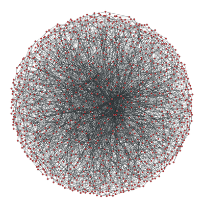

# Dependency Graph API

This repository provides **Dependency Graph API**, a service that exposes HTTP and GraphQL APIs for exploring project dependencies,
and a constellation of worker jobs that populate its database in response to the publication of packages in external package registries
and GitHub pull-request push events that modify dependency manifest files.
For more information on system design, check out [the design doc](./docs/design.md).

<div style="text-align: center;">



*[source](https://graph-tool.skewed.de/static/doc/_images/rewire_corr.png)*

</div>

## Codespaces Development

Codespaces is the recommended way to develop dependency-graph-api. [See this doc for setup instructions](docs/codespaces.md).

## Development

### Prerequisites

Local development makes heavy use of [Docker containers](docker-compose.yml). In order to pull container images from `ghcr.io`, you need to first log in.

1. First you need to create a Personal Access Token for accessing packages. [You can follow these instructions](https://thehub.github.com/engineering/products-and-services/codespaces/dotcom-dependants-development/#setup-a-token-once-done-once-skip-this-for-future-services) for setting up a dotcom codespace, but make sure to save the value of the token.

2. With your token, run:

   ```bash
   docker login ghcr.io
   # Enter your Github username
   # Enter the token as a password
   ```

### Quickstart

Clone the repository:

```bash
git clone git@github.com:github/dependency-graph-api.git
cd dependency-graph-api
```

After cloning, if this your first time, you can run `script/setup` to bootstrap your environment:

```bash
script/setup
# this runs script/bootstrap automatically
```

Once that is done, you can make sure everything is setup correctly by running the test suite:

```bash
script/test
```

After pulling from origin, you can run any pending database migrations with:

```bash
script/update
```

Finally, to start a development server, you can run:

```bash
script/server
```

Alternatively, you can use `script/dx/server-start` which starts the server in a daemon. This may be more resilient to Codespace time-outs, see https://github.com/github/engineering/discussions/2690.

```bash
script/dx/server-start
```


## Development Workflows

### Running along github/github

We currently recommend using [Codespace Compose](https://github.com/github/gh-codespace-compose) for
development along the monolith. [This
document](https://github.com/github/dependency-graph-api/blob/master/docs/codespaces.md#running-dependency-graph-api-with-the-monolith)
has instructions on how to get up and running.

For a more general solution: you'll want to have Dependency Graph running on port 9596 before
calling `script/server` in dotcom:

```
# inside github/github:
DEPENDENCY_GRAPH_API_URL="http://localhost:9596/query" script/server
```

### Populate sample data

```bash
bin/rake db:seed
```

### Attaching a debugger

Debug locally by using `binding.pry`. Since we use [Overmind](https://github.com/DarthSim/overmind), you just need to connect to the overmind hosted process to interact with the debug console. Ex:

```bash
# On a Mac or standalone Codespace
overmind connect web

# On a dotcom Codespace, the socket is different
overmind connect web -s /tmp/overmind.dgapi.sock
```

Also note that Puma has a [default worker timeout of 60s,](https://github.com/puma/puma/blob/master/lib/puma/configuration.rb#L14). If you are having timeouts impact your debugging, you may want to set `worker_timeout` to something larger (e.g. 3600) in the [puma config](https://github.com/github/dependency-graph-api/blob/master/config/puma.rb).

## Running in the Enterprise Solutions development environments

The setup instructions [GHAE](https://github.com/github/ghae) and [GHES](https://github.com/github/enterprise2) can be found in [ghae-kube](./docs/ghex/ghae-kube-dev-instructions.md) and [bp-dev](./docs/ghex/bp-dev.md) guides respectively
<!---
Working locally with the container requires you to have to manually set [environment variables as nomad manages](https://github.com/github/enterprise2/blob/30180bf5d93beae445550698b19f25a16d409b4a/vm_files/etc/consul-templates/etc/nomad-jobs/dependency-graph-api/00-dependency-graph-api-env.hcl.ctmpl) that in GHEX (e.g. `docker run -it --env ENTERPRISE=1 --env FAILBOT_BACKEND="console" --env SECRET_KEY_BASE="SECRETKEY" --env HMAC_KEY="NOOP" --env DEPENDENCY_GRAPH_API_HMAC_KEYS="KEYS" ghex`).

Note: You can use `journalctl -ft dependency-graph-api` from the appliance once dependency graph is enabled to see the logs for the service.
-->

## Testing vulnerability data locally (with mock data)

1. Currently, there's not a good way to use prod advisory data locally. Instead, we're going to borrow a script from the dependabot team that creates a relatively light set of mock data in a repo in github/github:
   1. In github/github , run `HYDRO_KAFKA_BROKERS=kubernetes.docker.internal:9092 HYDRO_MAX_BUFFER_SIZE=1 bin/create-dependabot-example-vulnerable-repo.rb`. This is sourced from [dependabot's README](https://github.com/github/dependabot-updates/blob/main/docs/development/dotcom-localdev.md#-ive-already-set-up-dependabot-fixtures-in-githubgithub)
   1. You can see this data in `github_development_notify`, in the `vulnerabilities` table.
   1. This takes care of the dotcom side of things -- Now we have fake advisory data in dotcom, along with a repo that is setup to line up with it.
1. Dependency graph ingests a portion of the advisory data into its local database (see `dg_vulnerable_version_ranges`). This happens on a regular cadence in the production environment, but we will simulate it in local development.
   1. In github/dependency-graph-api , run `bundle exec rake sync_vulnerabilities`
   1. Now, you should see `dg_vulnerable_version_ranges` with data, copied from dotcom. However, we're still missing the corresponding package entries in `dg_packages`.
1. Run `script/etl/ingest_packages` ([follow this section](#importing-package-manager-databases))
1. Run `bin/rails r script/dev/import-packages-for-mock-data.rb` to OneOffImport the packages that we "know" are impacted by the mock vulnerability data. _Note that this script's import events will be lost unless you are running `script/etl/ingest_packages` in the background._ You should now see entries in `dg_packages` for octokit and more!
1. At this point, everything should be functional in the dependency graph view, including sample vulnerabilities.

## Azure Resources

We are using Terraform integration to manage cloud resources. Please go to [terraform.md](docs/terraform.md) for more info.

## API

The app comprises of [REST](#rest), [GraphQL](#graphql-endpoints) and [Twirp](#twirp) endpoints. It also exposes a Dependency Review REST endpoint in DotCom. Locally, the server can be started by running `script/server` in the repository root folder. Below are some sample queries.

URLs for our various environments can be found in [environments.md](docs/environments.md).

<!----
TODO Add seed data for local testing and update readme
--->
### REST

Diagnostics

```bash
curl localhost:9596/_ping
```

### GraphQL

[GraphQL](http://graphql.org/) APIs formally specify data types and connections between data types. API consumers read the formal specification, compose queries, and POST them to a single endpoint: `/query`.

The easiest way to explore the API and craft GraphQL queries is to install [GraphiQL](https://github.com/graphql/graphiql). GraphiQL provides an interface for reading API documentation as well as composing queries.

```bash
brew install --cask graphiql
```

#### Locally

Open GraphiQL and set the endpoint to `http://localhost:9596/query`.

#### Production

To query for production data:

* [connect](https://thehub.github.com/security/security-operations/production-vpn-access/) to the VPN and set the endpoint in GraphiQL to `https://dependency-graph-api.service.iad.github.net/query`. For queries likely to exceed the default 10s time out, use the slow query endpoint `https://dependency-graph-api-slow-queries.service.iad.github.net/query` .
* [generate](/docs/hmac_personal_keys.md) an HMAC TOKEN and edit the HTTP Headers to add `X-Request-Hmac:<HMAC_TOKEN>`

repositoryDependencies

```bash
 {
  repositoryDependencies(repositoryId: 479007934) {
    directDependencies
  }
}
```

repositoryOwnerDependencies

> returns a list of ids of dependencies in repositories that the user or organization owns.

```bash
{
  repositoryOwnerDependencies(ownerId: 30846345, directOnly: true, packageManagers: RUBYGEMS) {
    dependencies
  }
}
```

repositoriesUsingDependencies

> ownerId corresponds to user or organisation that owns repos to be searched.

```bash
{
  repositoriesUsingDependencies(ownerId: 30846345, dependencyIds: [27412]) {
    repositories
  }
}
```

repositoryPackageReleases

```bash
{
  repositoryPackageReleases(ownerIds: [30846345], license: MIT) {
    edges {
      node {
        packageRelease {
          packageName
        }
      }
    }
    vulnerabilitySeverities {
      dependentsCount
      severity
      totalCount

}
```

packageReleaseVulnerabilities
> returns a list of vulnerabilities ids

```bash
{
  packageReleaseVulnerabilities(packageName: "activejob", packageManager: RUBYGEMS, containsVersion: "4.2.7.1")
}
```

packageReleases

```bash
{
  packageReleases(packageName: "rails", packageManager: RUBYGEMS) {
    edges {
      node {
        publishedOn
        repositoryNwo
        version
      }
    }
  }
}
```

allRepositoriesWithVersionRange

```bash
{
  allRepositoriesWithVersionRange(packageName: "rails", packageManager: RUBYGEMS) {
    edges {
      node {
        repositoryId
        manifestPath
        manifestFilename
        requirements
      }
    }
  }
}
```

reassignPackage

> this is a mutation query so it will modify the database hence DO NOT run it in production unless thats the intention, but using staff tools is the recommended option. To test it locally, run the import package [script](./script/dev/import-packages-for-mock-data.rb)

```bash
mutation {
  reassignPackage(input: {packageName: "faraday", packageManager: RUBYGEMS, repositoryId: <REPO_ID>}) {
    clientMutationId
  }
}
````

The above queries can also be run using curl

```bash
curl -H "X-Request-Hmac: <HMAC_TOKEN>" -H "Content-Type: application/json" -d '{"query":"query{repositoryDependencies(repositoryId: 479007934) {directDependencies}}"}' '<GraphQL Endpoint>'
```

### Twirp

Twirp services are defined in the specification [file](proto/twirp/v1/dependency_graph_api.proto). Please note that the `repository_id` is the _*DotCom repository id*_  NOT the ID in the `dg_repositories` table

#### Locally

Diagnostic

```bash
curl -H "Content-Type: application/json" -d '{}' 'http://localhost:9596/twirp/health/DependencyGraphAPI.v1.HealthAPI/Ping'
```

```bash
curl -H "Content-Type: application/json" -d '{}' 'http://localhost:9596/twirp/health/DependencyGraphAPI.v1.HealthAPI/Boom'
```

The endpoints below require a sample repository with manifests loaded in the database. You can achieve this by reusing the `Dependabot script` in a dotcom codespace

```bash
  bin/safe-ruby script/create-dependabot-example-vea-repo.rb
```

GetDirectDependencies

```bash
curl -H "Content-Type: application/json" -d '{"repository_id": 16}' 'http://localhost:9596/twirp/repositories/DependencyGraphAPI.v1.Repository/GetDirectDependencies'
```

GetDependenciesForRepository

```bash
  curl -H "Content-Type: application/json" -d '{"repository_id": 16, "sha": "<SHA>" }' 'http://localhost:9596/twirp/repository-dependencies/DependencyGraphAPI.v1.RepositoryDependenciesAPI/GetDependenciesForRepository'
```

GetSnapshotsDiff

```bash
  curl -H "Content-Type: application/json" -d '{"repository_id": 16,"base_sha": "<BASE_SHA>","target_repository_id": 17,"target_sha": "<TARGET_SHA>", "limit_to_files": {"base": ["path":"", "blob_id":""], "target": ["path":"", "blob_id":""]}}' 'http://localhost:9596//twirp/snapshots/DependencyGraphAPI.v1.SnapshotAPI/GetSnapshotsDiff'
```

#### Production

Make sure you are [connected](https://thehub.github.com/security/security-operations/production-vpn-access/) to the prod vpn and have a valid [HMAC Token](/docs/hmac_personal_keys.md)

Diagnostic

```bash
curl -H "X-Request-Hmac:<HMAC_TOKEN>" -H "Content-Type: application/json" -d '{}' 'https://dependency-graph-api.service.iad.github.net/twirp/health/DependencyGraphAPI.v1.HealthAPI/Ping'
```

```bash
curl -H "X-Request-Hmac:<HMAC_TOKEN>" -H "Content-Type: application/json" -d '{}' 'https://dependency-graph-api.service.iad.github.net/twirp/health/DependencyGraphAPI.v1.HealthAPI/Boom'
```

GetDirectDependencies

```bash
curl -H "X-Request-Hmac: <HMAC_TOKEN>" -H "Content-Type: application/json" -d '{"repository_id": 128955660, "package_managers": [1,3]}' 'https://dependency-graph-api.service.iad.github.net/twirp/repositories/DependencyGraphAPI.v1.Repository/GetDirectDependencies'
```

GetDependenciesForRepository

```bash
  curl -H "X-Request-Hmac: <HMAC_TOKEN>" -H "Content-Type: application/json" -d '{"repository_id": 128955660, "sha": "2802ecd368ad741cfd6850274aa312ca86081eef" }' 'https://dependency-graph-api.service.iad.github.net/twirp/repository-dependencies/DependencyGraphAPI.v1.RepositoryDependenciesAPI/GetDependenciesForRepository'
```

GetSnapshotsDiff

```bash
  curl -H "X-Request-Hmac: <HMAC_TOKEN>" -H "Content-Type: application/json" -d '{ "repository_id": 128955660,"base_sha": "f67207aff39fde9faaea10f5055904781422d970","target_sha": "55d1bb1affdeda831b7ff5dc95fc4ca8d928df17","target_repository_id": 128955660,"limit_to_files": {"base": [{"path":"npm/ghost/package.json", "blob_id":"5a9faa523a5f4cc87e7fa8d14da2a1e8b263f701"}], "target": [{"path":"npm/ghost/package.json", "blob_id":"b45ec183fc14dad30e0c8cc6d2dbabd672e9aefc"}]}}' 'https://dependency-graph-api.service.iad.github.net/twirp/repository-dependencies/twirp/snapshots/DependencyGraphAPI.v1.SnapshotAPI/GetSnapshotsDiff'
```

### DotCom

#### Locally

Start the DotCom server with the DEPENDENCY_GRAPH_API_URL env variable set

```bash
  export DEPENDENCY_GRAPH_API_URL=http://localhost:9596/query`
```

Dependency Review

Generate a PAT, create sample repository via the web UI and [configure](https://thehub.github.com/epd/engineering/products-and-services/public-apis/rest/development-endpoint/) the hostname

```bash
  curl -H "Authorization: token $TOKEN" -H "Accept: application/vnd.github.v3+json" 'http://api.github.localhost/repos/<REPO_NWO>/dependency-graph/compare/<BASEHEAD>'
```

#### Production

Dependency Review

Generate a PAT with repo scope and authorize it for GitHub SSO

```bash
   curl -H "Authorization: token $TOKEN" -H "Accept: application/vnd.github.v3+json" 'https://api.github.com/repos/dsp-testing/sample_manifests/dependency-graph/compare/55d1bb1...f67207a'
```

Note: All production examples above use the [dsp-testing/sample_manifests](https://github.com/dsp-testing/sample_manifests) repository

GraphQL Public Schema

* [Configure](https://thehub.github.com/epd/engineering/products-and-services/public-apis/graphql/using-graphiql/#using-graphiql-in-production) GraphiQL for dotcom production access
* [Add](https://docs.github.com/en/graphql/overview/schema-previews#access-to-a-repositories-dependency-graph-preview) preview support

```bash
{
  repository(owner: "dsp-testing", name: "sample_manifests") {
    dependencyGraphManifests(first: 2) {
      nodes {
        filename
        dependencies {
          totalCount
          nodes {
            packageName
            packageLabel
            requirements
          }
        }
      }
    }
  }
}

```

### Authentication

We rely on [HMAC authentication](https://en.wikipedia.org/wiki/HMAC) for securing the API (added in [this PR](https://github.com/github/dependency-graph-api/pull/366)).
In order to make requests, the client and server must share an `HMAC_API_KEY` which the client will use to sign and generate an HMAC digest which will be added as a header to their request.
The server will then generate its own digest and compare the two to ensure the client has access to the correct keys.

#### Getting and Using HMAC Keys

If you need a personal access HMAC key for debugging or development, please contact the [#dependency-graph](https://slack.com/app_redirect?channel=dependency-graph) team on Slack. Check out the [HMAC personal keys documentation](https://github.com/github/dependency-graph-api/blob/master/docs/hmac_personal_keys.md) to figure out how to generate keys, if you have access, and for [sample client code](https://github.com/github/dependency-graph-api/blob/master/docs/hmac_personal_keys.md#sample-client-code).

## Importing data

### Importing Package Manager Databases

To download and extract packages from public registries into intermediate tables:

```bash
# Start Kafka and Azurite locally inside of Docker containers:
script/start-containers

# `script/server` is responsible for starting the ingest scripts, so run that:
script/server

# Build and start the Docker container responsible for scraping a package database:
# <ADAPTER> can be any of: npm, rubygems, pypi
package_manager_adapters/script/start <ADAPTER>

# After running through a package_manager_adapter, you should see entries in your dg_packages table in SQL. If not, something went wrong!
# At this point, ingest_packages is going through the events to get your DB caught up to what package_manager_adapters dumped.

# The package_manager_adapters can sometimes time out, they keep track of how far they got, though.
# Starting them again will pick up where they left off. If someone could doc here how to reset the watermark,
#  that would be great -- the only way I know how to do it right now is to re script/setup the dg-api codebase

# Tail the logged output to verify data is actually being processed
script/etl/tail_<process-to-tail> eg. script/etl/tail_packages
```

## Running tests

```bash
# You'll have to do this any time you restart your computer or stop the container.
script/start-containers

# Run test framework
script/test
```

## Troubleshoot test friction

## VCR Tests

**Important!** read [this doc](docs/vcr.md) *before* creating or editing Rails tests depending on VCR cassettes (monolith or DG-API)

## Performance Profiling

See: [Profiling Dependency Graph queries](docs/performance_profiling.md)

## Development process

At a high level, most dependency-graph-api work will follow this pattern:

1. Local dev
1. Open a PR -> ensure checks pass -> get review approval
1. [Deploy](#deploying) your branch
1. Verify the changes, check the appropriate [Sentry](https://sentry.io/organizations/github/issues/?project=1858608) and [DataDog](https://app.datadoghq.com/dashboard/cmd-vkt-mii/dg-api) data for regressions relative to when you deployed.
1. Merge PR

## Deploying

Deployments use Heaven Pipelines & Merge Queue. To deploy a pull request, add to merge queue ("Merge when ready") once all checks have passed. The `production_rollout` pipeline will be automatically started and the PR will be deployed to all production environments (dotcom and all Proxima stamps). For more information [see TheHub](https://thehub.github.com/epd/engineering/devops/deployment/onboarding-to-heaven-pipelines/). The pipeline will halt before merging and require manual action (called a "blocking gate"). Keep an eye on #dg-alerts, [DataDog](https://app.datadoghq.com/dashboard/cmd-vkt-mii/dg-api?from_ts=1678962723342&to_ts=1678963623342&live=true) and on [Sentry buckets](https://github.com/github/dependency-graph-api#sentry-buckets). Once you are happy to proceed, run `.pipeline resume dependency-graph-api`. If you do not want to proceed, click "Something is wrong" in the top-right corner of the pipeline UI and then click "Cancel and roll back ".

You can bypass pipeline requirements with `--ignore-required-pipeline`, e.g. `.deploy <PR> to production --ignore-required-pipeline`. Think twice before using this, though. Could you queue your PR for merge and do your testing once it reaches the blocked gate? Try to default to that. If you really want to do manual testing, can you deploy your PR to `lab` and test it via a shell? If so, then do that. As a last resort, deploy to `production` with `--ignore-required-pipeline`. Do not forget to unlock the environment once you are done.

To deploy to `lab`, run `.deploy dependency-graph-api/YOURBRANCH to lab` in the [#dg-ops](https://github.slack.com/archives/C8MHAEGE7) Slack channel.

To deploy high-risk changes to a small fraction of prod traffic, you can do a canary deploy: `.deploy dependency-graph-api/YOURBRANCH to production/canary`, see https://thehub.github.com/epd/engineering/products-and-services/internal/moda/feature-documentation/canary-deploys/ for more information.

Useful resources:
  - [Moda Homepage](https://moda.githubapp.com/apps/dependency-graph-api/deployments/api?cluster=general-1-ash1-iad) in per-deploy-site pod listings
  - [Datadog k8s board](https://app.datadoghq.com/dashboard/cpc-97s-ksj/kubernetes-namespaces?tpl_var_kube_cluster=general-1-ash1-iad&tpl_var_kube_namespace=dependency-graph-api-production&tpl_var_namespace=dependency-graph-api-production) optionally filtered by deploy site (adjust template vars to taste).

## [SLI's](https://en.wikipedia.org/wiki/Service_level_indicator) and [SLO's](https://en.wikipedia.org/wiki/Service_level_objective)

| SLI                                  | SLO                |
|--------------------------------------|--------------------|
| p99 latency of an individual request | 500ms              |
| Total API throughput                 | 25 requests/second |
| Total API error rate                 | 1%                 |
| Availability                         | 99.9%              |

## Performance Dashboards

Status and performance of Dependency Graph are tracked via Datadog dashboards:

1. [API Status & Health](https://app.datadoghq.com/dashboard/cmd-vkt-mii/dg-api?live=true)
2. [Slow query API](https://app.datadoghq.com/dashboard/nth-mwe-f6w/dg-slow-query-api?live=true)
3. [Package and Manifest Ingestion Data (Workers)](https://app.datadoghq.com/dashboard/rb9-x9p-b8f/simple-ingest-dash?live=true)
4. [Background Jobs](https://app.datadoghq.com/dash/846123/dependency-graph-jobs?live=true)
5. [Package Manager adapters](https://app.datadoghq.com/dashboard/9im-uhe-hwd/dg-package-manager-adapters?live=true)
6. [Dependency Review Health](https://app.datadoghq.com/dashboard/nqz-iew-h8h)

## Sentry buckets

We have two Sentry buckets

1. [Dependency Graph API](https://sentry.io/organizations/github/issues/?project=1858608) - errors from the API
2. [Github Dependency Graph](https://sentry.io/organizations/github/issues/?project=1890397) - errors from the dotcom side client

## Lightstep request tracing

Dependency-graph-api logs spans (traces that can also be containers of other traces) through OpenTracing. You should see calls out
to dg-api showing up in a larger graph of a github request. Both dg-api data and github/github data can be found at <https://app.lightstep.com/github-prod/explorer>.

In order to search by github request id, a simple query like `"guid:github_request_id" IN ("E928:2807:801056:90A82E:61731FDD")` can be used. This query will
pull back all spans which have the request id annotated, which means it could be a dg-api span or a github/github span. If you select a gh/gh span, you should
be able to see a full request waterfall that eventually reaches out to DG-api and shows our tracing waterfall!

You can find GitHub request ids by popping open your browser's developer tools and looking at the response headers for a header named `x-github-request-id`.

## Hydro

Dependency Graph employs a lot of workers and backgrounds jobs that leverage [Hydro](https://github.com/github/dependency-graph-api/blob/master/docs/hydro.md).

## Architecture

The Dependency Graph architecture is shown [here](/docs/dependency-graph-architecture.md) (last update: October 2021).

How the Dependency Graph interacts with the rest of the GitHub architecture can be seen below (diagram as of 2019-07-31)


## (Re)Vendoring DG-API Twirp Gem in the monolith

1. Merge the DG-API side PR that applies changes to the Twirp Gem; remember to regenerate the code and check it in too!
1. Note the SHA of the current commit in dependency-graph-api.
1. `cd` over to your monolith `github/github` checkout (or a Codespace)
1. You may need to install ruby 3.3.6 ( `rbenv install 3.3.6` ).
1. Edit the monolith `Gemfile` and update the `ref:` field for the line starting with `gem "proto-dependency-graph-api"`. The new ref should match the commit you took note of before.
1. Run `bundle install` to install and vendor the new version of the gem.
1. Update the generated Sorbet types with `./bin/tapioca gem proto-dependency-graph-api`.
1. Check in and PR the generated code in the monolith repo

## Debugging in Production

### Setup

First you will need [production shell access](https://thehub.github.com/security/security-operations/production-shell-access/).
If this is your first time using `kubectl` on shell you will want to configure
the Kube environment (`$ gh-kubeconfig` will tell you the clusters you are
configured for):

```bash
. vault-login
gh-kubeconfig general-3-ac4-iad
```

Once you have run `gh-kubeconfig` you can use `kubectl` to access Moda pods.

``` bash
kubectl get pods -n dependency-graph-api-production

kubectl exec -itn dependency-graph-api-production <POD NAME> -- bash
```

### Shell console

The `gh-k8s-shell` script automates running commands in the shell environment.
Run a shell on a Dependency Graph Shell pod:

```bash
gh-k8s-shell --namespace dependency-graph-api-shell bash
```

### Rails console

To get a production console, you can use a Dependency Graph Shell pod:

```bash
# On a shell host:
gh-k8s-shell --namespace dependency-graph-api-shell script/console
```

#### Writing console

The above console defaults to **reading** database. If you want to perform writing queries, you can wrap your queries with `ActiveRecord::Base.connected_to(role: :writing) do ... end` or connect to the `writing` database with

``` bash
# On a shell host:
gh-k8s-shell --namespace dependency-graph-api-shell script/console writing
```

#### Analytics console

If you want to perform long-running queries and do exploratory program, use the `analytics` database instead of the `reading` one:

``` bash
# On a shell host:
gh-k8s-shell --namespace dependency-graph-api-shell script/console analytics
```

**Note** if you want to use `bin/rails c` for any of the above make sure you do `bin/rails c -- writing` as `bin/rails c writing` makes rails think you want to be in the `writing` rails environment which doesn't exist

### MySQL console

You can access the Dependency Graph MySQL database using standard `gh-dbconsole` tooling:

```bash
# On a shell host
#
# In most cases the analytics replica is the best place to run general queries:
gh-dbconsole dependency-graph-analytics dependency_graph
#
# But if you need a real-time production replica, you can use that too:
gh-dbconsole dependency-graph dependency_graph
```
