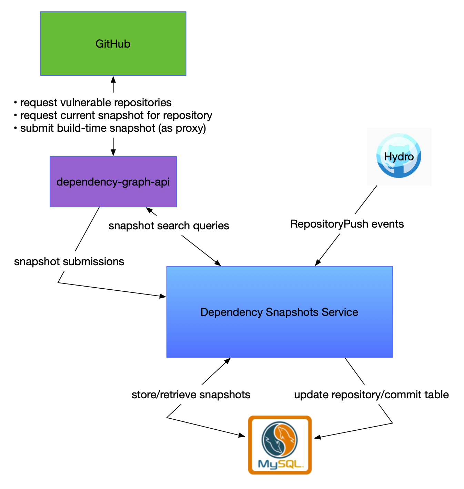

# Dependency Snapshots Service

> Note: This document focuses heavily on the early development milestones of the Snapshots Service, namely enabling Dependabot alerts for build-time snapshots in a limited number of repositories. It does not fully cover all of the planned work, but it does take into account certain future plans so as not to make them more difficult than they need to be.

## Introduction

The architecture that backs the Dependency Graph is efficient enough, but it's severely limiting. The Dependency Graph was designed to consider only one set of dependencies per repository, but we have future plans of considering different sources of data (e.g., conventional source-time detection as well as build-time detection and even 3rd-party detectors) as well as support for multiple branches, tags, and historical commits. At the same time, the data flow between GitHub and dependency-graph-api is overly complex, having been developed at a time when service-to-service communication at GitHub was less refined than it is now.

We have an opportunity now to enable the features we want and arrive at a simpler overall architecture by switching to a snapshot-based approach. A snapshot is an immutable record that consists of:

1. a set of dependencies, each represented by ecosystem, source, package name, the version number or range, etc.
2. the file(s) with which each dependency is associated, if any. Generally these will be manifest files.
3. additional metadata about the source of the snapshot (e.g., the commit hash, creation time, build process, and the detector used).

As part of a move towards representing _all_ of our dependency data in snapshots, we have created a new service that is responsible for managing snapshots. This document will outline the high-level architecture of this service.

## Purpose

The Snapshots Service is responsible for storing, indexing, searching, and combining snaphots of dependency data.

## Features

### Owns storage

This service defines and controls the storage of snapshots, and will be the exclusive client of whatever backing database we end up using—presumably, but not definitely, Vitess. All schema definitions, migrations, etc., will be defined in this service.

> Note: During early development, the Snapshots Service currently shares a database with dependency-graph-api (the previous home of snapshot data). This is temporary, and storage will be split up in the near future.

Owning storage also means that the Snapshots Service determines the internal representation of snapshot data. This format is still being actively iterated on. The specifics here will make some use cases easier and others more difficult, so it's important to be deliberate about how we choose to represent snapshots in storage.

### Indexes snapshots

Apart from the storing the snapshots themselves, the Snapshots Service will also store indices derived from snapshot data. 
These indices will be crucial for enabling not only search _per se_, but more importantly for features like vulnerability alerting, which will be based on search.

For example, one index we expect to implement is one that contains one row per dependency, with a pointer to the snapshot that it was derived from. This will enable us to quickly find all snapshots that are affected by a particular vulnerability. See more in [Implementing version range indices](#implementing-version-range-indices).

This is almost certainly the most difficult part of the project. We need indices that we can use to service version range queries over potentially tens of millions of rows, if not more.

### Searches snapshots

The service will also expose a query endpoint for searching snapshots, e.g., by commit hash, build ID, dependency name and version range, etc. Initially we will provide a few basic query types tailored to the specific features we're implementing, but in the future we may choose to support a limited query language that allows conjunction and disjunction of query terms.

The first query type we'll implement is one that matches all snapshots that contain a dependency with a particular name and version range. Given the example index from the above section, this shouldn't be too difficult to implement. However, complicating things is the fact that we actually only care about _current_ dependencies, not past ones. So we'll need to limit the results to snapshots that match the current tip of the default branch for their respective repositories.

### Combines snapshots

Although search results could come in the form of a list of snapshots, we will also provide a mechanism for combining multiple snapshots into a single result.

There are two basic ways to combine snapshots:
  * return the union of all of the dependencies in all of the snapshots
  * return the difference (i.e. diff) between two snapshots (or two sets of snapshots)

The **sum operation** is good for answering questions like "what are all of the dependencies this project has ever used?" or "what are all of the current dependencies for this org?". The **diff operation** is essentially what we already use for Dependency review It's good for answering questions like "what are the dependencies that have changed since the last release?" or "what will be the effect of merging this PR into the main branch?"

## Non-features

### Generating snapshots

Initially at least, this service will not generate snapshots from git data (or any other source). That process will continue to be handled by Dependency Graph API. Replicating that functionality here is not currently planned.

### Tracking vulnerabilities

This service will have no concept of vulnerabilities. It's expected that dependency-graph-api will continue to track vulnerabilities and enrich snapshots with that data when needed.

### Serving clients other than dependency-graph-api

This service is also not planned to be accessible directly from any service other than Dependency Graph API. It should be considered entirely subordinate to that service for the foreseeable future.

## Dependencies

* MySQL
    * Stores snapshots, indices, and any additional data or metadata we need to support the features we want to implement
* [github.v1.RepositoryPush](https://hydro.githubapp.com/schemas/github-v1-RepositoryPush) Topic
    * For tracking when commits are pushed that may require us to update our internal table of relevant commits (see [Limiting results to current snapshots](#limiting-query-results-to-current-snapshots))
* Spokes
    * For retrieving git data on demand.

## Implementation

* This service is implemented in Go, following patterns established in [go-sample-service](https://github.com/github/go-sample-service).
* It is stateless, relying on a MySQL database for storage.
* It is highly available and autoscaled via Moda deployment.
* Latency and recency requirements are tracked [in this document](https://github.com/github/dependency-graph/blob/master/docs/dependency-snapshots/service-endpoints.md)

## Difficult problems

### Limiting query results to current snapshots

Although storing historical snapshots is an explicit goal of the service, our most frequent queries will need to be limited to _only those snapshots that are relevant to the current state of their respective repositories_. We call these **canonical** snapshots, meaning they are tied to the head of the default branch.

### Implementing version range indices

We have some prior art on this topic, but it's unclear how well it will scale. Right now we service version range queries for one snapshot's worth of data per repository, but this service will eventually hold orders of magnitude more data than that. The straightforward solution is to replicate the way we store dependency versions today, but with an extra column to point to the snapshot from which the row was derived.

In a simplified form, this table would contain:
* Package name: the name of the dependency
* Package manager: the name of the package manager the dependency is associated with.
* Encoded lower bound: an integer representation of the lower bound of the version range.
* Encoded upper bound: an integer representation of the upper bound of the version range.
* Snapshot ID: the numeric ID of the snapshot from which the row was derived.

Note that although build-time snapshots always have an exact version, rather than a range, not all snapshots will always be generated from build-time data. We'll need version ranges to continue to support source-time detection indefinitely.

If we can solve the problem of snapshot currency, then that should buy ourselves some breathing room here as well, since we'll only be searching through one snapshot per repository in our main use cases. But ideally we do want to be able to search historical snapshots, so coming up with good indices is still a challenge we'll need to meet.
