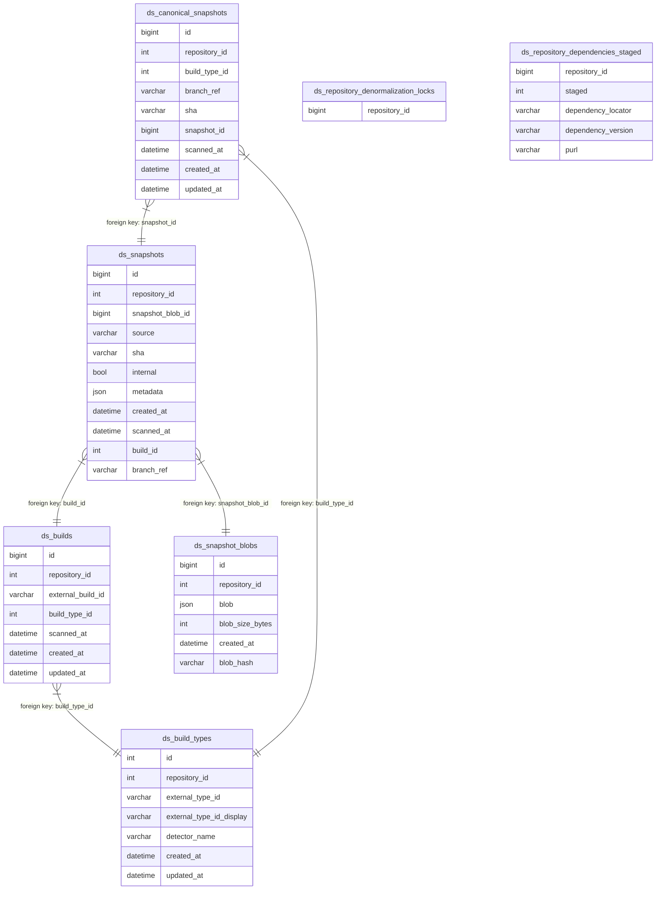

# The Snapshots Database

This document is an overview of the database used to store snapshots, including
its structure, the relationships between the tables, and some of the nuances of
the columns. If you notice a discrepancy between this document and the actual
database, please either correct this document or bring it up in Slack.

## Connecting to the database

### Codespaces development

By default, the database runs on the `db` host, port 3306. You can connect to it with the following command:

```
mysql -u root -h db -P 3306 dependency_snapshots_development
```

### Local (non-Codespace) development

If you're not running in Codespaces, you can connect to the database with this command:

```
mysql -u root -h 127.0.0.1 -P 3001 dependency_snapshots_development
```

### Production Vitess replica

To connect to a read-only Vitess replica:

1. Connect to a production shell instance over ssh. See [these instructions](https://thehub.github.com/security/security-operations/production-shell-access/) for more information.
2. Run `gh-dbconsole dependency-snapshots-api` to connect to the database.

### Production Read/Write Vitess

> Warning: there's no limit to the havoc you can cause this way! Use only as a last resort, and only if you know **exactly** what you're doing!

1. Connect to a production shell instance over ssh. See [these instructions](https://thehub.github.com/security/security-operations/production-shell-access/) for more information.
2. Get the `dependency_snapshots_ap_rw_0` password from [professorx](https://professorx.githubapp.com/mysql/cluster/dependency-snapshots-api).
3. Connect to the database with the following command, supplying the password from step 2 when prompted:

```
mysql -h vitess-vtgate-mysql-staging.service.iad.github.net -P 10001 -u dependency_snapshots_ap_rw_0 -p dependency_snapshots_api_ks
```

## A historical note

Some of the oddities you may find here are the result of the long and windy
path that the database has taken. Some of these tables were created to support
the original build-time detection effort in [dg-api](https://github.com/github/dependency-graph-api).
Over time, they have evolved to support the snapshots in general, but they
may still contain traces of their original use and co-location with the 
other dependency-graph-api tables.

## Tables

Below is a list of the tables in the database, and some notes for columns that
are not sufficiently self-explanatory.

* **ds_snapshots**: The main table for snapshots.
    - **id**: this is the outward-facing snapshot ID.
    - **source**: largely here for historical reasons. Used to correspond to what we now call "detector".
    - **sha**: the sha of the commit that generated the snapshot. Not the hash of the snapshot itself.
    - **internal**: whether the snapshot is from internal tooling (true) or the external API (false).
    - **metadata**: the top-level metadata key from the snapshot blob. Mainly here for historical reasons, as it also exists in the blob.
    - **created_at**: the time this row was created. Not the same as the `scanned` time from the snapshot blob.
    - **scanned_at**: the `scanned` time from the snapshot blob. This date could
        be in the future or the distant past, we don't do any particular validation
        on that. This column is mainly used for ordering snapshots within a
        single repository. You should only compare `scanned_at` times to other
        `scanned_at` times within the same repository, and never to our own
        clock time.
    - **branch_ref**: the branch **or** ref of the commit that generated the snapshot.
* **ds_snapshot_blobs**: Stores the JSON blobs for `ds_snapshots`. Each blob may correspond to multiple snapshots.
    - **created_at**: the time this row was created. Not the same as the `scanned` time from the snapshot blob.
* **ds_build_types**: Defines the types of builds that we know about, scoped by repository. Represents a class of builds like "linux-x64", "macos-arm", etc.
    - **external_type_id**: the id of the build type in the external system. Opaque to us.
    - **external_type_id_display**: a more human-readable version of the external type id. Also opaque to us. Available for future use, but we don't currently do anything with this.
    - **detector_name**: this is pulled directly out of the snapshot's `detector.name` field. The assumption being that multiple detectors can run in the same "job."
* **ds_builds**: Individual instances of `ds_build_types`, these are directly referenced by `ds_snapshots`.
    - **external_build_id**: the id of the build in the external system. Opaque to us. Not to be confused with `ds_build_types.external_type_id`.
* **ds_canonical_snapshots**: tracks which snapshots are canonical. A snapshot is canonical if it is the latest version of the snapshot for a given build on the default branch. Rows are unique according to (`repository_id`, `build_type_id`).
* **ds_repository_denormalization_locks**: tracks which repository IDs are locked for denormalization.
* **ds_repository_dependencies_staged**: contains the denormalized dependency data for each repository's _canonical_ snapshots.
    - **staged**: used to used to prevent incremental updates to this table from showing up in production queries before we
      can atomically swap staged bits. The staging pattern is in play because we can't commit 1000s of rows transactionally
      without causing gap lock problems. Instead, under the protection of a denormalization lock, we commit small batches
      (short running transactions) with staged = 1, and then atomically swap the staging bit. A value of `1` indicates
      that the row is part of an update in progress. Most queries should ignore rows with a `staged` value of `1`.
* **ds_migrations**: The table for migrations. Included here for completeness, but you should never need to manually interact with this table.

## ERD of the database

This diagram shows each table, all of their columns, and how the tables are related.
See [this helpful page](https://www.databasestar.com/entity-relationship-diagram/) for a nice explanation/refresher on how to interpret the different types of arrows.


