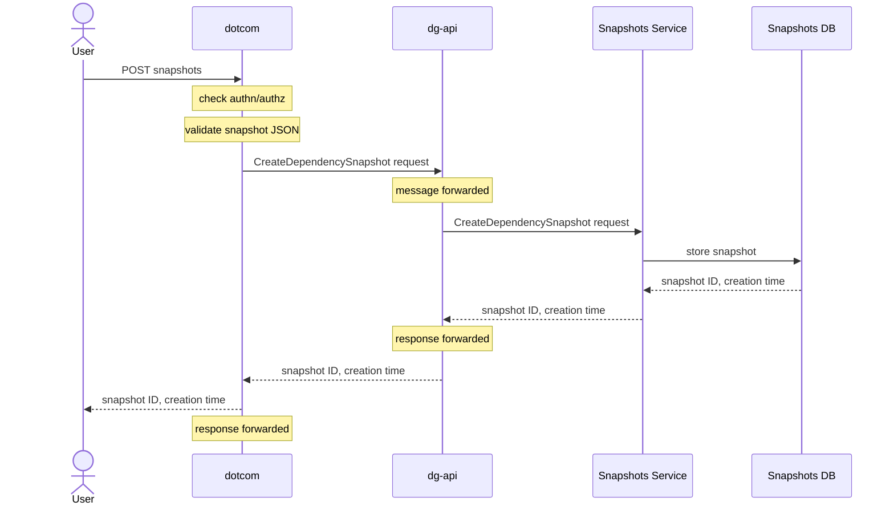
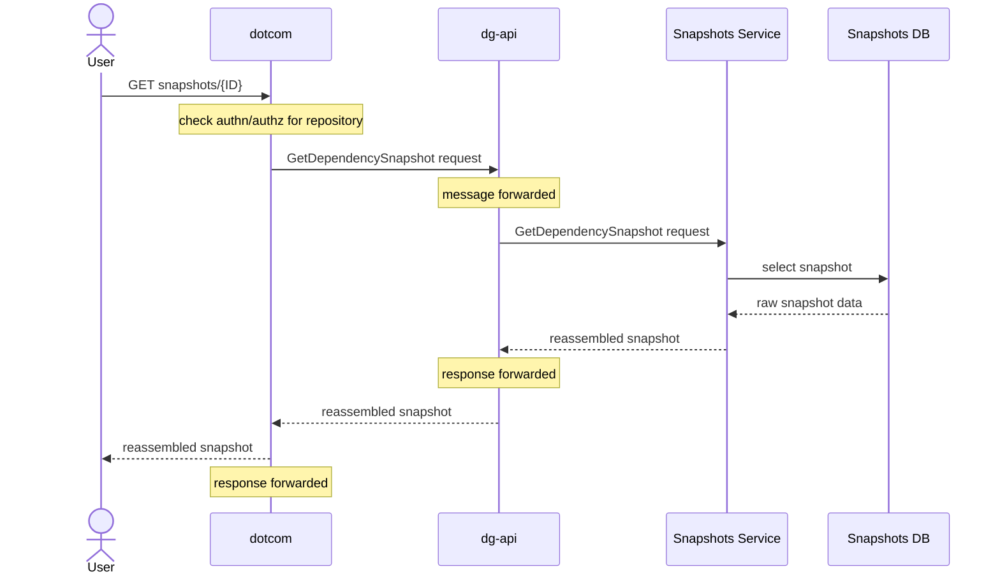
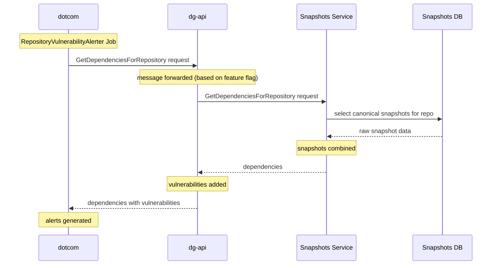

# API Dataflows

This document illustrates the various Snapshots API endpoints in their greater
context at GitHub, including the involvement of other services like dotcom and
dg-api.

# Snapshot operations

We have two operations that work directly on snapshots:
`CreateDependencySnapshot` and `GetDependencySnapshot`.
These are declared in the [Twirp protocol here](https://github.com/github/dependency-snapshots-api/blob/73612c99b4a644fa3a10c0d78fd568efb2b0b094/proto/snapshots.proto).

## CreateDependencySnapshot

Snapshots are created via a POST request to the
`https://api.github.com/repos/<NWO>/dependency-graph/snapshots'` endpoint. We do
minimal processing on snapshots during creation—essentially we just store the
JSON blob and create rows for the build type (if necessary) and build.

Although dg-api is involved in the request, it acts as a proxy and does no
significant work of its own here.

## GetDepedencySnapshot

This is _extremely_ similar to creating a snapshot in terms of data flow, but
the request and response formats are different.

# Dependencies operations

We currently support two operations that work directly on dependencies (rather than snapshots): `GetDependenciesForRepository` and `HasManifests`. They are defined in the a [Twirp protocol in the dg-api repository](https://github.com/github/dependency-graph-api/blob/4b3b8bf31027d88c435a5358674b8e69ecdd92e2/proto/twirp/v1/dependency_graph_api.proto#L47-L52).

## Retrieving dependencies for a repository (with vulnerabilities)

The dotcom service requests vulnerabilities for a repository from the `RepositoryVulnerabilityAlerter` job.
Note that the snapshots service has no notion of vulnerabilities—those are added to the response by dg-api.

## Checking whether a repository has manifests

This endpoint exists, but it is currently not used as part of any process. It returns `true` if the repository has dependency data and `false` if it does not.

# Worker processes
