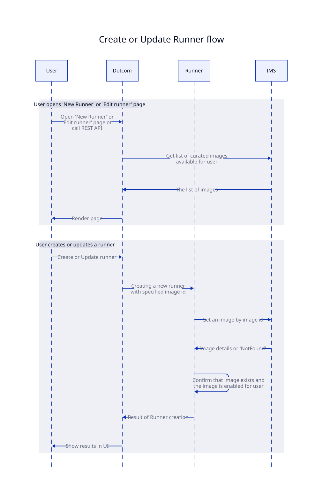
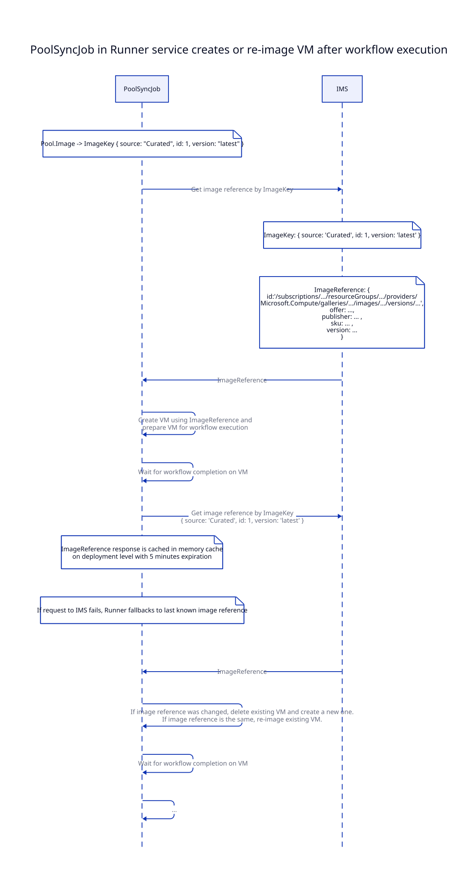
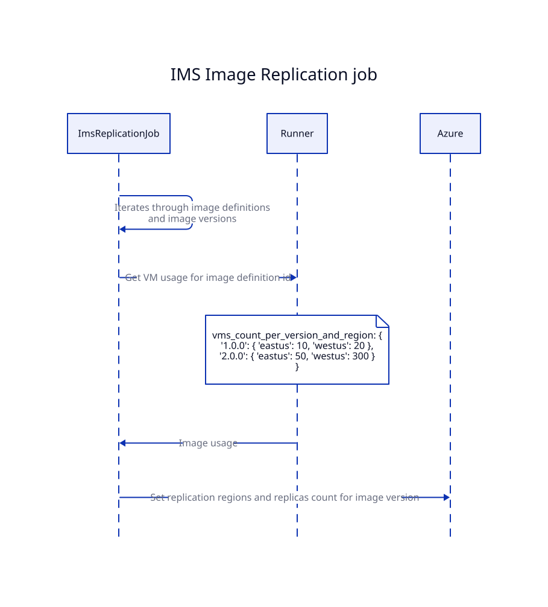

# IMS Overview for Larger Runners DRI

Useful links:
- Repo: https://github.com/github/hosted-compute-ims
- Moda deployment: https://devportal.githubapp.com/devportal/apps/hosted-compute-ims
- Feature flags: https://devportal.githubapp.com/feature-flags?searchType=team&name=compute-turbine
- Ops playbooks: https://github.com/github/ops/tree/master/docs/playbooks/actions/hosted-runners/image-management-service

Slack channels:
- `#hosted-compute-ims` -> for communication / discussions
- `#hosted-compute-ims-ops` -> deployment notifications & chatops
- `#hosted-compute-ims-alerts` -> Alerts from Datadog, Sentry, etc

### Current status

- Integration of Curated images with IMS is completed.
- Rollback from IMS back to Runner is still supported but not recommended:
    - Runner service still has old curated images jobs / services
    - Dotcom FF: https://devportal.githubapp.com/feature-flags/larger_runners_use_curated_images_from_ims/overview
    - Runner FF: `GitHub.Actions.Runner.Server.ImageManagementService.Curated` (disabling this flag will disable all other IMS flags automatically)
- We are planning to start deprecation of old Runner logic after new year

### Integration of IMS with other services:

There are 4 flows:
1. User opens "New Runner" or "Edit Runner" pages in dotcom UI or calls REST API
    - Interaction: Dotcom -> IMS
    - Potential impact if IMS is down: the list of images will be empty and customer won't be able to create new runners or update existing ones
    - 49s future: this flow will stay in dotcom
2. User creates or updates runner via dotcom UI or REST API
    - Interaction: Runner -> IMS
    - Potential impact if IMS is down: the list of images will be empty and customer won't be able to create new runners or update existing ones
    - 49s future: this flow will be moved to Runner Config or dotcom
3. PoolSyncJob in Runner service creates or re-image VM after workflow completion
    - Interaction: Runner -> IMS
    - Potential impact if IMS is down: Runner supports graceful degradation. Even if IMS is down, Runner will continue to use last known image reference. No impact.
    - 49s future: this flow will be moved to Runner config
4. IMS image replication job
    - Interaction: IMS -> Runner
    - Details: If image version doesn't have enough replicas in specific region, Runner might fail to create VM from this replica. Replications count define the number of concurrent VM creations. When IMS provisions a new image version, it sets the same replicas as previous version had. Also, IMS sets at least 1 replica in all supported regions.
    - Potential impact: Low, no immediate impact if job starts to fails.
    - 49s future: IMS will need to use Oracle to grab usage by config and then use runner config service to resolve config to image key
5. Uploading of curated images
    - Covered by [Upload curated images to IMS ADR](../adrs/2024-07-upload-curated-images-to-ims.md)
    - Deploying to Canary image definitions on daily basis
    - Deploying to production image definitions once per week
    - Example of image deployment pipeline: https://mseng.visualstudio.com/AzDevNext.Deploy/_build/results?buildId=29415991&view=results

### Telemetry

- Docs: https://github.com/github/hosted-compute-ims/blob/main/docs/telemetry.md
- Splunk: https://splunk.githubapp.com/en-US/app/gh_reference_app/search?q=search%20index%3D%22hosted_compute_ims%22%20deployment.environment%3Dproduction
- Sentry: https://github.sentry.io/issues/?environment=production&project=4506904886116352&statsPeriod=24h
- Datadog: https://app.datadoghq.com/dashboard/vwb-6j5-4ry

### Stafftools operations

IMS stafftools is available on https://admin.github.com/stafftools/hosted_compute_ims_admin

Useful operations:
- Disabling image (aka rollback)
    1. Go to image definition page
    2. Choose image version
    3. Click disable
    4. "latest" points to latest enabled image version in Ready state
- Adding a new image
    1. Create a new image definition under FF
    2. Upload image versions using image definition Id
    3. Enable FF for test org and validate an image
    4. Enable image definition globally
- Deprecating / removing an image
    1. Disable image definition -> it will prevent creating new pools with this image. But won't break any existing pools or pool updates
    2. Delete pools in Runner which uses an image
    3. Delete image definition
- Migrate "ubuntu-latest" and "windows-latest"
    1. Edit image definition pointer, choose another target image and save changes

### Kusto telemetry and other notifications

- new `ImageId` format
    - use `ImsImages` view (join by `join ImsImages on ImageSource and ImageId`)
    - some popular views are already updated
- DRI dashboard: https://dataexplorer.azure.com/dashboards/28cccc39-3380-41e9-97d8-e978d4d3c012?p-_startTime=24hours&p-_endTime=now&p-_scaleUnit=all#eac20ed9-fea9-42ff-908d-51f0422e6204 
