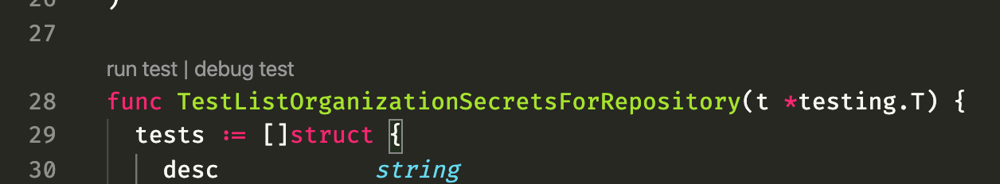

## Standing up Launch from Scratch in a New Codespace

For a brand new codespace, here are the steps required to get Launch up-and-running for debug purposes:

1. If you haven't yet created a Codespace, create one [using the `Actions Development` Dev Container Configuration](https://github.com/codespaces/new?hide_repo_select=true&ref=master&repo=3&skip_quickstart=true&devcontainer_path=.devcontainer%2Factions%2Fdevcontainer.json).
1. Open your Codespace in Visual Studio Code.
1. Include `actions/launch` source files in your Visual Studio Code workspace by running the following command from a terminal prompt[^add-folder]:
```
code -r -a /workspaces/actions/launch
```
4. If prompted via pop-up dialog to provide your password in the "Codespaces Port Forwarder Password Prompt", enter your MacBook password.  (This will save you the trouble of manually configuring Visual Studio Code port forwarding.)
1. Review [Launch Issue 252](https://github.com/github/actions-launch/issues/252#issuecomment-1904886428) to see if it's still necessary to tweak/hack your environment to get things working correctly (especially for Proxima debugging).
1. Within your Codespace, open five Terminal panels (bash consoles):

| Terminal Nickname | Initial Command |
|--|--|
| GH        | `cd /workspaces/github` |
| OVERMIND | `cd /workspaces/github` |
| GHDEBUG   | `cd /workspaces/github` |
| LAUNCH | `cd /workspaces/actions/launch` |
| RUNNER   | `cd ~` |

4. Using the terminal panels described above (as indicated by the left-most column below), run the following linux commands.

| Terminal / Window | Phase[^parallel] | Command |
|--|--|--|
| OVERMIND | 1 | (Optional) If you have a `github/github` feature branch to test, use the `shallow-clone` command to check out your feature branch. | 
| LAUNCH | 1 | `git pull` |
| LAUNCH | 1 | `git checkout <master or your-branch-name>` |
| SYSTEM-WIDE | 1 | Check to make sure you don't have any other `github/script/server` instances still running from previous debug sessions.  Otherwise, you could run into resource conflicts (port-forwarding, etc.) |
| OVERMIND | 2 | **Standard Mode:**  `script/server` <br/> **Proxima Mode:** `ALL_USERS_ARE_EMPLOYEES=1 script/server --multi-tenant` <br/>(`script/server` should keep running for the duration of the session.  If it exits after just a few seconds, try running it again.)<br/><br/> (Alternatively, to _debug_ github:  <br/> &nbsp;&nbsp;&nbsp;from Visual Studio Code Debug Menu select either <br/>&nbsp;&nbsp;&nbsp;`ruby debug: start unicorn` or `ruby debug: start unicorn in proxima mode` <br/>&nbsp;&nbsp;&nbsp;and press the ["Start Debugging" icon](https://github.com/github/launch/assets/81404201/51385c65-2d22-4fd4-b135-995d0249c6a6).) |
| GH     | 3 | (Proxima Mode Only) `script/multi-tenant/toggle-feature-flags enable` |
| GH     | 3 | If you have a feature flag to test, `bin/toggle-feature-flag enable <your feature flag>` |
| GH     | 3 | `start-actions` |
| BROWSER | 3| Login via the browser. <br/> **Standard Mode**:  login to [github.localhost](http://github.localhost/login?return_to=http%3A%2F%2Fgithub.localhost%2Fgithub), (username:  `monalisa`) <br/> **Proxima Mode**:  login to http://avocado-gmbh.ghe.localhost/, (username:  `monalisa`) <br/><br/> (Note that the Password and 2FA fields should be pre-populated for you.) | 
| GH, LAUNCH | 4 | Have a look at the `GH` terminal where you invoked `start-actions`.  Search within the terminal for the text:  `launch-deployer`.  If that text isn't present, wait until you see output similar to the image below. <br/><br/>  <br/><br/> Once `start-actions` confirms `launch` is running, switch to your `LAUNCH` terminal and run:<br/><br/> `service launch stop`[^cannot-attach]. |
| LAUNCH | 4 | **Standard Mode:**  <br/>`script/server --debug` <br/><br/> **Proxima Mode:** <br/> `API_HOST=http://internal-api.service.ghe.localhost`<br/> `LAUNCH_IS_MULTI_TENANT=true`<br/> `script/server --debug` |
| RUNNER | 5 | If needed[^self-hosted-runner], [configure one or more self-hosted runner(s)](https://docs.github.com/en/actions/hosting-your-own-runners/managing-self-hosted-runners/adding-self-hosted-runners). |
| VSCODE | 5 | To debug launch:  From the Visual Studio Code `Run and Debug` Activity Bar, select the launch service you want to debug and press the "Start Debugging" icon.   |
| GHDEBUG| 5 | If needed, to access the GitHub console: <br/> **Standard Mode:**  `script/console` <br/> **Proxima Mode:** <br/>  `MULTI_TENANT_ENTERPRISE=1 script/console` <br/> Once the console finishes loading, run:  `set_tenant "avocado-gmbh"`[^exit-github-console]

[^add-folder]:  Alternatively, choose `Add Folder to Workspace ...` from the `File` menu and select `/workspaces/actions/launch`.
[^parallel]: for parallelization
[^login]: This step should prompt you to open a new browser tab for viewing your debug instance of GitHub.com.  Hint:  Login with username `monalisa` in **Standard Mode**, `monalisa_avo` in **Proxima Mode**.
[^self-hosted-runner]: In Standard Mode, note that there's a [pre-configured Runner registered with the `github` organization](http://github.localhost/organizations/github/settings/actions/runners).
[^cannot-attach]:  `start-actions` doesn't currently provide a way to spin-up `launch` in "debug" mode, so we'll spin it down and then spin it back up again, this time in "debug" mode.
[^exit-github-console]:  The GitHub console will sometimes leave you in `vim`-mode.  Press `q` to exit `vim`-mode.  Type `exit` to exit the console.


### Sample Workflow for Testing

```
name: Simple Echo

on:
  workflow_dispatch

jobs:
  # This workflow contains a single job called "build"
  build:
    runs-on: self-hosted

    steps:
      - run: echo Hello, World!
```

#### Debugging unit tests

Unit tests that do not use the database can be debugged as normal via `Run test` or `Debug test` in the codelens.



To debug the `db/stores` unit tests, the `launch-db-1` container first needs to be running. You can execute `start-actions` in a [Dotcom Codespace](https://aka.ms/actions-innerloop) or `script/start-db` to start it.

---
<details>
  <summary><h3>Previous Guidance</h3> (click to expand)</summary>
  
### VS Code

#### Debugging the service(s)

1. Run `script/server`
1. Select the debug profile for the service you want to attach to
1. Hit run
1. Debug as usual, breakpoints etc. should just work. The `VARIABLES` and `WATCH` views might be a bit flakey, but evaluating manually in the `DEBUG CONSOLE` should work just fine.

#### Troubleshooting Debugger
- ~~Run `echo "0" | sudo tee /proc/sys/kernel/yama/ptrace_scope` to get past the error in the Dotcom Codespace~~ Configuring `ptrace_scope` should no longer be necessary (ever since https://github.com/github/launch/pull/7743 was merged.)
- If in a Dotcom Codespace and after clicking on "Start debugging" no breakpoints are hit, double check that no other instances of the Dotcom process (/workspaces/github/script/server) are running in another Codespace or VS Code instance.

</details>

### See also
- https://github.com/github/launch/blob/master/docs/local-dev.md#multi-tenant-mode
- https://thehub.github.com/epd/engineering/products-and-services/codespaces/dotcom-development/#start-the-github-server-in-multi-tenant-mode-proxima-and-sign-in
- https://thehub.github.com/epd/engineering/products-and-services/actions/actions-on-proxima/

