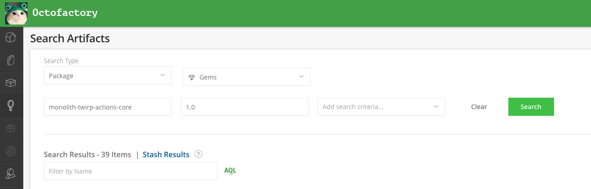

# Twirp APIs

# Best Practices

## Global IDs

A Global ID encodes type information, a sharding key, and the database ID into a single string.
A Global ID can always be decoded into the database ID, but a database ID can't be encoded by Launch into a Global ID.
If a Global ID is needed for a database ID, Launch needs to make an API call to Dotcom (this can be cached). See [`GetNextGlobalID`](https://github.com/search?q=repo%3Agithub%2Flaunch+symbol%3AGetNextGlobalID&type=code).

There is a negligible performance benefit to looking up an object in Dotcom by a Global ID[^perf].

A database ID is human readable and doesn't require an extra decoding step.
Global IDs are case-sensitive, which consumers need to be aware of when comparing them and querying Splunk and Kusto.

Since it's difficult to retrieve Global IDs and very easy to decode them, **prefer sending database IDs in requests and including both database IDs and Global IDs in responses**. If an API deals with multiple entity types in the request, a Global ID can be used instead. In the future, it's possible that a single database ID may not uniquely identify an `ActiveRecord` object so this recommendation can change in the future.

Example with `Actor` to include both a global ID and database ID in responses:

```proto
message Actor {
  ...
  int64 id = 2;
  ...
  Identity global_id = 7;
}
```

Where `Identity` is defined as

```proto
message Identity {
  // The Global Relay ID used to identify the entity in GraphQL queries.
  string global_id = 1;
}
```

From [`actor.proto`](/proto/monolith/core/v1/identity.proto) and [`identity.proto`](/proto/monolith/core/v1/identity.proto)


[^perf]: See https://github.com/github/github/pull/218428 for some discussion on this. With a Vitess VIndex on an object's primary ID, we tend to prefer simpler queries rather than always specifying a sharding key.

# Dotcom to Launch Twirp Implementation
## 1. Update the proto definitions and services in Launch
Proto definitions are located in `/proto/services` folder.

1. Update/add service in `/services/deploy` and `.proto` file.
1. If you added a new Twirp service that needs to be used within GitHub, add the generated client to [`ruby/proto/twirp.rb`](/ruby/proto/twirp.rb)
1. Update generated declarations and include them in your PR

    ```
    script/protoc
    ```

## 2. Update the `github/github` Launch Ruby Gem

Launch provides a Ruby Gem that includes the protoc defintions required by `github/github` to talk to Launch.

This `github-launch` gem is installed from the `github/launch` repository as a [bundler git source](https://bundler.io/guides/git.html) (as of December 2024 with [github/github#351812](https://github.com/github/github/pull/351812)).

1. Modify `ref` for `github-launch` in the `Gemfile` to point to a new SHA

    ```rb
    gem "github-launch",       github: "github/launch", ref: "2600d7d860701af298ecf23290afb28e0e3ffa50"
    ```
    [`Gemfile`](https://github.com/github/github/blob/9ffe2f3e9b77b81fee966a4be0fc98c93468cf02/Gemfile#L115C1-L116C1)

1. Run `bundle` to pull in the changes
1. If you're adding a new Twirp service, add the client to [lib/launch/twirp.rb](https://github.com/github/github/blob/fa810584d531ba88fd09e5c7a571b4fdfcea00bf/lib/launch/twirp.rb)

When testing changes during development, this can be a SHA for your branch.

**After your Launch changes are merged, this should be updated to the latest SHA
of Launch's default branch.**

Reach out to `#ruby-architecture` in Slack if you have questions or need help.

> [!NOTE]
> There's no need to bump any version file or create a release for changes to these files.

# Launch to Dotcom Twirp Implementation
This section describes how to update the Twirp proto definition, the creation of new endpoints, publishing and consuming the gem, as well as local testing. The process consists of four steps:

1. Update the proto definitions in Launch
1. Update the gem in Dotcom
1. Create or update the handler in Dotcom
1. Consume the Twirp API in Launch

These can be done in 3 PRs: one in Launch for step 1, one in Dotcom that covers 2-3, and another in Launch for step 4. The example PRs included in the steps below cover a single API being created and going through these steps.

## Update the proto definitions

Twirp API definitions are located in the `/proto/monolith` folder.

1. Add, remove, or change messages as needed for your APIs.
1. Update the `proto/monolith/core/VERSION` file, this is needed for the Ruby gem
1. Update the generated declarations and include them in your PR

```shell
go generate ./proto/monolith
```

Calls using new endpoints will fail until the Twirp handler is updated in Dotcom.

[Example PR](https://github.com/github/launch/pull/5344)

## Publish release as Gem hosted on Octofactory

Run the following command in the `#actions-launch-ops` Slack channel to build and deploy the package to the Octofactory:

```
.ci build actions-monolith-twirp
```

Once this command has run to completion you should see the correct version of the package in Octofactory. To verify that your package was successfully added to the Octofactory you should [connect to the developer VPN](https://thehub.github.com/security/security-operations/developer-vpn-access/), then login to the [Octofactory](https://octofactory.githubapp.com/artifactory/webapp) and perform the following search:



You should see the name of your package (which is "monolith-twirp-actions-core") with the version number used in Step 2.
## Update the `github/github` Monolith Twirp Ruby Gem

Follow the instructions in [Installing Gems](https://github.com/github/monolith-twirp/blob/master/docs/usage.md#installing-gems) to set up your bundle config and get an Octofactory token.

Then, in `github/github` run `script/vendor-monolith-twirp-gem actions core <VERSION>`, replacing `<VERSION>` with the new version of your gem created in step 1.

### Alternative if the script isn't working in codespaces
1. [Connect to the developer VPN](https://thehub.github.com/security/security-operations/developer-vpn-access/) locally
1. Download the latest `monolith-twirp-actions-core` gem from [Octofactory](https://octofactory.githubapp.com/artifactory/webapp)
1. Add the file to `vendor/cache` in `github/github` in your codespace You can do this by drag-and-dropping the file into the folder in the VSCode file explorer
1. In the `Gemfile` update the line with `gem "monolith-twirp-actions-core", <VERSION>` with the new version number 
1. Run `bin/bundle install`

## Generate type definitions

1. Run `bin/tapioca dsl`
2. Run `bin/tapioca gem`

## Add new `monolith-twirp` handlers/endpoints

For service-to-service calls between GitHub.com and `launch`, you may need to implement a new handler in dotcom. The handlers are located in the [`app/api/internal/twirp/actions/core/v1`](https://github.com/github/github/tree/master/app/api/internal/twirp/actions/core/v1) directory, so if a new handler is being added, you can either define a new service or add the endpoint to a pre-existing service definition.

### Implementing the Handler

`github/github` has a [helpful generator](https://github.com/github/monolith-twirp/blob/master/docs/implementation.md#use-the-generator) for generating handlers and methods from the Twirp gems, so use that for implementing *new* handlers. Skip any conflicts for existing handlers.

```sh
bin/rails generate twirp --from-gem=monolith-twirp-actions-core --client=launch --version=V1 --service=RefsAPI
```

[Example PR adding handlers](https://github.com/github/github/pull/180151/files) (Covers steps 2 and 3)
[Example PR removing handlers](https://github.com/github/github/pull/216622/files)

## Consume the Twirp API in Launch

After the `github/github` handler changes are deployed, you can use the Twirp client within the `ghtwirp` package within `github/launch`.

# Testing a version locally before deploying

If you want to test your new proto definitions before creating a PR, getting it approved, etc, you can build the gem or go module locally and install them into your setup. Once you have a working proto that you're happy with you need to follow the proper steps to publish a new release.

In both cases do not check the vendored changes in that you're doing, just use it to test locally then follow the proper process once you are happy with the result.

## Ruby (for Dotcom)

This should work without any extra authentication on Codespaces. You may need to authenticate with GHCR to generate the Ruby gem on a local dev machine, see [Authenticating to the Container registry](https://docs.github.com/en/packages/working-with-a-github-packages-registry/working-with-the-container-registry).

Generate the ruby gem with

```bash
cd $LAUNCH_PATH
mkdir tmp/monolith-twirp-artifacts
docker run -e NAMESPACE=actions \
  -e MODULE_ROOT=proto/monolith \
  -e NWO=github/launch \
  --volume $(pwd):/repo \
  --volume $(pwd)/tmp/monolith-twirp-artifacts:/docker-build-artifacts \
  ghcr.io/github/monolith-twirp-tools/gen-ruby:latest generate
rm proto/monolith/core/Makefile
```

Then you'll need to move the gem into github with the generated version using this (with the proper gem version):

```
cp ./tmp/monolith-twirp-artifacts/gems/monolith-twirp-actions-core-1.x.x.gem $GITHUB_PATH/vendor/cache/
```

Finally, you'll have to go into a few files in dotcom and update the version numbers there. Search for `monolith-twirp-actions-core` and update the version number in the `Gemfile` and `Gemfile.lock`. Run `script/bootstrap --local` and it should install for you.

## Go (for Launch)

After you've updated the `.proto` definitions, running `go generate ./proto/monolith` will update any generated declarations.
