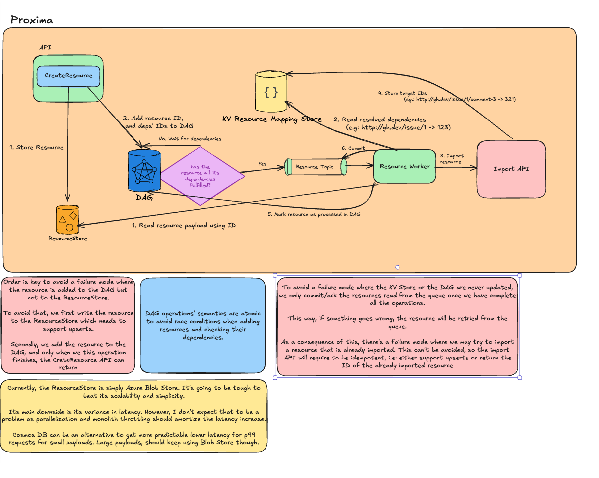

# Ingestion Pipeline Design

## API

- *CreateResource(resource)*

**CreateResource** is the API that the service exposes to create a resource. The resource argument represents the ELM representation of the resource that needs to be migrated from a source system (GHES) into the target system (Proxima).

Authentication, authorization, auditing (AAA), and encryption are extremely important aspects of the system. Their design will be discussed in a separate document.

For the purposes of this document, we assume that a call to **CreateResource** has successfully completed all the verification steps carried out by the AAA component. As a result, the resource includes a valid migration context, which contains information about the migration itself: the tenant (as the destination tenant in Proxima), the migration ID, and the source system URL. This migration context is passed through the different processing steps and plays a key role in ensuring that resources are migrated to the correct tenant.

These are the steps taken by **CreateResource** to process a resource:

1. **Rate limiting:** as the first step, the system has the opportunity to communicate backpressure to the client. This is a crucial mechanism to ensure the health and reliability of the system. Refer to the section on rate limiting for a more detailed explanation of its expected functionality.  
2. **Validation**: the system verifies that the resource contains all the required fields necessary for processing.  
3. **Write to Resource Store:** the resource payload is written to the resource store. See the Resource Store section below for further details.  
4. **Write to DAG**: the resource ID and the IDs of its dependencies are extracted and used to add the resource to a Directed Acyclic Graph (DAG). This DAG allows the system to process resources in an order that respects their dependencies.  
5. **Ack response to client:** once the resource has been successfully enqueued for further processing, an acknowledgment is returned to the client.

### Order and Idempotency

As outlined in the steps above, during the execution of **CreateResource**, the resource is written to two different systems: the **Resource Store** and the **DAG**. There is a potential failure mode where the process could be interrupted right after the resource is written to the Resource Store but before it is written to the DAG.

This failure can be handled gracefully due to the order of operations, as explained below:

-  Writing to the **Resource Store** is **idempotent**, meaning the same resource can be upserted multiple times without adverse effects.

- The DAG is always updated **after** the Resource Store because, as we will see in a later section, the DAG depends on the resource being available in the Resource Store to fully process it.

Reversing this order would create issues in the DAG, as it would lack the required resource data.

Additionally, there is another failure mode where the process might be interrupted before sending an acknowledgment back to the client. This would cause the client to retry the operation. During the retry, the resource would be written again to both the Resource Store and the DAG. To handle this case, writing the same resource to the DAG also needs to be **idempotent**.

## Resource Store

### Max Kafka message size

**ELM** makes extensive use of Kafka, leveraging it as a buffer while also enabling parallelism by allowing concurrent consumers to process resources.

However, using Kafka introduces an important limitation for this project. Kafka has a configured maximum message size, and our Hydro clusters are typically set with a limit of 5 MB.

We know that certain resources will exceed this limit. Even though file attachments are handled out-of-band, our experience with the audit log has shown that some resources, such as issue or comment bodies, can still exceed the 5 MB threshold.

To address this limitation, resources that exceed the size limit and need to be written to Kafka store their payload in the **Resource Store**. The corresponding Kafka message then contains a pointer to the stored payload, allowing the resource to be hydrated before processing.

### DAG nodes

As explained in more detail in the next section, the current proof-of-concept (PoC) implementation uses a Directed Acyclic Graph (DAG) where only the resource IDs and their dependency IDs are stored.

This design requires the actual payloads to be stored elsewhere. The **Resource Store** serves as the repository for these payloads.

### Required API semantics

From the two requirements described above, we can infer that those use cases are well served by a simple KV store.

### Candidates

An object store is an ideal solution for these requirements. We have been successfully using **Azure Blob Storage (ABS)** in our current PoC, and we believe it will be hard to surpass its scalability and simplicity.

The main drawback of using an object store is its latency, which can exhibit high variance. However, our hypothesis is that the expected throughput and the ability to process resources in parallel will mitigate this issue.

**Cosmos DB** could also be a candidate for the Resource Store. However, it would still require an object store for certain resources as the maximum size for documents stored in Cosmos DB is limited to 2 MB.

A combination of the two storage solutions could be a valid approach, with the following considerations:

1. **Cosmos DB** would provide consistent latency in the low tens of milliseconds (p99).  
2. **ABS** would handle larger objects efficiently.  
   

## DAG

The system needs to handle resources that may come in out of order. For resources that don’t depend on each other, the processing order is irrelevant. However, for resources that depend on other resources, the system needs to assure that the dependencies are successfully processed before their dependents are processed.

In order to deal with these cases, a DAG is used as it allows for a topological sort where for every directed edge A → B, node A appears before node B in the order. This ensures that dependencies are resolved before their dependents.

The DAG exposes the following interface:

### AddNode(kind NodeKind, id ID, dependencies …Node) 

- ***kind***: is the type of node: resource or event  
- ***id***: is the node’s ID  
- ***dependencies***: list of dependencies where each dependency is a node type and its ID

### EligibleNodes() \[\]Node

- Returns a list of nodes that are ready to be processed, i.e: their dependencies if any are fulfilled

### MarkNodeAsProcessed(nodes \[\]Node)

- ***nodes***: list of nodes to mark as processed

Before a resource can be processed, it needs to be added to the DAG. For that, we only need to extract its ID and its dependencies IDs. With that, and using `AddNode` the resource is added to the DAG.

If a node has all its dependencies fulfilled, it goes into the `eligible_list`. This list contains the nodes that are ready to be processed. One can see this list as the *“output”* of the DAG. 

When a node is successfully processed, the DAG is notified via `MarkNodeAsProcessed`

Please, see the “DAG worker” section for more information about how this list is used.

### Baseline implementation

The current Proof of Concept (PoC) implementation is backed by Redis.  
**Redis Service Provides:**

1. The ability to easily implement DAG operations atomically using Lua scripts.

2. High throughput in terms of the number of requests per second it can support.

### Memory Concerns

There might be concerns about Redis’s memory usage. However, these are currently mitigated by the fact that we only store resource and event IDs, which are just URLs, with no need to store payloads. Based on this and the number of resources that need to be stored, we can easily calculate an upper bound on the memory required.  
To further optimize memory usage, we propose the following changes:

1.	**Avoid storing already-processed nodes in the DAG**: Use an external system, such as any key-value store, for these resources. This prevents unnecessary consumption of Redis memory for processed nodes. As a result, Redis only needs to store resources and events whose dependencies are not yet fulfilled.

2.	**Implement a rate limiter**: Apply backpressure to the ELM client that creates resources to ensure the number of unprocessed nodes does not exceed a specified threshold.

3.	**Shard Redis instances by tenant**: Distribute the load across multiple Redis instances to improve scalability.

4.	**Add serialization/deserialization capabilities for the DAG**: This enables flexibility in storing and reconstructing the DAG as needed.

### Scaling Concerns

With these optimizations, the primary challenge for scaling would be handling **pathological DAGs**, where a large volume of completely out-of-order nodes is added, resulting in an excessive number of unprocessed nodes. Otherwise, this model should scale effectively and efficiently.

In any case, to decide which optimizations apply, we need to first calculate the expected resource usage. For that, we can use the existing historic data that Octoshift has to compute limits per instance and size the instances accordingly.

### Alternative Design Approaches

While Redis is the foundation for our current implementation, there are alternative designs that could also support our requirements. Below are some options with their respective advantages and limitations:

**1\. Cosmos DB Graph Database (Gremlin)**

- **Pros**: A graph database is well-suited for modeling and querying complex relationships, like those in a DAG.  
- **Cons**: Our DAG requirements are relatively simple, and using a full-blown graph database like Cosmos DB with Gremlin would be overkill. It might add unnecessary complexity and overhead for our use case.  
- **Limitations**: As of now, there doesn’t appear to be an official Go library for accessing Cosmos DB with Gremlin, which could complicate development and maintenance.

**2\. Cosmos DB (NoSQL)**

Instead of using the Graph Database flavor, given that our use case is relatively simple, we could try to implement it on top of  Cosmos DB NoSQL.

- **Pros**: Cosmos DB’s NoSQL capabilities can be leveraged to implement a simple DAG. Its global distribution and scalability are strong points.  
- **Implementation Idea**: Each resource or event could be a document, with fields representing dependencies (e.g., parent nodes) and status. Queries could determine which nodes are ready for processing.  
- **Cons**: While feasible, implementing DAG operations on top of Cosmos DB (NoSQL) may involve more custom logic compared to Redis, as it lacks out-of-the-box DAG operation support. This approach could also be costlier at scale.

**3\. MySQL**

Similarly to Cosmos DB, we could implement a DAG on top of MySQL.

- **Pros**: MySQL is a well-established relational database with robust support for indexing and querying relationships. It could be a simpler alternative for implementing a DAG using table relationships.  
- **Cons**: Implementing DAG-specific logic would require more custom queries, and handling highly concurrent scenarios might become challenging compared to Redis. However, it remains a cost-effective and widely supported option.

## DAG Worker

The DAG worker is the component that takes care of processing the output of the DAG.

It monitors the  DAG’s `eligible_list` for new nodes in the following way:

1. When a new node is detected, its ID is fetched.  
2. Using the ID, it fetches the actual payload from the Object Store.  
3. The fetched payload is then written to Kafka  
4. Add node to the in-memory in-process list that indicates that node is already in Kafka and ready to be processed

### Idempotency

There’s a failure mode where a resource or event can be written to Kafka twice. The consumers of these resources are ready to deal with this scenario making this idempotent and a non-issue.

## Resource Worker

The Resource Worker is the component responsible for processing resources. The end result of its processing is a resource successfully imported into the target system.

It consumes resources from a Kafka topic. By design, any resource read from this topic already has all its dependencies satisfied. For each resource, the following steps occur:

1. Check the resource ID to verify whether it has already been processed. If it has, stop the processing at this point. Otherwise, continue.  
2. Resolve all the resource’s dependencies. The resource specifies its dependencies using source system URLs; these need to be translated into target system IDs. For example, a dependency on https://ghe.dev/vim/issue/123 must be translated into the corresponding issue ID (not just the issue number, but its database ID) in the target system.  
3. These translations for already processed resources are stored in the Resource Mapping Store.  
4. Transform the resource’s content, for instance, by replacing source system URLs in an issue comment with target system URLs.  
5. Import the resource into the target system using the import API.  
6. Add the new IDs returned by the import calls to the Resource Mapping Store. This ensures that resources depending on this one can use its translated ID.  
7. Mark the resource as processed. This action triggers a DAG evaluation for all the resource’s dependents.

### Dead Letter Queue

By default, a failing resource is retried several times with an exponential backoff. However, due to our use of Kafka, a consistently failing resource can block the processing of other resources.  
To address this issue, we take the following approach:

1. We attempt to distinguish errors that indicate a general issue in the Resource Worker from those that are limited to a single resource or a small subset of resources.  
2. Errors indicating a general problem cause the Resource Worker to fail.  
3. Errors indicating an issue confined to a few specific resources are sent to a Dead Letter Queue (DLQ).

Please note that this error triaging is currently very primitive and will need refinement.

The DLQ is a separate Kafka topic with its own Resource Worker. This Resource Worker operates at a slower pace than the primary one but essentially performs the same task: attempting to import the resources.

### Result Caching

The translated IDs lend themselves well to caching optimizations. Once a Resource Worker has retrieved a translated ID from the Resource Mapping Store, all subsequent requests for the same resource ID can be efficiently served from the cache.

Our PoC uses an LRU cache, which greatly reduces the number of round-trip calls to the Resource Mapping Store.

### Concurrency

Multiple Resource Workers can be deployed. However, the actual concurrency limit will be established by the number of Kafka partitions.

This surfaces a challenge: how can we assure fairness in the case of having large migrations that coexist with smaller migrations. A simple approach is having tooling in-place to move migrations from shared topics/partitions to stand-alone topics/partitions which will allow us to throttle those migrations in a more fine-grained way and increase fairness for other migrations when needed.

### Idempotency

To minimize the impact of non-idempotent APIs, we use a common pattern across all components: keeping track of which resources have already been migrated to skip them during retries caused by failures. It’s important to note that avoiding retries entirely is impractical—they will occur across all components regardless.

The Resource Worker is the component where the effects of not having idempotent APIs are more evident and critical.

The main failure mode that we haven’t addressed yet is:

1. The Resource Worker imports a resource into the target system, and the target system successfully creates the resource assigning a new database ID.  
2. The Resource Worker process dies or crashes right before it is able to successfully update the Resource Mapping Store with the newly assigned ID.

The failure described results in a resource that, from the ingestion pipeline’s perspective, hasn’t been migrated and will therefore be retried indefinitely. However, with the current APIs, the migration will never succeed because the resource already exists in the target system. Consequently, this also blocks any dependent resources from being processed.

Addressing this is key to increasing the reliability of the system. We can explore some options:

- Modify the import APIs to make them idempotent. This can range from a simpler approach, where an error is returned when a resource already exists (along with the database ID), to a more complex approach, where the import API supports upserts.  
- Implement a mechanism to handle resources that return an “already-exists” error. This can be achieved using the public API or a custom-made API that attempts to find the newly assigned ID. Once this ID is found, the Resource Mapping Store can be updated accordingly.

## Rate limiting and throttling

Rate limiting is essential to ensure the stability of the ingestion pipeline, as well as the systems that depend on it, such as Proxima, Azure Blob Store, Redis, etc.

There won’t be a unique rate limit but a combination of multiple limits and whose minimal value will decide whether a given resource can be processed or not.

These are the rate limits that will be used:

- **Local rate limit**: the purpose of this limit is to make sure that the concurrent handling of multiple resources by a single instance does not exhaust the available memory resources. To do so, it keeps track of aggregated  memory used by the in-flight resources to make sure that the configured limit is not exceeded.  
- **Processing-aware rate limit:** this is a distributed rate limit and its goal is to ensure that resource production and resource processing for each tenant are –to some extent– in-sync. This means that we want to avoid a scenario where the resource production and resource processing rate are very unbalanced. This helps to make a more rational use of system  resources such as bandwidth and CPU utilization.  
- **Proxima backpressure:** backpressure from Proxima in the form of 429s or Freno metrics will be used by the system to slow down resource processing.

## High-level System Diagram

## Remaining questions

Most of the remaining questions below will be addressed in the form of an ADR:

- Authentication and encryption  
- File attachments and assets: these are good candidates to be handled out-of-band.  
- How should we handle “deleted” users?  
- Analyze and decide what data stores we will use  
- Decide how to handle idempotency issues
