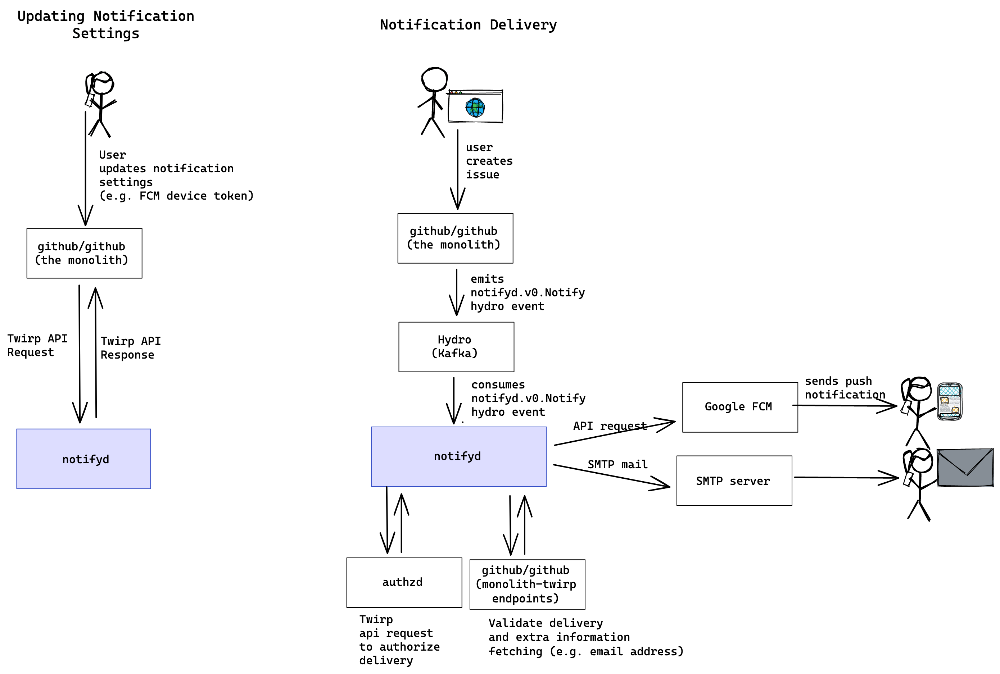
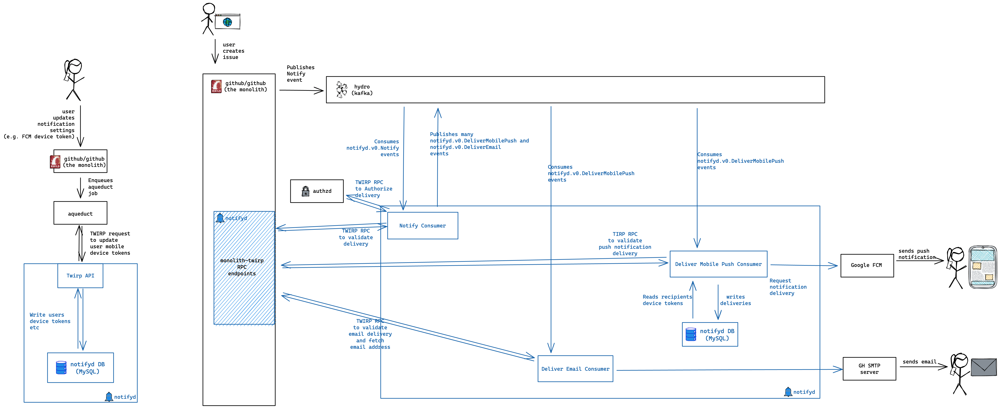

# Architecture

This doc covers the system architecture of notifyd at a high level.

## System Context

These diagrams show notifyd in the context of the systems and users it interacts with. Here we see the two main workflows for notifyd, the workflows are depicted separately for clarity.

**Updating Notification Settings**

To update notification settings, for example a user's device token, typically their device will make a request to the `github/github` monolith, which will in turn make a twirp API request to `notifyd`.

**Notification Delivery**

Notification delivery is triggered from the `github/github` monolith by emitting a `Notify` hydro event. `notifyd` consumes this event and uses it to determine who should be notified.

* `github/authzd` is an external service used to authorize notification delivery
* A set of `github/monolith-twirp` are used in order to perform several checks to validate notifications before delivering them and to fetch some pieces of information that ar not denormalized into `notifyd`'s database yet.
* Google's [Firebase Cloud Messaging (FCM)](https://firebase.google.com/docs/cloud-messaging) is used for actually sending mobile push notifications.
* [GH's internal SMTP architecture is used to deliver emails.](https://github.com/github/sre/blob/main/docs/email.md#glb-balanced-low-priority-mail)

## Notifyd Internals

This diagram shows the main internal modules within `notifyd` and how they interact with each other, and the systems it interacts with.

* Notification delivery is performed by a series of hydro consumers. These communicate with each other by publishing and consuming hydro messages.
* The twirp API is a standalone module.
* They all share access to the same backing databases.
* Each one of the consumers works in a smilar way:
  1. They consume a message from their topic
  2. They perform a set of checks on the received message to know if it has to be discarded
  3. If it has not been discarded they go for the next step (for example, publishing a message for the next step or delivering a notification)
* Checks are done through monolith-twirp RPC, both to authorize delivery and to validate it.
* Validation is different on each step:
  * On `notify` consumer: we perform a batch check for global properties that are common to all channels and discard messages in cases like spammy actors, actors blocked by recipients...
  * On `deliver-mobile-push` consumer: we check push notification specific properties like whether a given mobile token is correct or authorized on a given org or if the user has configured a schedule in which they don't want to receive pushes.
  * On `deliver-email` consumer: we check email specific check and return the email address that we'll use for the final delivery. This check is NOOP for now while we iterate on the email channel.

The following diagram illustrate that high level architecture. Blue is used on the parts of the system that belong to the `notifyd` codebase (like our `monolith-twirp` endpoints).

