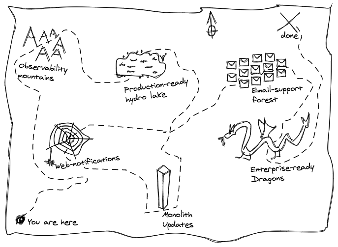

# 14. Ship mobile push notifications before focusing on other types

Date: 2021-04-15

## Status

Accepted

## Context

There is a lot of work to do, on many different axes, before `notifyd` will fully replace newsies for notification delivery across all platforms (dotcom, GHES, GHAE). The axes include:

- Feature completeness in notifyd
  - All notification channels (mobile, email, web) fully supported
  - Subscription/settings management all happening inside notifyd
  - New, more granular, subscription/settings
- Changes in the monolith
  - Updating existing UI to pull data from notifyd
  - Updating integrator's callsites to call notifyd instead of newsies
- Data and service migrations
  - Migrating existing data from newsies -> notifyd
  - Transitioning from newsies -> notifyd services in production
- Production readiness
  - notifyd scaled to full notifications volume
  - resiliency, robustness, availability, security
- Operational readiness
  - observability, monitoring, dashboards, on-call
- Enterprise support
  - Supporting notifyd in GHES/GHAE
  - Transitioning existing customers from newsies -> notifyd

As we plan for this multi-stage rollout, we need to consider our preferred approach to rollout:

- Do we try to finish all feature completeness work, and answer all our questions about the entire service before transitioning any of it to "full" production?
- Or, can we transition certain sub-systems fully to notifyd, before we have full feature completeness?

## Decision

Following `incremental correctness` as a principle, we will focus on fully transitioning mobile push notifications to notifyd before starting work on email and web notifications.

In essence this is applying the [StranglerFigApplication](https://martinfowler.com/bliki/StranglerFigApplication.html) pattern to notifyd, starting with replacing mobile push notifications in production before moving on to other types.

## Consequences

### Benefits

* The earlier we can get production traffic flowing through notifyd, the sooner we can build our production and operational experience, and improve the system as a result.
* Push notifications are lower in volume (and arguably less critical) than email and web notifications, so we can do our first production rollouts with lower risk.
* Push notifications are simpler than email/web notifications as they don't depend on subscriptions for delivery, so we can start sending push notifications without building out all our subscription logic.
* Push notifications are currently not supported in enterprise, so we can make progress in production, and defer some of the GHAE/GHES work until later.
* Having code running production traffic sooner will create value for users, integrators and other teams sooner.
* Having code running production traffic sooner will create more momentum for the project.

### Drawbacks

* We are electing to run two systems in production at the same time for longer, which may cause confusion for integrating teams.
* We will be front-loading operational and production readiness work ahead of more in-depth feature development (web/email/granular subscription settings)
* We defer discovery about challenges of web/email notifications until later in our rollout process.
    -  This is mitigated by the work and thinking we've already done on the [initial prototype](https://github.com/github/i2c-backlog/issues/625) which covered email/web notifications to some extent.
* Getting the mobile team members up to speed on this repo/system/new programming language to contribute to a feature owned by that team
