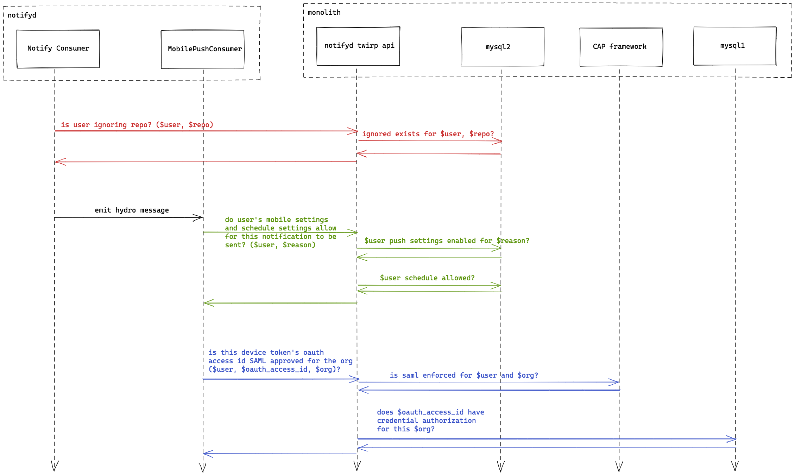

# 15. Make requests to the monolith for mobile push checks during the migration to notifyd

Date: 2021-04-21

## Status

Accepted

Amends [3. Minimise requests from the notifications service back to the monolith](0003-minimise-requests-from-the-notifications-service-back-to-the-monolith.md)

## Context

In the context of [14. Ship mobile push notifications before focusing on other types](0014-ship-mobile-push-notifications-before-focusing-on-other-types.md) we have a number of delivery checks that must be implemented in notifyd for it to reach feature parity with newsies:

1. Notifications should be skipped if the recipient is ignoring the repository
2. Mobile push notifications should be skipped if the user has not enabled them for the specific notification type (e.g. mentioned/assigned/etc)
3. Mobile push notifications should be skipped if the user has setup mobile push schedules and we are outside working hours
4. Mobile push notifications should be skipped if the device is not authorized to receive SAML protected content

Each of these features require the functionality to be implemented in notifyd _and_ all the relevant data to be migrated into notifyd. It will take some time to implement all of these features and to move the data. This increases the risk of any rollout and will make it harder to rollout notifyd for staff in "production" incrementaly and build confidence.

## Decision

To make the rollout more incremental, it is proposed that first we leave the data and logic for all these checks in the monolith and make twirp requests from notifyd back to the monolith to perform these checks.

After we have this in place we can migrate each of the checks along with their logic and data into notifyd.

Here's a representative sequence diagram of how this may look:

## Consequences

### Benefits

- This should be a shorter and faster path to getting the delivery logic in notifyd to match what we have in newsies today.
- This will let us increase the number of notifications we are sending via notifyd sooner.
- Once in place we can migrate each check individually to notifyd in a lower risk way.
- For shared functionality like mobile push schedules, we can leave these checks as-is in the monolith until we are ready to work with the relevant teams to move them into notifyd together.
- This also allows us potentially to run both the new notifyd checks and the monolith checks, and compare results.

### Drawbacks

- Implementing the monolith twirp api for notifyd to call will take some up front effort that will eventually (hopefully!) be removed.
- While these checks are still in the monolith we will be adding an additional dependency into our delivery pipeline. This will likely impact performance of the delivery pipeline while they are in place.
