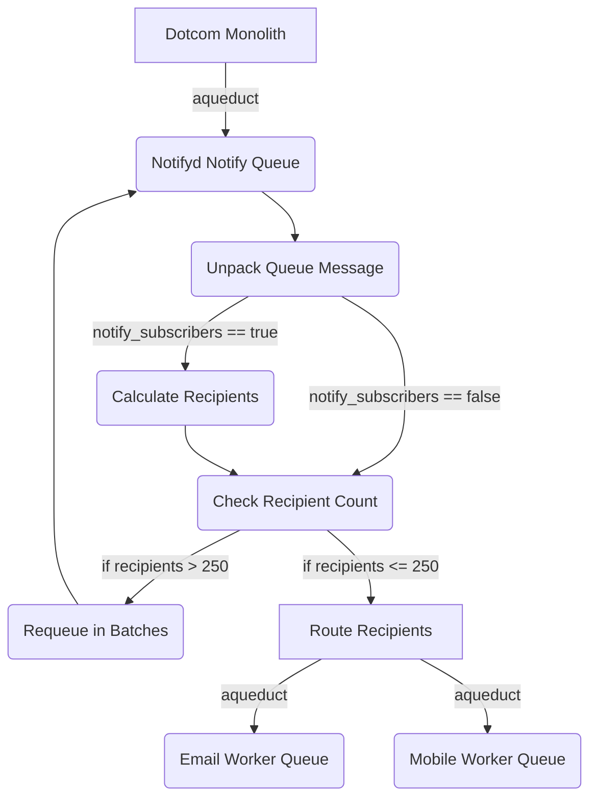

# 35. Batch Recipients by re-queueing them on Notify Worker

Date: 2022-11-18

## Status

Accepted

## Context
The requests to Authzd and the Dotcom Policy checker endpoint have limits of 250 and an estimated 1000 recipients, respectively. Individual messages may have more recipients than these limits. 

Solutions considered:
1. Batching individual requests to Authzd and the Dotcom Policy checker endpoint
1. Create a new queue between the Calculate Recipients and Authzd, and the Dotcom Policy checkers. Send all notifications to the new queue while batching those with over 250 recipients
1. Re-queue any notifications with over 250 recipients, but skip the Calculate Recipients stage

## Decision

 We decided to batch recipients by re-queueing recipients in small batches to the notify queue.

## Consequences
- We didn't have to create any new queues
- The logic for when messages are re-queued/skip the calculate recipients stage vs. when they are routed is based on a magic setting called `notify_subscribers`
- We are increasing the number of paths a message can take within the notify worker, which makes finding issues more difficult and the paths less clear
- We need to be careful when changing re-queue or notify_subscribers logic so that we don't cause infinite loops