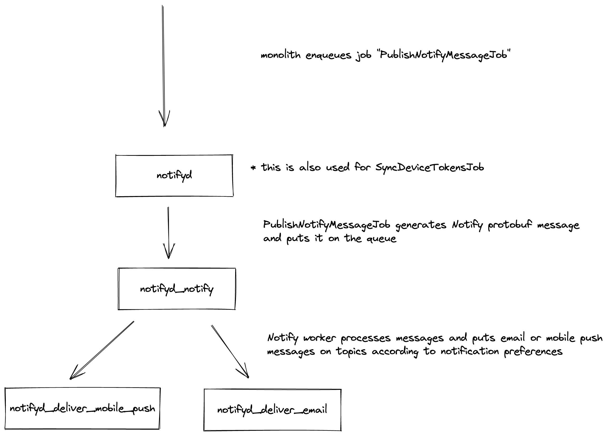

# Aqueduct for notifications

The main job queue powering notifications is [aqueduct][aqueduct], both for
jobs in the monolith as well as the `notifyd` platform. The details of the
implementation for notifyd are described  [in the proposal][aqueduct_proposal]
for moving from plain hydro to aqueduct.


## Jobs
We are using a number of different jobs to make notifications works:

- [`PublishNotifyMessageJob`][publish_job]: publishes `notify` messages for the `notifyd` platform
- [`SyncDeviceTokensJob`][sync_dt_job]: sync device token from monolith to `notifyd`
- notifyd notify worker: processes notify messages
- notifyd mobile push worker: sends mobile push messages
- notifyd email worker: sends email notifications


## Queues
There are a number of queues being utilized in aqueduct for a number of
different jobs. The queues being used in `notifyd` are defined in [its
aqueduct config][aqueduct_config].

The queues are:

- notifyd_publish: jobs from the monolith
- notifyd_notify: notify jobs
- notifyd_deliver_mobile_push: deliver mobile push jobs
- notifyd_deliver_email: deliver email jobs
- notifyd_delete_repository: deletes list and thread-type subscriptions & settings from a repository

The high level flow of notifications through these queues looks like this:





## Updating queues
Whenever we update a queue name, the data structure on a queue, or even a [job class name in the monolith][monolith_aqueduct_guidance], we must ensure that the deprecated queue is completely drained. There are a few resources that can help us with this effort:
1. The Datadog [aqueduct developer dashboard][aqueductdeveloper_dashboard]
2. Kusto's [hydro tables][kusto_hydro] - `aqueduct_v0_job_parsed` and `aqueduct_v0_message_state_change`
    For example, the following queries:

    Check for recently queue jobs by queue and job class
    ```
    aqueduct_v0_job_parsed
    | where queue == "notifyd_publish"
    | sort by timestamp
    | where parsed_payload.job_class == "Notifyd::PublishNotifyMessageK8sJob"
    | take 30
    ```
    
    Check the states for recently queue jobs by queue and job class
    ```
    aqueduct_v0_job_parsed
    | where queue == "notifyd_publish"
    | where timestamp > todatetime("2023-08-02T10:56:53.3826241Z")
    | sort by timestamp
    | where parsed_payload.job_class  == "Notifyd::PublishNotifyMessageK8sJob"
    | take 30 // because I saw that 23 repeated
    | join kind=leftouter  aqueduct_v0_message_state_change on $left.message_id == $right.message_id
    ```
3. The [`active_job.retry` metric][retry_dashboard] for the monolith can help see if any recently re-queued job could take 1+ days to execute.

## Aqueduct/Hyrdo Job retries in the monolith 
When a job fails for a retryable reason, such as replication lag, jobs will be retried with the following exponential delay. 

|  attempt number |  delay  |
|  ---- |  -----  |
| 0 | 2 seconds |
| 1 | 3 seconds |
| 2 | 18 seconds |
| 3 | 1 minutes 23 seconds |
| 4 | 4 minutes 18 seconds |
| 5 | 10 minutes 27 seconds |
| 6 | 21 minutes 38 seconds |
| 7 | 40 minutes 3 seconds |
| 8 | 1 hours 8 minutes 18 seconds |
| 9 | 1 hours 49 minutes 23 seconds |
| 10 | 2 hours 46 minutes 42 seconds |
| 11 | 4 hours 4 minutes 3 seconds |
| 12 | 5 hours 45 minutes 38 seconds |
| 13 | 7 hours 56 minutes 3 seconds |
| 14 | 10 hours 40 minutes 18 seconds |
| 15 | 14 hours 3 minutes 47 seconds |
| 16 | 18 hours 12 minutes 18 seconds |
| 17 | 23 hours 12 minutes 3 seconds |
| 18 | 1 days 5 hours 9 minutes 38 seconds |
| 19 | 1 days 12 hours 12 minutes 3 seconds |
| 20 | 1 days 20 hours 26 minutes 42 seconds |


[aqueduct]: https://github.com/github/aqueduct
[aqueduct_config]: https://github.com/github/notifyd/blob/main/internal/pkg/aqueduct/config.go#L9-L12
[aqueduct_proposal]: https://github.com/github/notifyd/blob/main/docs/proposals/pipeline-scale.md
[publish_job]: https://github.com/github/github/blob/master/app/jobs/notifyd/publish_notify_message_job.rb
[sync_dt_job]: https://github.com/github/github/blob/master/app/jobs/notifyd/sync_device_tokens_job.rb
[monolith_aqueduct_guidance]: https://thehub.github.com/epd/engineering/products-and-services/dotcom/background-jobs/adding-a-job/#updating-an-existing-job
[aqueductdeveloper_dashboard]: https://app.datadoghq.com/dashboard/vmq-gt6-2h7/aqueductdeveloper
[kusto_hydro]: https://dataexplorer.azure.com/clusters/ghdwprod.eastus/databases/hydro
[retry_dashboard]: https://app.datadoghq.com/notebook/6184062/job-retries
