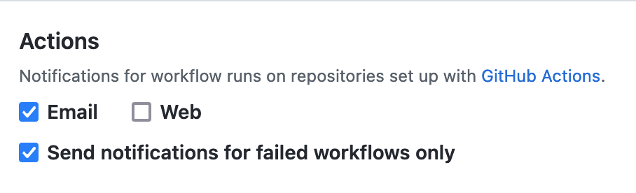

# CI Activity Settings Migration and Synchronization

## Problem statement
There are two related problems that we want to solve:
- [CI Activity notification settings](https://github.com/settings/notifications) are currently owned by Newsies.
- CI Activity notifications are currently sent by Newsies.
As part of the migration of email delivery of CI Activities notifications towards Notifyd, we need to:
- Make notifyd the owner of CI Activity email settings.
- Switch delivery of CI Activity email notifications from Newsies to notifyd.

### Expected outcome
- Updating the [CI Activity notification settings](https://github.com/settings/notifications) should update both Notifyd and Newsies settings
- Email delivery of CI Activity should be handled by notifyd.
- Ensure that old CI settings are migrated from Newsies to Notifyd.

## Context
The [CI Activity notification settings](https://github.com/settings/notifications) section on the setting page determine which CI Activity emails a user receives. 

These email settings are stored in `continuous_integration_email` and `continuous_integration_failures_only` columns in the [`notification_user_settings` table](https://github.com/github/github/blob/master/db/mysql2-structure.sql#L124-L147). The new notification's platform will not have an analog for this table, so we need to model Newsies' functionality leveraging the notifyd's routing settings. 

Below is a list of the features of the [CI Activity notification settings](https://github.com/settings/notifications) that we should translate to the notifications platform.

- Toggling the `Email` button should alter whether a user receives CI all activity emails
- Toggling the `Send notifications for failed workflow only` should alter whether a user receives emails for successful CI activities.

Once this information is also available, we'll switch delivery to Notifyd.

## Goal
- Ensure that CI settings changes update CI delivery behavior in both Newsies and Notifyd.
- Build observability mechanisms to track sync failures and conflicting records instances.
- Ensure that CI notifications email delivery is moved to Notifyd.
- Provide a rollout mechanism to make the migration gradual.
- Provide a rollback mechanism to Newsies in case of disaster.

## Assumptions
- The acceptable time window for settings changes to propagate is under 1 minute
- There may be synchronization failures in rare cases, which should be acceptable. Those failures will eventually be corrected through some user action that resets the settings or the database sync.

## Guiding Principles
- Notifyd shouldn't incorporate the domain logic of integrators.
