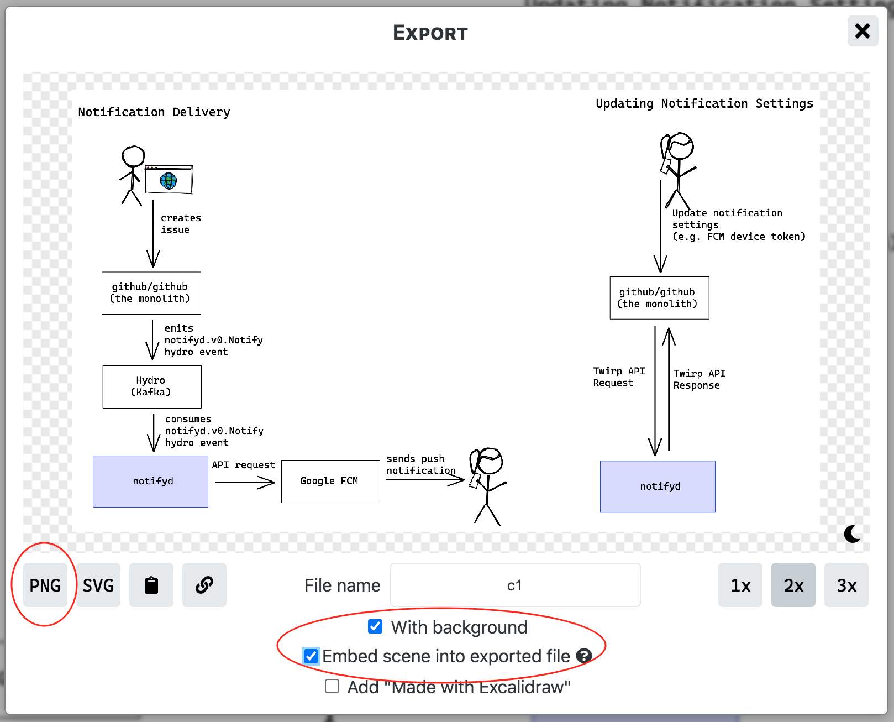
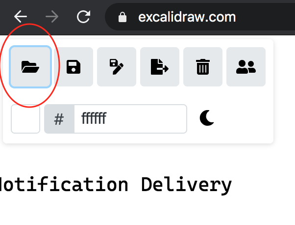

# Diagrams

## Creating diagrams

Images are created with [Excalidraw](https://excalidraw.com).

## Exporting diagrams

When exporting diagrams from excalidraw use **png** and ensure that **"Embed scene into export file** is set so that they can be edited later.

## Editing existing diagrams

As long as you followed the instructions in [exporting diagrams](#exporting-diagrams) above, the pngs are magically editable in excalidraw:

