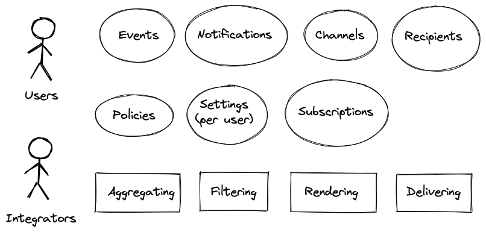

# North Star: Notifyd

This document explains the 'north star' of Notifyd, the future we wish for regarding our application(s).

This document is mostly meant to represent the functional design of Notifyd and a collection of words and concepts
(ubiquitous language) to aid during communication of future technical decisions.

Meaning if we keep the _North Star_ on the horizon, we know we're heading in the right direction.

## Mission

The purpose of the Notification team is to take events from the GitHub applications and deliver them as
notifications to our users.

## Notifyd Universe

Within the Notifyd Universe there's a few commonalities that emerge.

### Actors
Notifyd operates with two distinct actor types.
- Users: _End users dealing with notifications in GitHub Applications_
- Integrators: _Developers dealing with the Notifyd API platform_

### Entities
- Events
- Channels
- Recipients
- Notifications
- Policies
- Settings
- Subscriptions

### Operations
- Aggregating
- Filtering
- Rendering
- Delivering

## Operational flow
- **Events** are received from GitHub Applications (i.e. GitHub.com, Authnd, etc)
- Notifyd needs to **aggregate** the **recipients**
  - explicitly from those sent in **events**
  - but also from **subscribers**
- Notifyd needs to **filter** the **recipients** 
  - by using **policies** (i.e. no spammy accounts, authorization check, etc) 
  - and **user settings** (i.e., disabled security alerts, push notification schedules, ignored repositories, blocked users, etc)
- Notifyd sends the approved **events** and **recipients** to **channels**.
- **Channels** need to **filter**, **render** and **deliver** the **notifications** to **users**.

### Pipelines
We've chosen to use the architectural concept of pipelines to fulfill these requirements.
This also means that we're separating channels, specifically the services that support them, both 
functionally and technically.

## Further reading
Applications
- [Goals](goals.md)
- [Fundamental Requirements](fundamental-requirements.md)
- [How do we prioritize](how-do-we-prioritize.md)
- [Development](development.md)
- [Deployment](deployment.md)
- [Glossary](glossary.md)

Team
- [How do we work](how-do-we-work.md)
- [How do we prioritize](how-do-we-prioritize.md)
- [Communications diary](communications-diary.md)
- [Learning resources](learning-resource.md)
