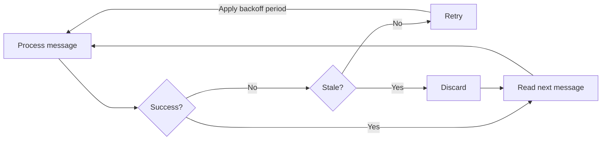
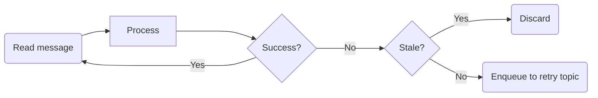
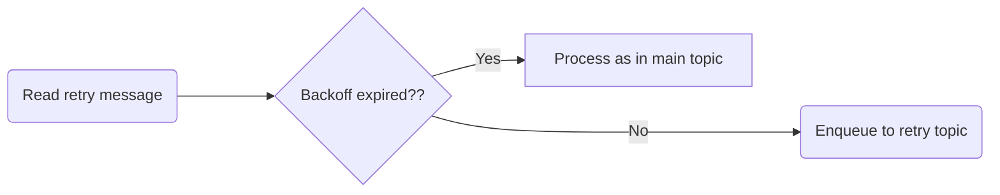
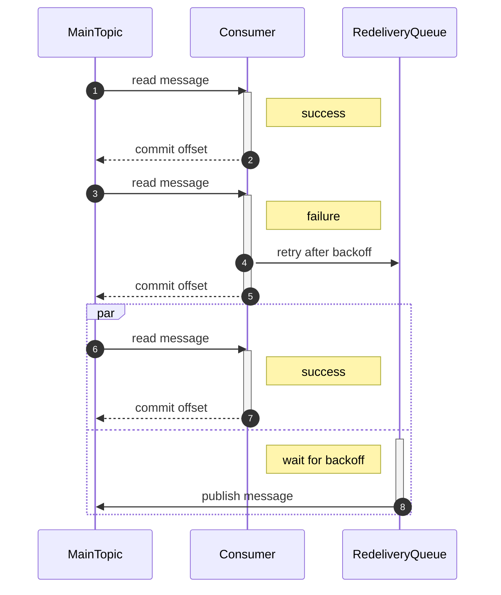
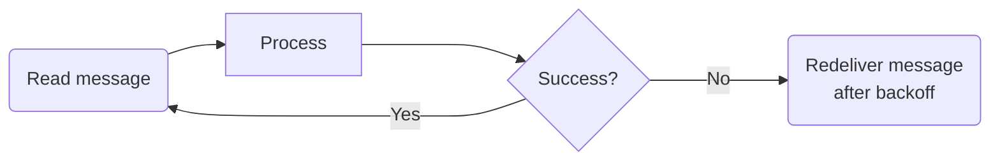
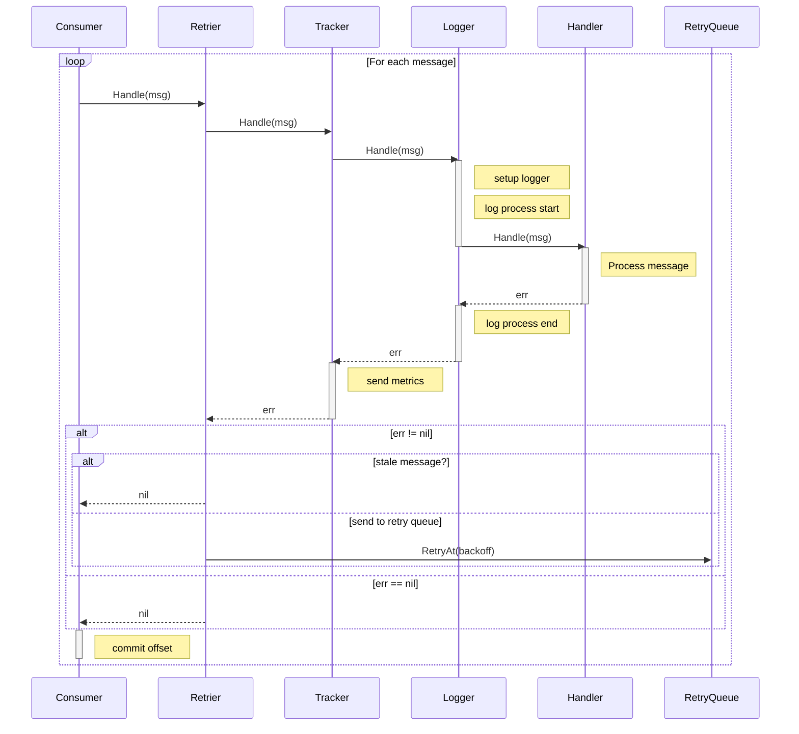

# [Proposal] Improve our message loss story

## Brief

This proposal comes after an exploration phase where we've been inspecting our metrics and evaluating our possibilities in the following issues.

- [Exploration on fault tolerance][fault-tolerance] Where we explored the state of our system, the existing fault points and the alternatives that seemed worthy of investing.
- [Exploration on fault metrics][fault-metrics] Where we explored our metrics in order to decide next steps. As a result we decided to invest on reducing message loss in case of transient issues.

## Overview

As outlined in the previous issues the goal is to improve our message loss story. TL;DR whenever one of the downstream services or dependencies has an outage or a trainsient network issue happens, we end up loosing messages.

Given our calculations are accurate we expect that by applying this we get rid of ~9/10 errors we see in the application and significantly reduce our message loss.

The solutions proposed here are not meant to be a silver bullet. Instead our goal with them is to iteratively improve our isolation from issues that might surround our service and ultimately have a mostly self-healing system where alerting is a last resource.

At the same time they only take into account our pipeline of consumers and leaves out our twirp API.

As such this proposal also includes a part that outlines a strategy to gather relevant metrics to confirm the progress on our objective.

## Preface

In order to enable retries on notifyd there are some technical requirements that need to be taken into account.

- When to retry?
- How do we apply backoff?
- How many times to retry?

## When to retry?

Let's first define what a retriable error is for our use case:

> An error is retriable when not retying would mean dropping a notification and retrying it wouldn't risk a duplicated notification.

For the purpose of this document we'll consider as retriable erros:

- Read only operations - A failing request to authzd, a checker, or reading the list of tokens for a user.
- Canceled contexts. Those happen when our consumers detect that the program needs to halt processing because of a timeout, a restart or some other reason. We don't implement this practice yet but we should start considering it sooner rather than later.
- Idempotent write operations - those where the same input would produce the exact same output without duplicating notifications. There are no examples of those right now in our pipeline.

At the same time we consider non-retriable errors:

- Any write operation that would either be non-idempotent or produce a duplicated notification. Some examples: sending a push notification when we can't clearly identify if the notifications have been delivered or not.

With that in mind we might want to extend our `errors` package with an `errors.Retry(err, msg)` function. The purpose of this function is to mark an error as retriable and let lower layers indicate to upper layers whether an error should be retried or not.

An example implementation could look like:

```go
type retriable struct {
	error
}

func (r *retriable) Unwrap() error {
	return r.error
}

func Retry(err error, msg string) error {
	return &retriable{errors.Wrap(err, msg)}
}

func IsRetriable(err error) bool {
	var retriableErr *retriable

	return errors.As(err, &retriableErr)
}
```

An inner layer that receives an error response from a downstream service can easily mark it as retriable by using the `errors.Retry` function like:

```go
if err != nil {
  return errors.Retry(err, "checking recipient authorization")
}
```

`errors.Retry` effectively works like `Wrap` as described in [Go 1.13][go-113] except that it also marks the error as retriable. That's why in the example implementation we also provide an implementation for `Unwrap() error`

## How do we apply backoff?

Our [initial exploration][fault-tolerance] didn't include a backoff, it would, however be a critical part of the system as otherwise could be retrying during an incident without leaving enough time for it to recover.

Our [hydro client][hydro-client-go] doesn't provide a built-in backoff strategy, neither does the [underlying library][sarama-config] it uses to communicate with kafka (We can tweak its `sarama.Config` but it doesn't include any retry relevant to us, all the mentions to retry are related to the  client itself and how it communicates with kafka)

### 1. Naive approach

A naive implementation could be to "sleep" the consumer processes to introduce the backoff but this would mean halting the notification processing during this time, which would increase the latency. In our case this would look like:




This implementation would leave our consumer locked on the retry loop for as long as the message succeeds or becomes stale (see next section), which would have a negative effect on our latency SLO.

At the same time this would risk delivering notifications twice because once a message is not commited after a given period, kafka assumes the consumer has dissapeared and produces a rebalance, that would mean the message would then be repolled by another consumer, redelivering the same notification again.

### 2. Using kafka

Most of the bibliography on this aspect ([link][kafka-retries-1], [link][kafka-retries-2], [link][kafka-retries-3], [link][kafka-retries-5], [link][kafka-retries-5], [link][kafka-retries-6]) proposes patterns that rely directly on using kafka at a low level in order to achieve it, that would be possible through [sarama][sarama], but it would still require a level of expertise with Kafka we don't have at the moment.

The most common pattern proposed seems to be using a series of retry topics that then pause processing while they sleep for the necessary backoff period.

Given that, we would need to redesign notifyd on top of sarama instead of hydro-client-go in order to be able to use a backoff period.

Some frameworks like spring in Java include specific tooling to implement this kind of retries, on our case, however, we would be on our own. That would mean:

- Implement the low level pause/retry control with [sarama][sarama]
- Handle the multiple retry topics that are, at least, as many as the main topics.
- Handle, at least, as many retry consumers as main consumers (+instrumentation +their infrastructure/deploy, etc.)

There are however some interesting points on the patterns proposed in these articles that can be interesting to us:

- Most of them use auxiliar kafka topics to apply the backoff.
- The result of discarding a message is sending it to a DLQ (Dead Letter Queue) where they are not processed, but instead await for human inspection and debugging.

**Pros**
- It would give us a low level direct control over kafka that would give us a lot of freedom.

**Cons**
- The engineering, infractructure and architecture costs are high compared to the other options.

### 3. Re-enqueue for backoff

Another alternative that is within our reach could be to use an auxiliary topic to apply the backoff and perform the retries. Given that, the main topic would work as:



The retry topic, would work in the same way as the main topic, its logic would be the same and it would implement the exact same business logic. The only difference is that it would be wrapped  with a middleware to handle retries.

This middleware would have the ability to handle the retry logic in a way that should be agnostic to the message it is handling.



**Pros**

- It would be relatively easy to implement and apply on existing consumers
- The retry consumers would be able to reuse the same code if we are able to configure the stack of middlewares and the topic to read on the application startup.

**Cons**

- We would need an extra topic for retries on each one of the consumers we would want to use retries.
- I'm not sure about the effect that continously requeueing messages into kafka in order to wait for a backoff period would have. My concern is mainly related to the growth in size it could cause on the retry topic.

  I've seen similar patterns used in the past in background workers for rails and although it wasn't a huge issue I'm skeptic this would hold the scale of load that GitHub notifications hold, mainly because of all the noise that the backoff requeues produce.

### 4. Use a re-deliver queue for backoff

Inspired on the previous design and in the spirit of refining on its cons, an alternative that we could aspire to use with the tools that hydro/aqueduct put at our hands is to use a redelivery queue.

In particular, aqueduct has a `deliver_at` mechanism that would allow us to specify a dely in which we want messages to be reprocessed. This would give us backoffs without the cost of their implementation.

At the same time we could have a topic-agnostic aqueduct worker that would receive as parameters:

- The topic to send for reprocessing
- The message to redeliver
- The retry information (TTL in order to decide if a message is stale or not)

That would be something of the sorts of

```protobuf
message Redelivery {
  // The topic we want to redeliver the message to
  string topic = 1;
  // The data of the message
  google.protobuf.Any msg = 2;
  // The TTL of the message, the number of retries or some other indicator to
  // avoid infinite retries
  int32 ttl = 3;
}
```

Alternatively this could use the [aqueduct bridge][aqueduct-bridge] to provide this same functionality wrapped with a protobuf envelop.

In essence it would work as in the following diagram. When a mesage fails, we enqueeue a redelivery `(4)` and continue processing `(7)/(8)` in parallel, when the backoff period has expired, aqueduct will redeliver the message to kafka `(6)`



That way we would only care about the cost of a single extra topic. The main topic would work as usual, except in the case of failure.



The redeliver queue would be fairly trivial as it would only work as a router:

1. Read a message.
2. Find its topic.
3. Redeliver the message to the topic updating TTL.

**Pros**:

- Similar to the previous option.
- Cheaper as we would only need an extra topic, for the redelivery queue.

**Cons**:

- We introduce a new piece on the stack that uses a different technology (aqueduct), but at the same time is a well known technology inside GitHub, so the risk is minimal.

### Conclussion

Options `1.` is a faulty option. It doesn't solve the problem and is only valid in the sense that it help us understand the problem better.

Option `2.` is more complete and might be applicable on different circunstances. However its cost, given our current state, the current stack we use and our achitecture is too high compared to options `3.` and `4.`.

Option `3.` has a risk related to how the system would react to numerous requeues + the cost of extra topics and extra infrastructure and monitorization for it.

Option `4.` reduces that risk by using a known solution inside GH for it and reduces the cost to a single auxiliary topic.

Given that option `4.` looks like a fair choice with option `3.` as a backup and options `2.` as a 2nd backup in case others result inapplicable, but taking into account that the investment it requires might grow.

## How many times to retry?

No matter how we retry, we don't want to retry endlessly, we want it to have some boundaries and stop once we are able to assess the notification is unsendable or stale.

If we check at newsies, the current retry strategies are varied, but we can grab some inspiration from them:

```ruby
# For web/email notifications
retry_on(
  *DATABASE_UNAVAILABLE_EXCEPTIONS,
  JobInterrupted,
  wait: :exponentially_longer,
  attempts: 20,
)

# For mobile pushes the behaviour is inherited from `ApplicationJob`
retry_on Freno::Throttler::Error, wait: :exponentially_longer, attempts: 10
```
Ref: [link][newsies-retries] [link-2][push-retries]

the `:exponentially_longer` option, by checking on the rails' `ActiveJob` documentation, works as:

> :wait - Re-enqueues the job with a delay specified either in seconds (default: 3 seconds), as a computing proc that takes the number of executions so far as an argument, or as a symbol reference of :exponentially_longer, which applies the wait algorithm of ((executions^4) + (Kernel.rand * (executions^4) * jitter)) + 2 (first wait ~3s, then ~18s, then ~83s, etc)

This means that for a failed notification it can be processed up to ~45h after the causing event.

We might not want the same behavior on notifyd but those are the current boundaries and similar ones might make sense as a starting point, even when they might be easy to fix in the future.

Given that, we're safe to assume that on our current context it is safe to retry:

- **For email**: Up to 20 times with an exponential backoff (during _~45h_)
- **For push notifications**: Up to 10 times with the same exponential backoff (roughly during _~3h_)

Those are our uppper limits, in addition to that we need to explore with the authentication team if 2FA notifications need a special treatment since their validity could be shorter.

## A note on middlewares

I talk a couple of times about middlewares on this proposal and I would like to expand a bit more on the concept to clarify what I mean with it.

Middlewares are a concept heavily used in other parts of our architecture, like building our API handlers or configuring the monolith's pipeline for processing HTTP requests.

The only difference is that Go normally call those `handler` instead of middleware: https://github.com/github/notifyd/blob/30d53dbe8e2235f34ad64520bd1a56e7f39a17d0/internal/api/api.go#L123-L143

In our case they would use HOF (High Order Functions) to decouple the application logic from the business logic, some examples of these same pattern inside Go can be seen [here][example-handlers], where we build a stack of handlers to process our twirp requests.

Other well known implementation of this pattern can be seen on [Ruby's rack][rack] or on [Elixir's plug][plug]

## A note on metrics

In order to keep track of the effect of retries in the whole system we need new metrics.

Capturing those metrics can happen in different ways, by preference these should be agnostic to the consumer and reusable accross them. At the same time this might give us the opportunity to better encapsulate some of our other metrics by building a pipeline stack:



Here `Retrier`, `Tracker` and `Logger` are middlewares, while `Handler` is the business logic processor for that specific topic. All middlewares would keep the same interface and work in a similar way:

- Receive a message.
- Perform some action.
- Pass to the downstream layer.
- Read its return value.
- Perform some action.
- Return a value.

The specific order and functionality for those middlewares could be different but the idea stays: separate those responsibilities on encapsulated entities that handle business agnostic logic.


[aqueduct-bridge]: https://github.com/orgs/github/teams/engineering/posts/428
[example-handlers]: https://github.com/github/notifyd/blob/943765074213b2befe3545a37d4e210eb8945bc3/internal/api/api.go#L138-L143
[fault-metrics]: https://github.com/github/notifyd/issues/686
[fault-tolerance]: https://github.com/github/notifyd/issues/345
[go-113]: https://go.dev/blog/go1.13-errors
[hydro-client-go]: https://github.com/github/hydro-client-go
[kafka-retries-1]: https://evgeniy-khist.github.io/spring-kafka-non-blocking-retries-and-dlt/
[kafka-retries-2]: https://medium.com/naukri-engineering/retry-mechanism-and-delay-queues-in-apache-kafka-528a6524f722
[kafka-retries-3]: https://www.linkedin.com/pulse/kafka-consumer-retry-rob-golder/
[kafka-retries-4]: https://blog.devgenius.io/exceptions-and-retry-policy-in-kafka-6f0d3cf2c330
[kafka-retries-5]: https://www.wise.jobs/2021/06/17/teamwork-implementing-a-kafka-retry-strategy-at-wise/
[kafka-retries-6]: https://www.confluent.io/en-gb/blog/error-handling-patterns-in-kafka/
[newsies-retries]: https://github.com/github/github/blob/f18143a971bf9d96f1c410d09b55c2ebc62a5ebb/app/jobs/newsies/deliver_notifications_job.rb#L21-L26
[plug]: https://github.com/elixir-plug/plug
[push-retries]: https://github.com/github/github/blob/f18143a971bf9d96f1c410d09b55c2ebc62a5ebb/app/jobs/application_job.rb#L255-L256
[rack]: https://github.com/rack/rack
[sarama-config]: https://pkg.go.dev/github.com/Shopify/sarama#Config
[sarama]: https://github.com/Shopify/sarama
