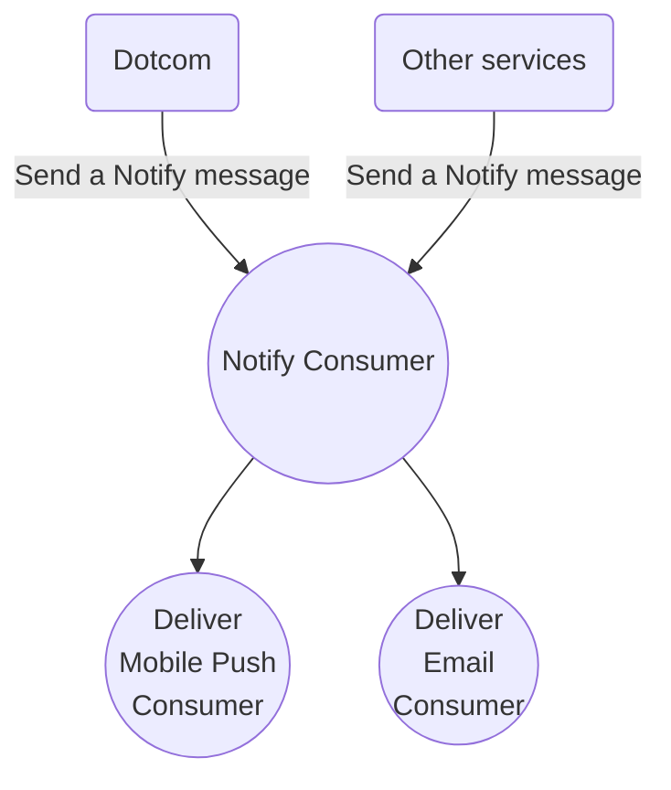
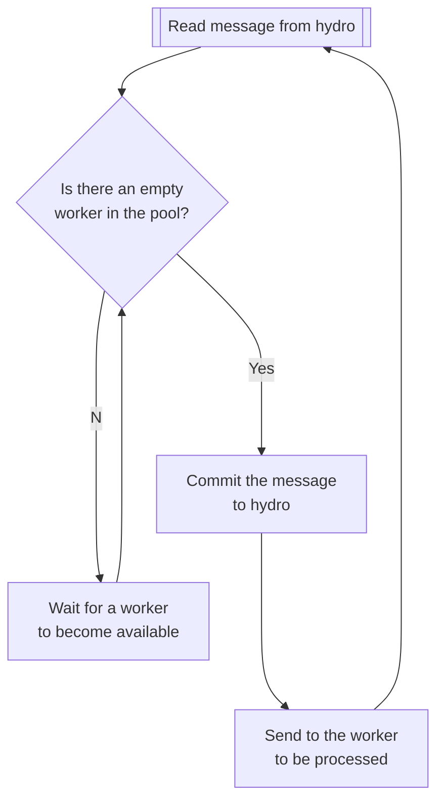

# [Proposal] Improve our pipeline scale

## Definitions

This document is better understood after defining some concepts beforehand.

- **Consumer**: A process that reads and process messages on a FIFO fashion from a single hydro partition.
- **Worker**: An entity in the code that can be assigned a message to be processed.

## Brief

One of our current goals in notifications is to move notifications traffic from newsies towards notifyd. This process starts with the CI activity as we have identified that as the lowest risk possible that allows us to move forward while improving `notifyd`. In terms of traffic we want `notifyd` to be able to deliver 600k emails/day.

There are two pillars to this migration, a functional pillar, where we make sure that `notifyd` covers the needed functionalities and a second pillar focused on making `notifyd` scalable enough to be able to take the extra traffic that it is going to receive.

This document focuses on the second pillar and it explains the challenges and proposes some possible solutions for our current setup.

## State of the art (What we have right now)

Our current architecture uses [hydro][5] to process messages. Hydro is built on top of kafka and behaves pretty similarly and shares most of the same benefits and drawbacks.

Our architecture uses a pipeline composed by three consumers to process incoming messages and delivering them to users in the form of push or email notifications.

For each received `Notify` message the `Notify` consumer qualifies the recipients for each one of the existing channel (at the moment mobile push and email)

A single `Notify` message can produce many different notifications. To properly scale and dimension our systems it would be useful to know the current rate at which a `Notify` message transforms on a message for each one of the channels. This could be possible for mobile pushes, unfortunately the mail system doesn't have enough traffic to transform it into significant metrics.

### Current problems

#### Wasted resources

Each one of our current pipelines operates over four kafka partitions. We recently discovered that for each one of our consumers we deploy 12 consumers (1 per region x 6 regions x 2 replicas). Given the way consumer groups work in kafka, this means 2/3 of our current operational power is wasted doing nothing. As an example for the [production group on the notify topic][6]

All the members with a `0` in the `Partitions` column are not consuming from any partition and they are just wasting resources.

Luckily our initial explorations show that we could just increase the number of partitions to 12 [here][7]

#### Head of line blocking

Given a partition in kafka, the message arriving into it are served 1 by 1 in a FIFO ordering, each message blocks the existing ones from processing until it is completed. You can learn more about it [here][8]

This poses many problems for the type of traffic that notifyd handles and their implications make our work harder, fundamentally because once a message is on a partition only the consumer assigned to that partition can pull messages from that partition. We have (as of today) a way to split the work on a partition among many workers.

Some examples:

##### 1. Blocked consumers

We've had cases of blocked consumers in the past. Those were caused by services or connections timing out and blocking the queue for bigger than usual amounts of time, growing the paratition Lag tremendously and causing a degradation of our SLOs.

We can't redirect the blocked messages to other consumers, so those have to wait until the blocking message times out or completes.

##### 2. Traffic overflows

We've not had any yet, but traffic could grow so much that it would overflow the consumers, making the queue grow faster than the consumers can cope with it.

This would mean that in case the traffic overgrows notifyd in a way where many messages are lagged, recovering would take as much time as all those messages take to process, even if we grew the number of partitions and consumers it would only affect new messages, locked messages would still need to be processed in the partition they were assigned in delivery and their latency SLO might be breached.

### The Math

As a first approximation, we can consider that the consumers follow the same model as an [M/M/1 queue][1], where each consumer behaves as a different queue.

I'll spare you the detailed maths (the [wikipedia article][1] or [this other site][14] explains it in good detail), but the summary is that for our consumers to be able to accept more traffic we need to make this formula return a number which is &rho; < 1

- &rho; = &lambda; / &mu; -> the system occupacy. We need &rho; < 1  so that the system is stable and new messages can be processed. A &rho; > 1 would mean that we would start accumulating unprocessed messages and breaching our SLOs.
- &lambda; -> is the rate at which messages arrive
- 1/&mu; -> is the mean time to process a message

This means we can increase the amount of traffic we read by impacting 2 parameters:

1. The rate at which a new message arrives to a consumer.
2. The rate at which messages are processed.

This proposal focuses on the first one, but also proposes some small things that can be done to increase the processing rate of the consumers. However it doesn't focus on fixing specific bottlenecks, specially for one of our [most important bottlenecks][2] found up to this moment.

### Some more maths

I said I would spare you the detailed maths... but some are needed.

Important parameters are:

Partition lag = Lq = &lambda;2 / &mu;(&mu; - &lambda;)

We can use this to calculate &mu; with some accuracy [like this][3]

Given that we can make the calculations for our 4 consumers. Take also into account that these are very conservative calculations, the partition lag is taken from as the biggest partition lag for all the partitions and &lambda; (rate of arrival) is taken as the maximum during peak hours of our system.

Other queue parameters, their explanation and how they are calculated can be found in this [queue calculator][4]

Let's now apply these to our consumers. Take these into consideration:

- Lq is the biggest mean partition lag for a consumer.
- &lambda; is the biggest message in rate (Like in [this example][9])
- Other numbers are obtained from splunk searches:
  - [Number of processed messages][10]
  - [Number of skipped messages][11]
  - [Messages with email layouts the end up delivering emails][12]
  - [Number of messages that do not include an email layout][13]

#### Notify consumer
- Lq = 0.92
- &lambda; &cong; 44 msg/s / 4 partitions = 11 msg/s
- 1 / &mu; &cong; 0.054 s/msg
- &rho; = 0.594

Some other relevant considerations about the notify consumer to understand its current size:

- The notify consumer processes around 2.2M of messages per day.
- Around 320K messages are skipped (unauthorized, self mentions, etc...)
- Around 1M do not include an email layout.
- Around 1.2M include email and push notification layout.

#### Deliver mobile push consumer
- Lq = 0.12
- &lambda; &cong; 23 msg/s / 4 partitions = 5.75 msg/s
- 1 / &mu; &cong; 0.050 s/msg
- &rho; = 0.2875

#### Deliver email consumer
- Lq = 0.004
- &lambda; &cong; 0.033 msg/s / 4 partitions = 0.0082 msg/s
- 1 / &mu; &cong; 0.13382 s/msg
- &rho; = 0.00441

Some more considerations to understand the size of the consumer.

- We deliver around 600 emails/day on peak traffic days.
- As of today the current email consumer could roughly accept 200 times more traffic (which is **not** enough for our goals).
- Real email traffic, for the beta phase, accounts for less than 0.05% of the whole traffic that notifyd processes.
- **NOTE**: We've recently improved the response time for the email postprocess RPC and &cong; halved it. We should update  these numbers accordingly.

If we multiplied our capacity in the deliver email consumer by more than 5, we would be able to hold &cong; 1000 times more traffic.

# Proposed solutions

## Selection criteria

We want a solution that ideally has the following properties:

1. Fair implementation cost. Meaning that it can be achieved with the resources available for the team and in a timely manner.
2. Flexibility. This means our ideal solution can hold not only for our current traffic and our goal traffic, but can also grow as needed.
3. Future proof. Even when we only have 3 consumers right now we expect to have more at some time (other channels or other asynchronous operations that we might need to handle). The solution we propose here can't be limited to those 3 consumers and should be adoptable by others.
4. Solves our known problems. Ideally it mitigates or solves the problems described above by the head of line blocking problem.

## A. Reducing &lambda; (AKA: Less messages for each consumer)

In this section we'll explore options to reduce the number of messages that each consumer processes.

### 1. Increasing the number of Partitions

The main parallelization technique in a system like ours (that backs queues with kafka) is increasing the number of partitions. Extra partitions would mean that the amount of work is spread among many more consumers, reducing the effect of the HoL blocking problem.

This would require us to:

1. Upgrade the relevant configuration [in hydro-schemas][16].
2. Increase the [number of replicas][15] to which we deploy our consumers.

This has 2 problems however:

1. We might want different levels of parallelization and scale for each consumer, to achieve that we would have to change our deploying configuration to individually deploy each one of the consumers.
2. The process to increase the partitions is one way only. Meaning we can't undo it.
3. It wouldn't shield us against traffic overflows, once traffic is assigned to a partition it can't be reassigned, so in case of a traffic overflow we'd have to wait and we would not be able to act.
4. It doesn't shield us against HoL blocking, although we would reduce the problem.

#### Conclusion

Given `3.` and `4.` this can be discarded as it doesn't solve our problem, only partially mitigates some issues.

### 2. Increasing the concurrency in the consumers

A second option that can be combined with the previous one is introducing worker pools on each consumer.

In this model each consumer would span a pool of workers of the desired level of concurrency (normally that's > 1).

Then the consumer would proceed as follow:

This would allow us to increase the level of parallelization inside each consumer as much as we want.

Some considerations:

1. While it could shield us against traffic overflows and HoL blocking issues, we wouldn't have a way to do so in the affected partitions, meaning that in case some partitions are affected by increases of traffic we would have to increase parallelization in all of them to solve the problem in one, wasting resources.
2. This can be combined with batch reading from hydro, however that would require a low level driver ([sarama][19]) as our current hydro client doesn't support it.
3. As @dev-time noted we would loose some of the guarantees that we that we get from aqueduct, like making sure that jobs are processed.

#### Conclusion

While this could mitigate things, it would still not solve the problems 100%, individual partitions could still be affected by issues and our ability to solve them would be minimal without wasting a lot of resources.

Short term this solution might have the biggest ROI.

A task breakup for this could be similar to:

- Build a pool of workers similar to the one we use for aqueduct retries right now.
- Study improving our deployment so that we have separated deployments rather than deploying all the consumers in the same pod as we do now. This would allow us to dimension each one separately and also improve configuration and the different environments a bit.
- Use it with parallelization 1 to make sure it work.
- Increase parallelization to 2, make sure throughput accordingly.
- Upgrade pod container setup regarding memory and CPU.

### 3. Migrate to aqueduct

Let's first start by taking one step back to understand our current situation.

The reasons we decided to build `notifyd` on top of hydro instead of aqueduct were outlined in [this ADR][17].

Given our understanding of `notifyd` as a system has grown some of those are not longer valid.

- While ordering can be desirable, the main issue with it are duplicates and they can be solved by tracking deliveries as we do now with the mobile pushes.
- The supposed scalability ceiling for aqueduct is not relevant. On conversations with the data pipelines team they even hinted that on a worst case scenario we could even consider a new cluster only for `notifyd`.
- The ability to process jobs in batches is not a requirement for `notifyd` and doesn't seem like it is going to be in the long term. @mrsimonfletcher hinted that something like that could be desirable if we ever decide to build a digest funcitonality. This could, however, be easily solved by spanning a separate hydro topic to which we publish the digestable content.

This means the reasons we decided to use hydro over aqueduct can be reevaluated and aqueduct becomes again a viable option.

The main benefits from this migration is that the whole system would share a single queue of jobs. The implications are that in case of traffic increases, we could just deploy a bigger amount of consumers or even increase parallelization if needed.

At the same time, since the system would become "pull based" (each worker pulls jobs to process them when it has capacity) we would no longer have to worry about partitions growing because of a locked worker. Reducing the effect of HoL blocking.

There's a [spike by @dev-tim][18] playing with this idea. The problem we face, however, is that the migration to aqueduct is not trivial and some questions need answers before it can be done:

- Message schemas: our hydro message have predefined schemas which are coded in protobuf, by just plainly migrating to aqueduct we would loose them. A  solution could be to use the aqueduct-bridge to keep the message schemas.
- Data warehousing: aqueduct provides data warehousing for messages, however the content of our messages is currently encoded as protobuf, this would mean aqueduct data warehousing wouldn't allow us to inspect our messages. This is again solvable through aqueduct-bridge.
- Migration: assuming that we will have the same message schemas as now, we can abstract our handlers to that they are 100% independent of hydro. However we would still need to make sure that a rollback is possible and doesn't imply halting service for customers.
  - Just deploying and then rolling back wouldn't work. The reason is that stopping processing for hydro would just accumulate messages on the partition. In case of rollback we would start processing all the accumulated messages, creating duplicates.
  - Given that, one of the options we could use is a different topic for aqueduct-bridge and control the topic to which we deploy with a feature flag from the monolith.
  - Migration has to be handled with the `authnd` project too, since they publish to the same topic.

A quick task breakup for this project could be similar to:

- Refactor handlers so that they can be used both for aqueduct jobs and hydro consumers.
- Improve the `WorkerPool` so that it can use any queue and the level of parallelization can be explicited (right now it is harcoded to use a pool of a single worker)
- Study improving our deployment so that we have separated deployments rather than deploying all the consumers in the same pod as we do now. This would allow us to dimension each one separately and also improve configuration and the different environments a bit.
- Setup a new hydro topic to use with aqueduct-bridge for everyone of our main topics.
- Modify the monolith and authnd so that they publish to the new topic or to the old one depending on a feature flag.
- Deploy the new workers with the feature flag enabled for a member of the team, check that it works and then enable the feature flag gradually o all the traffic.
- Remove the consumers once we are sure they are not handling traffic and all traffic in is properly handled through aqueduct properly + data warehousing is working as expected.
- Upgrade pod container setup regarding memory and CPU.

#### Conclusion

This might be the most expensive solution in the short term, but the one with the biggest ROI in the long term.

## B. Increasing &mu; (AKA: Reducing the latency on consumers)

These can be done independently of the other main topics (increasing parallelization in the consumers)

### 1. Applying stricter timeouts

Now that we have retries in place we can experiment with stricter timeouts. Those would avoid blocking workers as it happens now in case of transient errors.

At the same time we can put in place slow queues to process those retries and, in addition, bump the timeouts a bit on those cases.

### 2. Optimizing API/RPC calls

There are some tools that we are underusing right now that could improve our RPC calls:

- Authzd supports splitting batches, it is recommended for requests bigger than 50 authorizations and the benefit is that when splitting batches you only have to wait for the batch that has a longer duration.
- Batch check on the notify consumer is unsplittable right now, it could be easily split on the `notifyd` side to perform many calls instead of just one, also overcoming the problem we have right now with the batch limit.
- Deliver mobile push consumer performs many calls that can probably be batched in the same way.

## Out scope/Not our goal right now

### 1. Priority queues

While this is in our radar, it is not the goal of this proposal to build this feature right now.

It is important to note, however, that none of the described options would block us from doing this.

## General Conclusion

If we have to make a decision limited to the simpler solution that is cost effective right now, we might want to increase the level of concurrency in the consumers. While it doesn't fix 100% our problems it addresses many of those and can help us.

If we are not limited by budget, migrating to aqueduct looks like a more viable solution in the long term. It increases gives us more flexibility and it increases our operational capabilities thanks to the control aqueduct gives us.

Given that we want to solve our problems once and for all **I strongly advice to go for the aqueduct migration** as this would give us a stronger foundation for the future of notifyd.

[1]: https://en.wikipedia.org/wiki/M/M/1_queue "M/M/1"
[2]: https://github.com/github/planning-tracking/issues/952
[3]: https://www.wolframalpha.com/input?i2d=true&i=solve+equation+L+%3D+Divide%5BPower%5By%2C2%5D%2Cx%5C%2840%29x-y%5C%2841%29%5D%5C%2844%29+L%3D0.92%5C%2844%29+y%3D11%5C%2844%29+find+x
[4]: https://mathcracker.com/single-server-model-calculator "M/M/1 Queue calculator"
[5]: https://thehub.github.com/engineering/products-and-services/internal/hydro/ "Hydro"
[6]: https://hydro.githubapp.com/kafka/clusters/potomac/consumer_group?group_id=notifyd-production-notify-consumer&tab=members
[7]: https://github.com/github/hydro-schemas/blob/main/topic-configuration/production/potomac/notifyd.yaml
[8]: https://en.wikipedia.org/wiki/Head-of-line_blocking
[9]: https://app.datadoghq.com/dashboard/n77-d3g-dqh?fullscreen_end_ts=1651217636537&fullscreen_paused=false&fullscreen_section=overview&fullscreen_start_ts=1651214036537&fullscreen_widget=3794440682413830&from_ts=1651214023079&to_ts=1651217623079&live=true
[10]: https://splunk.githubapp.com/en-US/app/gh_reference_app/search?q=search%20index%3Dnotifyd%20kube_namespace%3Dnotifyd-production%20cmd%3Dnotify-consumer%20msg%3D%22processing%20message%22%20|%20stats%20count(eval(request_id))%20as%20requests&display.page.search.mode=smart&dispatch.sample_ratio=1&earliest=-24h%40h&latest=now&display.page.search.tab=statistics&display.general.type=statistics&sid=1651151425.105371_F2EA0199-868B-4D84-9505-FB920CF29063
[11]: https://splunk.githubapp.com/en-US/app/gh_reference_app/search?q=search%20index%3Dnotifyd%20kube_namespace%3Dnotifyd-production%20cmd%3Dnotify-consumer%20msg%3D%22skipping*%22%20%7C%20stats%20count(eval(request_id))%20as%20skipped&display.page.search.mode=smart&dispatch.sample_ratio=1&earliest=-24h%40h&latest=now&display.page.search.tab=statistics&display.general.type=statistics&sid=1651151650.105383_F2EA0199-868B-4D84-9505-FB920CF29063
[12]: https://splunk.githubapp.com/en-US/app/gh_reference_app/search?q=search%20index%3Dnotifyd%20kube_namespace%3Dnotifyd-production%20cmd%3Dnotify-consumer%20notification_id%3D*%20msg%3D%22email%20notifications%20published%22%20%7C%20stats%20count(eval(notifications_count!%3D0))%20as%20publishes_email_messages%2C%20count(eval(notifications_count%3D0))%20as%20does_not_publish_email_messages%2C%20sum(eval(notifications_count))%20as%20total_sum_of_email_messages_sent&display.page.search.mode=smart&dispatch.sample_ratio=1&earliest=-24h%40h&latest=now&display.page.search.tab=statistics&display.general.type=statistics&sid=1651217692.4256_F2EA0199-868B-4D84-9505-FB920CF29063
[13]: https://splunk.githubapp.com/en-US/app/gh_reference_app/search?q=search%20index%3Dnotifyd%20kube_namespace%3Dnotifyd-production%20cmd%3Dnotify-consumer%20notification_id%3D*%20msg%3D%22no%20layout%20found%3A%20skip%20sending%20emails%22%20%7C%20stats%20count(eval(request_id))%20as%20without_email&display.page.search.mode=smart&dispatch.sample_ratio=1&earliest=-24h%40h&latest=now&display.page.search.tab=statistics&display.general.type=statistics&sid=1651217714.4259_F2EA0199-868B-4D84-9505-FB920CF29063
[14]: https://eventhelix.com/congestion-control/m-m-1/
[15]: https://github.com/github/notifyd/blob/17370c7d561511cccaaf989b21ddf224537751f4/config/kubernetes/default/deployments/notifyd-consumers.yaml#L8
[16]: https://github.com/github/hydro-schemas/blob/87b032f4a6487bfcdc04efa9b28937b7fa37783d/topic-configuration/production/potomac/notifyd.yaml#L3
[17]: https://github.com/github/notifyd/blob/main/docs/adr/0010-use-hydro-consumers-not-aqueduct-jobs-for-notification-delivery-inter-process-messaging.md
[18]: https://github.com/github/notifyd/pull/1060
[19]: https://github.com/Shopify/sarama
