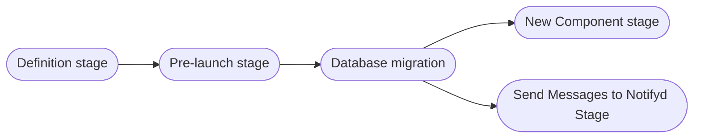
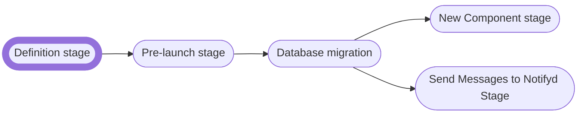
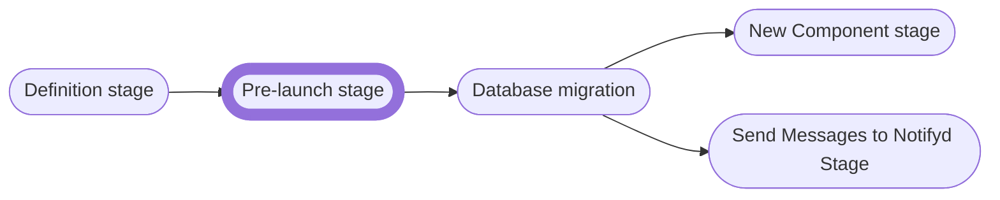
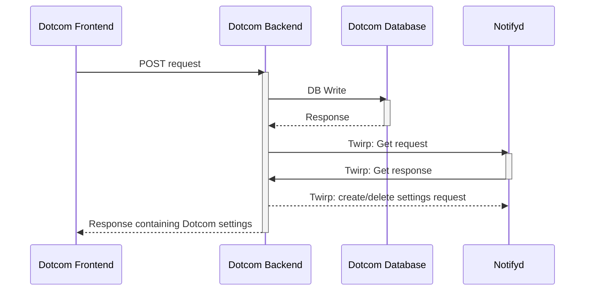
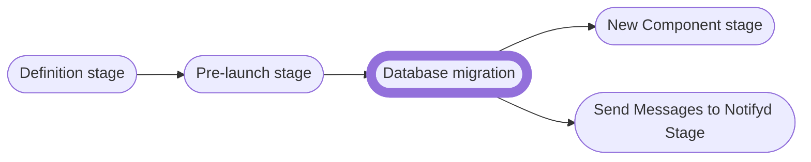
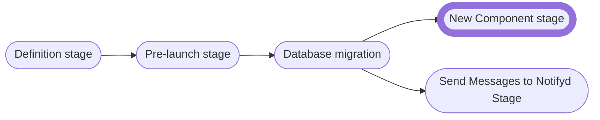
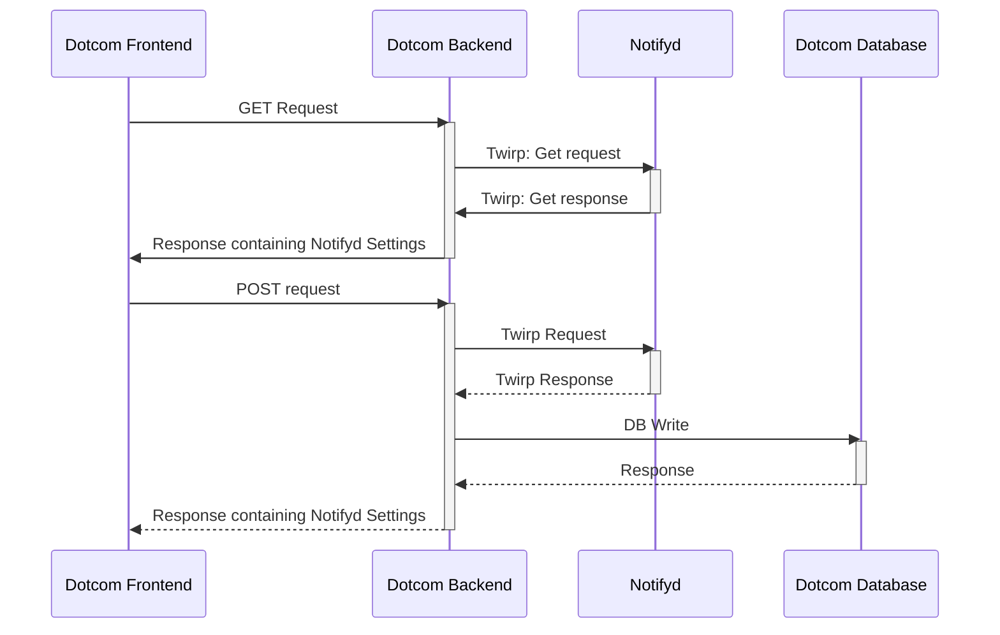
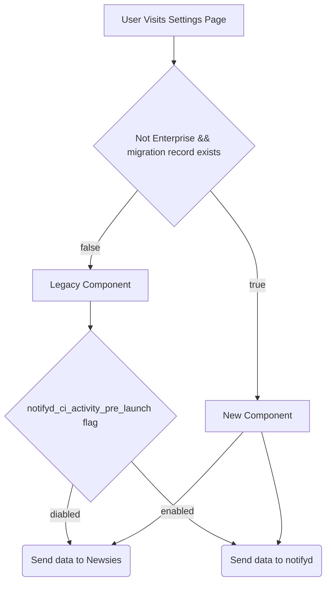
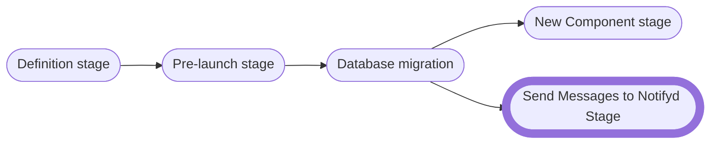
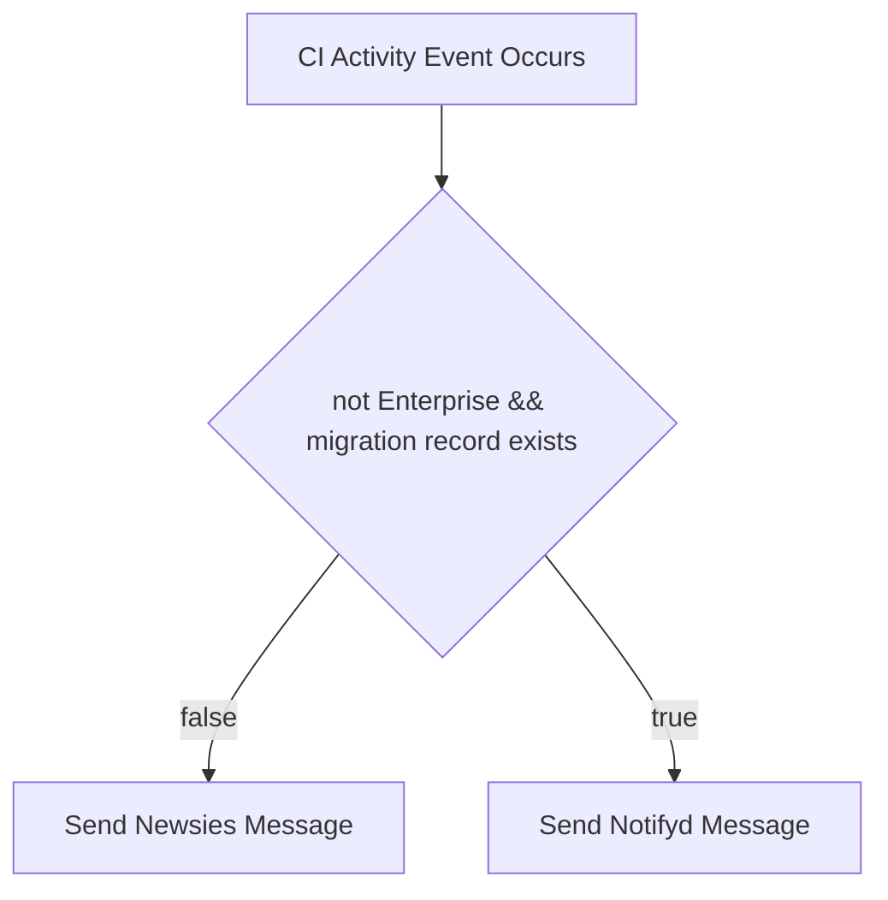

# [Proposal] CI Activity Settings Synchronization

## Brief

[CI Activity Settings Synchronization](../briefs/ci-activity-synchronization.md)


## TLDR
We will migrate users in 3 main groups - Notifyd Team, Github Staff and Other Orgs, All Users 
Notifyd Team. For the first two groups we will:
1. Enable the `notifyd_ci_activity_pre_launch` flag for the group
1. Show Pre-Launch component to the group with the `notifyd_ci_activity_pre_launch` flag
1. Run database migration to keep track of the group
1. Enable `notifyd_ci_activity_enable_ci_activity` flag for migrated users to Show New Component and Send Via Notifyd

For the third group, we will modify the process to account for the size of the migration.

### Overview

Currently, notifyds support CI Activity email notifications. Dotcom can send Check Suite and Workflow Run Approval messages to notifyd, and notifyd can send emails to users. Notifyd's routing system data model also supports storing delivery settings, but there's still no API built around it and users cannot yet configure these delivery settings.

This proposal defines a path for ensuring that users can configure email delivery settings on the [CI Activity notification settings page](https://github.com/settings/notifications). There are several ways to do this, but this proposal focuses on making notifyd the owner of the data. To achieve this goal, we will need to safely:

1. Migrate users' existing settings to notifyd
1. Keep users' CI Activity email settings synchronized between Newsies and notifyd until Newsies CI Activity email notifications are fully deprecated

#### Discarded alternatives

Decouple delivery from data ownership by making notifyd read setting from Newsies as an intermediate step.

PROS:
- Data ownership and delivery would be decoupled and both can be rolled out independently.
- Repeat migration processes in case of desynchronization.

CONS:
- Switch over needs to be made explicitly.
- More moving parts involved and thus bigger risk of errors.
- Deferring the risks instead of tackling them at the beginning.

### Proposed solution



The proposed solution for the CI Activity settings migrations is a series of steps we can apply to subsets of users.

1. **Definition stage** - define a subset of users to migrate
1. **Pre-launch stage** - allow the subset of users to toggle Notifyd settings but do not display settings and do not send CI Activity emails via notifyd
1. **Database migration** - run a database migration to transfer Newsies settings to notifyd
1. **New Component stage** - show users a new component that displays notifyd settings
1. **Send Messages to Notifyd stage** - enable Notifyd emails for users and disable Newsies for CI Activity

#### 1. Definition Stage



The first two subsets of groups that will have routing settings migrated are:

1. the Notifyd Team
1. Internal Github Users - preview_features group see [Feature Flag groups for more information](https://thehub.github.com/epd/engineering/products-and-services/Dotcom/features/feature-flags/groups/)

During this stage, we will enable a feature flag for each group called `notifyd_ci_activity_pre_launch` We will later use this flag to determine which users should pass through the database migration stage. 

#### 2. Pre-launch stage



This stage focuses on creating a way for users to edit CI Activity settings on notifyd from Dotcom. After this stage, users should be able to toggle CI Activity settings on both systems but will continue to see the Dotcom data. Allowing the toggling of routing settings before the database migration stage has three benefits:

1. allows the team to toggle and test routing settings before initializing a migration to ensure the system works
1. can prevent race conditions while the database sync is running. for example, if a user saves their settings after their migration is finished, but we are not showing the new data yet
1. We can enable Pre-launch for all users to de-risk and test notifyd settings changes at scale
1. Can cover any remaining users that are created after the final migration occurs but the routing mechanism hasn't been removed yet. 



**Error handling**: we should begin to track if requests to notifyd fail, but we will not raise an error message to the user nor retry requests to notifyd. The purpose of the Pre-launch stage is to test and de-risk the process of saving configuration data to notifyd.

**Enterprise considerations**: Enterprise cannot use notifyd, so we should use an Enterprise and a feature flag check to prevent sending messages to notifyd

**Feature flag**: `notifyd_ci_activity_pre_launch`

##### Modeling CI Activity Notifications in Notifyd

The CI Activity settings have three potential states

**A. Only CI Activity Failures (Default)**
As the default, this option should have no record in the database if the user has never changed their CI Activity email settings. Instead, if notifyd does not find any routing settings for `ci_activity` in the database, then the system should assume that the user only wants to receive CI activity failures via email. This approach does embed integrator logic in notifyd, but the team has decided to accept the technical debt. Using a default means that we will not require every user to have a record in the database for the default behavior. The team is also planning to create a system for integrators to configure default settings in the future, which should remove integrator-specific logic from notifyd.

If a user has interacted with the CI Notification email setting in notifyd, then the Monolith will update the record to the setting below.

```ruby
{
    user_id: 1,
    name:   "Receive Only Failed CI Activity",
    channels: {email: true},
    topics: {type: "any", value: "any"},
    filters: [
        {
            reason: "ci_activity",
            match_rules: [
                {attribute: "failed", value: "true", match_rule: "eq"}
            ],
        },
        {
            reason: "approval_requested",
            match_rules: []
        },
    ],
    custom_fields: [
        {name: "delivery_group", value: "ci_activity"}
    ]
}
```


**B. All CI Activity**

Routing settings match all CI activity without matching rules

```ruby
{
    user_id: 1,
    name:   "Receive All CI Activity",
    channels: {email: true},
    topics: {type: "any", value: "any"},
    filters: [
        {
            reason: "ci_activity",
            match_rules: [],
        },
        {
            reason: "approval_requested",
            match_rules: [],
        },
    ],
    custom_fields: [
        {name: "delivery_group", value: "ci_activity"}
    ]
}
```

**C. No CI Activity**
Routing settings match all CI Activity without match rules, and channels are disabled.

```ruby
{
    user_id: 1,
    name:   "Receive No CI Activity",
    channels: {email: false},
    topics: {type: "any", value: "any"},
    filters: [
        {
            reason: "ci_activity",
            match_rules: []
        },
        {
            reason: "approval_requested",
            match_rules: [],
        },
    ],
    custom_fields: [
        {name: "delivery_group", value: "ci_activity"}
    ]
}
```

**D. No CI Activity, enable failure only filter**

This use case isn't different from the previous one from the notifyd standpoint, but it's needed for Web Notifications Newsies compatibility,
as the failures only filter is shared between email and web notifications.
As a result, even if the user doesn't want tor receive email notifications, we must allow in our settings to distinguish when failures only is checked.
We use the same matching rule for that.


```ruby
{
    user_id: 1,
    name:   "Receive No CI Activity, failed only filter enabled",
    channels: {email: false},
    topics: {type: "any", value: "any"},
    filters: [
        {
            reason: "ci_activity",
            match_rules: [
                {attribute: "failed", value: "true", match_rule: "eq"}
            ],
        },
        {
            reason: "approval_requested",
            match_rules: []
        },
    ],
    custom_fields: [
        {name: "delivery_group", value: "ci_activity"}
    ]
}
```

##### Monolith settings to Database

Below is an example of how to model two different user settings in notifyd's database

```ruby
{
    user_id: 1,
    name:   "Receive No CI Activity",
    topics:  {type: "any", value: "any"},
    channels: {email: false},
    filters: [
        {
            reason: "ci_activity",
            match_rules: [],
        },
        {
            reason: "approval_requested",
            match_rules: [],
        },
    ],
    custom_fields: [
        {name: "delivery_group", value: "ci_activity"}
    ]
}
```

```ruby
{
    user_id: 2,
    name: "Receive All CI Activity",
    channels: {email: true},
    topics: {type: "any", value: "any"},
    filters: [
        {
            reason: "ci_activity",
            match_rules: [],
        },
        {
            reason: "approval_requested",
            match_rules: [],
        },
    ],
    custom_fields: [
        {name: "delivery_group", value: "ci_activity"}
    ]
}
```

```ruby
{
    user_id: 3,
    name:   "Receive Only Failed CI Activity",
    channels: {email: true},
    topics: {type: "any", value: "any"},
    filters: [
        {
            reason: "ci_activity",
            match_rules: [
                {attribute: "failed", value: "true", match_rule: "eq"}
            ],
        },
        {
            reason: "approval_requested",
            match_rules: [],
        },
    ],
    custom_fields: [
        {name: "delivery_group", value: "ci_activity"}
    ]
}
```

```ruby
{
    user_id: 4,
    name:   "Receive No CI Activity, failed only filter enabled",
    channels: {email: false},
    topics: {type: "any", value: "any"},
    filters: [
        {
            reason: "ci_activity",
            match_rules: [
                {attribute: "failed", value: "true", match_rule: "eq"}
            ],
        },
        {
            reason: "approval_requested",
            match_rules: []
        },
    ],
    custom_fields: [
        {name: "delivery_group", value: "ci_activity"}
    ]
}
```


**meta_routing_settings**

| id | user_id | name | details |
|----|---------|------|---------|
|  1 |    1    |  Receive No CI Activity    |   JSON Above     |
|  2 |    2    |  Receive All CI Activity    |    JSON Above     |
|  3 |    3    |  Receive Only Failed CI Activity    |    JSON Above     |
|  4 |    4    |  Receive No CI Activity, failed only filter enabled | JSON Above |


**routing_settings**
| id | user_id | topic_type | topic_value | subject_type | trigger | reason      | meta_id |
|----|---------|------------|-------------|--------------|---------|-------------|---------|
| 1  | 1       | any        | any         | any          | any     | ci_activity | 1       |
| 1  | 1       | any        | any         | any          | any     | approval_requested | 1       |
| 2  | 2       | any        | any         | any          | any     | ci_activity | 2       |
| 2  | 2       | any        | any         | any          | any     | approval_requested | 2       |
| 3  | 3       | any        | any         | any          | any     | ci_activity | 3       |
| 3  | 3       | any        | any         | any          | any     | approval_requested | 3       |
| 4  | 4       | any        | any         | any          | any     | ci_activity | 4       | 4
| 4  | 4       | any        | any         | any          | any     | approval_requested | 4       |

**routing_setting_match_rules**
| id | user_id | routing_setting_id | attribute | value | match |
|----|---------|--------------------|-----------|-------|-------|
| 1  | 3       | 3       |    failed  | true  | eq    |
| 2  | 4       | 4       |    failed  | true  | eq    |

**routing_setting_channels**
| id | routing_setting_id | channel | enabled |
|----|--------------------|---------|---------|
| 1  | 1                  | email   | true    |
| 2  | 2                  | email   | false   |
| 3  | 3                  | email   | true   |
| 4  | 4                  | email   | false   |


**routing_setting_custom_fields**
| id | user_id | meta_id   | name | value  |
|----|---------|-----------|------|--------|
| 1 | 1       | 1 | delivery_group    | ci_activity |
| 2 | 2       | 2 | delivery_group    | ci_activity |
| 3 | 3       | 3 | delivery_group    | ci_activity |
| 4 | 4       | 4 | delivery_group    | ci_activity |

##### Modeling Risks

- The way we model CI Activity settings may change moving forward; we can mitigate the risk by ensuring that the default action does not require an entry in the database
- CI Activity includes two reasons `ci_activity` and `approval_requested`, which means that our routing settings require two filters instead of 1. We may want to find a better way of grouping events than reasons before committing to a large-scale database migration, so we don't have to duplicate migration efforts
- We are still working on sharding. A change in how we approach sharding may affect how we model the data and force us to apply a database transition

#### 3. Database Migration stage



##### Migration Algorithm

There are around [87 million users in the database](https://data.githubapp.com/sql/b12ec61d-5157-48c3-b81f-b4c4cc5519e1?query=SELECT%20%2A%0AFROM%20hive.snapshots_presto.users%0ALIMIT%2010#!schemas-tab:hive.snapshots_presto.users), but only [10 million have `notification_user_settings` records](https://data.githubapp.com/sql/29329551-cb6e-43a5-b53a-132e5f00a16a?query=SELECT%20%2A%0AFROM%20hive.snapshots_presto.users%0ALIMIT%2010#!schemas-tab:hive.snapshots_presto.users). Since 2016 the monolith only adds `notification_user_settings` records for users that have edited any of the settings on the settings page. Given the facts above, we need to check that each user has a record in the `notification_user_settings` before creating a record in the database. Below is the algorithm that our migration code should follow

```
For each user in a batch:
    if user has a record in the `notification_user_settings` table and user has no routing settings record for CI activity:
        - Create a record in notifyd
            On Success: continue
            On Failure: log user failure for closer inspection
```

##### Dealing with slow migration time
We can use the same Twirp endpoint that the Dotcom monolith uses to create records in Notifyd for the first two groups of users (Notifications Team and GitHub employees). This approach will not scale to 11 million users, but we are deciding to incur the technical debt for future iterations. 

The data we collect from this small sample will help us determine the time it will take to migrate the additional 11 million users. Depending on the results, we may choose to explore the following options for migrating users

1. A direct database connection
1. Batching parallel twirp calls

#### 4. New Component stage



This stage focuses on displaying Notifyd settings to users. We will build a new CI Activity Notifyd UI component to display settings. The new UI component replaces the entire CI Activity Settings section on the notification settings page. This component will look identical to the existing section but will behave differently in the following ways:

1. The new component will be loaded asynchronously using a [include-fragment-element](https://github.com/github/include-fragment-element) to avoid blocking the settings page load while it retrieves data from notifyd.
1. The checkboxes for `Email` and `Send notifications for failed workflows only` will change settings for both Newsies and routing settings for notifyd (this may require a new controller function)
1. The checkboxes for `Email` and `Send notifications for failed workflows only` will only display routing settings from notifyd (this may require a new controller function)
1. The `web` checkbox will continue to toggle and display Newsies settings.



**Error Handling**:

- If a request to notifyd fails, we log and display an error but do not update the Dotcom database
- If a Dotcom database write fails, we log an error but do not display it to the user

When we migrate the first two groups, we will not attempt to use retries or other ways to guarantee success; however, before starting a general migration, we should have some redundancy mechanisms to ensure that settings are updated. 

**What component to show on settings UI**



This new component will require substantial duplication of the Newsies system but will provide a safe area for our team to develop new features without affecting the legacy system.

**Enterprise considerations**: Enterprise cannot use notifyd, so we should use an Enterprise and feature flag check to prevent sending messages to notifyd. Enterprise will also continue to use the legacy component.

**Feature flag**: `notifyd_ci_activity_enable_ci_activity`

#### 5. Enable Notifyd Stage



We can enable notifyd after we migrate users. To ensure that there are no dropped or duplicate emails; we will need to set a flag at all places where the monolith sends CI Activity notifications to Newsies. When the flag is enabled, emails will go notifyd and vice versa.

**When to send a recipient's message to Newsies vs Notifyd**



##### Risk of missing messages

There is a possibility that the number of messages sent through Notifyd does not match the number of messages sent via Newsies. To handle the possibility that the new system misses messages, we should:
1. double-check that the notification business logic matches in both notifyd and Newsies' paths
2. add tooling to both paths to determine how many messages are sent from Notifyd and how many messages should have been sent from Newsies

After the initial two groups, we should expect the counts of Notifyd messages and potentially sent Newsies messages to be the same. 

##### Potential Rollback and Syncronization Issues

We will continue synchronizing users' CI Activity settings after they are migrated to Notifyd in case we revert to Newsies. We recommend that we continue the synchronization for a few months after all the users have CI Activity emails migrated to notifyd. The longer this synchronization lasts, the greater the chances of a synchronization issue occurring. At this point, it's unclear what the failure rate will be, but we can add observability tooling to track problems. The main two paths where we should add tooling are:

1. When a user loads the settings page - we should compare if the Newsies and Notifyd settings are the same
1. When a user saves the settings - we should track if there is a failure in either of the saves

If the failure rate of saving settings is lower than four nines, we may choose to ignore the synchronization issues. If the failure rate of saving settings is higher than four nines, we should make the saving methods more resilient and consider additional database migrations.  

**Enterprise considerations**: Enterprise cannot use notifyd, so we should use an Enterprise and a feature flag check to prevent sending messages to notifyd

**Feature flag**: `notifyd_ci_activity_enable_ci_activity`

## Conclusion

This proposal describes a process for migrating users' CI Activity email settings from Newsies to notifyd. The first two groups of users, the Notifications team and GitHub employees, do not require the granularity that this proposal describes. Nonetheless, we think it's essential to establish and test a pattern that will work for migrating all users so that we can validate the same process will work on a larger group. If this migration process successfully migrates CI Activity email settings,  it can also serve as a template for other settings migrations in the future.
