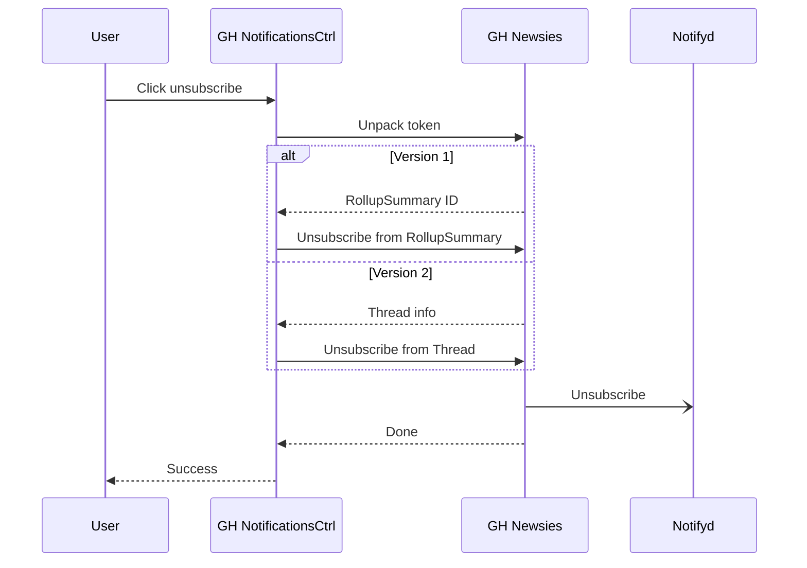
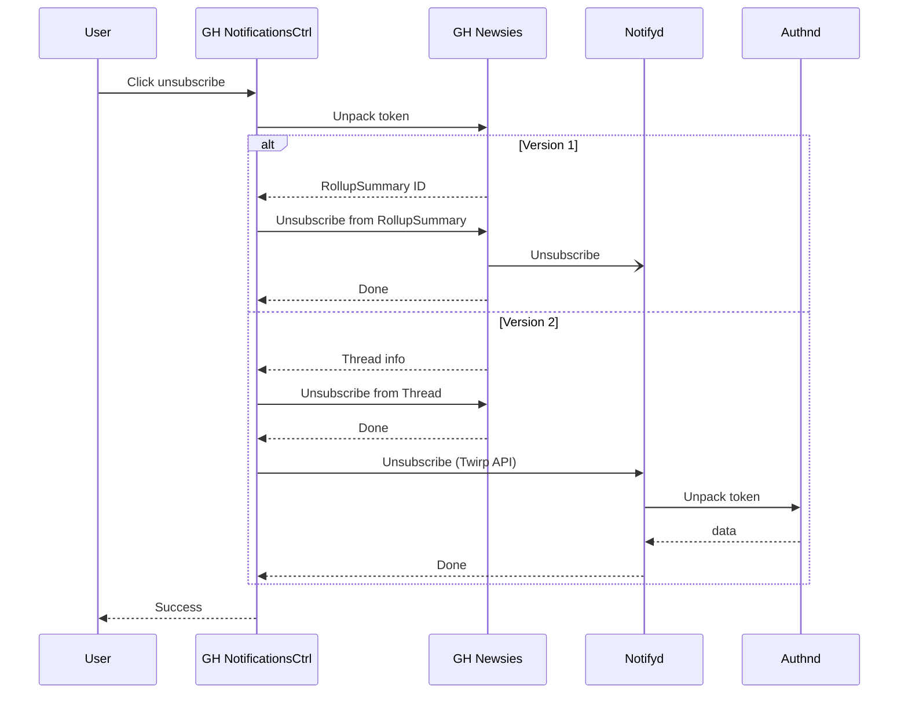
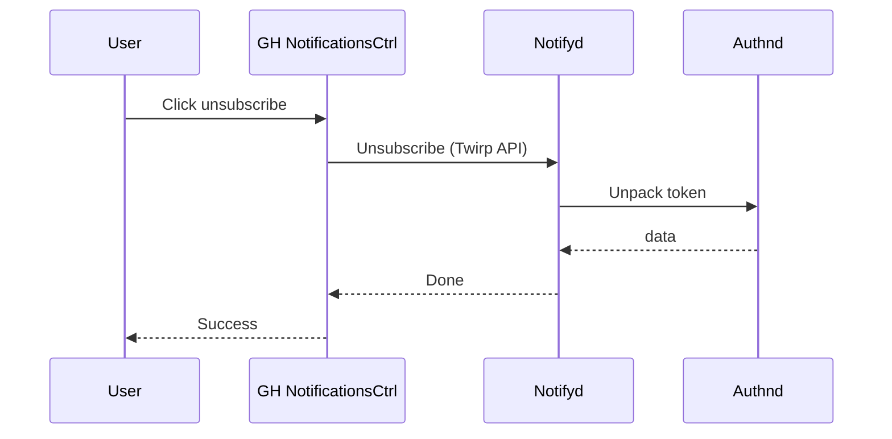

# [Proposal] Handle unsubscriptions from email links in Notifyd

## Introduction

## How unsubscribe from email works in Newsies

The main thing about unsubscribing from an email is that that action has to be quick and friendly. If someone wants to unsubscribe, that action should be as inmediate as possible.

Newsies does this by providing links that unbsubscribe from threads as soon as they are visited. It manages to do this by building [Signed Auth Tokens][sat] (without session information) with the user and target information of the notification.

These tokens are tightly coupled with Newsies data models, most of them use a [`RollupSummary`][rollup-summary] id, which is related to Newsies' web notification system.

Note that all unsubscriptions actions are scoped by threads. There is no unsubscription from a whole list (like `Repository`), at least not from email.

### Tokens

To build unsubscribe links that work from simple links, Newsies generates Signed Auth Tokens with the following information:

* The user ID. The user is used to sign the token in the first place
* A scope, or also called action. For example `:mute_thread` or `:mute_vuln`. These identify different unsubscribe actions
* The `RollupSummary` ID. This is used to identify the thread from where the user wants to unsubscribe

There is another token used, the same used for email replies, and is used to unsubscribe using the unsubscribe mail address. More of this later.

### Unsubscribe channels

There are two main channels a user can use to unsubscribe from a thread: links and an unsubscribe email. The unsubscribe email exists as a feature that email clients support that allow users to unscribe from lists with one click.

#### Links

Newsies generates three kind of links. All of these links use the previously defined tokens with the notification information.

Links are used in two parts:
* In the body of the email, mainly the HTML version
* In the headers of the email using the header [`List-Unsubscribe`][list-unsubscribe].

The `List-Unsubscribe` header is a feature that some mail clients use to allow users to unsubscribe from email lists from the mail client UI. It needs two values: an HTTP url and an email.

##### Unsubscribe from thread link

These links look in the form `https://github.com/notifications/unsubscribe-auth/AUTH_TOKEN`. These links are set in the footer of the HTML emails and they require the user to be logged in GitHub in order to work. If the user is logged out, the link will redirect to the login page.

Once the user visits the link, Dotcom[^dotcom] will unwrap the token and unsubscribe said user from the thread using the `RollupSummary` ID.

This url is generated by [`Newsies::Emails::Message#tokenized_unsubscribe_auth_url`][unsubscribe-auth] and it is processed by [`NotificationsController#email_mute_via_footer`][mute-via-footer].

##### Link present in List-Unsubscribe header

These links look in the form `https://github.com/notifications/unsubscribe/LIST_TOKEN`. These links are set in the header `List-Unsubscribe` of the emails and they don't require the user to be logged in GitHub in order to work.

Once the url is triggered by the email client, Dotcom will unwrap the token and unsubscribe said user from the thread using the `RollupSummary` ID.

This url is generated by [`Newsies::Emails::Message#tokenized_unsubscribe_list_url`][unsubscribe-list] and it is processed by [`NotificationsController#email_mute_via_list`][mute-via-list]. Note that list means "Email List" and not the internal List concept from Newsies.

##### Unsubscribe from vulnerabilities link

These links look in the form `https://github.com/notifications/unsubscribe-vulnerability/VULN_TOKEN`. These links are set in the footer of the HTML and Text emails and they require the user to be logged in GitHub in order to work. If the user is logged out, the link will redirect to the login page.

In Newsies there is no thread for vulnerability alerts, so what this unsubscribe action does is it updates the user's setting and disables the vulnerability alerts check.

This url is generated by [`Newsies::Emails::Message#tokenized_unsubscribe_vuln_url`][unsubscribe-vuln] and it is processed by [`NotificationsController#email_mute_vulnerabilities`][mute-via-vuln].

#### Email

There is the possibility to unsubscribe from a thread by replying to an email. This email is present in the `List-Unsubscribe` header and has the form `unsub+EMAIL_TOKEN@reply.github.com`. This email works in the same fashion as the `Reply-To` email.

* It uses the same token used in the reply emails. This is done by the [`GitHub::Email.unsub_email`][email-unsub] method
* It is captured and by the [Mail Replies][mail-replies] service, which in turn sends the reply to Dotcom's jobs system
* Once it is send to Dotcom, it is processed by the [`EmailUnsubscribeJob`][email-unsubscribe-job]

This job doesn't use a `RollupSummary` ID like the other actions. It uses the thread type and ID like in email replies and finds a way to unsubscribe from there.


## Existing problems: Email rendering owner

As described before, a user can use two channels to unsubscribe: the email header `List-Unsubscribe` and links in the email body. Notifyd can set different email headers, but right now it doesn't have a way to add links to the reused emails generated from Newsies. Since Newsies is the owner of the email body, it is it the one that sets up the links to unsubscribe.

What this means is that until we get a better way to compose email layouts, we can't change who is generating the unsubscription entry points.

In order for the [Notifyd lib to generate Newsies' emails][notifyd-newsies-emails] with proper unsubscribe links, it has to run almost the whole Newsies stack, and this has to be done because Newsies needs the `RollupSummary` ID for the unsubscribe token. This implies a lot DB interactions as well.

Another problem with this is that Notifyd will be highly coupled with Newsies


## Proposal: New Signed Auth Tokens

### The ideal world

Ideally, the generation of unsubscribe tokens and the links and emails using them should be handled by Notifyd. This means:

* Notifyd should be in charge of assembling the email layout with the integrator data and forma plus extra information like unsubscribe links
* Notifyd should set the `List-Unsubscribe` header
* All unsubscribe actions should be forwarded from Dotcom to Notifyd

### Paving the way forward

Until we have a better layout rendering system that allow us to build email bodies with extra Notifyd information, we need to try to reduce the coupling our Newsies integration. We can do this by updating the generated Signed Auth Tokens that hold the unsubscribe information.

The new format could look like the following:

```ruby
{
  # Introduce versioning so systems can change how to deal with the token based on the version
  # NOTE: No version field (as is now) means version 1
  version: 2,

  user_id: 1234,

  # Newsies information
  thread_type: "pull_request", # underscore version
  thread_id: 5678,

  # Notifyd information, reserved for future use
  notifyd: {
    subscription_id: 4321,
  }
}
```

We know from the `EmailUnsubscribeJob` that it is possible to unsubscribe from Newsies by using the thread type and ID. This information is present while building Notifyd notifications inside Dotcom, which means we can generate a token without building a `RollupSummary` instance, reducing the coupling inside the email rendering system.

Changing the token means changing how it is generated inside `Newsies::Emails::Message` and how it is handled by `NotificationsController` and `EmailUnsubscribeJob`. For handling, instead of looking for a `RollupSummary` by its ID we can find it by [the thread information][rollup-thread-id].

Note that unsubscribing in Notifyd will still work because thanks to data sync between Newsies and Notifyd, unsubscribing from Newsies will trigger an unsubscribe event in Notifyd.

The unsubscribe flow can be represented as follows:



### Managing Signed Auth Tokens in Notifyd

Once Notifyd can control the links to unsubscribe inside an email body (and headers), it can generate the token and set it up with the internal information, the subsciption ID, that it needs to unsubscribe an user.

The drawback is that we can only generate Signed Auth Tokens inside the Dotcom. The main authentication service, [authnd]. The proposal solution so solve this is to add a Twirp endpoint in Dotcom that can sign a payload for a given user.

Once Notifyd can generate Signed Auth Tokens, the flow of how to unsubscribe can be:

* Dotcom receives the token, unpacks it and gets the thread info (type and ID). This information has to exist in Notifyd subscription, but we need it for data sync at the moment.
* It forwards the unsubscription token to Notifyd via a new Twirp API call. We need this to be sync
* Notifyd unpacks the token via `authnd` and proceeds to unsubscribe the user from the thread

This flow can be represented as follows:



### Moving away from Newsies

By the time we don't need to sync with newsies anymore, we can keep the previous flow except the unsubscribe from Newsies thread step.



## Final notes

This proposal implies different steps and changes in Newsies, but I think they allow a gradual integration of unsubscribe actions into Notifyd. This feature is highly coupled with how email bodies are rendered, so some steps will be blocked until we solve that issue.

The bottom line is that unsubscribe should work essentially as today, but ultimately the owner of the data, Notifyd, should handle how tokens are generated and what do they include.

[^dotcom]: Dotcom refers to the monolith Rails app that runs GitHub.

[sat]: https://thehub.github.com/epd/engineering/dev-practicals/secure-coding/secure-coding-dotcom/external-session-auth/#using-session-signed-auth-tokens-ssat
[rollup-summary]: https://github.com/github/github/blob/95ea0bc8b521505669662dfb390345c58564de03/packages/notifications/app/models/rollup_summary.rb
[list-unsubscribe]: https://sendgrid.com/blog/list-unsubscribe/
[unsubscribe-auth]: https://github.com/github/github/blob/9942225cd34baf31d436af1b2f2de3fbc8fb0183/lib/newsies/emails/message.rb#L152-L155
[unsubscribe-list]: https://github.com/github/github/blob/9942225cd34baf31d436af1b2f2de3fbc8fb0183/lib/newsies/emails/message.rb#L162-L165
[unsubscribe-vuln]: https://github.com/github/github/blob/9942225cd34baf31d436af1b2f2de3fbc8fb0183/lib/newsies/emails/message.rb#L157-L160
[mute-via-footer]: https://github.com/github/github/blob/714819c8f4eb8af4e9349c3253e0bbb16cb39108/app/controllers/notifications_controller.rb#L253-L270
[mute-via-list]: https://github.com/github/github/blob/714819c8f4eb8af4e9349c3253e0bbb16cb39108/app/controllers/notifications_controller.rb#L253-L270
[mute-via-vuln]: https://github.com/github/github/blob/714819c8f4eb8af4e9349c3253e0bbb16cb39108/app/controllers/notifications_controller.rb#L293-L305
[email-unsub]: https://github.com/github/github/blob/95ea0bc8b521505669662dfb390345c58564de03/lib/github/email.rb#L30-L34
[mail-replies]: https://github.com/github/mail-replies
[email-unsubscribe-job]: https://github.com/github/github/blob/95ea0bc8b521505669662dfb390345c58564de03/app/jobs/email_unsubscribe_job.rb
[notifyd-newsies-emails]: https://github.com/github/github/blob/662e10f91876d6c18d94a1bdd42d9577946059d4/packages/notifications/app/models/notifyd/bridge_mailer.rb
[rollup-thread-id]: https://github.com/github/github/blob/f807a895bb1d82fc9cfac179d83b82983229ef2c/lib/newsies/service.rb#L550-L563
[authnd]: https://github.com/github/authnd
