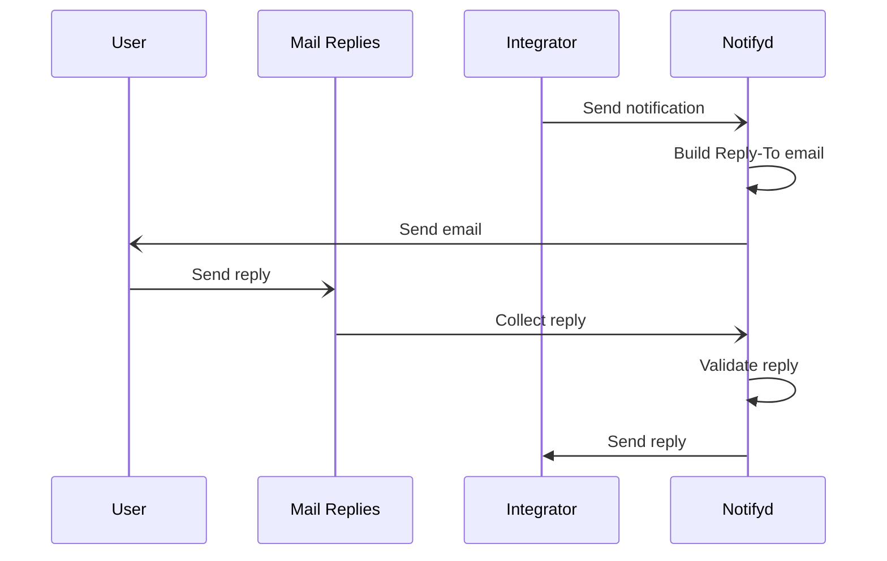

# [Proposal] Reply from email functionality in Notifyd

## Introduction

The reply to email feature allows users to act on notifications that represent some kind of content that allows interactions, like issues' comments or pull requests' reviews. These users can add a comment without leaving their email client, speeding up integrations.

However, replies are not present in all notifications, they depend on the content of the notification itself. For this reason Notifyd can't know by itself when something can be replied or not.

I believe it can offer the basic work around replies: how to set up the proper email to reply to, how to handle this reply and who to forward a reply.

This proposal tries to explain how to do exactly this.

## How email replies currently work

This is a summary of how the reply system works for some notification emails sent by Newsies. There is one important thing to note for replies and is that **not every notification can be replied**. Replies depend on the target of the notification. It is possible to reply to an Issue, this will generate a new comment in it, but it's not possible to reply to a CI Workflow Run notification, since there is nothing to reply to.

This means that indicating that something can be replied or not depends on the integrator, the client that is sending the notification in the first place.

### `Reply-To` header and reply email

If a user can reply to a notification through email (for example, a new issue has been created), the current system will send the email with a `Reply-To` header set to an email in the form `reply+EMAIL_TOKEN@reply.github.com`. The most important thing about this email is the `EMAIL_TOKEN`. This is generated using [`GitHub::Email::Token.target_token`][gh-email-token], which is used by [`GitHub::Email.reply_email`][gh-email-reply]. This token has the information of the user that is receiving the notification email and the target (`Issue`, `IssueComment`, etc). This token is signed as a [Signed Auth Token][sat] (without session) by Dotcom's[^dotcom] signing features.

### Inbound emails

If a user decides to reply to an email, that reply will be collected by the [Mail Replies][mail-replies] service. This service will take the email, extract basic information from in and push it into a job so Dotcom can process it with its job system. This service doesn't perform any authentication, it only acts as a bridge.

### The reply job

Inbound replies are handled by Dotcom via [`EmailReplyJob`][email-reply-job]. In summary what this job does is:

* Extracts information from the given `EMAIL_TOKEN`.
* If everthing is valid and the user can write to the target, a new comment, etc will be added to the target. How this is done depends on the target.
* It tells Newsies to mark as read the [`RollupSummary`][rollup-summary] associated to the target's thread. A `RollupSummary` is used by Newsies in its web integration.

## Proposal: Reply forward mechanism

We know that enabling the ability to reply to an email is heavily content dependent, for this reason Notifyd can't know when to generate and add a `Reploy-To` email.

What Notifyd can do is to manage how to generate reply emails and how to collect replies. Once replies are collected, it can then forward them to a callback API/Job defined by the integrator so it can process the reply and do something about it.

Roughly, the flow could look like this:

* The integrator sends a `Notify` message indicating that it can be replied to and where to derive the reply (i.e, a twirp endpoint)
* Notifyd validates the notification, and before sending it builds a `reply+NOTIFYD_TOKEN@reply.github.com` email
* The user decides to reply to leave a comment in a Pull Request, for example
* Notifyd (or Notifyd + Mail Replies) collects the email and extract information like: token, response and sender
* Forwards the response and the sender to the integrators callback endpoint



There are different parts of this system that need more clarification, let's see that in the following sections.

### Reply data in Notify messages

First of all we need to allow integrators to indicate that an email can be replied to, and in case there is a reply, where that reply can be forwared. Integrators might need extra information in order to identify a reply, that information should be indicated as well.

We can extend our Notify proto definition to allow all this information. Note that this is more of a draft than a final definition, but it can help as a guideline:

```proto
message Notify {
  message ReplyToEmail {
    // Context forwarded to the integrator when Notifyd gets a reply
    // Example: { issue_id: 123, repository_id: 456 }
    google.protobuf.Any context = 1;

    // Define how to forward the reply by seting up a forward type system
    oneof forward_type {
      // To simplify the example these are set as Any,
      // but they should be properly structured messages
      google.protofbuf.Any twirp = 2; // Things like the URL: { url: "https://ex.co/twirp" }
      google.protofbuf.Any aqueduct = 3; // Things like the App name and the Queue: { app: "my_app", queue: "replies" }
    }
  }
}
```

The bottom line is that the integrator is telling Notifyd what to send back in case of a reply and where.

### Generating reply emails and tokens

If Notifyd sees the previous payload in a Notify message before sending an email, it will then generate a valid reply email with a token that encapsulates all the information it needs to forward a message.

The token can contain two types of payloads:

* Minimum information like user ID (the email receiver) and the notification ID.
* All the reply to information including user ID, context, and forward information.

For the first option to work we would need to save reply information in our DB so we can collect it later. A table like this could look like the following:

```sql
CREATE TABLE `notification_replies` (
  `id` bigint(20) unsigned NOT NULL AUTO_INCREMENT,
  `user_id` bigint(20) unsigned NOT NULL,
  `notification_id` varchar(255) NOT NULL,
  `context` json DEFAULT NULL,
  `forward_to` json NOT NULL,
) ENGINE=InnoDB DEFAULT CHARSET=utf8mb4;
```

Whether we save the information in our DB or not is not really that important for this proposal. The important thing is to make sure we can retrieve the forward config and the context in the event of a reply.

We can then assume that a token can have the following payload:

```ruby
{
  user_id: 123,
  notification_id: "org/issue-456#c789",
  scope: :reply,
  version: 2, # to differentiate the existing one
}
```

Note that I'm assuming that `notification_id` is globally unique. If we can't guarantee that then we need to generate our own ID to be able to identify replies. The table described before can be of help for this case.

To generate a Signed Auth Token we need to use Dotcom. Right now there is no way to generate this kind of tokens outside it. To be able to use Dotcom token generation the best way would be to build a Twirp API that builds the token for us. In the future this might become available in [authnd], but that's not the case right now. However, authnd can validate a Signed Auth Token.

For the email address we need to remember that the existing one, `reply+TOKEN@reply.github.com`, is already handled by the existing system. It would be better to use a new email address that identifies Notifyd replies. For the sake of simplicity I'm going to use `reply-v2+NOTIFYD_TOKEN@reply.github.com`, but we probably need a better address for the implementation.

### Inbound email

The [Mail Replies][mail-replies] service handles inbound emails and redelivers them based on the address. For the moment I don't think we need a new system that does this inside Notifyd. What we need to do is to make sure Mail Replies forwards Notifyd reply emails to the proper queue.

[We can update how it treats address and add the new one, `reply-v2`][mail-reply-forward]. This can then enqueue an aqueduct job or use an internal Twirp API in Notifyd.

Notifyd will get then a payload with following form:

```
'from'       => address list array (see below)
'to'         => address list array
'cc'         => address list array
'subject'    => string message subject
'body'       => string plain text body of the message
'html'       => string html body of the message (if present)
'reply_code' => string mail target code that determines what github
                object the message should be applied to.
'headers'    => hash of all mail headers with downcase string keys

The address list array is an array of hashes. Each hash includes
'address' and 'name' keys:

  [{'address' => string email, 'name' => string name}, ...]
```

The `reply_code` field is the token we set in the previous step. We can use authnd to unpack it and retrieve all the information needed to forward the reply to the integrator.

### Reply validation

There are at least two validation steps in a reply:

* Is the user blocked or spammy?
* Is the user allowed to reply to that content?

Notifyd can only validate the first one since it doesn't context on the content of the notification. These validations should be similar as the ones we perform before sending a notification in the first place, checking for bots, blocked or spammy users.

### Reply forwarding

At this point a reply has been received and validated, but not action has been performed around it. Notifyd will need to forward the reply to the original integrator so it can act on this reply. This can be something like adding a comment to an Issue or Pull Request.

In order for Notifyd to have a consistent way to communicate with integrators, the reply message must be defined with a protobuf format. An example could be the following:

```proto
message EmailReply {
  // The user replying to the email
  int64 user_id = 1;
  // Original context set when the notification was triggered
  google.protobuf.Any context = 2;

  // In case the integrator does some kind of tracking
  string notification_id = 3;

  // Email properties extracted
  // NOTE: Address has the form: { address: string email, name: string name }
  repeated Address from = 4;
  repeated Address to = 5;
  repeated Address cc = 6;
  string subject = 7;
  string body = 8; // text body
  string html = 9; // html body, if any
  map<string, string> headers = 10;
}
```

If the forward system is a Twirp API, it can wrap the previous defined message with a `Notifyd.EmailReplyRequest` endpoint definition, also defined by Notifyd.

If the forward system is an Aqueduct job, the payload can be encoded and it can be sended as bytes.

As long as the integrator implements the predefined APIs, it should be able to handle the payload and act on the reply.

[^dotcom]: Dotcom refers to the monolith Rails app that runs GitHub.

[gh-email-token]: https://github.com/github/github/blob/9942225cd34baf31d436af1b2f2de3fbc8fb0183/lib/github/email/token.rb#L73-L79
[gh-email-reply]: https://github.com/github/github/blob/95ea0bc8b521505669662dfb390345c58564de03/lib/github/email.rb#L15-L21
[mail-replies]: https://github.com/github/mail-replies
  [mail-reply-forward]: https://github.com/github/mail-replies/blob/300040c7f174680dfced36fb5caf571490c4a8e9/lib/twirp_client.rb#L52-L58
[email-reply-job]: https://github.com/github/github/blob/9942225cd34baf31d436af1b2f2de3fbc8fb0183/app/jobs/email_reply_job.rb
[rollup-summary]: https://github.com/github/github/blob/95ea0bc8b521505669662dfb390345c58564de03/packages/notifications/app/models/rollup_summary.rb
[sat]: https://thehub.github.com/epd/engineering/dev-practicals/secure-coding/secure-coding-dotcom/external-session-auth/#using-session-signed-auth-tokens-ssat
[authnd]: https://github.com/github/authnd
