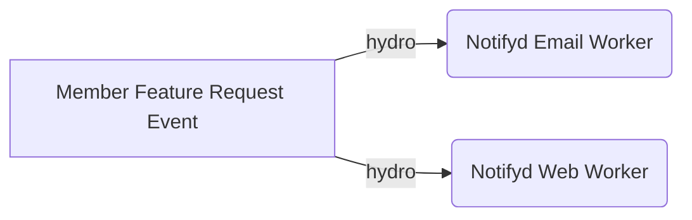
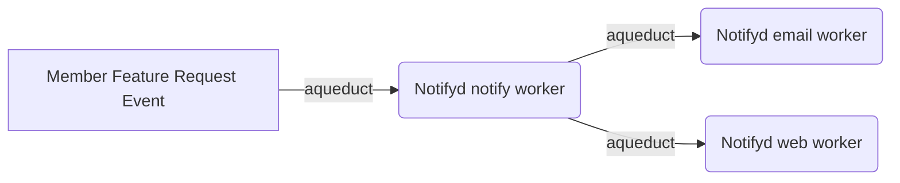
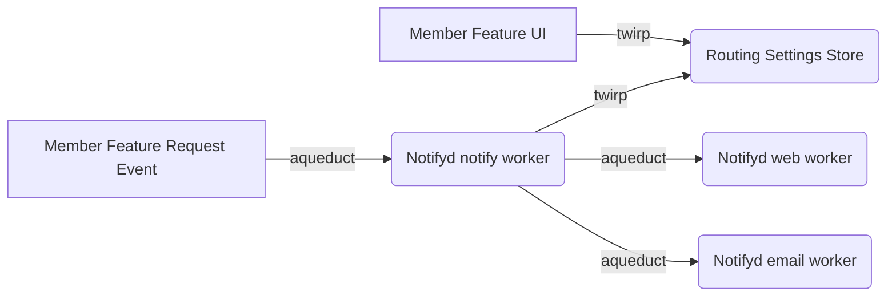

# Member Feature Request

## Context
The Growth Team has been actively creating a new [feature workflow](https://github.com/github/octogrowth/issues/1724), whereby members of a Free organization (w/private repos) can "request" features that would require an upgrade to their organization's plan. The workflow includes a new notification type that alerts organization admins that members have requested a feature. 

## Background reading
* https://github.com/github/octogrowth/issues/1724
* https://github.com/github/octogrowth/issues/2153
* https://github.com/github/octogrowth/issues/2257
* https://github.com/github/octogrowth/issues/2053

## Properties of the Member Feature Request notification

* **Recipients**: Notifications are only sent to admin users.
* **Trigger**: Notifications will be sent weekly if the admin has pending feature requests. 
* **Channels**: Email and Web. The team is willing to launch with Email-only.  
* **Default Subscription-State**: Admins receive all emails by default unless they opt out.
* **Message Information**: Notifications inform users that there are pending requests when they are sent (synchronic). They do not summarize member feature request events from the previous week. 
* **Topic**: Org-based - notifications are sent for the organization rather than a specific repository.
* **Message Types**: Admins will receive messages for each feature - draft_pull_requests, custom_repository_roles, copiolot_for_business, protected_branches, + more

## Status-Quo of the Notification
Today (2032-07-01), Member Feature Request emails are sent via Action Mailer and do not use Notifyd. A job collects the admins of organizations with pending Member Feature Requests and sends each admin a message on a weekly cadence. The Growth Team's requests integrating the feature with Notifyd services to leverage channels and routing settings features. The scope of the work can be found in [this issue](https://github.com/github/octogrowth/issues/2257). The Growth Team, as the domain owner, can own monolith integration points, including but not limited to the MememberFeatureRequest model, the subject adapter, email generation, landing page, and subscription management buttons. 

## Why Notifyd?
The Member Feature Request notification is a strong contender for using Notifyd services for the following reasons.

1. The Member Feature Request notification informs users of stateful system information and is relevant to the admin workflow. 
1. The Member Feature Request notification requires multiple channels: Notifyd can easily provide both Web and Email channels
1. The Member Feature Request notification has a non-trivial opt-out subscription model. Admins are subscribed by default and can opt out of individual notification types: Notifyd provides a flexible routing settings model for opt-out subscriptions. 

## Potential Solutions

### Member Feature Request notification is sent directly to relevant channels
The Growth Team can use Notifyd's channels without using subscriptions and routing settings. In this scenario, the Growth Team can send messages with explicit recipients directly to Notifyd's email and web workers. The Growth Team would also build domain-specific models for managing the opt-out subscriptions and channels. 



**Risks**
* Messages sent directly to channel workers skip authzd checks. The Notifications Team must accept the risk that the notification owner would own all authorization decisions. 
* The Email and Web workers are currently private interfaces and do not support external integrations. 
* The Growth Team will need to duplicate the opt-out subscription feature in the growth domain, adding development time. Also, the notification team may need to migrate settings if the feature evolves and requires more elements from Notifyd. 

**Benefits**
* Straightforward solution for Notifications Team. Notifications will function if the messages meet the email and web message interfaces.

### Member Feature Request notification is sent to Notifyd notify worker
The Growth Team can use Notifyd's message delivery pipeline without using subscriptions and settings. The Growth Team can send messages with explicit recipients to the main Notifyd worker. The Growth Team would also build domain-specific models for managing the opt-out subscriptions. In this scenario, Member Feature Request notification would only be routed to specific channels with additional development from the Notifications Team. The Notifications Team would need to build a way for messages that go to the Notifyd notify worker to contain routing instructions set by the integrator and set default routing settings. This scenario would require the addition of several configurations:
1. Authzd configurations
1. Default routing settings



**Risks**
* We need to add additional features to Notifyd. Adding a way for integrators to set channels outside of routing settings may not be the preferred product approach. 
* The Growth Team will need to duplicate the opt-out subscription feature in the growth domain which will add development time for them. Also, the notification team may need to migrate the settings if the feature evolves and requires more elements from Notifyd. 

**Benefits**
* This is an acceptable approach if we plan on enabling email-only notifications for the Member Feature Requests. This could be used as an initial step before we enable routing via channels. 


### Member Feature Request notification uses and owns Notifyd routing settings
The Growth Team can use Notifyd's message delivery pipeline and leverage routing settings. The Growth Team would send notification messages with explicit recipients to Notifyd's notify workers and use routing settings to manage both opt-out subscriptions and channel settings. The Growth Team would also create its UI for managing routing settings and channels. This scenario would require the addition of several configurations:
1. Authzd configurations
1. Default routing settings
1. Routing settings models opt-out and channels

The Notifications Team would need to define these settings and provide guidance to the Growth Team for implementing them. 



**Risks**
* The Notifications Team needs to support the specific settings models for the Growth Team for the long term. 
* The Platform may not be ready to support independent integrators
* The Growth Team's opt-out model may not be a good product fit for Notifyd because it doesn't fit into the `Watching` or `Thread Participant` models.

**Benefits**
* The Growth Team would not need to duplicate opt-out subscription work since Notifyd's subscription and settings models will function with Notifyd.
* The Notifications Team would gain insights and feedback from having an independent integrator that could invest in developing connection points.  


### Member Feature Request notification uses Notifyd routing settings, but channels are tied to watching settings.
This option is similar to the option above; however, with one main difference: the channel choice for Member Feature Request notification is controlled by the `Watching` settings on the main notification page.  

**Risks**
* Watching settings are confusing, users may not understand that Member Feature Request notification are tied to them. 
* The approach of the Growth Team controlling opt-out subscriptions via Notifyd and the Notifications Teams controlling channels creates an unclear domain division that may cause maintainability issues in the long-term. 

**Benefits**
* Easy development path for the Growth Team because they don't need additional UI designs for managing channels. 

### Member Feature Request notifications are managed by Scheduled Reminders 
The Growth Team uses Scheduled Reminders to maintain a list of admin recipients. Also, it uses Scheduled Reminders to trigger a notification that would go to notifyd and take advantage of the different notifications channels. 

**Risks** 
* Scheduled Reminders is not a feature the Notifications team is actively developing.
* Scheduled Reminders does not support email and web, the two channels the Growth Team has requested.
* Using Scheduled Reminders would duplicate work that the Growth team has already done and is willing to maintain
* Scheduled reminders does not fit the product vision described in the Growth Team's research and product documents.
* Scheduled Reminders is designed to use a list of subscribers to send requests. The Growth Team would need to add all the admins in Github to the reminders or create a new reminder that does the same work they are already doing in the Growth's codebase to create an opt-out notification.
* Scheduled Reminders adds more work but does not solve the subscription problem the Growth team has asked the notification team to solve. 
* Scheduled Reminders is strongly coupled to Pull Requests, it may be difficult changing the functionality since the feature is not in active development

**Benefits**
* The Notification team would benefit from another team developing scheduled reminders. 
* Scheduled Reminders has built-in cron capabilities and are easy to configure by organization. 

## Conclusion
The best solution for the Member Feature Request notification is for `the Growth team to use and own Notifyd routing settings.` It is the ideal path because it allows the Growth team to benefit from Notifyd's routing settings for opt-out subscriptions and web and email channels. Additionally, this solution is the least risky for the Notification Team because it only requires configuration changes that would not affect the delivery of other notification types. The risk of dealing with a future migrations is also minimal because the  Member Feature Request notification would be independent of other notifications. Even if the Notifications team is required to migrate routing settings, the number of records would be minimal because the  Member Feature Request notification is only for admins. 

The main risk in this solution is that the Growth team needs to have designs for managing channels. The Growth team requested to tie Member Feature Request notifications to `Watching` settings in their original designs. The first iteration of the Notification will be email-only, so this will be an issue in a future iteration. The teams can work together to create an optimal solution during this time. 

## Addendum 
This section contains specific configurations for the Member Feature Request. 

### Authzd notification policies
Member Feature Requests notification should only be enabled for organization admins. Standard spammy and suspended rules also apply. 

##### Authzd Policies
```json
   {
      "id": "user-receives-member-feature-request-notification",
      "version": 2,
      "description": "An admin user can receive member feature request notifications",
      "match": [
        "and",
        ["=", ["attr", "action"], "receive_notification"],
        ["!=", ["attr", "actor.id"], null],
        ["!=", ["attr", "subject.id"], null],
        ["=", ["attr", "subject.type"], "MemberFeatureRequest"]
      ],
      "rules": [
        "and",
          ["=", ["attr", "notification.recipient.is_user"], true],
          ["=", ["attr", "actor.spammy_or_suspended"], false],
          ["=", ["attr", "subject.owning_organization.permissions.admin.granted_to_user"], true]
      ]
    }
```

Note: The authzd policies above do not check `notification.initiator.id` like other notification policies because the platform sends member feature requests instead of a specific user action. Today, we send these emails on a per-admin basis, so the initiator is the recipient. However, there may be one notification for many admins in the future. In this case, the initiator would be an allowed integrator like Dependabot.


##### MemberFeatureRequest Permissions Attributes
```ruby
module Permissions
  module Attributes
    class MemberFeatureRequest < Default
      def subject_attributes
        super.merge(
            "subject.owning_organization.id" => participant.organization_id,
        )
      end
    end
  end
end
```
Notes: Most properties are set by default; however, `subject.owning_organization.id` is required for Authzd's`subject.owning_organization.permissions.admin.granted_to_user`.

### Models for opt-out unsubscriptions 
The MemberFeatureRequest has [3 different subscription states](https://www.figma.com/file/j6ENprgMic8DxM1cVtlHlS/Improve-Discoverability-for-Request-a-Feature?type=design&node-id=476-90644&mode=design&t=I70551rhtZht6Pjw-0) and 2 different channel options - Email and Web. Channels settings would affect all notifications types equally, so users would not be able to choose to have Draft pull requests notifications to be sent via Web and Copiolot for Business to be send via email. 

* Admins receive all email/web notifications (default) - defined by default routing settings 
* Admins do not receive any notifications (ignore)
* Admins ignore specific email/web notification types (custom) - Draft pull requests, Custom repository roles, Copiolot for Business, and Protected Branches.

These states are also governed by the recipient's `Watching` settings on [the notifications settings page](https://github.com/settings/notifications). If a recipient has disabled email for `Watching` settings, they should not receive any email settings. The Growth Team has found that 80%+ % of admins have enabled watch email settings. This feature set may not be ideal, but it is a way to respect a user's current email settings.

#### Admins receive all email notifications (default) - defined by default routing settings 
##### Default settings `internal/pkg/routing/default.go`
Member Feature Requests notifications are emailed to admins by default unless they explicitly ask to be unsubscribed.
```go
{
    SubjectType: "MemberFeatureRequest",
    Channels: map[string]*match_engine_dto.Channel{
      "EMAIL": {Channel: "EMAIL", Enabled: true},
      "WEB": {Channel: "EMAIL", Enabled: false}, // Will be true when Web is enabled in a later version
      "PUSH":  {Channel: "PUSH", Enabled: false},  
    },
  }
```

#### Admins do not receive any notifications (ignore)
##### Routing Settings
These are the routing settings the integrator should submit to Notifyd
```json
{
  "topics": [
    {
      "Type": "organization",
      "Value": "1234"
    }
  ],
  "filters": [
    {
      "subject_type": "MemberFeatureRequest",
      "trigger": "any",
      "reason": "any",
    }
  ],
  "channels": {
    "ALL": { // Could change to "EMAIL" / "WEB" depending on the situation
      "Channel": "ALL",
      "Enabled": false
    }
  },
  "custom_fields": [
    {
      "name": "delivery_group",
      "value": "member_feature_request"
    },
    {
      "name": "owner_id",
      "value": "1234" // user or org owning a notification subject
    },
    {
      "name": "owner_type",
      "value": "organization"
    },
  ]
}
```

#### Admins ignore specific email notification types (custom) - Draft pull requests, Custom repository roles, Copiolot for Business, and Protected Branches
##### Routing Settings
These are the routing settings the integrator should submit to Notifyd. Specific types are defined by the `trigger`

```json
{
  "topics": [
    {
      "Type": "organization",
      "Value": "1234"
    }
  ],
  "filters": [
    {
      "subject_type": "MemberFeatureRequest",
      "trigger": "draft_pull_requests", // , Other options: custom_repository_roles, copiolot_for_Business, protected_branches
      "reason": "any",
      ]
    }
  ],
  "channels": {
    "ALL": { // Could change to "EMAIL" / "WEB" depending on the situation
      "Channel": "ALL",
      "Enabled": false
    }
  },
  "custom_fields": [
    {
      "name": "delivery_group",
      "value": "member_feature_request"
    },
    {
      "name": "owner_id",
      "value": "1234" // user or org owning a notification subject
    },
    {
      "name": "owner_type",
      "value": "organization"
    },
  ]
}
```

##### MemberFeatureRequest subject adapter
In order for custom unsubscription to work we need to change the message depending on the trigger
```ruby
  def trigger
     "draft_pull_requests", # Other options: custom_repository_roles, copiolot_for_Business, protected_branches
  end
```


#### Watch Settings (OPTIONAL - if we choose to tie the Member Featur Request notifications to watching settings)
##### MemberFeatureRequest subject adapter
In order to respect watch settings `MemberFeatureRequest` subject adapter should contain the `watch_activity` attribute 
```
def attributes
  [
    { name: "watch_activity", value: "true" },
  ]
end
```

#### Other critical fields
##### MemberFeatureRequest subject adapter
In order scope the routing settings to a specific org `MemberFeatureRequest` subject adapter should contain the organization id as a topic
```ruby
def related_topics
  [
    { type: "organization", value: organization.id.to_s },
  ]
end
```
