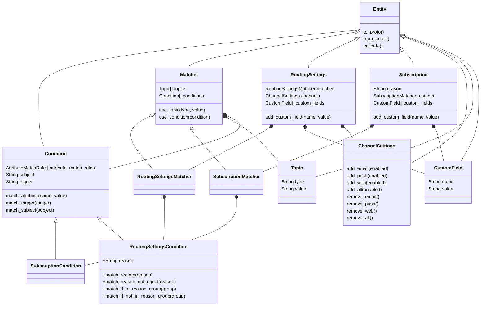

# Notifyd API interfaces for integrators


## Backgound

Integrators can interact with Notifyd via Notifyd Twirp API. Currently we use low-level protobuf models to construct and send requests to Notifyd. These models do not have internal validation and expose a lot of unnecessary details to integrators. This makes integration with Notifyd complicated and counter-intuitive. The goal of this document is to propose a new abstraction layer for integrators that will encapsulate our internal logic and make it simpler to work with Notifyd in monolith code.


## Current code structure

The diagram below shows components that participate in the Monolith -> Notifyd Twirp API flow:


Our Notifyd code in monolith is not very well structured and use different approaches to communicate with Notifyd API. For example, we created Newsies service in Notifyd with endpoints that implement existing monolith logic.

For some integrations we use additional layer `RoutingSettingsService` and `SubscriptionsService` classes to encapsulate work with subscriptions and routing settings API.

For example, that's how the code is constructing routing settings for participating activity notifications:

```ruby
 sig { returns(RS::RoutingSetting) }
    def to_routing_setting
      RS::RoutingSetting.new.tap do |routing|
        routing.name = "notifyd_issue_participating_activity_email"

        routing.topics.push(RS::Topic.new(type: "any", value: "any"))
        routing.channels.push(RS::Channel.new(
          name: CHANNEL_EMAIL,
          enabled: @email_enabled,
        ))

        participating_activity = RS::Filter.new(
          subject_type: "any",
          trigger: "any",
          reason: "any",
        )

        participating_activity.match_rules.push(RS::MatchRule.new(
            attribute: "thread_participant_activity",
            value: "true",
            match_rule: "eq",
          ))

        participating_activity.match_rules.push(RS::MatchRule.new(
          value: "participant",
          match_rule: "in_reason_group",
        ))

        routing.filters.push(participating_activity)

        routing.custom_fields.push(RS::CustomField.new(name: "category", value: "user_setting_participant_activity"))
      end
    end
```

This code creates a Protobuf model for routing settings that will be applied to participant activity notifications.


## Problems with current approach

1. The code samples above are too long and complicated. 
2. A integrator might get confused about all of the information they have to add to the routing setting/subscription.
3. Heavy dependency on Protobuf models.
4. No validation.

The goals of the proposal is to come up with the solution that would simplify the code and provide integrator with concise way to interact with Notifyd API.

In this proposal I'll be concentrating on abstraction layer for our main APIs: Subscriptions and Routing settings.


## Proposed solution

### Contracts

We start with creating a middle layer that is easier for us to control. The middle layer shall be used by integrators to construct requests to Notifyd API and shall include validation. The middle layer should be part of our ruby gem and therefore it cannot be dependent on GitHub modules or classes and we should be careful not to mix GitHub and Notifyd entities. 

The POC of middle layer can be found in this branch: https://github.com/github/notifyd/pull/3666/files

#### Classes overview

Below diagram shows the classes representing Notifyd entities for Twirp API.



Two main entities are `Notifyd::RoutingSettings` and `Notifyd::Subscription`. The part that is responsible for matching is extracted to a `Notifyd::Matcher`. User of the library can construct matcher when initializing `Subscription` or `RoutingSettings` in code.

The concept of this abstraction layer is the following: integrator can create subscriptions and routing settings that will be applied to certain messages. The rules are described using `matcher`. Entity `matcher` contains `topics` that defines the broad scope of the messages to be matched and `condition` that narrows the scope of messages. I renamed `filters` that we use in Protobuf to `conditions` because `Matcher::Filter` looks very overloaded in meaning. 


#### Examples 

All code samples related to the monolith code can be found in this branch: https://github.com/github/github/pull/305642 


The code for participating routing settings can be rewritten using the new abstraction layer:

```ruby
  sig { returns(Notifyd::RoutingSettings) }
    def to_routing_setting
      routing_settings = Notifyd::RoutingSettings.new("notifyd_issue_participating_activity_email", user.id) do |matcher|
        matcher.use_condition(Notifyd::Conditions::ThreadParticipant.new)
      end

      routing_settings.add_custom_field("category", "user_setting_participant_activity")
      routing_settings.channels.add_email(email_enabled?)
      routing_settings
    end
```
In this case we use a ThreadParticipant pre-defined condition to match notifications about thread participant activity:

```ruby
module Notifyd
    module Conditions
        class ThreadParticipant < Notifyd::Matcher::RoutingSettingsCondition
            def to_proto
                match_attribute("thread_participant_activity", "true")
                match_if_in_reason_group("participant")
                super
            end
        end
    end
end
```

It's possible to add more pre-defined conditions that might be useful for different integrations.

The code for label subscriptions will look like this if rewritten with the new abstraction layer:

```ruby
def build_label_subscriptions(repo, label_id)
    comment_on_labeled_issue_subscription = Notifyd::Subscription.new(user_id: id) do |matcher|
      matcher
        .use_topic("repository", repo.id.to_s)
        .use_condition(Notifyd::Matcher::SubscriptionCondition.new
          .match_subject("Issue")
          .match_trigger("create")
          .match_attribute("has_label", label_id.to_s))
        .use_condition(Notifyd::Matcher::SubscriptionCondition.new
          .match_subject("IssueComment")
          .match_trigger("create")
          .match_attribute("has_label", label_id.to_s))
      end

      issue_labeled_subscription = Notifyd::Subscription.new(user_id: id) do |matcher|
        matcher
          .use_topic("repository", repo.id.to_s)
          .use_condition(Notifyd::Matcher::SubscriptionCondition.new
            .match_subject("Issue")
            .match_trigger("labeled")
            .match_attribute("added_label", label_id.to_s))
          .use_condition(Notifyd::Matcher::SubscriptionCondition.new
            .match_subject("Issue")
            .match_trigger("unlabeled")
            .match_attribute("removed_label", label_id.to_s))
      end

      [
        { name: "repository_id", value: repo.id.to_s },
        { name: "label_id", value: label_id.to_s },
        { name: "label_name", value: repo.labels.find(label_id).name },
        { name: "owner_id", value: repo.owner.id.to_s },
        { name: "subject_type", value: "Issue" },
      ].each do |custom_field|
        comment_on_labeled_issue_subscription.add_custom_field(custom_field[:name], custom_field[:value])
        issue_labeled_subscription.add_custom_field(custom_field[:name], custom_field[:value])
      end

      [comment_on_labeled_issue_subscription, issue_labeled_subscription]
end
```

#### Explanation for two different Matcher classes

The difference between `SubscriptionMatcher` and `RoutingSettingsMatcher` objects is that they represent slightly different structures. Routing settings are matched against reasons, while subscriptions aren't. Reason in `Subscription` and Reason in `RoutingSettingsMatcher` have different meaning. Reason in subscription is added to the list of reasons for a recipient to be later matched by routing settings engine. For example, if we create subscripion with reason `subscribed` and want to create a routing setting that enables email channel for notifications that will be delivered because of this subscription - we can add a condition to match `subscribed` reason to `RoutingSettingsMatcher`.


```ruby
subscription = Notifyd::Subscription.new(user_id) do |matcher|
    matcher
        .use_topic("repository", "123")
end
```

The code above creates a subscription to a repository. By default all subscriptions are created with reason `subscribed` for now.

If we want to enable email channel for everyone who explicitly subscribed to a repository we'll have to create the following routing setting:

```ruby

    rs = Notifyd::RoutingSetting.new(user_id) do |matcher| 
        matcher
            .use_topic("repository", "123")
            .use_condition(Notifyd::RoutingSettingsCondition.new
                .match_reason("subscribed")
            )
    end

    rs.add_email(true)
```

This difference explains why we need separate matchers for Subscriptions and Routing settings. `RoutingSettingsCondition` contains some extra methods like `match_reason` or `match_if_in_reason_group` to hide the implementation details of these rules and simplify the code on the caller's side.

## New `Notifyd::Client` methods

Currently we use low-level methods on `Notifyd::Client` generated based on our API endpoints. As a result a caller has to construct Protobuf objects like `GetRequest`, `BatchReplaceRequest` etc in the code. This brings little value to the integrator. Instead we can create higher level methods on `Notifyd::Client` that would accept objects of an abstraction layer and return objects of an abstraction layer so that the caller doesn't have to deal with protobuf models.


Currently caller code that makes a request to Notifyd looks like this:

```ruby
 sig { params(custom_fields: T::Array[RS::CustomField]).returns(RS::GetResponse) }
    def get(custom_fields)
      GitHub.tracer.in_span("notifyd.routing_settings_service.get", kind: :internal, attributes: { "gh.user.id" => user.id }) do
        request = RS::GetRequest.new(
          user_id: @user.id,
          filter_by_custom_fields: custom_fields,
        )

        response = make_network_request_to_notifyd(request.class.name, raise_error, stat_tags) do
          client&.routing_settings.get(request)
        end

        empty_result = Notifyd::Proto::RoutingSettings::GetResponse.new(routing_setting: [])

        return empty_result unless response.present?
        response.data
      end
    end
```


We can add `get_routing_settings` method to the client: 

```ruby
    def get_routing_settings(user_id, custom_fields)
      request = Notifyd::Proto::RoutingSettings::GetRequest.new(
        user_id: user.id,
        filter_by_custom_fields: custom_fields,
      )
      
      response = make_request("get_routing_settings") { routing_settings.get(request) }

      response.data.routing_setting.map { |proto_routing_setting| Notifyd::RoutingSettings.from_proto(proto_routing_setting) }
    end
```

The caller code rewritten to use the new method will look like this:

```ruby
    sig { params(custom_fields: T::Array[Hash]).returns(T::Array[Notifyd::RoutingSettings]) }
    def get(custom_fields)
      GitHub.tracer.in_span("notifyd.routing_settings_service.get", kind: :internal, attributes: { "gh.user.id" => user.id }) do
        routing_settings = make_network_request_to_notifyd_v2("get_routing_settings", raise_error, stat_tags) do
          client&.get_routing_settings(@user.id, custom_fields)
        end

        Array(routing_settings)
      end
    end
```

In this way we free integrators from the necessity to use low-level objects to call our API endpoints.

## Conclusion

As a result of implementing the proposed solution we will get the following advantages:

1. Integrator can interact with Notifyd entities via contracts that can be documented and type checked and that contain validation.
2. Implementation details like reason matching for routing settings are abstracted away from the user of the library.
3. Integrator does not have to call Notifyd API with low-level methods that require lots of preparation work like constructing protobuf request objects.
4. The proposed solution can be implemented gradually.
