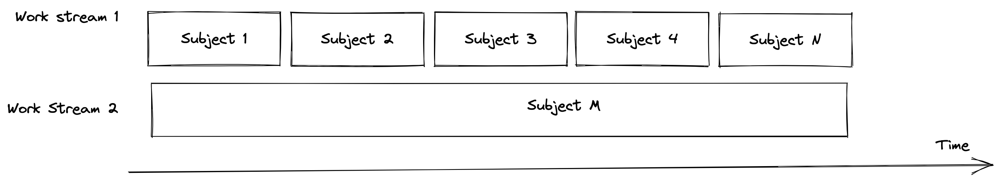
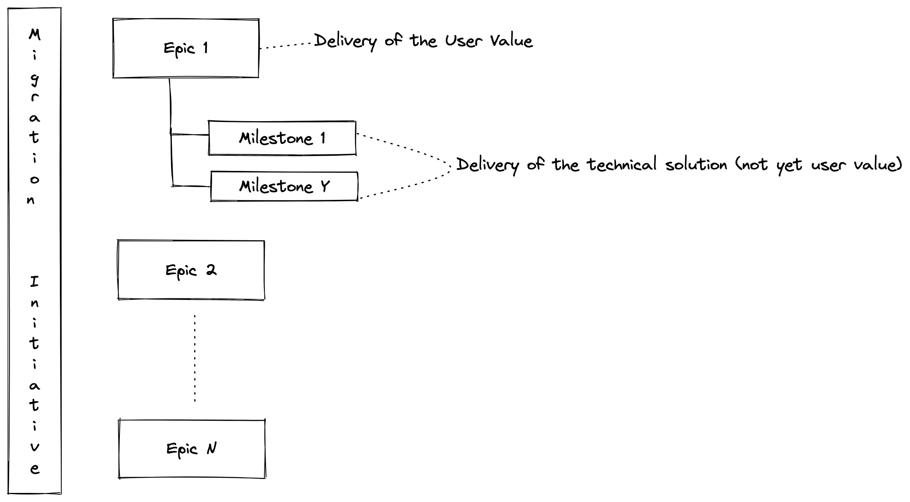

# NotifyD: Migration of subscriptions and routing settings.

We are currently in the planning phase to make Notifyd as primary subscriptions and routing settings store as we want to enable [most important flows](https://docs.google.com/document/d/1MMAjJqHzcmoTMvIJ24k6ZBBajkjBJiBDdcMxRHx8x6M/edit) to go via Notifyd and not Newsies.

## First steps
We need to start somewhere. We know that the migration story of all different notification types is going to be challenging due to the nature of Newsies. We need to identify the sequence of work items to get this migration successful.

### KPIs for success
- 80% of email notifications traffic is done by NotifyD
- NotifyD is a master of the subscriptions and settings data

### Scope
- All subscription data is kept in sync between Newsies and notifyd.
- All subscription data is migrated from Newsies to notifyd.
- Notifyd is the source of truth for subscriptions data.
- All subscription settings are kept in sync between Newsies and notifyd.
- All subscription settings are migrated from Newsies to notifyd.
- Notifyd is the source of truth for subscriptions settings.
- All the remaining routing settings are kept in sync between Newsies and notifyd.
- All the remaining routing settings are migrated from Newsies to notifyd.
- Notifyd is the source of truth for all the remaining routing settings.
- Notifyd delivers all the email notifications.
- Notifyd delivers all the push notifications.

### Out of scope
- Deliver / store web notifications
- Subscriptions for Web Notifications
- Some particular notification types could be left out due to time constraints or prioritization, these types are yet to be determined.

### Project Management Requirements
- The work should be split into small units. 
- Business value should be provided continuously and incrementally.
- Epics should be parallelizable where possible.
- All these requirements should be achievable without creating a huge amount of extra work.

Based on these requirements, we should try to partition the amount of work per epic into different groups, as much as possible, when it makes sense. In the past, we have used reasons to define this partitioning, but the proposal is open to any grouping approach.

### Product Requirements
The product guidelines, highlighted from this [product direction doc](https://gist.github.com/mariorod/f90478023102bd9be6cd0d9cb86ba9b8), are the following:
- There should be a consistent notification model across artifacts (aka subjects).
- Integrators should fall into a pit of success when implementing notifications for their artifacts (aka subjects). APIs and defaults should help by removing choices and complexity.

In order to move toward these guidelines, we are making some changes to how notifications work, diverging from the existing behavior. 

These are the product expectations:
- Less auto-generated subscriptions, more explicit subscriptions
- This means the user is notified when the user is mentioned or their team is mentioned. But the user is not receiving subsequent notifications about the thread automatically. They still can receive the subsequent notifications by explicitly subscribing for the thread updates.
- Participants are owned by integrators. The definition of a participant should be consistent among artifacts / subjects and are part of the explicit recipients.
- Authors are owned by integrators.
- Mentions (both for individuals and teams) are stateless, they just become part of the explicit recipients for notifications, but they don’t become participants.
- Manual subscriptions don’t change.

## Fundamentals Milestones
Fundamentals **Epics** define a set of tasks to complete a building block to enable some functionality for a user. They are development oriented.
**Milestones** define a technical goal in the direction of a target epic.

### Milestone 1: Subscriptions data synchronization.
Newsies has different subscription models. We need to define a mapping between Newsies and notifyd subscriptions model. This definition should serve as the guide on how to migrate and keep data in sync between the two platforms. Once the mapping is defined, we should do double writes.

There are several subscription types in Newsies: 
- List subscriptions 
  - Watchers (user watching Repository, Team, Org)
  - Ignoring (can be represented as RoutingSetting with all disabled channels)
- Thread Type subscription - scoped version of Participating and Mentioned
- Thread Subscription - actual subscription on Thread (Issue, PR, Discussion, etc)

#### Definition of done:
- A proposal for subscription data conversion between Newsies and notifyd, for:
  - List subscriptions
  - Thread type subscriptions
  - Thread subscriptions
- A proposal to synchronize data between Newsies and notifyd, evaluating the cost of making this synchronization incremental (in groups)
- Subscription data synchronization is completed (for all the groups).

### Milestone 2: Solve the sharding problem.
Subscription data volume is going to become big and that raises the question of whether our existing data model is going to be enough to handle it or not. If it’s not, it’ll take time to solve this problem.

#### Definition of done:
- A proposal that evaluates the scalability problem of our data store.
- If there are scalability problems, a proposal to address them.
- The solution is implemented.

### Milestone 3: Subscriptions data migration
Newsies currently stores all the subscription data and it needs to be migrated to notifyd in order to make notifyd the owner of this data.

#### Definition of done:
- A proposal to migrate data from Newsies to notifyd, evaluating the cost of making this migration incremental (in groups).
- Subscription data migration is completed (for all the groups), for:
  - List
  - Thread type 
  - Thread

### Milestone 4: Notifyd is owner of subscription data.
There’s currently a subscriptions data API, we just need to validate that it’s complete and flexible enough to handle all the use cases needed to make notifyd the data owner.

#### Definition of done:
- Existing subscriptions data in notifyd is accessible from dotcom.
- Newsies is able to compose subscription data from different sources if needed.

### Milestone 5: Subscriptions settings synchronization.
We need to define a mapping between Newsies and notifyd for subscription settings. This definition should serve as the guide on how to migrate and keep data in sync between the two platforms. Once the mapping is defined, we should do double writes.
The following subscription settings have been identified.
- Automatic watching
- Watching
- Participating

#### Definition of done:
- A proposal for subscription settings conversion between Newsies and notifyd, evaluating the costs of doing an incremental sync (in groups).
- All the subscription settings are in sync (for all the groups).

### Milestone 6: Subscriptions settings migration.
Newsies currently stores all the subscription settings and it needs to be migrated to notifyd in order to make notifyd the owner of this data.

#### Definition of done:
- A proposal to migrate data from Newsies to notifyd, evaluating the cost of making this migration incremental (in groups).
- Subscription settings migration is completed (for all the groups).

### Milestone 7: Notifyd is owner of subscriptions settings.
There’s currently a routing settings API, we just need to validate that it’s complete and flexible enough to handle all the use cases needed to make notifyd the data owner.

#### Definition of done:
- Existing subscriptions settings in notifyd are accessible from Newsies.
- Newsies is able to compose subscription settings from different sources if needed.

### Milestone 8: Remaining routing settings synchronization. 
In order for notifyd to become the data owner, we need all the remaining routing settings available. We need to make sure that we identify and sync them. Currently identified routing settings are:
- Notification email settings
- Dependabot
- ‘Deploy key’

#### Definition of done:
- A proposal for routing settings conversion between Newsies and notifyd, for the remaining settings.
- A proposal to synchronize data between Newsies and notifyd, evaluating the cost of making this synchronization incremental (in groups)
- Routing settings synchronization is completed (for all the groups).

### Milestone 9: Remaining routing settings migration
The remaining routing settings should be migrated for Newsies in order to make notifyd the owner of this data.

#### Definition of done:
- A proposal to migrate data from Newsies to notifyd, evaluating the cost of making this migration incremental (in groups).
- Remaining routing settings migration is completed (for all the groups).

### Milestone 10: Notifyd owner of remaining routing settings
There’s currently a routing settings API, we just need to validate that it’s complete and flexible enough to handle all the use cases needed to make notifyd the data owner.

#### Definition of done:
- Existing routing settings in notifyd are accessible from Newsies.
- Newsies is able to compose routing settings from different sources if needed.

### Milestone 11: Rework the email layout system.
We currently have two different email layout systems:
- Basic layout.
  - Currently used for label subscriptions, it doesn’t provide enough flexibility to build all the different kinds of notification emails.
  - It requires a callback to dotcom, which is slow.
- Raw layout.
  - Reuses newsies rendering mechanism.
  - Hard to evolve.
  - Renders every notification, even if they are not delivered.
  - Slow

Definition of done:
- A proposal to extend or reimplement our email layout system.
- An implementation of the solution.

### Milestone 12: Reply email
Notification emails should be repliable, and when the user replies such emails notifyd data should be used as notifications data owner.

For generating email replies is responsible this code:
https://github.com/github/github/blob/c7b1d48f246d1c9efb1b0bee827ebc86c64b7159/lib/newsies/emails/message.rb#L139-L142

If we can pass it to our message headers in correct format and subject has right methods

Then in **EmailReplyJob** we will:
- Fetch **RollupSummary** which marks web notification as read https://github.com/github/github/blob/c7b1d48f246d1c9efb1b0bee827ebc86c64b7159/app/jobs/email_reply_job.rb#L123-L130
- Based on input parameters we will construct method to be called on the fly https://github.com/github/github/blob/c7b1d48f246d1c9efb1b0bee827ebc86c64b7159/app/jobs/email_reply_job.rb#L182-L189 and will create reply to message 
 
#### Definition of done:
- A proposal to use notifyd on email replies.
- An implementation of the solution.

### Milestone 13: Unsubscribe action in email

Unsubscribe functionality from email is responsible for the “unsubscribe” button that the user sees in the email view. 

If we want to consider subscriptions to be kept in sync between Notifyd and Newsies - we should also handle deleting/muting of subscriptions, unsubscribe can be treated as part of Data Sync epic. 

There are 3 pillars:
- Unsubscribe from thread - removes subscription from thread
- Unsubscribe from list - removes thread subscription for thread in the list ???
- Unsubscribe from vulnerability - it’s special case for vulnerabilities (I don’t really remember why it was introduced)

https://github.com/github/github/blob/c7b1d48f246d1c9efb1b0bee827ebc86c64b7159/lib/newsies/emails/message.rb#L148-L165

Here where it’s all handled:
https://github.com/github/github/blob/c7b1d48f246d1c9efb1b0bee827ebc86c64b7159/app/controllers/notifications_controller.rb#L253

From implementation side:
Newsies:
- For threads 
  - Encodes user + rollup summary in the link that will be used for Unsubscribe button
  - When a link is clicked - newsies controller decodes user_id and rollup_summary_id and via rollup_summary_id we fetch a thread that will be muted later with unsubscribe_from_thread
- For lists
  - For some reason just uses different method

Main challenge here is to figure out what to use to generate an unsubscribe link. For Notifyd we don’t want to use Newsies abstractions (List, Thread and RollupSummary) but at the same time we want to map **Newsies subject -> Newsies Thread** so we can trigger unsubscribe for Newsies counterpart as well. 

Example: You can Issue and one day we are sending an email about IssueComment from Notifyd.
User clicks on unsubscribe link, so somehow we will need to generate link that will allow us to:
- Identify user 
- Identify Notifyd subscription 
- Identify Newsies subscription

Another example (easier tbh):
Issue is sent by Newsies and user clicks on Unsubscribe from Newsies generated email. 
In this case we will need to
- mute Newsies subscriptions (already implemented)
- Mute Notifyd subscription (easier because we have List, Thread, Comment) at our disposal

#### Definition of done:
- Research best way to unsubscribe from Repository in Notifyd use-case
- Click on unsubscribe link unsubscribes user both on Newsies and Notifyd from
  - List
  - Thread
  - Vulnerability if migrated 

### Epic 14: Scale dotcom checks
Currently, we are calling back dotcom for some additional checking before sending the notifications. These callbacks have some upper limits that are not good enough and we need to propose and implement a better solution that is able to cope with the amount of work notifyd will need to cope with.

#### Definition of done:
- A proposal to scale dotcom checks.
- An implementation of the solution.

### Milestone 15: Improve the notifications API for integrators
Currently we are acting as integrators and using our low-level API and some abstractions (like the SubjectAdapter class) over it. This is not a proper API for our integrators and we may want to rethink the whole API to improve our delivery pipelines

#### Definition of done:
- A proposal for a new integrators API.
- An implementation of the solution.

### Milestone 16: Improve the observability of the platform
As we are moving most of the notifications data over the new platform, we may require improvements over our observability stack that gives us better visibility of the migration process, scalability problems and debuggability. We are also using a darkship environment that we don’t want to maintain in its current state. Overall, we need to rethink a more systematic approach to observability that gives us better confidence to deploy in production.

#### Definition of done:
- A proposal for observability improvements that gathers all the lessons learnt.
- An implementation of the solution.

### Milestone 17: Automatic unsubscriptions
There’s a [brief](https://github.com/github/notifyd/blob/main/docs/briefs/automatic-unsubscriptions.md) that highlights the problem of automatic unsubscriptions. The purpose of this epic is to make a proposal to solve that problem and implement it.

#### Definition of done:
- A proposal for automatic unsubscriptions.
- An implementation of the solution.

### Milestone 18: Automatic subscriptions as explicit recipients
As explained in the Product Requirements, we are changing how automatic subscriptions work and we are delegating this to the integrators. As a result, we are not going to sync or migrate them, but we need to talk to and support the integrators adding this support, in a consistent way.

#### Definition of done:
- A proposal of how automatic subscriptions can be delegated to integrators, following the product guidelines (consistency / pit of success).
- A discussion is held with integrators to make them aware / part of the new approach.
- The proposal is implemented.

## Migration Epics
Migration Epics are business oriented. They depend on the partial or total completion of some fundamental epics
We’ll have a migration epic per Subject, to indicate that the subject has been completely migrated.
This is the set of epics by Subject (the order is only defined for the first two):

- Epic 1: Gist is GA
- Epic 2: Issue is GA
- Epic 3: AdvisoryCredit is GA
- Epic 4: CommitComment is GA
- Epic 5: Discussion is GA
- Epic 6: DiscussionMessage is GA
- Epic 7: DiscussionPostis GA
- Epic 8: Grit::Commit is GA
- Epic 9: ImportableIssue is GA
- Epic 10: Milestone is GA
- Epic 11: PullRequest is GA
- Epic 12: PullRequestReviewComment is GA
- Epic 13: Release is GA
- Epic 14: RepositoryAdvisory is GA
- Epic 15: RepositoryDependabotAlertsThread is GA
- Epic 16: RepositoryInvitation is GA
- Epic 17: RepositoryVulnerabilityAlert is GA
- Epic 18: SecurityAdvisory is GA
- Epic 19: SecurityAlert is GA
- Epic 20: CheckSuite is GA. Routing settings for web notifications still need to be migrated to notifyd.
